# 揭开神经网络中微分和优化器的神秘面纱

> 原文：<https://medium.com/nerd-for-tech/demystifying-differentiation-and-optimisers-in-neural-network-510c54f693c?source=collection_archive---------4----------------------->

## 直观地理解为什么在神经网络中使用微分，并了解可用的不同优化器。

在上一篇文章中，我谈到了可用的不同损失函数，并了解了梯度函数。梯度函数使用损失相对于权重的微分来计算网络必须如何改变权重以更接近预期输出。

但是我意识到我忽略了分化在帮助神经网络学习中的作用。因此，我将在这篇文章中这样做，并讨论我们可以为神经网络选择的不同优化器。剧透警告:使用亚当乐观者。

# 区别

微分是一个如此抽象的概念，以至于我们不知道为什么要使用它，也不知道为什么 x 的微分是 2x 而 x 是 1。如果我们理解使用差异化背后的原因，我相信它不会显得令人生畏。

> *在深度学习中使用微分的根本原因是为了找到曲线中非直线的任何一点的切线斜率。*

让我们解开那个句子。

一个**斜率**是一条直线的陡度。如果斜率为 0，则线是水平的，这意味着线完全是平的。另一方面，如果直线是垂直的，则称该直线的斜率为无穷大。

求直线的斜率很容易。选取任意两个点，并除以 y 坐标和 x 坐标之间的差值。现在，如果我们想知道直线上任意一点的斜率，我们可以确定它与直线的斜率相同，如下图所示。

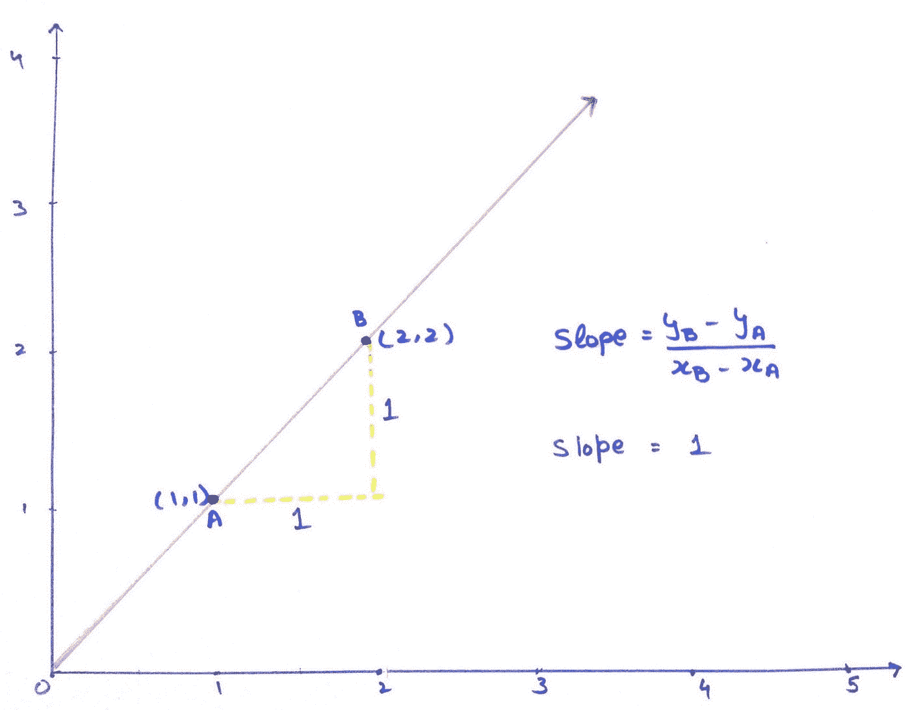

红色线的斜率

然而，如果我们想求出曲线或圆上某一点的斜率，这个方程就不成立了。考虑下面的 y = x 的图形。

考虑直线上的 4 个点，A，B，C 和 D。A 和 B 之间的斜率与 C 和 d 不同，这使得我们很难自信地说出曲线上任意一点的斜率。

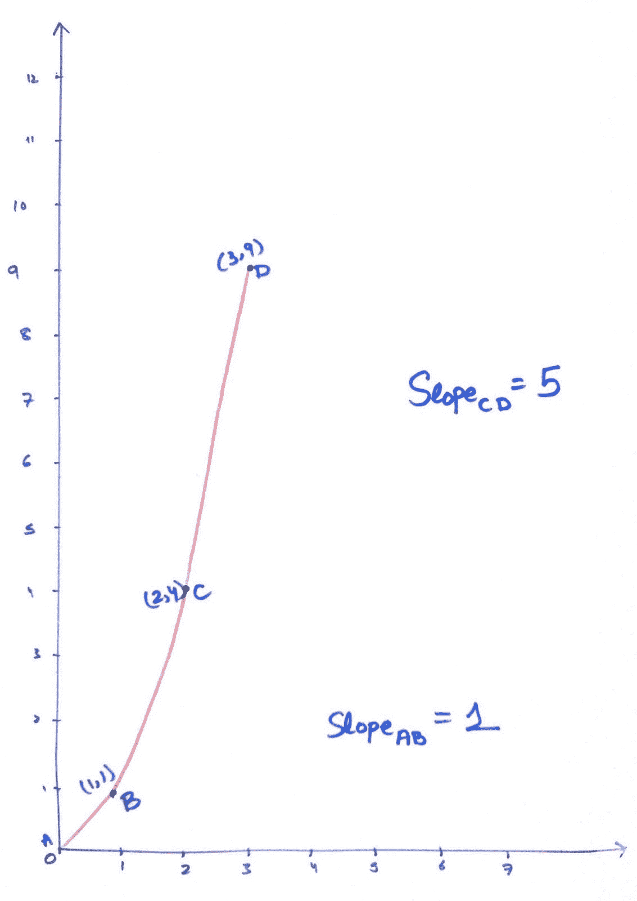

曲线的斜率

在我们了解如何找到曲线的斜率之前，我们首先需要知道为什么我们需要斜率。

如果你还记得[上一篇文章](/nerd-for-tech/never-forget-gradient-descent-and-loss-function-ever-again-e593936a3bf8)中的梯度下降，我们的目标是尽可能减少损失。为此，我们需要到达曲线的底部。

难道我们不能选择值而不是让模型来选择吗？

答案是否定的！如果你只有两个特征，就很容易画出一个二维图并选择最小值。但是，如果您的数据集中有 100 个或 1000 个要素，您需要一台计算机来执行这些计算，因为我们的大脑无法理解三维以外的任何东西。

## 斜率如何帮助我们找到最佳值？

斜坡告诉我们是否在正确的轨道上。如果当前点的斜率没有前一点陡，我们知道我们在正确的路上。类似地，如果斜率接近于零，我们可以有理由相信我们已经到达最低点，并且该点是我们模型的最佳可能值。

## 我们如何找到曲线在一点的斜率？

如果我们放大一个圆，在某一点上，我们可以看到曲线开始像一条直线。我们可以用这条直线求出曲线的斜率。这叫做曲线的**切线**。然而，这些点彼此非常接近，几乎相互重叠；我们对此表示如下:

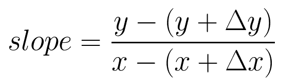

我们可以这样写

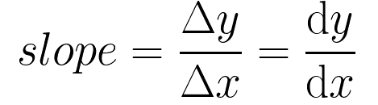

这是没有任何限制的最简单形式的微分公式。如果你想详细了解差异化，可以查看这个[链接](https://www.youtube.com/playlist?list=PLZHQObOWTQDMsr9K-rj53DwVRMYO3t5Yr)。

要求曲线任一点的斜率，必须对曲线方程求微分，代入 x 的值。

一些需要记住的简便公式。

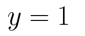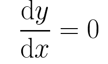

常数微分为零，因为常数是一个点，而点没有斜率。

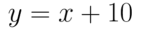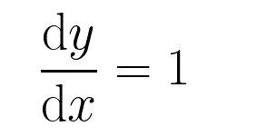

一条线的斜率是一个常数，因为它不变，这和我们之前的观察是一致的。

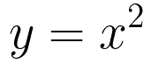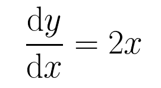

曲线在任一点的斜率都不是常数。因此，我们得到一个等式，可以代入 x 的值，求出该点的斜率。

同样，要了解更多关于差异化的信息，您可以查看此[链接](https://www.youtube.com/playlist?list=PLZHQObOWTQDMsr9K-rj53DwVRMYO3t5Yr)。

我们现在对分化及其在神经网络中的作用有了足够好的理解。我们现在可以看看可以用来更新权重的各种优化器。

# 乐观主义者

在我们使用优化器之前，等式的一个主要部分是 de/dw，它是误差相对于权重的变化率，在 ***反向传播*** 步骤中计算。它是高度数学密集型的，超出了本文的范围。如果你很好奇，可以去看看[这个](https://www.youtube.com/watch?v=Ilg3gGewQ5U)了解更多。

经过反向传播后，我们现在有了更新权重的所有原材料。最简单的方法是遵循**随机梯度下降**公式。内容如下。

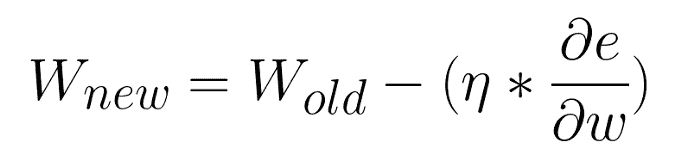

所有其他优化技术给这个等式增加了其他东西。

SGD 方法的一个缺点是它的更新方向完全依赖于当前批处理，因此它的更新是不稳定的。解决这个问题的一个简单方法是引入动量。

## SDG +势头

Momentum 计算一组更新次数的梯度的滚动平均值，并将该平均值与每一步的单独梯度相结合。另一种思考方式是想象一个球滚下山坡；即使它遇到一个小洞或一座小山，动量也会推动它径直穿过小洞或小山，到达一个更低的最小值——山的底部。如果你陷入局部最小值(一个洞)并且来回跳动，这可能是有用的。有了动量，模型更有可能通过局部最小值，进一步降低损失。简单地说，动量可能仍然指向全球梯度下降的方向。

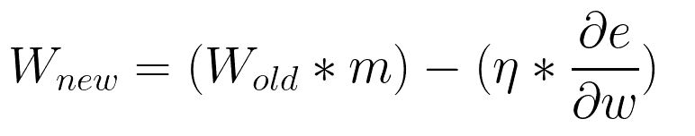

这里我们有两个超参数，动量( *m* )和学习率(/eta)。超参数就像一个旋钮。如果你旋转一个旋钮，这个模型可以学得更好或更差。它让我们能够控制优化过程。

实际上，带有动量的 SGD 乐观者经常是乐观者的两个主要选择之一，还有亚当乐观者，我们稍后会讨论。首先，我们将通过两个以上的优化。AdaGrad 是随机梯度下降的下一个增强。

Adagrad 和 RMSProp 差不多。我说几乎是因为他们之间唯一的区别是他们计算学习率的方式。两者都关注于改变每个参数的学习率，而不是对所有参数都保持相同。这允许不经常改变的参数跟上变化，有效地利用更多的神经元进行训练。

## 阿达格拉德

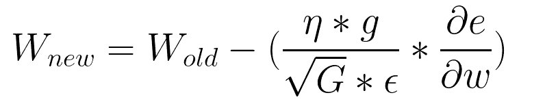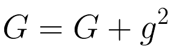

这里，g 是当前周期的梯度。ε是防止被 0 除的超参数。ε值通常是一个小值，比如 1e-7。

## RMSProp

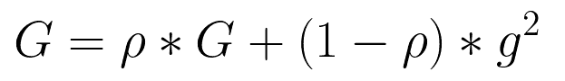

Roh 是超参数；默认值为 0.9。我们可以根据你的需要来改变它。

结合 RMSProp 和基于动量的 SGD 的最佳特性，我们得到了 Adam。

## 圣经》和《古兰经》传统中）亚当（人类第一人的名字

Adam 是 Adaptive Momentum 的缩写，是最广泛使用的基于 RMSProp 的优化器，并且重新引入了 SGD 的 Momentum 概念。这意味着我们将不再使用当前的梯度，而是使用像 SGD 优化器中的动量，然后是像 RMSProp 中的缓存的每权重自适应学习速率。

这个等式有点复杂，如果你感兴趣，你可以通过这个[视频](https://www.youtube.com/watch?v=JXQT_vxqwIs)了解更多。

## 如何选择优化器？

*   如果数据稀疏，使用自适用的方法，即 Adagrad、Adadelta、RMSprop、Adam。
*   RMSprop，Adadelta，Adam 在很多情况下都有类似的效果。
*   Adam 只是在 RMSprop 的基础上增加了偏差修正和动量，
*   随着梯度变得稀疏，Adam 的性能将优于 RMSprop。

总的来说，亚当是最好的选择。

# 结论

在本文中，我们讨论了各种优化器，也使区分变得更容易接受。我们还了解到，Adam 可以作为首选优化器用于几乎所有的深度学习项目，如果这不起作用，你可以寻找替代方案。在下面的文章中，我们将最终编写一些代码并实现我们的第一个神经网络。一定要让我知道你下一步想看什么作品。