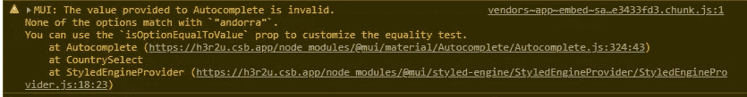
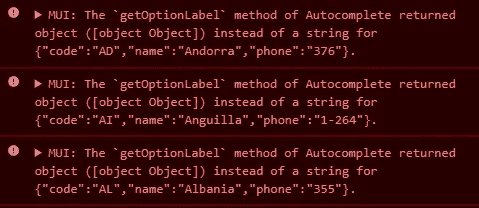
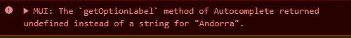
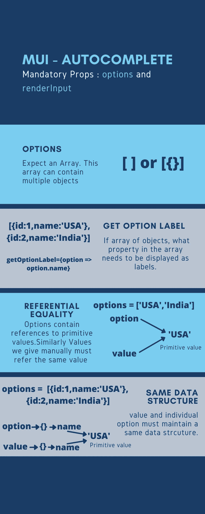

# 揭开 MUI 自动完成中错误的神秘面纱—第一部分

> 原文：<https://medium.com/nerd-for-tech/demystifying-errors-in-mui-autocomplete-part-i-e306f922a906?source=collection_archive---------0----------------------->

# 自动完成是 Material UI 核心包中的新功能。

它是**搜索**暨**输入**组件。对于**搜索**，我们需要给出搜索选项。因此**【选项】**道具是强制的。关于**输入**字段，自动完成是一个抽象输入字段。我们需要指定需要呈现什么输入组件，在大多数情况下，应该是 **TextField。**因此' **renderInput'** 组件是必需的。

> 自动完成→搜索和输入→选项和渲染输入属性

选项属性只接受数组。我得到的几乎所有自动完成错误都是因为数据结构的不一致，我们将在后面看到。如果选项数组包含原始值，它将直接在选项列表中显示这些值。

```
import * as React from "react";
import TextField from "@mui/material/TextField";
import Autocomplete from "@mui/material/Autocomplete";export default function ComboBox() {return (<Autocomplete
**options**={**top100Films**}
sx={{ width: 300 }}
**renderInput**={(params) => <TextField {...params} label="Movie" />}
/>
);
}const **top100Films** = [
**"The Shawshank Redemption",
"The Godfather",
"The Godfather: Part II",
"The Dark Knight",
"12 Angry Men",
"Schindler's List",
"Pulp Fiction",
"The Lord of the Rings: The Return of the King",
"The Good, the Bad and the Ugly",
"Fight Club",
"The Lord of the Rings: The Fellowship of the Ring",
"Star Wars: Episode V - The Empire Strikes Back",
"Forrest Gump",
"Inception",**
];
```

在上面的例子中，options prop 接受一个数组。这个数组包含电影的字符串(原始数据类型)值。

选项道具演示

如果数组包含对象。默认情况下，它接受以下结构。

```
options =  [
  { label: 'The Shawshank Redemption', year: 1994 },
  { label: 'The Godfather', year: 1972 },
  { label: 'The Godfather: Part II', year: 1974 },
  { label: 'The Dark Knight', year: 2008 },
  { label: '12 Angry Men', year: 1957 },
  { label: "Schindler's List", year: 1993 },
  { label: 'Pulp Fiction', year: 1994 },
]
```

它会将对象中的**标签**属性显示为选项列表。然而，我们可以通过使用 **getOptionLabel** prop 来使用不同的选项结构。

```
options =  [
  { name:'The Shawshank Redemption', year: 1994 },
  { name:'The Godfather', year: 1972 },
  { name: 'The Godfather: Part II', year: 1974 },
  { name: 'The Dark Knight', year: 2008 },
  { name: '12 Angry Men', year: 1957 },
  { name: "Schindler's List", year: 1993 },
  { name: 'Pulp Fiction', year: 1994 },
]<Autocomplete
options={top100Films}
**getOptionLabel = {option => option.name}**
sx={{ width: 300 }}
renderInput={(params) => <TextField {...params} label="Movie" />}
/>
);
}
```

**getOptionlabel** 需要一个有默认参数的函数，这个参数基本上是数组中每个对象的单独选项。

getoptionlabel 的演示

getOptionLabel 的一个特点是它不会改变输入值。它只是改变了我们在列表中看到的标签。输入值仍然是整个单个对象。这一事实需要铭记在心，因为知道这一点可以避免 60%的错误。

Autocomplete 中的大多数 prop 都是基于与 options prop 的关系。特别是与选项的引用关系。

```
import * as React from "react";
import Box from "@mui/material/Box";
import TextField from "@mui/material/TextField";
import Autocomplete from "@mui/material/Autocomplete";export default function CountrySelect() {return (<Autocomplete
id="country-select-demo"
sx={{ width: 300 }}
**options={countryStrings}**
autoHighlight
**value={"Andorra"}**
renderInput={(params) => (
<TextField
{...params}
label="Choose a country"
inputProps={{
...params.inputProps,
autoComplete: "new-password" *// disable autocomplete and autofill* }}
/>
)}
/>
);
}const **countries** = [
{ code: "AD", label: "Andorra", phone: "376" },
{ code: "AI", label: "Anguilla", phone: "1-264" },
{ code: "AL", label: "Albania", phone: "355" },
{ code: "AM", label: "Armenia", phone: "374" },
{ code: "AO", label: "Angola", phone: "244" },
{ code: "AQ", label: "Antarctica", phone: "672" },
{ code: "AR", label: "Argentina", phone: "54" },
{ code: "AS", label: "American Samoa", phone: "1-684" },
{ code: "AT", label: "Austria", phone: "43" }
]; ***-----Extracting only label from countries array----*****const countryStrings = countries.map((option) => option.label);**console.log(**countryStrings**);
*["Andorra", "Anguilla", "Albania", "Armenia", "Angola", "Antarctica", "Argentina", "American Samoa", "Austria"]*
```

指称关系是如何工作的？让我们在这里看一些案例。带有**国家字符串**和**国家的选项。**

**countryStrings** 由字符串数组组成。让我们看看会发生什么

**案例一**:options = {**country strings**} value = '**安道尔**'。

上面的例子工作正常，因为我们输入的**值**与 **countryStrings 的值之一匹配。**

但是当我们稍微改变这个值时，事情就变得有趣了。

**案例二**:options = {**country strings**} value = '**安道尔**'。

上面的例子会抛出一个错误，但是文本框中显示的值会是'**安道尔【T1]'，但是我们会在控制台中得到一个错误。**


显示的值为“安道尔”



控制台出错

出现此错误是因为'**安道尔**与**国家字符串**中的任何字符串都不匹配

> 所以第一条规则是值必须与任何一个选项完全匹配。从技术上讲，它必须与选项之一具有**引用相等性**。

**情况 3** :改变数据结构本身

**选项** = **国家 getOptionLabel = { option =>option . name }值= '安道尔'**

让我们把国家的**标签改为**名称**财产，而不是**财产。

```
import * as React from "react";
import Box from "@mui/material/Box";
import TextField from "@mui/material/TextField";
import Autocomplete from "@mui/material/Autocomplete";export default function CountrySelect() {
return (
<Autocomplete
id="country-select-demo"
sx={{ width: 300 }}
**options={countries}**
*// value={"Andorra"}* renderInput={(params) => (
    <TextField {...params}
      label="Choose a country"
}}
/>
)}
/>
);
}const **countries** = [
{ code: "AD", **name**: "Andorra", phone: "376" },
{ code: "AI", **name**: "Anguilla", phone: "1-264" },
{ code: "AL", **name**: "Albania", phone: "355" },
{ code: "AM", **name**: "Armenia", phone: "374" },
{ code: "AO", **name**: "Angola", phone: "244" },
{ code: "AQ", **name**: "Antarctica", phone: "672" },
{ code: "AR", **name**: "Argentina", phone: "54" },
{ code: "AS", **name**: "American Samoa", phone: "1-684" },
{ code: "AT", **name**: "Austria", phone: "43" }
]; 
```

如果没有 **getOptionLabel 和 label** 属性，我们会得到一个错误



props 中没有标签属性时出错

注意 **getOptionLabel** 被调用，即使我们在 props 中添加了它。这是因为获取'**标签**'属性的默认行为。

```
<Autocomplete
id="country-select-demo"
sx={{ width: 300 }}
**options={countries}
getOptionLabel={(option) => option.name}**
*//value={"Andorra"}* renderInput={(params) => (
    <TextField {...params}
      label="Choose a country"
}}
/>
)}
/>
```

现在我们没有得到任何错误，因为我们明确提到通过**getOptionLabel = {(option)=>option . name }**从 **name** 属性中获取**标签**

让我们增加道具的价值

```
<Autocomplete
id="country-select-demo"
sx={{ width: 300 }}
**options={countries}
getOptionLabel={(option) => option.name}**
***value={"Andorra"}***renderInput={(params) => (
    <TextField {...params}
      label="Choose a country"
}}
/>
)}
/>
```



给定值= '安道尔'时出错

这里我们会得到一个类似上面的错误。这是棘手的部分。见流程是

给 props 的值是'**字符串**，但是每个单独的选项是一个'**对象**。这里的**值**是硬编码的，因此它试图直接放入 DOM。既然我们提到 **getOptionLabel** ，那就要经过这一步。 **getOptionLabel** 需要一个对象，但提供的值是**“字符串”。**这实际上导致了一个错误。

***MUI:Autocomplete 的“getOptionLabel”方法返回 undefined，而不是“Andorra”的字符串。***

> 所以第二条规则很简单——只要在道具之间保持相同的数据结构。

所以正确的方法应该是

```
<Autocomplete
id="country-select-demo"
sx={{ width: 300 }}
**options={countries}
getOptionLabel={(option) => option.name}**
***value={countries[0]}***renderInput={(params) => (
    <TextField {...params}
      label="Choose a country"
}}
/>
)}
/>
```

当值满足相同数据结构的标准时



使用 canva 的插图