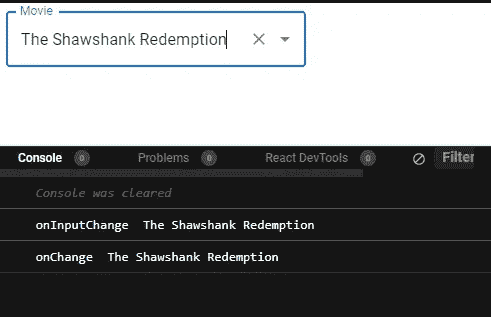
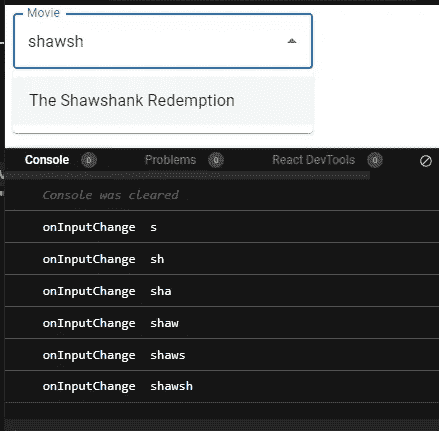
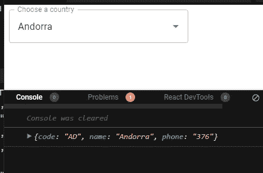

# 揭开 MUI 自动完成中错误的神秘面纱—第二部分

> 原文：<https://medium.com/nerd-for-tech/demystifying-errors-in-mui-autocomplete-part-ii-de56c885e973?source=collection_archive---------1----------------------->

在阅读此之前，请先阅读本[第一部分](/nerd-for-tech/demystifying-errors-in-mui-autocomplete-part-i-e306f922a906)。它将为您提供 MUI 自动完成中的一些基本概念。

我们知道选项中显示的值将是**原语** ( **字符串、数字等**)。选项的输入可以是**非原语** ( **对象数组**)。对于任何实际的目的，比如向 API 或其他函数发送数据，我们都需要一个原始的数据结构。

在深潜之前，先给大家介绍两个道具 **onChange** 和 **onInputChange。**两者都采用精确的参数(事件、值和原因)

> **onChange** —每当您在弹出菜单中选择显示选项时调用。
> 
> **onInputChange** —每当您在搜索字段中键入时调用。

```
<Autocomplete
options={top100Films}
sx={{ width: 300 }}
renderInput={(params) => <TextField {...params} label="Movie" />}
**onChange={(event, value, reason) => *console.log("onChange", value)}*
onInputChange={(event, value, reason) => *console.log("onInputChange",value)}*** />
```



onChange vs onInputChange

请注意，当选择该选项时，onChange 和 onInputChange 具有相同的值。当我在搜索栏中键入时，事情变得有趣了。



onChange vs onInputChange

当我在搜索字段中键入时，只有 **onInputChange** 值发生变化。OnChange 仍然为空。因此规则是

> **onChange** 是一个函数**弹出选项**而 **onInputChange** 是一个函数**search field**值

所以每当我需要一个非原始的格式，比如对象，我应该使用 onChange 值。

```
<Autocomplete
id="country-select-demo"
sx={{ width: 300 }}
options={countries}
getOptionLabel={option => option.name}
**onChange={(event,value,reason) => console.log(value)}** renderInput={(params) => (
<TextField {...params}
label="Choose a country"
/>
)}
/>
);
}const countries = [
{ code: "AD", name: "Andorra", phone: "376" },
{ code: "AI", name: "Anguilla", phone: "1-264" },
{ code: "AL", name: "Albania", phone: "355" },
{ code: "AM", name: "Armenia", phone: "374" },
{ code: "AO", name: "Angola", phone: "244" },
{ code: "AQ", name: "Antarctica", phone: "672" },
{ code: "AR", name: "Argentina", phone: "54" },
{ code: "AS", name: "American Samoa", phone: "1-684" },
{ code: "AT", name: "Austria", phone: "43" }
];
```



onChange

注意这里 onChange 值返回包含名称**‘安道尔’的整个对象。我们可以将这个对象用于 API 和函数。这是 MUI Autocomplete 中的一个重要特性，使它变得完整。希望这有帮助。**