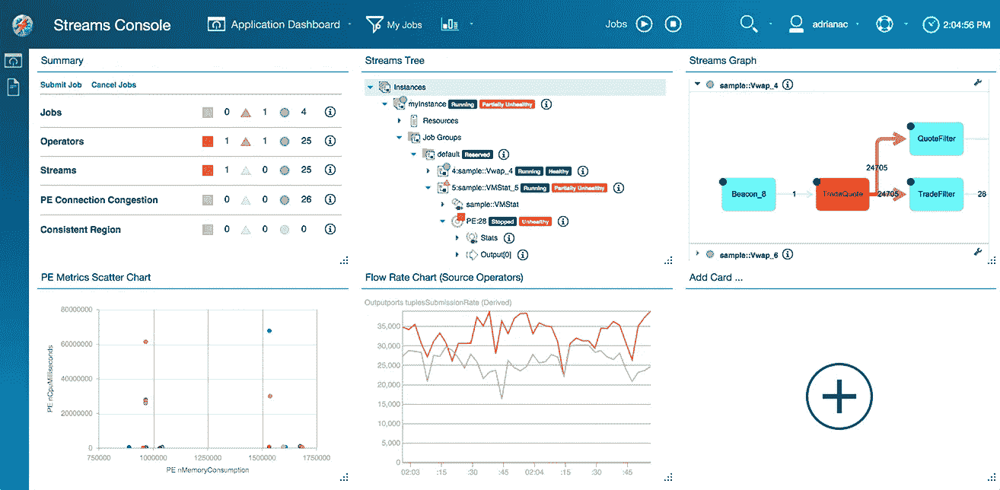

# 揭开 IBM 流的神秘面纱

> 原文：<https://medium.com/nerd-for-tech/demystifying-ibm-streams-cb2db8615871?source=collection_archive---------3----------------------->

这个博客的目的是帮助你建立一个如何在 IBM streams 中开发 SPL 程序的框架。在这个博客中，你将了解到—

*   *数据流和对实时决策系统的需求。*
*   *IBM Streams 及其工具包。*
*   *一些 SPL 电码。*

让我们深入了解 IBM 流的海洋。

50 米亚特兰蒂斯 1 号潜艇— **流分析**


流分析(也称为流处理)是一种动态处理大量数据(**流**)的方法。这些数据流是一个超长数据序列的不间断流动。流分析的强大之处在于，它允许每秒数百万个事件的流，并使我们有权构建推荐实时决策的应用程序。

流数据可能包括电子商务购买生成的日志文件、游戏中的玩家活动、来自社交网络的信息、金融股票市场，甚至来自设备的网络日志。

> 到 2021 年，全球 IP 流量将达到每年 3.3 兆字节(ZB)——思科

随着硬件越来越便宜，设备越来越智能，发送和接收的数据量急剧增长。面对不断变化的不断增长的数据量，当今的公司面临的挑战是做出**明智的**、**实时**业务决策，并且在不需要在 Hadoop 系统中缓存数据的情况下保持竞争优势。

*300 米水肺潜水员* **—什么是 IBM Streams？**

IBM Streams(**IBM info sphere Streams**)是一个专有工具，它有一个开发平台和运行时环境，使企业能够开发和执行接收、过滤和分析大量数据流的应用程序。

它使用其独特的**流处理语言(SPL)** ，并且可以用 **C、C++或 Java** 应用程序进行扩展，以重用现有的逻辑。它由基于 Eclipse 的 IDE、应用程序图和运行时监控组成，以简化构建和管理应用程序的过程。

下面是最简单的可能；我们最喜欢的 **Hello World** 应用程序—

```
namespace sample;composite HelloWorld {
    graph 
        stream  Hello = Beacon() {
            param 
                iterations: 5u; 
            output 
                Hello: message = "Hello World!"; 
        } 

        () as Sink = Custom(Hello) { 
            logic 
                onTuple Hello: 
                    printStringLn(message); 
        }
}
```

这里，它使用一个**信标**操作符来生成携带“Hello World”消息的元组。自定义接收操作器从信标接收元组，并在控制台上显示 5 次。

很少外卖—

流是元组的序列，元组是属性的集合。(例如。rstring 消息)。流可以是无限的元组序列，例如来自网络传感器的流。

运算符是流处理应用程序的基本构件。它们处理来自输入流的元组，并产生输出流。运算符以下列逻辑模式之一处理输入流。

当每个元组被接收时以及作为一个窗口。

它还处理来自输入流的元组数据，并以输出流的形式生成结果。



这个 spl 代码编译成功后，一个**。生成 sab** 文件。streams application bundle (sab)文件是一个单独的、可重定位的文件，其中包含运行应用程序所需的所有工件。当这被提交用于执行时，应用捆绑文件然后被分解成运行时应用。

1000 米巨型太平洋章鱼— **使用匹配文件类型的模式计算指定目录下所有文件的行数。**

```
use com.ibm.streams.teda.internal::DirScan;composite LineCounter {
    type
    LineCountType = rstring fileName, int32 lineCount;
    graph
        (stream < rstring fileName > MyFileName) = DirectoryScan() {
            param
            directory: getSubmissionTimeValue("Dir");
            ignoreDotFiles: true;
            sleepTime: 10.0;
            pattern: ".*\\.*"; //This takes a regex 
        }(stream < rstring line, rstring fileName > Line) = FileSource(MyFileName) {
        param
        format: line;output
        Line: fileName = FileName();
    }(stream < LineCountType > LineCount) = Custom(Line) {
        logic
        state: {
            mutable int32 _lineCnt = 0;
            mutable rstring _fileName = "";
        }onTuple Line: {
            _lineCnt++;
            _fileName = Line.fileName;
        }onPunct Line: {
            if (currentPunct() == Sys.WindowMarker) {
                mutable LineCountType oTuple = {};
                oTuple.fileName = _fileName;
                oTuple.lineCount = _lineCnt;
                submit(oTuple, LineCount);
                _lineCnt = 0;
                _fileName = "";
            }
        }
    }stream < LineCountType > outputStream = Throttle(LineCount) {
        param
        rate: 2.0;
    }() as FileSink_4 = FileSink(outputStream) {
        param
        file: "/dev/stdout";
        flush: 1 u;
    }
}
```

这使用了一个**节流**算子，它以 2 秒的间隔输出结果流。通常，该运算符用于根据需要调整水流速度，使其以指定的速率流动。

3800 米泰坦尼克号沉船—


网络工具包中的 **PacketLiveSource** 操作符具有每秒近 **1M 数据包**的性能，并且 **DNSMessageParser** 可以作为独立操作符在每个内核上每秒解析 **600K 数据包**。

这个 IBM 流有多么大的马力简直是疯了。

6000 米米尔 DSV — **网络工具包**

该工具包允许我们分析底层网络数据包，如解析 **DHCP、DNS、Netflow、**使用地理空间数据丰富 IPV4 和 IPV6 地址。

```
stream < PacketType > PacketLiveStream as PacketsOut = PacketLiveSource() {
    param
        networkInterface: $networkInterface;
        promiscuous: true;
    output
        PacketsOut: captureTime = (float64) CAPTURE_SECONDS() + (float64) CAPTURE_MICROSECONDS() / 1000000.0, ipSourceAddress = convertIPV4AddressNumericToString(IPV4_SRC_ADDRESS()), ipDestinationAddress = convertIPV4AddressNumericToString(IPV4_DST_ADDRESS()), dnsMessage = PAYLOAD_DATA();
}
```

PacketLiveSource operator 能够从以太网接口捕获实时网络数据包。

```
stream<DNSMessageType> DNSMessageStream as Out = DNSMessageParser(PacketLiveStream){
    logic
        state : {
            map<uint16, rstring> dnsTypes = { 1 : "A", 2 : "NS", 3 : "MD", 4 : "MF", 5 : "CNAME", 6 : "SOA", 7 : "MB", 8 : "MG", 9 : "MR", 10 : "NULL", 11 : "WKS", 12 : "PTR", 13 : "HINFO", 14 : "MINFO", 15 : "MX", 16 : "TXT", 28 : "AAAA" } ;
            map<uint8, rstring> dnsResponseCodes = { 0 : "OK", 1 : "Format Error", 2 : "Server Failure", 3 : "Name Error", 4 : "[not implemented]", 5 : "Server Refused" } ;
        } param
        messageAttribute : dnsMessage ;
    output
        Out : captureTime = formatEpochTime(captureTime), isResponse = DNS_RESPONSE_FLAG(), responseCode = DNS_RESPONSE_CODE()in dnsResponseCodes ? dnsResponseCodes [ DNS_RESPONSE_CODE()] :(rstring)DNS_RESPONSE_CODE(), questionName = DNS_QUESTION_NAME(), questionType = DNS_QUESTION_TYPE()in dnsTypes ? dnsTypes [ DNS_QUESTION_TYPE()] :(rstring)DNS_QUESTION_TYPE(), answerNames = DNS_ANSWER_NAMES(), answerTTLs = DNS_ANSWER_TTLS(), answerData = DNS_ANSWER_DATA(), nameserverNames = DNS_NAMESERVER_NAMES();
}
```

此运算符解析输入元组中接收的各个 DNS 消息字段，并发出包含 DNS 消息数据的元组。然后，用户可以使用 DNS 解析器结果函数来进一步处理有效负载数据。

7700 米深水鱼— **自定义操作员**

自定义操作符是一个特殊的逻辑相关操作符，它可以接收和发送任意数量的流，本身不做任何事情。因此，它提供了一个用于定制的白板。让我们看看如何根据值对地图进行排序。

```
()as CustomSort = Custom(outputStream){
    logic
        state:{
            mutable map<rstring,int32> keyValueMap = {"e":10,"b":-24,"c":50,"a":-32,"d":230};
            mutable list<int32> valueList;
            mutable list<rstring> keyList = keys(keyValueMap);
            mutable int32 i = 0;
            mutable int32 j = 0;
            mutable int32 currentCount;
            mutable rstring currentKey;
        } onTuple outputStream :{
        mutable rstring tempKey;
        while(i < size(keyList)){
            tempKey = keyList[ i ];
            appendM(valueList, keyValueMap[ tempKey ]) ;
            i++;
        }
        i=1;
        while (i < size(valueList)){
            currentCount = valueList[ i ];
            currentKey = keyList[ i ];
            j = i-1;
            while (j >= 0 && valueList[ j ] < currentCount){
                valueList[ j+1 ] = valueList[ j ];
                keyList[ j+1 ] = keyList[ j ];
                j = j-1;
            }
            valueList[ j+1 ] = currentCount;
            keyList[ j+1 ] = currentKey;
            i ++;
            printStringLn("Sorted Values->"+ (rstring)valueList) ;
            printStringLn("Sorted Key->"+(rstring)keyList) ;
        }
        shutdownPE();
    }
}
```

shutdownPE() —关闭处理元素(PE)。这将停止当前的 PE。什么是体育？当您编译流处理应用程序时，构成数据流图的操作符和流关系被分解成一组单独的执行单元，称为 PEs。

这不是我们深潜的结束。这片海洋提供了更多。前往水下最深处的旅程仍在继续。我希望在我的下一篇文章之前发现一些丢失的海盗宝藏，但是你继续流！

*本博客原帖* [*此处*](https://kuharanbhowmik.wordpress.com/2018/09/04/demystifying-ibm-streams/) *。*