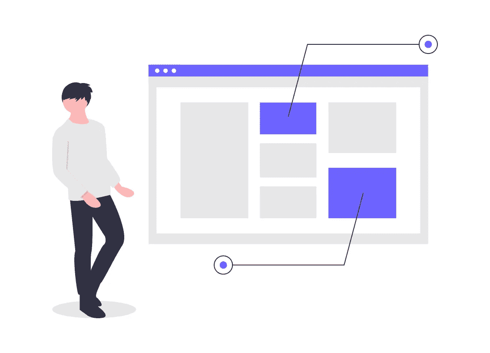
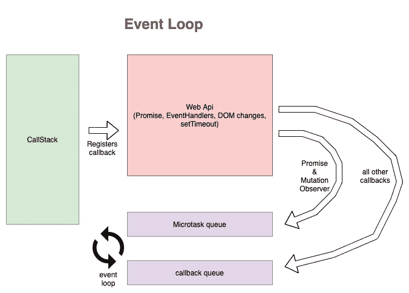

# 揭秘 Javascript 引擎

> 原文：<https://medium.com/nerd-for-tech/demystifying-javascript-engine-41f9aa4bfc07?source=collection_archive---------11----------------------->

**事件循环是 Node.js 的核心，我们都听过这个，让我们来探讨一下**

> 我们都知道 Nodejs 是单线程的，但仍然能够轻松地执行多个任务，这怎么可能呢？

Javascript 不会一次执行多个任务，而是一个接一个地执行所有任务，但是由于其异步特性，它看起来好像是一次执行多个任务。

让我们探索一下 javascript 如何执行代码

Javascript 有一个调用栈，所有代码都在调用栈下执行，一旦代码进入调用栈，它就立即开始执行，javascript 引擎非常快，可以立即执行，但仍有一个问题，现在我们知道 javascript 有一个调用栈，所有代码都在调用栈下执行，那么像从外部源请求数据、promise、setTimeout 等需要时间执行的代码呢，所以我们的下一张图中所有这些问题的答案，让我们探索下图

事件循环

上图是 javascript 引擎的基本表现，同时也解释了 javascript 如何快速执行异步任务。

在上图中，我们可以看到有一个调用栈、一个 webAPI、一个微任务队列、一个回调队列和一个事件循环。现在让我们探索它是如何工作的

一旦任何代码进入调用堆栈，javascript 就开始执行代码，但是如果有任何 fetch、promise、setTimeout、eventHandlers 找到它的代码，javascript 就将这些代码移动到 webAPI，并根据它们注册回调，一旦回调准备好执行，它就移动到微任务队列或回调队列，通知事件循环这些回调准备好执行。

Eventloop 的工作是持续监控调用栈、微任务队列和回调队列，因此当 eventloop 发现调用栈中没有可执行的内容时，它会将回调从微任务队列或回调队列移动到调用栈，javascript 会在回调被移动后立即执行。

现在的问题是这个黑客微任务队列和回调队列是什么，为什么我们有两个队列而不是一个？

让我们揭开这些的神秘面纱，微任务队列也可以被称为优先级队列，因此微任务队列中的所有任务都首先被执行，当微任务队列为空时，只有来自回调队列的任务被移动到调用堆栈中执行。

现在什么任务都归入微任务队列？

承诺和变异观察器放在微任务队列下，所有其他回调放在回调队列下。

希望这篇文章对你理解事件循环和 javascript 引擎有所帮助，欢迎发表你对这篇文章的建议，你喜欢什么，分享你的想法，这样其他人也会觉得有用！