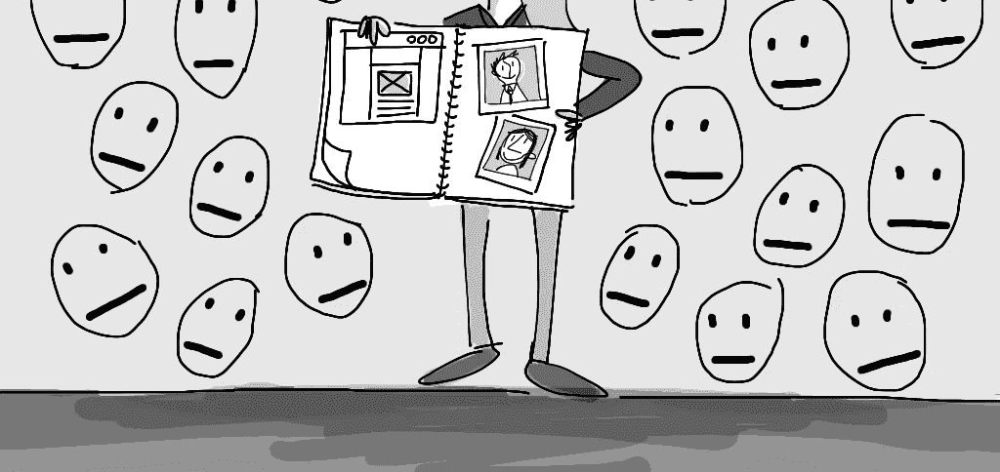
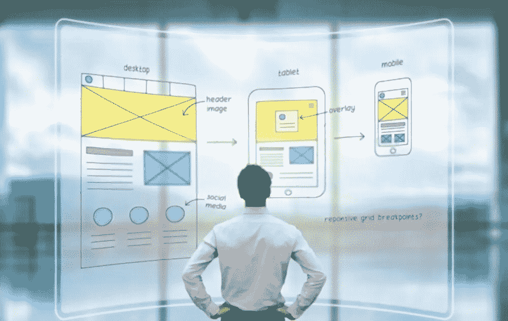
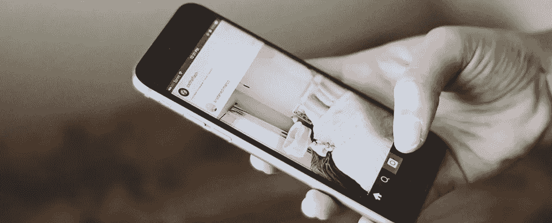
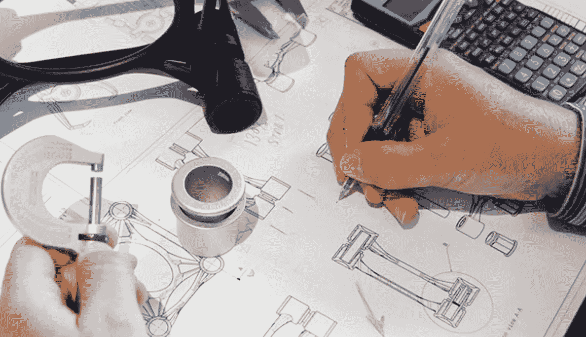
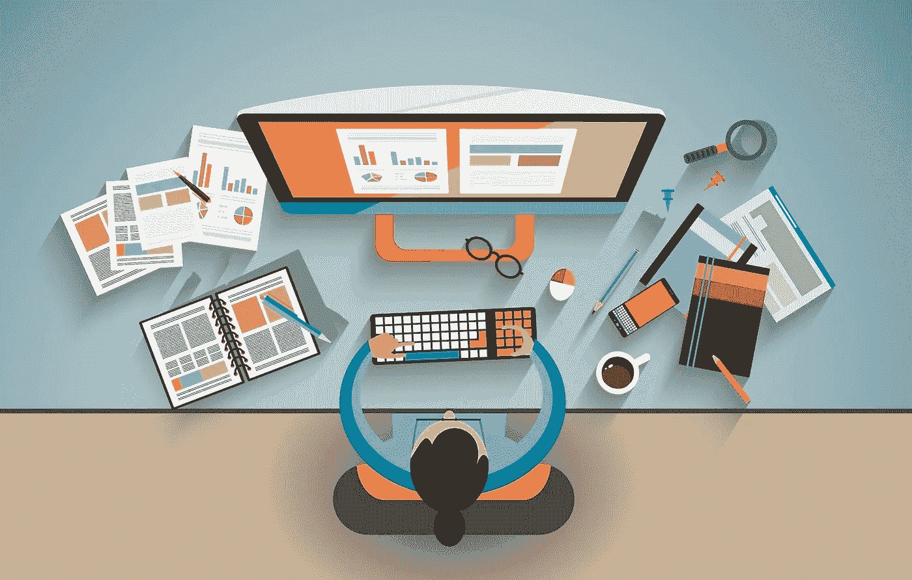

# 揭开 UX 职位及其角色的神秘面纱

> 原文：<https://medium.com/nerd-for-tech/demystifying-the-ux-job-titles-and-their-roles-56d0284d8e6e?source=collection_archive---------27----------------------->

公司从未如此积极地确保他们的用户有一个积极的体验，这就是为什么 UX 设计职位现在需求量很大。据 CNN 财经报道， [UX 职位](https://bit.ly/3rEGXgh)是美国 50 大专业职位之一。雇佣一名 UX 设计师是许多现代公司的优先事项，因此在未来 5 年，顶级组织的经理们将会把这类员工的数量增加一倍。

希望推进你的设计事业，并作为一名设计师赚取额外收入？今天并不缺少选择。你可以选择自由职业。或者加入或创办一家远程设计机构。或者用老办法，换到公司里薪水更高的职位。不管你走哪条路，有一样东西可以增加你的薪水:一项新的、受欢迎的设计技能。

[Wondershare Mockitt](https://bit.ly/3ewCXuz) 列出了一些在你的设计生涯中应该投资的技能。这份清单上的每一项技能都是雇主和客户非常需要的。从长远来看，这将帮助你赚更多的钱，并真正将你的职业生涯提升到一个全新的水平。

*1。UX 设计*

*2。交互设计*

*3。视觉设计*

*4。产品设计*

*5。编码技巧*

*6。内容策略*

*7。研究&评估*

# UX 设计

UX 设计是通过增加可用性和易用性，以及用户与产品交互过程中的乐趣来提高用户满意度的过程。UX 设计的最终目标是通过测试和确定满足双方需求的过程，将商业目标与用户需求联系起来。

UX 设计师是根据用户需求进行设计的人，并且清楚地了解用户的想法。UX 设计师的任务是为用户提供方便、有用和舒适的产品。形式上，UX 开发人员负责整个产品开发过程。然而，大公司倾向于将这个职位分解成几个更小的职位，更深入地专注于某个特定的部分。因此，不同公司的 UX 设计师似乎有不同的职责。

***职责:*** UX 设计师负责参与研究过程、原型制作、开发、测试。与用户和利益相关者沟通也是 UX 设计师工作中非常重要的一部分。对于 UX 设计师来说，手机设计、心理学、交互设计、平面设计和营销学科的知识通常被认为是最重要的。

# 交互设计

交互设计是一门研究系统和用户之间交互的学科。从最纯粹的形式来看，交互设计是指理解和分析人们如何与产品交互，使其更易访问(例如，使按钮更大以使用户输入更容易)。

交互设计师的工作是管理交互。他决定用户触摸后界面将做什么:菜单将如何滑动，将使用什么过渡效果，按钮应如何禁用。不同于 UX 设计，它关注用户与系统交互的所有方面，ID 设计者只处理用户与屏幕之间的特定交互。

***职责:*** 交互设计师负责在屏幕上创建每个元素，用户可以进行以下操作:点击、键入、轻击或滑动。他们努力让每一次互动都变得愉快和可理解。

# 产品设计

产品设计师——用于描述通常参与创建产品外观的设计师。这是负责确保产品设计朝着正确方向发展的人。正如贾斯汀·埃德蒙所说，“产品设计师从高层次保持产品愿景。产品设计师与 UX、UI 或视觉设计师以及市场营销和开发等其他部门密切合作，以创建一个产品如何发展、面向谁、其创建阶段将是什么的清晰画面。

***职责:*** 产品设计师的角色因公司而异。一些组织将“UX 设计师”和“产品设计师”互换使用。阅读职位描述是了解公司对这份工作的定义的最好方法。

# 视觉设计

*图片来源:* [*数字化学习行业*](https://elearningindustry.com/10-tips-improve-visual-design-skills-non-designers)

视觉设计的目标是确保产品传达一种品质感，并引起用户正确的情感反应。视觉设计是最有“品味”和主观的设计类型，但也是最容易被评判的。视觉设计师接受产品和界面设计师的意见，但是他们负责开发产品的“精神”。他们把大部分时间花在界面元素的吸引力上，为的是让用户完全明白产品的目的和价值。

一个好的视觉设计师知道如何在不使用过于浮华的细节的情况下让产品看起来不错。由于视觉设计师最接近用户遇到的实际产品体验，他必须在细节上投入大量时间。因此，视觉设计者获得了高分辨率的图像、动画或其他元素，用户可以立即理解并将其包含在最终产品中。

视觉设计和平面设计密切相关，这两个术语经常互换使用。然而，当我们谈论视觉设计时，我们基本上是指专门为数字产品(网站，移动应用程序，桌面应用程序)进行设计。

***职责:*** 视觉设计师专注于排版、布局、色彩、图形、视觉、图像、纹理，创造一种有凝聚力的美感。

# 创造视觉设计的原则

视觉设计吸引了上述元素，并以一种有意义的方式有效地整合了它们。为了弄清楚如何使用基本元素，您需要考虑以下问题:

*   **统一性**指的是页面上的所有元素在视觉上或概念上都应该在一起。视觉设计必须在统一性和多样性之间取得平衡，以免变得愚蠢或乏味。
*   视觉设计中的格式塔帮助用户感知整体设计——而不是看单个的元素。如果设计元素定位得当，整体设计的格式塔就会清晰。
*   正如亚历克斯·怀特在他的书《平面设计的元素》中所写的，空间是“当某物在其中时被定义的”。在设计中融入空间有助于保持注意力，增加可读性，并创造一种错觉。空白是布局的重要组成部分。
*   **平衡**给人平均分配的印象。这并不总是意味着实现了对称。
*   **对比**着重于使元素突出，突出大小、颜色、方向和其他特征的差异。
*   **层次**表示元素之间含义的不同。设计师通常通过改变字体大小、颜色和页面布局来创建层次结构。
*   **刻度**定义了尺寸范围。它通过展示每个元素如何根据大小相互关联来创造趣味性和深度。

# 编码技巧

写作和编码都是标志性的独角兽技能——同时掌握这两项技能会让你对雇主更有吸引力。最近一项对 500 份工作机会的行业研究发现，大多数雇主希望初学者和高级设计师都具备 HTML、CSS 和 JavaScript 技能(其次是 jQuery、React.js 和 Bootstrap)。如果你想要更高的速度和更好的设计性能，编码技能可以让你与其他设计师平起平坐，甚至超越他们。

如果你不想冒险在 UX 写作，试着学习一门编码语言。回报同样巨大。对于设计师来说，获得一些关于所谓的“界面”(表示层)、HTML 驱动(超文本标记语言)和 CSS(级联样式表，一种描述 HTML 文档中组件样式的语言)的基本知识会非常有帮助，也许会惊讶于学习这些基础知识是多么容易。

编码帮助你使你的创作更具互动性。您可以创建移动的原型和动画，向您展示每个设计元素将如何工作，而不是呈现平面布局。它可以帮助你逐步转向网站和 UX /用户界面设计，甚至推出你自己的产品。学习编码并不像听起来那么令人心碎。入门总是很难。所以先为宝宝走几步。玩一些游戏来取乐。找一个简单的 HTML 教程，完成它。将你的学习过程分解成你可以实际完成的小的日常任务。

# 内容策略

把设计和内容分开是不可能的，页面的外观和可用性取决于文本和它的布局。因此，UX 文案的工作与设计过程直接相关。在撰写文本时，他以来自 UX 设计师和分析师的业务任务和数据为指导。他和设计师一起工作，使用同样的数据和工具。

内容策略/ UX 文案是一个术语，有些人把它当作 UX 作家的同义词。但这不是真的，因为意义被违背了。文案就是描述一个公司的广告策略。UX 文案主要是关于吸引注意力和吸引顾客。这样的文字没有描述用户体验，这是纯粹的营销。文案的主要目标是帮助用户了解产品并试用它。

***职责:***

1.与编辑、作家、UX 设计师、内容管理系统开发人员和营销人员协作，提供与业务目标一致的故事

2.与跨职能团队合作，建立和阐明内部和外部重要信息，并确保内容相应一致

3.为传统和数字营销渠道以及内容营销和分发平台制定内容战略

4.监控网络流量和参与度(如转化率和跳出率)

5.关注行业相关新闻，围绕热门话题产生想法

6.根据需要查看和更新发布的内容

# 研究和评估

在研究过程中，用户体验设计师对用户有了更好的了解，并试图理解问题和行为。通过上下文用户访谈、人物角色和移情图等方法，最佳产品体验的基础就奠定在这里。没有对目标群体的研究和了解，通常很难想出好主意。这种类型的研究通常被称为用户或设计研究，相应方法的知识对于用户体验设计师来说非常重要。

在评估过程中，用户体验设计师利用他的技术专长来评估现有的产品或服务。通常，这是通过所谓的启发式审查来完成的，即根据某些用户体验标准进行系统的书面评估。对现有产品和功能的评估在用户体验设计师的日常生活中并没有发挥最大的作用，但对于创建一个良好的优化起点来说却是非常重要的。

# 结论

设计行业在过去的几年里发展了很多，正如你所看到的，很难清楚地定义一个人在某个职位上需要什么。当谈到 UX 设计职位，重要的是要明白，如果你真的想创造一个一致的和有凝聚力的体验，上述所有的学科和技能不能完全采取和划分！与此同时，如此多的种类为你选择最感兴趣的领域提供了大量的机会。

感谢您花时间阅读这篇文章。[了解更多关于 Mockitt 的信息](https://bit.ly/3ewCXuz)

我们为 UX 初学者创建了一个[终极指南](https://bit.ly/2OLPPlW)，它收集了来自多个 UXers 的知识、经验和建议。

订阅我们的 [YouTube](https://www.youtube.com/channel/UCESxamaRS8nOGpWYvP1VSqA) [脸书](https://www.facebook.com/mockitt) [Instagram](https://www.instagram.com/wondershare.mockitt/)

*原载于*[*https://mockitt.wondershare.com*](https://mockitt.wondershare.com/ui-ux-design/ux-job-titles.html)*。*