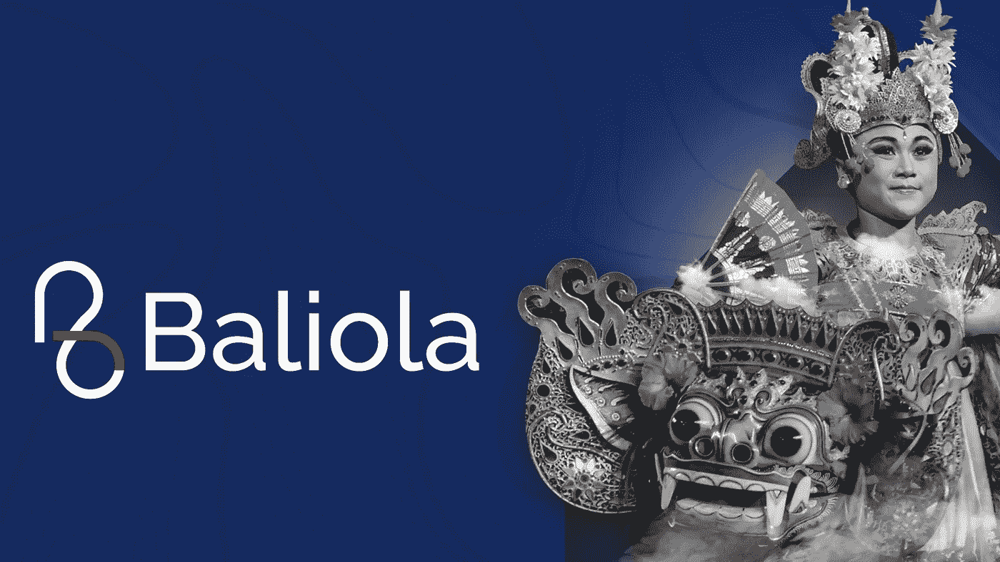
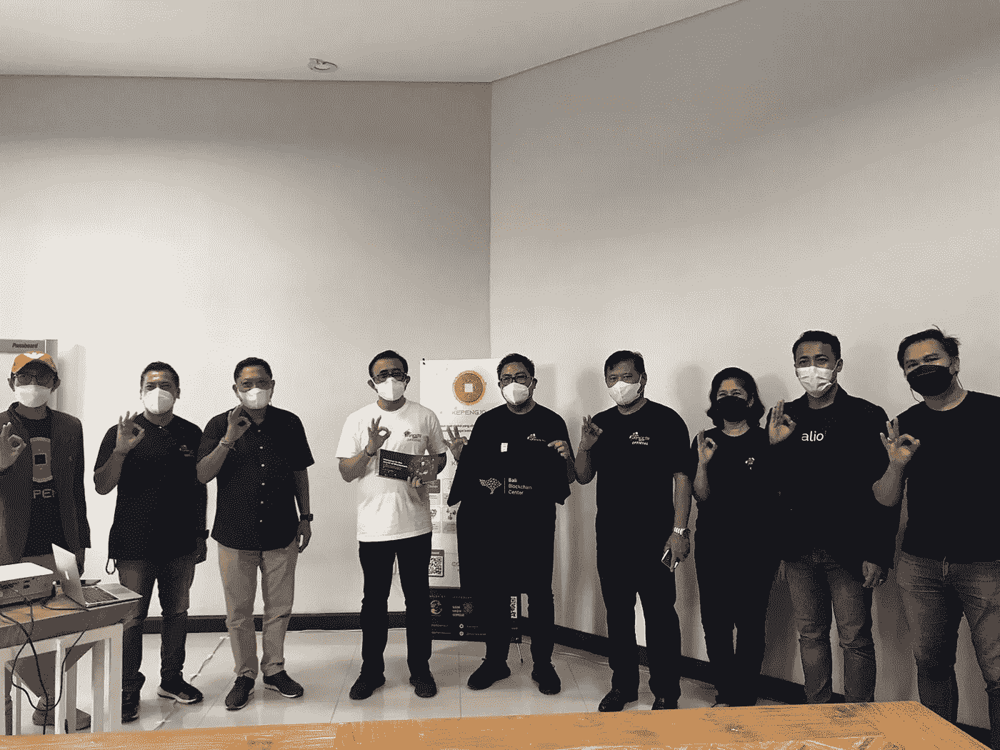
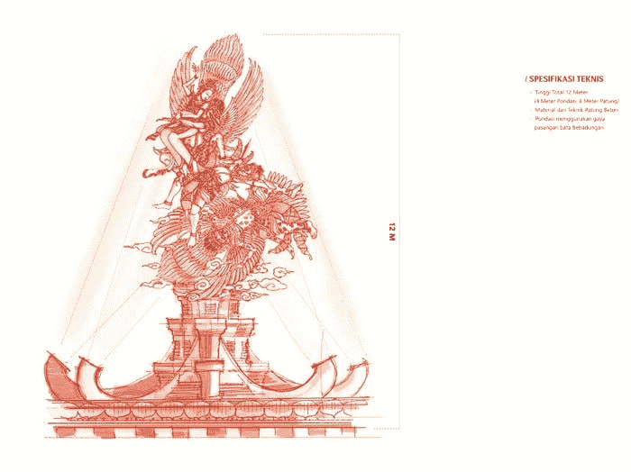

# 登巴萨市政府与巴利奥拉的关系

> 原文：<https://medium.com/nerd-for-tech/denpasar-city-governments-relationship-with-baliola-c0dc683cff2d?source=collection_archive---------9----------------------->

基于数字的创意产业被认为是重振巴厘岛经济的解决方案。巴厘岛是受新冠肺炎疫情影响最严重的省份之一。制定创业政策的若干战略，包括政府目前正在开展的创意经济发展，是通过提高企业能力和企业家获得融资的机会，增加企业和创业机会的创造，以及增加社会企业的附加值。
数据还显示，印度尼西亚约有 820 万家创意企业，以烹饪、时尚和手工艺企业为主，因此这三个子行业对创意经济的 GDP 贡献也最大。此外，增长最快的细分行业有 4 个，分别是电视和广播；电影、动画和视频；表演艺术；视觉传达设计(DKV)。

## Baliola.com

为此，BKRAF Denpasar 与 Kepeng.io 合作建造了 Baliola。Baliola.com 是由 Kepeng.io 形成的一个生态系统，作为一个市场，以 NFT(不可替代的令牌)的形式销售艺术家的创意产品，包括数字和非数字产品。Baliola 测试版的发布是每个艺术家和 NFT 活动家都在等待的时刻，他们将艺术品铸造成 NFT 物品的过程公布于众。在 NFT 铸造过程中，艺术家可以通过三种选择，即固定价格、定时拍卖和公开招标，来确定柯鹏令牌(KPG)价值中的销售价格(price)。
此外，Kepeng.io 和 Bekraf Denpasar 现在得到了登巴萨市政府的支持，旨在培养了解并能够实施区块链技术和 NFT 的登巴萨市民。

## 启动巴厘岛区块链中心。

巴厘区块链中心的成立旨在为社区提供了解加密货币和区块链技术的知识，以便他们能够正确有效地在其中发展自己。
这是因为区块链是一项新技术，需要理解和大量最新的技术参考，建立巴厘区块链中心的主要目标是学生和登巴萨市的加密资产爱好者社区。巴厘区块链中心的建立旨在使登巴萨市成为区块链技术发展和世界令牌化的长期中心。

## 区块链纪念碑

第二，用 NFT 的资金在登巴萨市建造纪念碑。登巴萨市政府将建造一座高达 12 米的纪念碑，名为“西塔柯潘东”。纪念碑的资金是通过不可替代的象征(NFT)机制从企业社会责任(CSR)中筹集的。这一机制被选为体现了登巴萨市政府在提高市民地位方面所倡导的 Vasudhaiva Kutumbakam 精神。据登巴萨市长 Jaya Negara 说，建造 Sita Kepandung 纪念碑是为了美化登巴萨的面貌。此外，这座纪念碑也有望给路过或在附近的每一个人带来积极的震动。

NFT 时代是一个合作的时代。当然，如果政府作为一个地区决策的实施者给予支持，效果会更好。Baliola 本着唤醒巴厘岛艺术家在工作中的创造力的精神，得到了市政府的支持，这符合在数字时代建立一个有文化和有技能的社区的愿景。