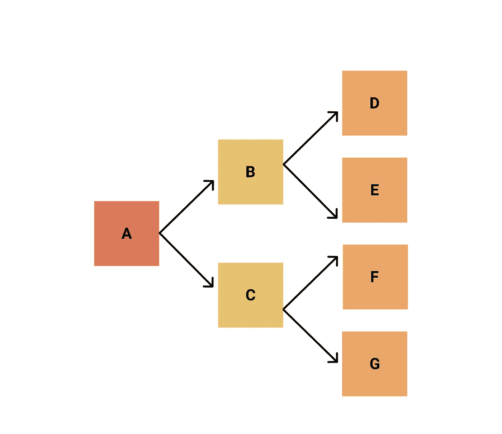
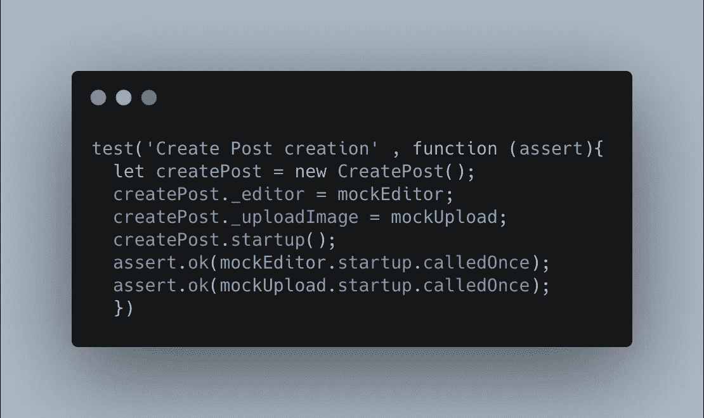
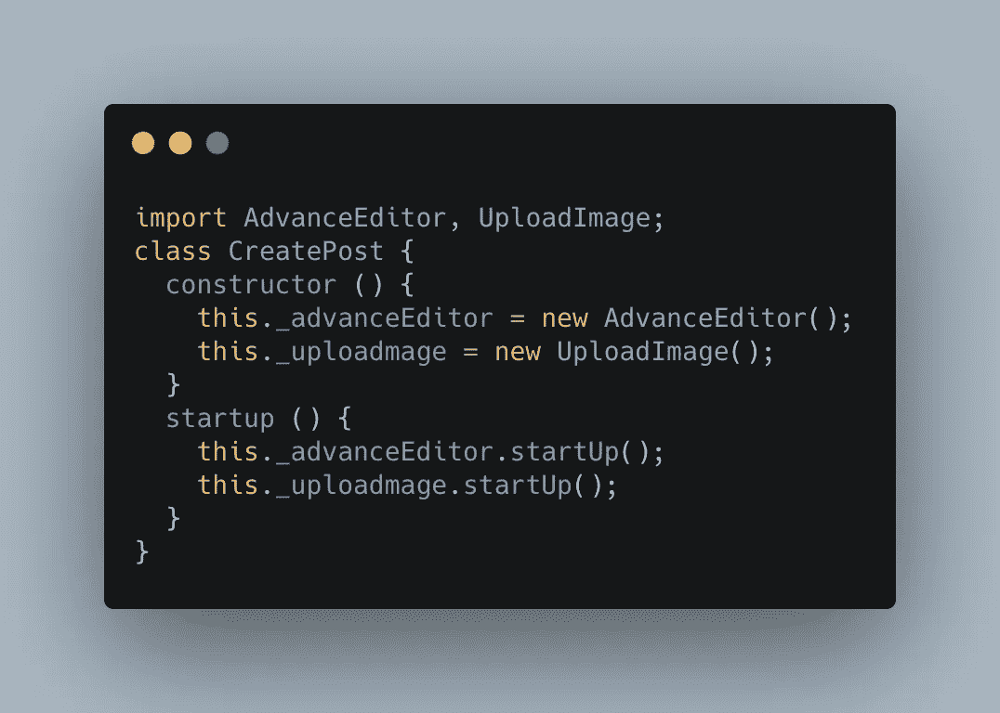
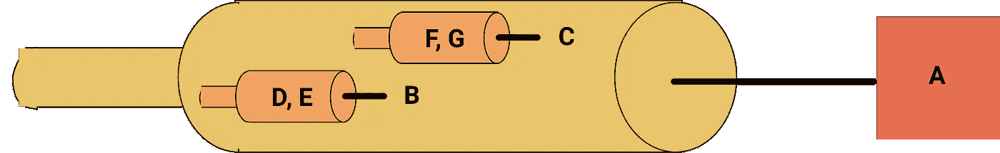
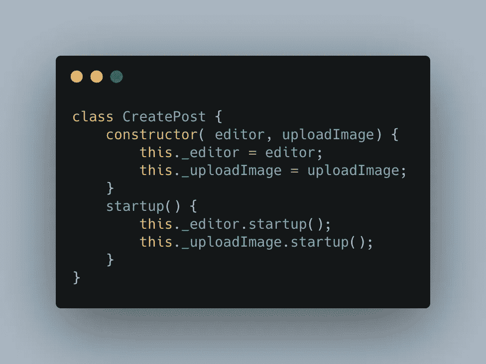
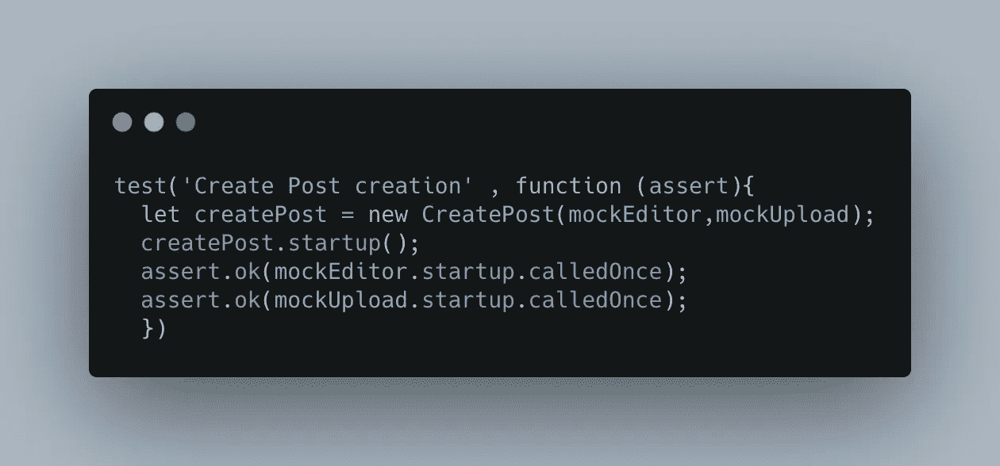

# 使用 JavaScript 的依赖注入

> 原文：<https://medium.com/nerd-for-tech/dependency-injection-using-javascript-42b720485bd4?source=collection_archive---------2----------------------->

# 什么是依赖？

一个组件或类有时需要其他类来执行它的功能。这些都是依赖。

## 为什么我们需要依赖？

我们把班级分开是为了更好地管理他们。在下面的例子中，**编辑器**和**上传图片**从**创建帖子**中分离出来，以便更好地管理它。

分离必须合乎逻辑，并且应该减轻我们的工作。依赖项可以有更多的依赖项。所以通过添加一个组件作为依赖项，你将会带来它所有的可传递的依赖项。

CreatePost 依赖于上传图像和编辑器

## 上面的代码有什么问题？

上面的类在构造函数中创建了**编辑器**和 **UploadImage** 实例。这存在以下问题。

> 难以对 CreatePost 类进行单元测试，就像难以模拟依赖关系一样。在下面的例子中，我们不能停止调用编辑器和上传的构造函数。

> 很难用 AdvanceEditor 这样的其他类来替换编辑器。在下面的示例中，需要更改 CreatePost 类以使用 AdvanceEditor。

# 依赖注入有助于解决这些问题

避免了直接依赖，以消除依赖注入中的紧密耦合。依赖项是在构造时通过构造函数添加或注入的。

D、E 到 B 的依赖注入；f，G 到 C 和 B，C 到 A

在下面的例子中，依赖关系由 **CreatePost** 的调用者提供。这将消除类 **CreatePost** 直接依赖编辑器和 UploadImage 的需要。编辑器和图像实例通过构造函数传递或注入。

> 通过 CreatePost 构造函数传递图像和编辑器，很容易模仿它们。

编辑器和上传是完全模仿出来的

> 易于用其他编辑器实例替换编辑器，因为只要 AdvanceEditor 支持该接口，就只传递一个编辑器实例。

依赖注入概念听起来是一个困难的概念。像 JavaScript 中的 Angular、Spring 和 Java 中的 Google Guice 这样的框架使用了它的许多附加功能，使它很难掌握。

这对于编写优雅的测试和消除紧耦合非常有用。最好先编写简单的类，然后随着复杂性的增加将它们分开。通过依赖注入消除紧耦合，实现更好的分离。