# 使用 Terraform 部署 2 层架构

> 原文：<https://medium.com/nerd-for-tech/deploy-2-tier-architecture-using-terraform-4b02c7d51936?source=collection_archive---------0----------------------->

欢迎回到我的世界。本周，我们将关注 Terraform。

在我们开始之前，我想我们都应该知道一个关于地形的基本知识。

那么什么是 Terraform 呢？

Terraform 是由 Hashicorp 开发的基础设施 as 代码( [IaC](https://en.wikipedia.org/wiki/Infrastructure_as_code) )。这是一个完全开源的配置工具，用类似 JSON 的语言编写，叫做 Hashicorp 配置语言( [HCL](https://www.linode.com/docs/guides/introduction-to-hcl/) )。


如果你有 AWS 方面的知识，你可能知道 CloudFormation，这是 AWS 提供的一项服务。Cloudformation 类似于 Terraform，但 Terraform 是多云平台，它可以用于你能想到的任何云平台。

Terraform 解决什么问题？

Terraform 是一种用于基础设施管理的声明性语言。这意味着您不必担心使用什么调用来制作东西的细节，您需要做的只是编写一个描述文件来描述您希望它做什么。

例如:我开始了一个新项目，我必须在 AWS 中部署它。如果没有 Terraform，我将不得不进入 AWS 控制台，单击 EC2 来部署实例，为存储部署 S3，并根据自己的需要手动配置 VPC、子网和安全组，这需要我点击很多次。

Terraform 解决了基础设施管理问题，我所要做的就是写下一个描述性的 terraform 文件，指定我想要什么资源并部署它。Terraform 将跟踪变化，并为我部署整个基础设施。

以下是我们将在项目中部署的内容:

> 1.使用 CIDR 10.0.0.0/16 部署一个 VPC，并使用 CIDR 10.0.1.0/24 和 10.0.2.0/24 部署两个公共子网。为了实现高可用性，每个公共子网应该位于不同的 AZ 中。
> 2。使用 CIDR“10 . 0 . 3 . 0/24”和“10.0.4.0/24”创建两个专用子网，其中一个子网中有一个 RDS MySQL 实例(微型)。每个专用子网应该位于不同的 AZ 中。
> 3。将流量导向公共子网的负载平衡器。
> 4。在每个公共子网中部署 1 个 EC2 t2.micro 实例。

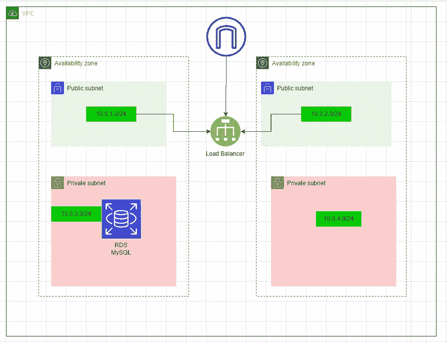

先决条件:

*   AWS 帐户
*   IDE，我将使用 VSCode

另外值得注意的是，我将使用 Terraform 模块来促进可重用性和防止错误，而不是像往常一样编写 HCL。

要找 AWS 模块，可以去官方 [Terraform 注册网站](https://registry.terraform.io/providers/hashicorp/aws/4.25.0)找。

Terraform 中的最佳推荐做法是使用 Terraform 模块，但这是我的第一个 Terraform 项目，所以我将在一个文件中编写我所有的代码。

让我们开始吧！。

我们将首先向 terraform 提供我们想要使用的云，指定我们想要使用的版本和区域。

接下来，我们将从下面的代码开始创建 VPC 和我们的 2 个公共子网

私有子网。

我们将需要:

*   引导流量的互联网网关。
*   网关的路由表，用于确定来自网关的网络流量被定向到何处。
*   我们公共子网的路由表。

接下来我们需要的是公共和私有子网的安全组。这将允许来自某些端口的传入流量。

负载平衡器将是我们创造的下一个东西。这将有助于平均分配连接数量，防止过载。把它想象成一个餐馆的主人，每次你走进去，主人都会把你安排到合适的桌子上。

负载平衡器将需要一个目标组来转移流量，监听器将处理请求

所以我们需要的东西都有了。是时候创建 EC2 了。我包括一个小脚本，以便我们可以确保网页是我们的愿望。

最后，我们的 RDS 附加了一个子网组，这将有助于为我们的 RDS 数据库实例指定一个 VPC。

我还将 IP 地址作为输出，这将在我们执行 terraform 命令时显示 IP 地址。

现在我们已经拥有了部署 2 层架构所需的一切。

让我们运行它！。

```
terraform init
```

这个命令将是您要执行的第一个命令。它帮助用 terraform 配置文件初始化一个目录。

一旦成功，就会显示如下图

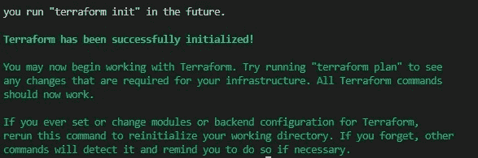

```
terraform plan
```

该命令将执行一个计划，并向您展示将要构建的内容的预览。

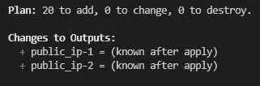

在这两个命令之后，您终于可以运行了

```
terraform apply
```

CLI 将询问您是否要继续，请键入 yes

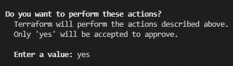

该过程将需要 5 分钟，因为构建 RDS 数据库需要一段时间

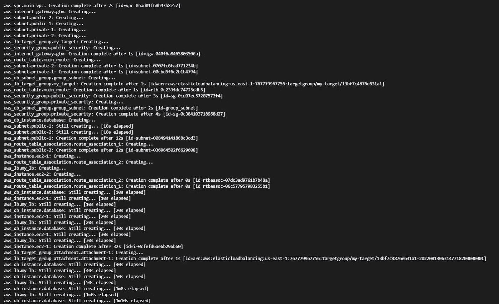

成功通知和我们放入代码中的输出 IP 地址将在完成时弹出。


我们可以进入 AWS，查看创建的资源。

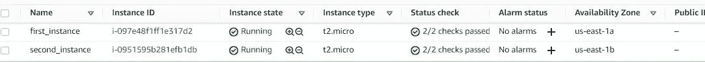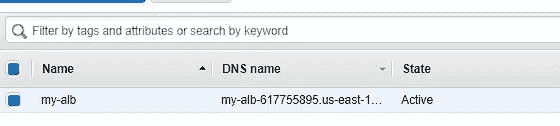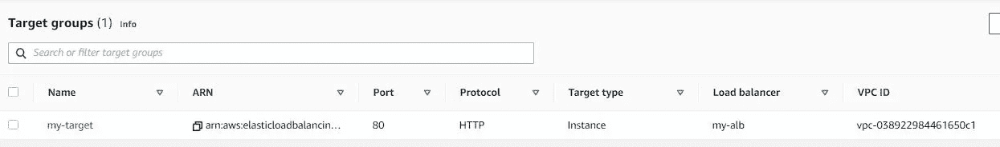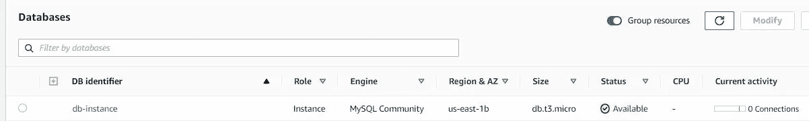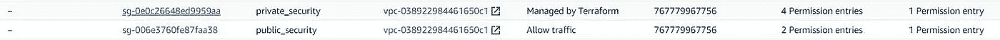

您可以通过进入我们的负载平衡器来检查 web 服务器，并复制 DNS 名称= >将其粘贴到一个新的选项卡上，它将显示我们的网页。

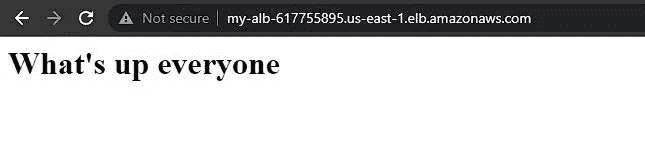

我们教程的最后一部分将删除我们创建的所有资源。

```
terraform destroy
```

系统将提示您再次键入 yes，然后继续。


非常感谢你跟随我的教程！。