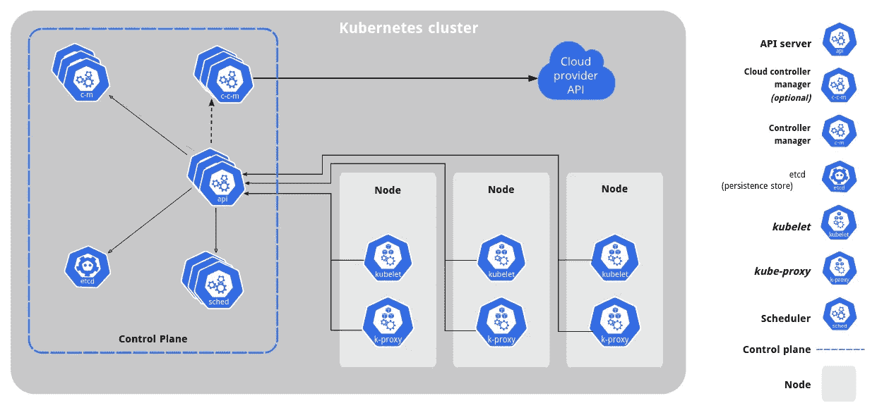
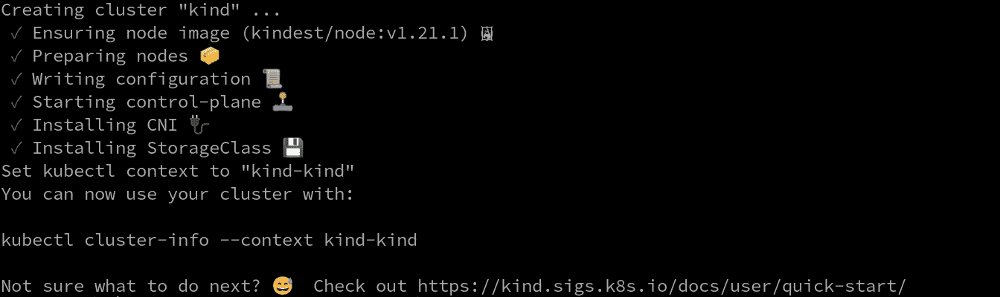
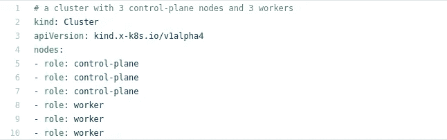
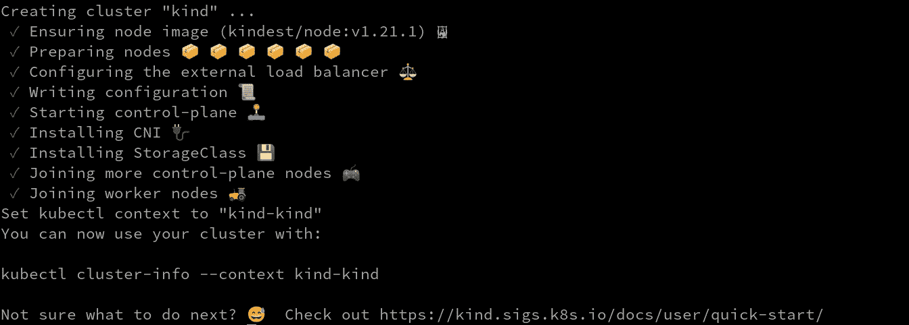
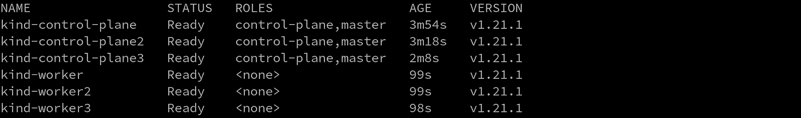
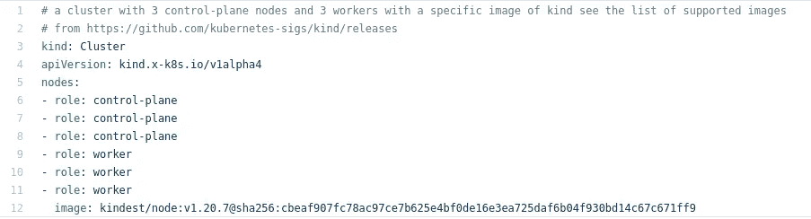
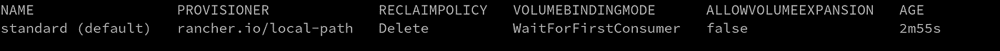
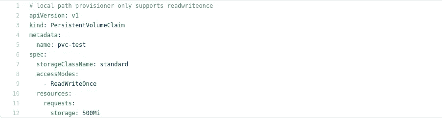
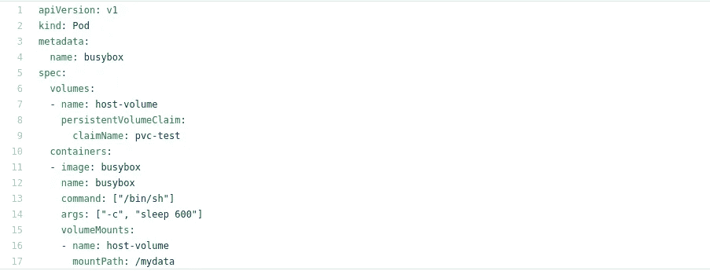
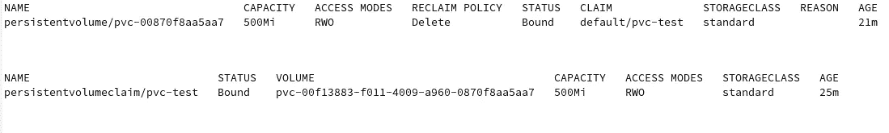

# 在 5 分钟内部署多节点 Kubernetes 集群

> 原文：<https://medium.com/nerd-for-tech/deploy-a-multi-node-kubernetes-cluster-in-5-minutes-346ec5c0ad1b?source=collection_archive---------0----------------------->

Kubernetes 是编排容器最常用的开源平台。在这里，我将向您展示如何使用 kind 在 5 分钟内创建一个多节点集群。在这里，我们将使用名为 kind 的工具将 run docker 容器用作 Kubernetes 工作节点。

**Kubernetes 建筑**

在开始创建集群之前，让我们先了解一下 Kubernetes 架构。



库伯内特建筑

**每个 Kubernetes 节点都会有一个容器运行时来运行容器。对于主节点，将有一个 API 服务器、控制器管理器、调度器和 kubelet。对于 worker 节点，它将有 kubectl 和 kube-proxy。**

点击，了解更多关于[的信息。](https://kubernetes.io/docs/concepts/overview/components/)

**种类**

Kind 是一个简单的工具，但是具有一些强大而独特的特性，使得运行本地 Kubernetes 集群更加方便。Kind 是 Kubernetes 的 SIGs 项目，但与 minikube 相比有很大不同。它将集群移动到 Docker 容器中。与生成虚拟机相比，这导致启动时间显著加快。

节点可以是数据中心的物理机，也可以是云提供商的虚拟机。建议的 VRAM 要求是 8GB。

## 先决条件

该工具要求您安装有[码头工](https://docs.docker.com/get-docker/)或[搬运工](https://podman.io/getting-started/installation)。

**选装包**
1。安装了 Kubernetes 命令行工具。
2。安装 [jq](https://github.com/stedolan/jq/wiki/Installation) 。

现在使用下面两个步骤中的任何一个来安装 kind。

**1。使用 golang 安装种类**

Kind 发布了它的 Go 包，如果您想以编程方式创建一个 Kubernetes 集群，可以在后台使用这些包。如果你想了解更多，看看 [GoDocs](https://godoc.org/sigs.k8s.io/kind/pkg/cluster) 看看 [KUDO 如何使用 kind 进行集成测试](https://github.com/kudobuilder/kudo/blob/f7b09025f5c2faf5492624facc1dc4c5c7a5ccad/pkg/test/harness.go#L105)。

从[这里](https://golang.org/dl/)下载最新的 [golang](https://golang.org) 包。

1.  `wget https://golang.org/dl/go1.16.6.linux-amd64.tar.gz`
2.  `sudo tar xzf go1.16.6.linux-amd64.tar.gz -C /usr/local/`
3.  `export PATH=$PATH:/usr/local/go/bin`
4.  `GO111MODULE="on" go get sigs.k8s.io/kind@v0.11.1`
5.  在步骤 4 之后，go 目录被创建。现在将路径导出到

`export PATH=$PATH:~/go/bin`

**2。使用二进制安装种类**

我们将遵循的说明将在您的主目录中创建一个“kind”文件，并为该文件设置适当的权限，然后将其移动到`/usr/bin`位置。

1.  `curl -Lo ./kind [https://kind.sigs.k8s.io/dl/v0.11.0/kind-linux-amd64](https://kind.sigs.k8s.io/dl/v0.11.0/kind-linux-amd64)`
2.  `chmod +x ./kind`
3.  `sudo mv ./kind /usr/bin/`或`/usr/local/bin/`

> 使用->种类版本验证版本
> 
> 种类 v0.11.0 go1.16.4 linux/amd64

## 创建单节点种类群集:

我们将首先创建一个单节点集群。要创建一个在 docker 容器中运行的主节点，请执行`kind cluster create`



种类分类创建

创建一个默认的集群名。创建集群时，使用`--name=<cluster-name>`指定集群名称。`k config get-contexts`列出当前活动的集群。


当前部分中的“ ***** ”表示。当前活动集群

> 要切换到不同的集群，`k config use-context <cluster-name>`

## 创建多节点种类集群:

使用 [yaml 文件](https://github.com/srivickynesh/kind/blob/master/configs/control-plane-ha.yaml)创建一个多节点类集群环境。



`control-plane-ha.yaml`

在创建集群时使用这个配置文件来创建一个多节点 Kubernetes 集群，它有 3 个控制平面和 3 个工作节点。

`kind create cluster --config configs/control-plane-ha.yaml`



验证通过执行`kubectl get nodes`创建的集群节点



**集群配置:**

默认情况下，集群访问配置存储在`${HOME}/.kube/config` 中，使用`export KUBECONFIG=${HOME}/.kube/config`设置 KUBECONFIG 环境。在终端中使用`kind get kubeconfig`来验证您的配置。

**改变节点图像:**

如果您想使用旧的映像，可以在创建集群时指定它

`kind create cluster --image kindest/node:v1.20.7@sha256:cbeaf907fc78ac97ce7b625e4bf0de16e3ea725daf6b04f930bd14c67c671ff9`

> kind 的每个版本都支持特定的 Kubernetes 版本列表。你可以从[发布页面](https://github.com/kubernetes-sigs/kind/releases)看到 Kubernetes 支持的版本列表。

此外，您可以通过配置文件为每个节点传递特定的映像。



不建议为不同的节点传递不同的图像

**动态卷供应:**

如果您想要将持久性存储附加到您的集群，kind 在创建 Kind 集群时会附带一个预先配置的默认存储类。使用`kubectl get sc` cmd 查看当前可用存储类别的列表。



标准是创建群集时创建的默认存储类

> volumebindingmode 中的 WaitforFirstConsumer 表示 pvc 在附加到 pod 之前不会被绑定。

创建一个 [pvc.yaml](https://github.com/srivickynesh/kind/blob/master/configs/pvc.yaml) 文件。



pvc.yaml

kubectl create-f[PVC . YAML](https://github.com/srivickynesh/kind/blob/master/configs/pvc.yaml)

我们已经创建了一个永久卷声明(pvc ),现在我们将它附加到一个 [busybox](https://github.com/srivickynesh/kind/blob/master/configs/busybox.yaml) pod。



claimName 应该与 pvc.yaml 中的 pvc 名称相匹配

kubectl create-f[busybox . YAML](https://github.com/srivickynesh/kind/blob/master/configs/busybox.yaml)

使用`kubectl get pv,pvc` 和`kubectl get pods`验证创建的 pv、pvc



现在我们已经创建了一个由 pvc 支持的多节点集群，并将其挂载到 busybox 上。

在 Kubernetes 中部署服务后，您必须公开您的服务，以便您的用户能够访问它。从外部访问集群有三种方式:入口、负载平衡器和节点端口。

**删除集群:**

移除种类群集非常简单。

```
kind delete cluster
```

当我想将本地图像直接加载到集群中时，Kind cluster 就派上了用场。这为我节省了一些额外的步骤，即每次我想做更改时，都要修复注册表并推送我的图像。这个映像可以在我的集群中使用，只需一个简单的`kind load docker-image app:latest` 命令。