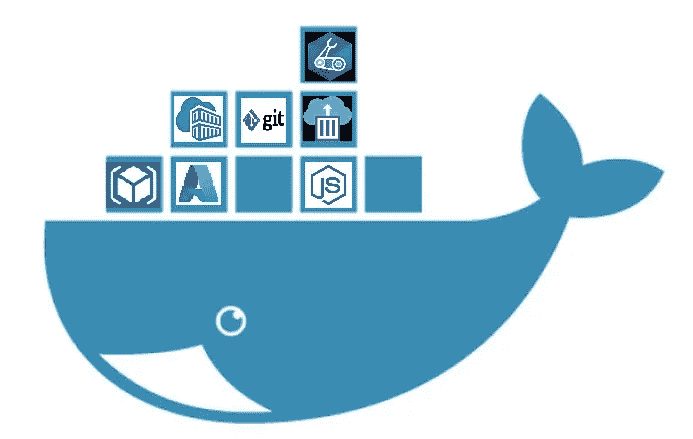
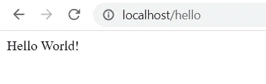
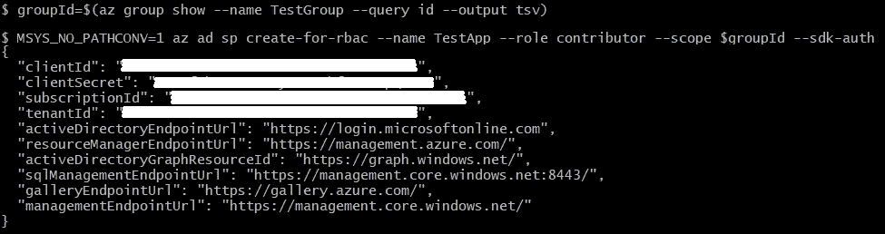
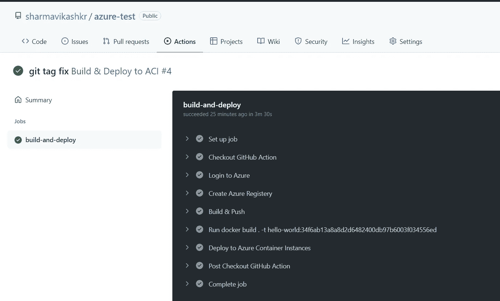

# 通过 GitHub 操作在 Azure 容器实例(ACI)中部署应用程序。

> 原文：<https://medium.com/nerd-for-tech/deploy-an-application-in-azure-container-instances-aci-through-github-actions-df7144fcd67f?source=collection_archive---------2----------------------->



旗帜

GitHub Actions 进入市场才一两年，就已经赢得了可观的人气。在社区中容纳了超过 80%的源代码，随着对 CI/CD 需求的增加，GH actions 在竞赛中起步较晚，但发展迅速。许多团队正在将他们的工作流迁移到 GH actions。
谈到迁移，容器已经成为打包&部署云应用的首选方式。Azure 的容器实例(ACI)为他们的 Kubernetes 服务(AKS)带来了一个最小的编排替代方案，这对于小型中型应用程序来说可能是理想的。
今天，我将指导您通过 GitHub Actions 在 ACI 中部署应用程序。

这篇文章分为三个部分。
***第一节*** 讲 dockering an(NodeJs)应用；
***Section#2*** 将帮助您在 GitHub secrets 中设置 Azure 凭证；
**第 3 节**将帮助您创建一个 GitHub 工作流，将您的 docker 映像部署到 Azure 容器实例。

# **第一部分:对申请进行备案**

在这一节中，我将对一个现有的 NodeJs 应用程序进行 docker 化，创建它的 docker 映像，并验证它在本地可以完美地工作。如果你的申请已经被归档，跳过这一部分。

## ***步骤#1* :将 Dockerfile 添加到您的应用程序中**

我有一个正在整理的 NestJs 应用程序。默认情况下，该应用程序在端口 80 启动。添加 Dockerfile 文件以构建映像。

## 步骤 2:在本地验证

在本地构建并运行 docker 映像，并验证它工作正常。

```
$ **docker build -t hello-world:1.0.0 .** $ **docker run -p 80:80 hello-world:1.0.0**
```



在本地工作

# **第 2 部分:在 GitHub secrets 中设置 Azure 凭证**

本节将指导您创建一个资源组范围的服务主体，并将其凭证保存到 GitHub secrets。这些秘密将在 GitHub 操作中使用，以在工作流中向 Azure 进行身份验证。如果您已经完成了这些步骤，请随意跳过这一部分。

## **步骤#1:在本地安装 Azure CLI**

我们将使用 Azure CLI 创建所有资源，并且在继续下一步之前，这些资源必须安装在您的本地计算机上。使用此链接下载 Azure CLI。

## **第二步:交互式登录 Azure CLI**

```
$ **az login --tenant <tenant_id>**
```

如果你只和一个房客交往，那么房客的争论就可以避免。否则，用您的 Azure 租户 ID 替换命令中的<tenant_id>，并在终端中运行。Azure CLI 将使用您的默认浏览器让您登录。</tenant_id>

## **步骤#3:创建资源组**

资源组是 Azure 中资源的逻辑集合。

```
$ **az group create -l centralindia -n TestGroup**
```

使用您选择的名称和位置创建资源组。我正在“*中心区*”中创建“*测试组*”。


## **步骤#4:创建一个服务主体**

Azure 服务主体是为应用程序、托管服务和自动化工具访问 Azure 资源而创建的身份。它承担一些角色，在这些角色中它可以采取行动。
要创建服务主体，请确保您有足够的权限(应用程序管理员)或您的租户所有者允许任何用户注册应用程序。

```
$ **groupId=$(az group show --name TestGroup --query id --output tsv)**$ **MSYS_NO_PATHCONV=1 az ad sp create-for-rbac --name TestApp --role contributor --scope $groupId --sdk-auth**
```

在第一个命令中，使用您在上一步中创建的资源组的名称。
将服务主体的名称放入您选择的第二个命令中。我把它命名为' *TestApp* '。



保存 Azure 生成的服务主体的 JSON。

## **步骤#5:创建 GitHub 秘密**

在您的浏览器中，进入您的**GitHub repo**->-**设置**->-**秘密**，创建以下秘密。GitHub actions 将使用这些秘密向 Azure 进行身份验证。

**AZURE _ CREDENTIALS**=>*<上面生成的 JSON>*
**AZURE _ USERNAME**=>*<服务主体的 clientId>*
**AZURE _ PASSWORD**=>*<服务主体的 client secret>*

# **第 3 节:创建 GitHub 工作流以创建容器实例**

本节创建一个 GitHub 工作流，该工作流构建应用程序的映像，推送到 Azure Container Registry，并使用它来部署 Azure Container 实例。

## 步骤#1:配置 *workflow.yml*

在您的本地，转到您的*存储库/。github/workflows* 并创建 *workflow.yml* 。将其配置为每次将更改推送到主分支时运行一次构建。

```
on:
 push:
  branches:
   — master
name: Build & Deploy to ACI
jobs:
 build-and-deploy:
  runs-on: ubuntu-latest
  steps:
```

现在，在 *workflow.yml* 中，添加以下步骤。

## 步骤 2:签出最新的代码

添加第一步，从主分支签出最新代码。

```
- name: ‘Checkout GitHub Action’
  uses: actions/checkout@master
```

## 第 3 步:登录 Azure CLI

添加下一步，使用保存的 Azure 凭据登录 Azure。

```
- name: ‘Login to Azure’
  uses: azure/login@v1
  with:
  creds: ${{ secrets.AZURE_CREDENTIALS }}
```

## 步骤 4:创建 Azure 容器注册中心

在下一步中，创建一个容器注册表。只有当注册表不存在时，才会创建注册表。

```
- name: ‘Create Azure Registery’
  run: az acr create — resource-group TestGroup — name testgroupregistry — sku Basic
```

## **第 5 步:构建和推送**

在这一步，构建 docker 映像并推送到 azure 容器注册中心。相应地选择 docker 图像的名称。
*注意*:之前生成的服务主体的 clientId 和 clientSecret 可以用来登录注册表。

```
- name: 'Build & Push'
  uses: azure/docker-login@v1
  with:
   login-server: testgroupregistry.azurecr.io
   username: ${{ secrets.AZURE_USERNAME }}
   password: ${{ secrets.AZURE_PASSWORD }}
   - run: |
      docker build . -t hello-world:${{ github.sha }}
      docker tag hello-world:${{ github.sha }} testgroupregistry.azurecr.io/samples/hello-world:${{ github.sha }}
      docker push testgroupregistry.azurecr.io/samples/hello- world:${{ github.sha }}
```

## 步骤 6:部署到 Azure 容器实例

使用映像创建 Azure 容器实例。相应地为您的实例选择变量，并正确地指定图像 URL。此步骤仅在 ACI 已创建的情况下部署新映像。

```
- name: 'Deploy to Azure Container Instances'
  uses: 'azure/aci-deploy@v1'
  with:
   resource-group: TestGroup
   dns-name-label: helloworlddevtest
   image: testgroupregistry.azurecr.io/samples/hello-world:${{ github.sha }}
   cpu: 1
   memory: 1
   registry-username: ${{ secrets.AZURE_USERNAME }}
   registry-password: ${{ secrets.AZURE_PASSWORD }}
   name: helloworlddev
   location: 'central india'
```

## 第七步:推动改变

这将自动触发工作流。导航到*<your _ repo _ URL>/actions*以查看您的工作流作业&构建。



## 步骤 8:验证

登录 Azure Portal，导航到创建的容器实例，找到 FQDN 并浏览。
或者，工作流中的“*部署到 Azure 容器实例*”步骤也打印实例的 URL。


> *代码库:* [https://github.com/sharmavikashkr/azure-test](https://github.com/sharmavikashkr/azure-test)