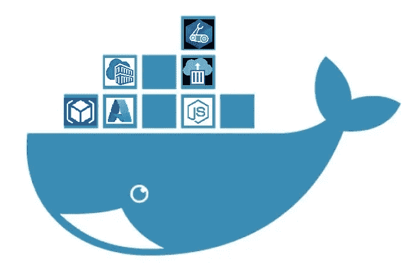
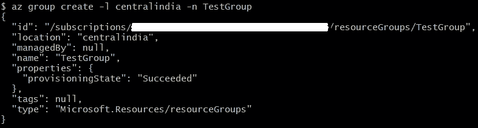
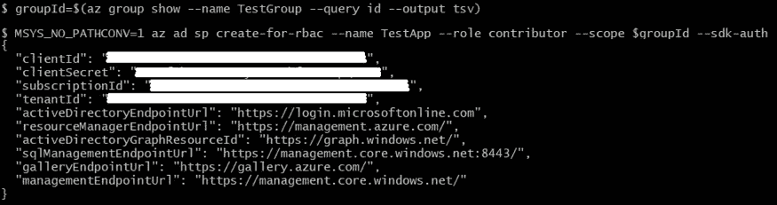
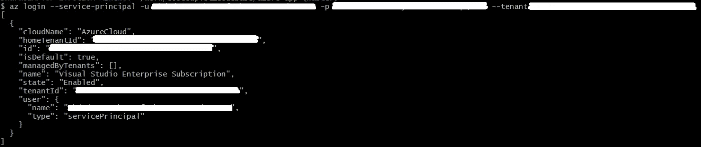
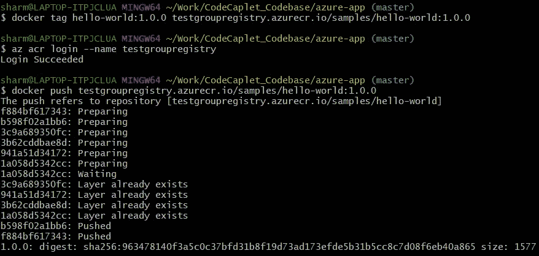
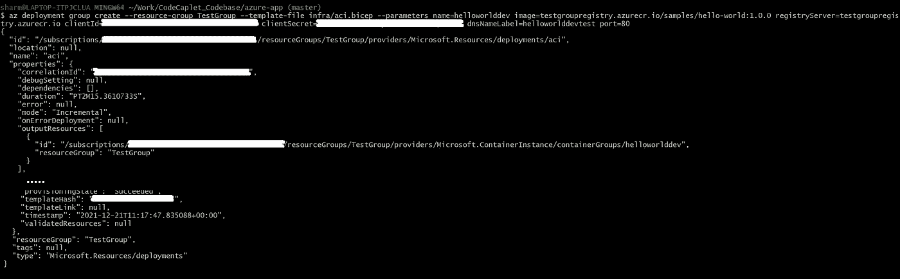

# 使用 Azure 资源管理器(ARM)模板在 Azure 容器实例(ACI)中部署应用程序

> 原文：<https://medium.com/nerd-for-tech/deploy-an-application-in-azure-container-instances-aci-using-azure-resource-manager-arm-f678ee3de06e?source=collection_archive---------3----------------------->



旗帜

容器已经成为打包和部署云应用程序的首选方式。Azure 的容器实例(ACI)为他们的 Kubernetes 服务(AKS)带来了一个最小的编排替代方案，这对于中小型应用程序来说可能是理想的。
同样，云资源的自动化和无缺陷供应导致对基础设施即代码(IaC)的需求不断增长。ARM (IaC)模板为管理 Azure 云资源带来了强大的功能。
今天，我将指导您使用 ARM 在 ACI 中部署应用。

这篇文章分为三个部分。
***第一节*** 讲 dockering an(NodeJs)应用；
***Section#2*** 将帮助您创建 Azure 服务主体；
**第 3 节**将带您完成将 docker 映像部署到 Azure 容器实例的步骤。

# 第一部分:将申请归档

在这一节中，我将对一个现有的 NodeJs 应用程序进行 docker 化，创建它的 docker 映像，并验证它在本地可以完美地工作。如果你的申请已经被归档，跳过这一部分。

## 步骤 1:将 Dockerfile 添加到您的应用程序中

我有一个正在整理的 NestJs 应用程序。默认情况下，该应用程序在端口 80 启动。添加 Dockerfile 文件以构建映像。

## 步骤 2:在本地验证

在本地构建并运行 docker 映像，并验证它工作正常。

```
$ **docker build -t hello-world:1.0.0 .** $ **docker run -p 80:80 hello-world:1.0.0**
```


在本地工作

# 第 2 部分:创建 Azure 服务主体

本节将指导您创建一个资源组范围的服务主体。这些机密随后将用于向 Azure CLI 进行身份验证。如果您已经完成了这些步骤，请随意跳过这一部分。

## 步骤 1:在本地安装 Azure CLI

我们将使用 Azure CLI 创建所有资源，并且在继续下一步之前，这些资源必须安装在您的本地计算机上。
使用[此链接](https://docs.microsoft.com/en-us/cli/azure/install-azure-cli-windows?tabs=azure-cli)下载 Azure CLI。

## 步骤 2:交互式登录 Azure CLI

```
$ **az login --tenant <tenant_id>**
```

如果你只和一个房客交往，那么房客的争论就可以避免。否则，用您的 Azure 租户 ID 替换命令中的<tenant_id>,并在终端中运行。Azure CLI 将使用您的默认浏览器让您登录。</tenant_id>

## 步骤#3:创建资源组

资源组是 Azure 中资源的逻辑集合。

```
$ **az group create -l centralindia -n TestGroup**
```

使用您选择的名称和位置创建资源组。我正在“*中心区*”中创建“*测试组*”。



## 步骤 4:创建服务主体

Azure 服务主体是为应用程序、托管服务和自动化工具访问 Azure 资源而创建的身份。它承担一些角色，在这些角色中它可以采取行动。要创建服务主体，请确保您有足够的权限(应用程序管理员)或您的租户所有者允许任何用户注册应用程序。

```
$ **groupId=$(az group show --name TestGroup --query id --output tsv)** $ **MSYS_NO_PATHCONV=1 az ad sp create-for-rbac --name TestApp --role contributor --scope $groupId --sdk-auth**
```

在第一个命令中，使用您在上一步中创建的资源组的名称。
将服务主体的名称放在您选择的第二个命令中。我把它命名为“ *TestApp* ”。



保存 Azure 生成的服务主体的 JSON。

# 第 3 部分:将您的映像部署到 ACI

本节使用 Azure CLI、ARM 模板将本地构建的映像部署到 ACI。

## 步骤 1:通过服务主体登录

通过服务主体登录 Azure。将<client_id>、<client_secret>替换为上面为服务主体生成的 clientId、clientSecret。</client_secret></client_id>

```
$ **az login — service-principal -u <client_id> -p <client_secret> --tenant <tenant_id>**
```



## 步骤 2:创建容器注册中心(ACR)

使用下面的命令提供您选择的名称来创建新的 ACR。

```
$ **az acr create --resource-group TestGroup --name testgroupregistry --sku Basic**
```


## 步骤#3:构建并推送创建的注册表

在这一步中，我们将在本地构建一个 docker 映像，标记它并将其推送到创建的 ACR。在推送到 ACR 之前，我们必须登录它。

```
$ **docker build . -t hello-world:1.0.0** $ **docker tag hello-world:1.0.0 testgroupregistry.azurecr.io/samples/hello-world:1.0.0** $ **az acr login --name testgroupregistry**
$ **docker push testgroupregistry.azurecr.io/samples/hello-world:1.0.0**
```



构建和推送 docker 映像

## 步骤#4:为 ACI 创建 ARM 模板

创建一个 bicep 格式的 ARM 模板，用于在'*<git _ repo>/infra/ACI . bicep '*创建一个 ACI，内容如下*。*

## 步骤#5:创建一个 ACI

在存储库的根目录下运行下面的命令，创建一个 ACI 并部署生成的 docker 映像。
*注意*:ACI 只能通过服务主体凭证访问 ACR 镜像。因此，用为上述服务主体生成的 clientId，clientSecret 替换< client_id >，< client_secret >。

```
$ **az deployment group create --resource-group TestGroup --template-file infra/aci.bicep --parameters name=helloworlddev image=testgroupregistry.azurecr.io/samples/hello-world:1.0.0 registryServer=testgroupregistry.azurecr.io clientId=<client_id> clientSecret=<client_secret> dnsNameLabel=helloworlddevtest port=80**
```



部署

## 步骤 8:验证

登录 Azure Portal，导航到创建的容器实例，找到 FQDN 并浏览。


> *代码库:* [*https://github.com/sharmavikashkr/azure-test*](https://github.com/sharmavikashkr/azure-test)