# 将 Rails API 后端部署到 Heroku，将前端部署到 Netlify

> 原文：<https://medium.com/nerd-for-tech/deploy-rails-api-backend-to-heroku-and-react-frontend-to-netlify-b515239d5022?source=collection_archive---------2----------------------->

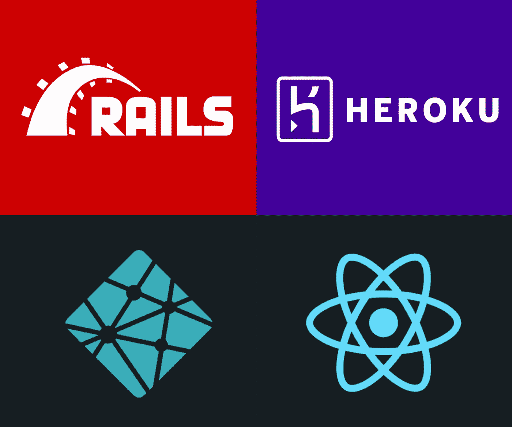

恭喜你，你已经用 **Rails API** 做后端，用 **React** 做前端，创建了一个很棒的应用程序。现在，是时候向全世界展示您的应用程序了。

在本文中，我将向您展示如何部署您的 **Rails API** 到 **Heroku** 和 **React** 到 **Netlify** 。将涵盖以下主题:

*   **将您的 SQLite 数据库转换为 PostgreSQL**
*   **检查你的 Ruby 版本**
*   **将后端 Rails API 部署到 Heroku**
*   **部署前端对网络失效做出反应**

# 将 SQLite 数据库转换为 PostgreSQL

如果您使用的是 ***SQLite*** 数据库，则需要将其转换为 ***PostgreSQL*** 。如果你没有 ***PostgreSQL*** ，可以在这里 下载[。](https://www.postgresql.org/)

**1。如果你要转换你的数据库，你必须删除你的目录文件夹中的 Gemfile.lock。**

**2。**在***gem 文件*** 中，将 ***gem 'sqlite3'*** 改为 ***gem 'pg'***

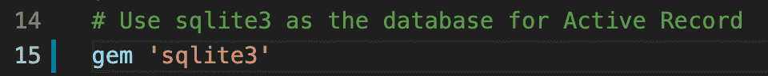

> 到

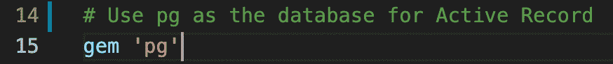

**3。**运行 ***捆绑安装*** 。

```
bundle install
```

**4。**转到你的 ***database.yml*** 文件里面你的 ***config*** 文件夹，删除所有的 ***SQLite*** 代码。将下面的代码复制粘贴到您的 ***database.yml*** 文件中。确保将信息更改为您在此代码中的信息。

```
# PostgreSQLdefault: &default
adapter: postgresql
encoding: unicode
pool: <%= ENV.fetch(“RAILS_MAX_THREADS”) { 5 } %>development:
<<: *default
# Your app name(e.g. my app directory folder name is fotoset-backend)
database: fotoset_backend_development
# you need to put your username and password here
username: Your PostgreSQL server name
password: The password you are using to login into your computertest:
<<: *default
# Your app name(e.g. my app directory folder name is fotoset-backend)
database: fotoset_backend_testproduction:
<<: *default
# Your app name(e.g. my app directory folder name is fotoset-backend)
# you don’t need username and password here below
database: fotoset_backend_production
username: fotoset_backend
password: <%= ENV[‘FOTOSET_BACKEND_DATABASE_PASSWORD’] %>
```

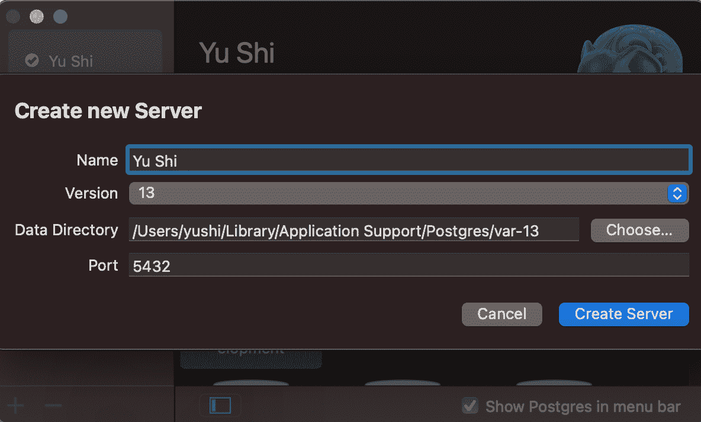

**5。确保你的 PostgreSQL 正在运行**

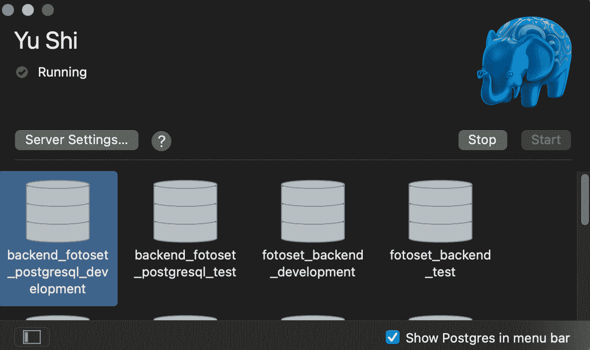

**6。**运行 ***rails db:设置*** 、 ***rails db:迁移*** 、 ***rails db:seed*** 。

**7。**运行 ***rails s*** ，到你的服务器 **localhost:3000** 检查是否一切正常。

# **检查你的 Ruby 版本**

为了成功部署您的应用程序，您可能需要更新您的 Ruby 版本。是因为 Heroku 不支持老的 Ruby 版本。如果您已经有了最新版本(3.0.1)，请跳过这一部分。

**1。**打开你的后台目录文件夹。

**2** 。在你的终端输入 ***ruby -v*** 来检查你的 Ruby 版本。

```
ruby -v
```

**3。**更新你终端里的 Ruby 版本 ***rvm 安装 3.0.1*** 如果你没有最新版本。安装需要几分钟时间。

```
rvm install 3.0.1
```

**4。**一旦完成，运行 ***rvm 使用 3.0.1*** 在你的 app 目录文件夹终端。再次检查 Ruby 版本 ***ruby -v*** 确保你现在有最新的版本。

```
rvm use 3.0.1
```

**5。**去你的 ***Gemfile*** ，把 Ruby 版本改成你现在有的 ***ruby 3.0.1*** 。


**6。**去你的 ***。ruby-version*** 文件放在你的目录文件夹下，把 ruby 版本改成 ***ruby-3.0.1*** 。

**7。**运行**捆绑*安装*安装**。

```
bundle install
```

**8。**转到你的 ***Gemfile.lock*** ，如果你的文件里没有它们，复制并粘贴下面的到你的 ***Gemfile.lock*** 。如果我没有以下内容，Heroku 不会让我部署我的应用程序。

```
nokogiri (1.11.3-x86_64-linux)
  racc (~> 1.4)
nokogiri (1.11.4-x86_64-darwin)
  racc (~> 1.4)PLATFORMS
  x86_64-darwin-20
  x86_64-linux
```

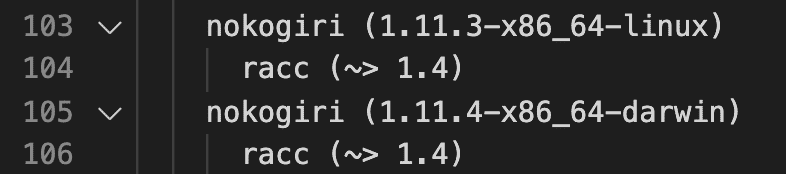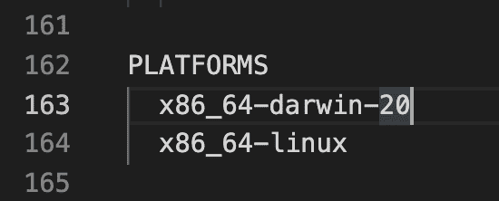

# **将后端 Rails API 部署到 Heroku**

1.  创建一个 [**的 Heroku 账号**](https://signup.heroku.com/) 。
2.  在您的终端中安装 **Heroku CLI** 。你可以在 这里找到 [**的说明。我用这个命令:***brew tap heroku/brew&&brew install heroku***。**](https://devcenter.heroku.com/articles/heroku-cli)

```
brew tap heroku/brew && brew install heroku
```

3.确保登录 Heroku 网站，然后在终端运行 ***heroku 登录*** 。

```
heroku login
```

4.运行 ***heroku 创建*** ，它会在终端显示 heroku 信息。Heroku 会给你一个随机的 Heroku app 名字。完成所有步骤后，您可以在此处更改名称[](https://devcenter.heroku.com/articles/renaming-apps#updating-git-remotes)****。****

```
**heroku create**
```

****5.运行***git push heroku main***将你的 app 文件推送到 heroku。****

```
**git push heroku main**
```

****6.运行 ***heroku 运行 rake db:迁移*** 和 ***heroku 运行 rake db:seed*** 将您的所有数据托管在 heroku 服务器中。您可以在这里查看我的数据:[**https://fotoset.herokuapp.com/users**](https://fotoset.herokuapp.com/users)****

```
**heroku run rake db:migrateheroku run rake db:seed**
```

****7.去你的 Heroku 网站，我推荐把你的 app GitHub repo 和 Heroku 连接起来(下图)。****

****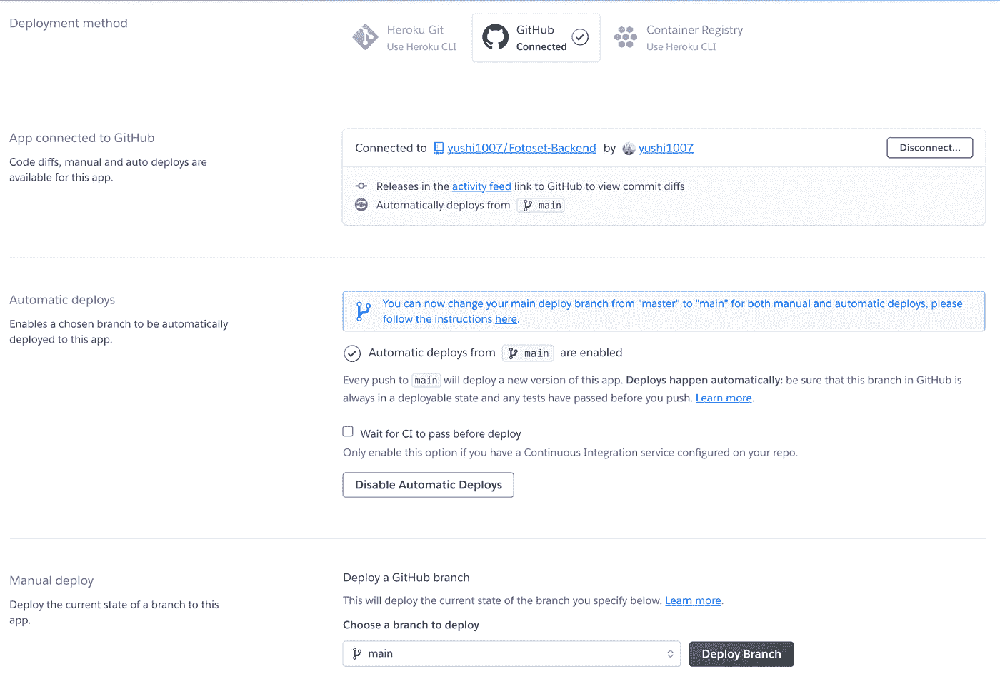****

****8.您也可以运行 ***heroku 在终端中打开*** 来运行 heroku 服务器，运行命令后 url 会是这样的[【https://fotoset.herokuapp.com/】](https://fotoset.herokuapp.com/users)。****

```
**heroku open**
```

****现在，您不必再运行 rails s 来获取数据了。希望这对大家有帮助。如果您有任何问题或反馈，请告诉我！我很乐意帮助你。****

# *******部署前端对网络攻击做出反应*******

1.  ****在*公共文件夹下创建一个***_ 重定向*** 文件，复制粘贴这段代码***/*/index . html 200***。只有当你使用***react-router-DOM***的时候。以防止刷新您的网站页面后出现错误消息。*****

*****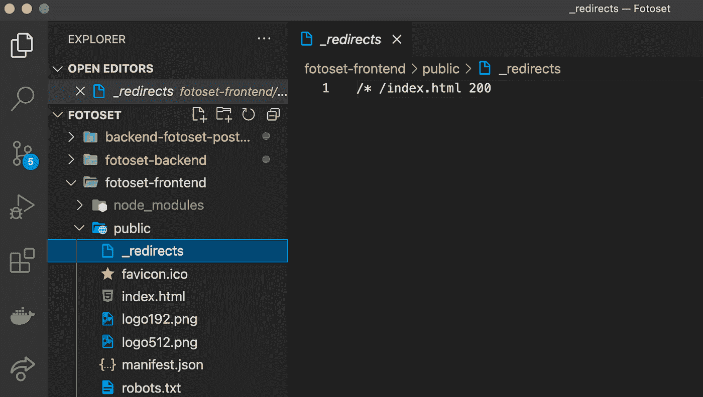*****

*****2.创建一个***Netlify***[***账户***](https://app.netlify.com/) 。*****

*****3.从 Git 转到 ***新站点。********

*****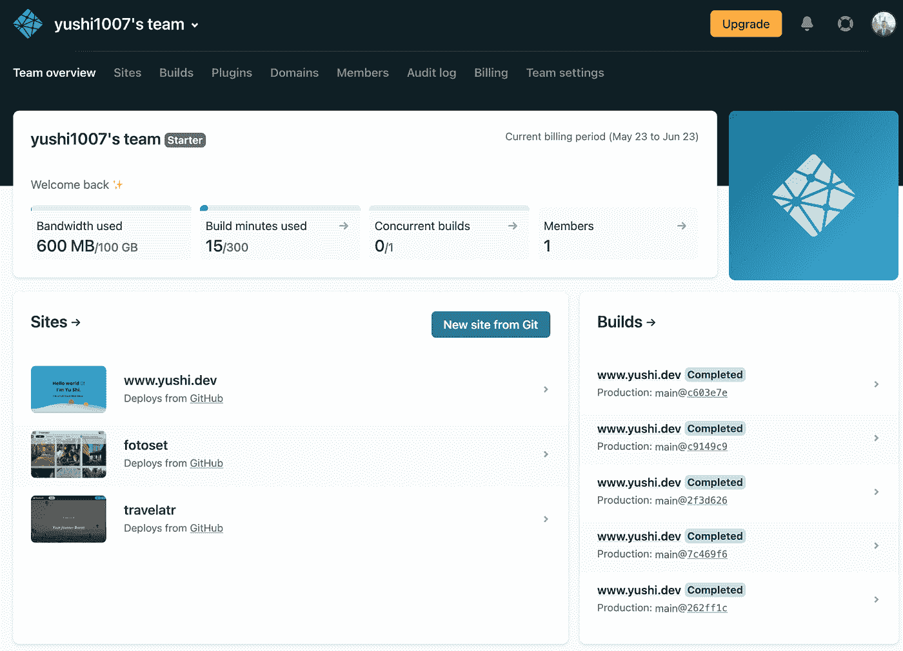*****

*****4.将 ***Netlify*** 连接到 ***GitHub*** 。*****

**********

*****5.搜索你的 GitHub repo，然后回车。*****

*****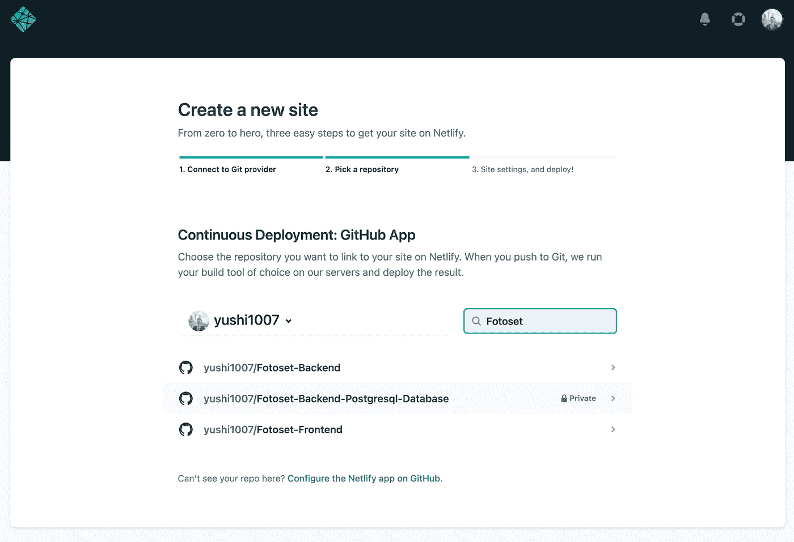*****

*****6.选择要部署的前端存储库。*****

*****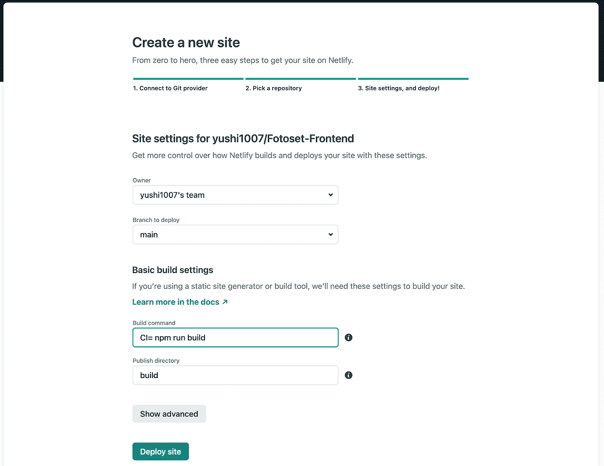*****

*****7.构建命令: ***CI= npm 运行构建*** ，然后单击部署站点。*****

*****8.您可以在站点设置中更改您的站点名称。*****

*****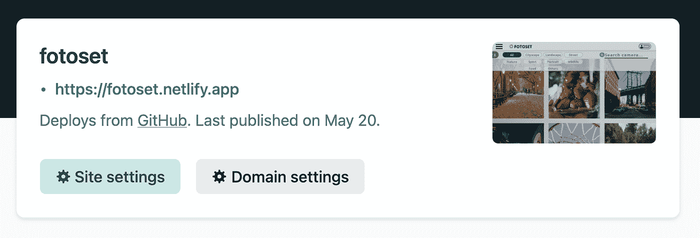**********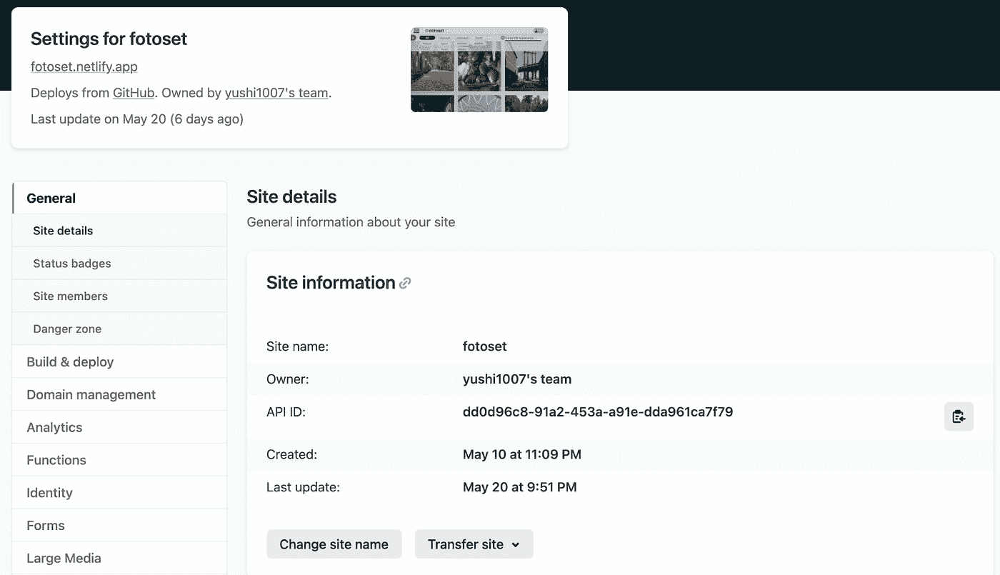*****

*******9。**将你所有的前端获取 url 改为 heroku url(例如下图)*****

*****http://localhost:3000/photos = >**https://fotoset.herokuapp.com/photos*******

*******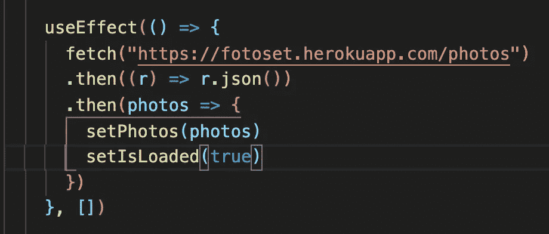*******

# *********加成:*********

*******如果你在后台使用任何 API 密匙，你需要把你的 API 密匙放在***Heroku Config Vars***中。与前端相同，如果您在前端使用任何 API 密钥，请将您的 API 密钥放在 ***Netlify 环境变量*** 中。*******

## *****赫罗库*****

1.  *****选择您正在使用 API 密钥的应用程序*****

*****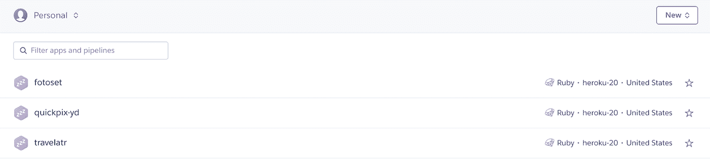*****

*****2.转到应用程序设置，然后单击显示配置变量*****

*****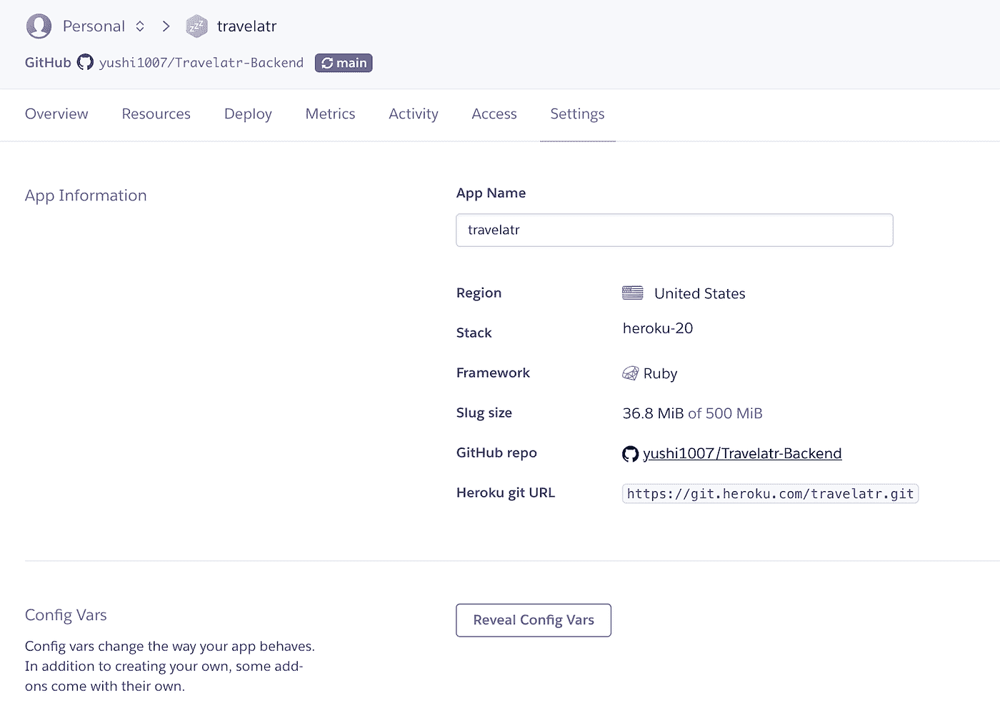*****

*****3.复制并粘贴您的 API 密钥变量名和密钥*****

*****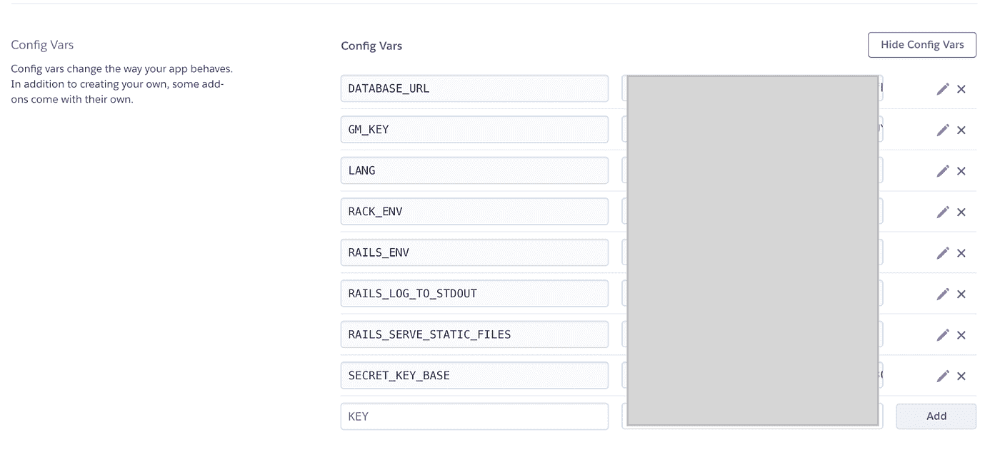*****

## *****网络生活*****

1.  *****选择您正在使用 API 密钥的应用程序*****

*****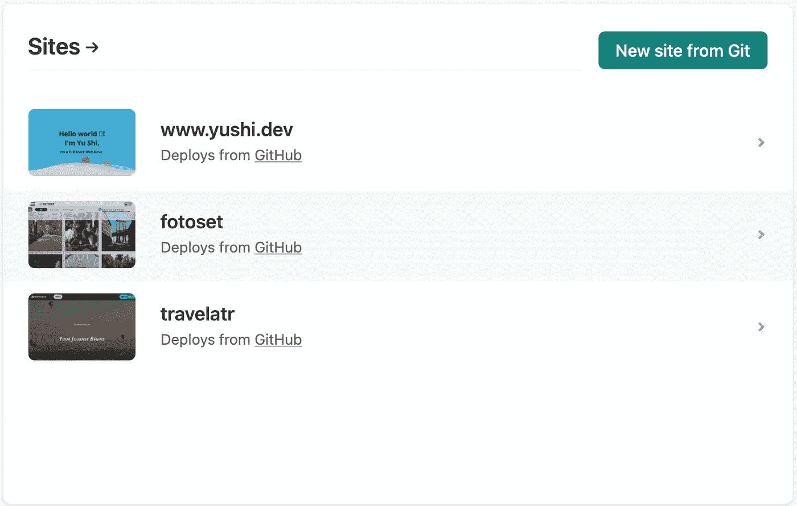*****

*****2.转到域设置*****

*****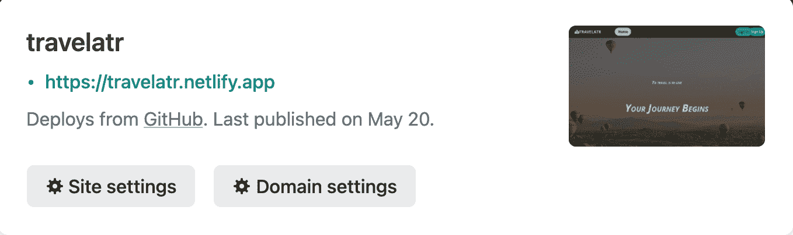*****

*****3.转到环境，单击编辑变量并添加您的 API 密钥*****

*****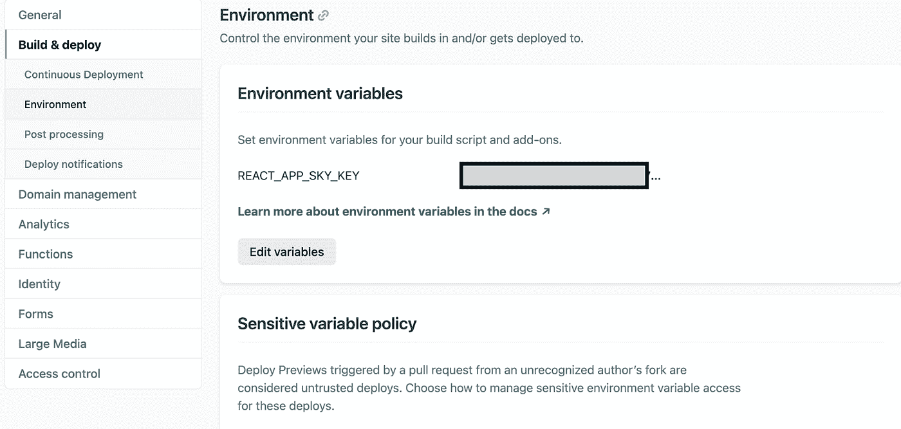*****

*****非常感谢您遵循本文中的所有步骤。希望这篇文章对大家部署网站有所帮助。如果你觉得我解释错了或者说的不清楚，请在评论里留言。我很乐意帮助你。*****