# 使用多环境位存储桶 CI/CD 管道将 Reactjs 应用程序部署到 Heroku

> 原文：<https://medium.com/nerd-for-tech/deploy-reactjs-app-to-heroku-with-multi-environment-bitbucket-ci-cd-pipeline-98bc4bf0672f?source=collection_archive---------1----------------------->

自动化 reactjs 应用程序的部署过程

# Hallo Welt(不要被德语中的 hello world 吓到)

几周前，我作为 reactjs 的开发人员开始在一家新的创业公司工作，我在万维网上搜索(是的，我用了整个短语)如何用 bitbucket 和 heroku 为 reactjs 项目创建管道。我曾期望找到关于如何做到这一点的很好的书面资源，但不能，它们已经过时了(可能是因为 bitucket 在他们的平台上有许多更新，使其用户友好，易于使用，并增加了新的功能)。当我尝试搜索不同部署阶段(开发、试运行和生产)的资源时，得到的响应是空的。我们将创建一个 bitbucket 管道，通过暂存和生产部署选项来自动化我们到 heroku 的部署。

## 先决条件

*   安装在您机器上的节点
*   [Heroku](https://www.heroku.com/) 记述
*   [Bitbucket](https://bitbucket.org/) 账号
*   你可以使用任何你喜欢的代码编辑器(我的是 [VSCode](https://code.visualstudio.com/download) )

## 步骤 1 —创建 React 应用程序

我可以想象你已经对创建 react 应用程序很熟悉了，但是对于那些以前没有经验的人来说，下面是我们如何做的。我们将使用 create-react-app starter CLI 工具。

```
npx create-react-app your-app-name /*I named my app bitbucketpipeline*/npx create-react-app bitbucketpipeline
```

项目创建过程因您的互联网连接速度而异，成功创建项目后，在您的代码编辑器中打开代码，如果您想要运行 app type ***npm，请在终端上启动*** 。最后，转到你的浏览器，打开 [http://localhost:3000](http://localhost:3000) (也就是说，这是为了防止应用程序不能在浏览器中自动打开)。

```
cd bitbucketpipelinenpm start
```

## 步骤 2-创建位存储库

既然我们已经创建了我们的应用程序，并且它已经启动并运行，我们可以继续在 bitbucket 上创建一个远程存储库。如果你还没有注册，去 https://bitbucket.org 注册一个免费账户，我们都喜欢免费的东西，不是吗？

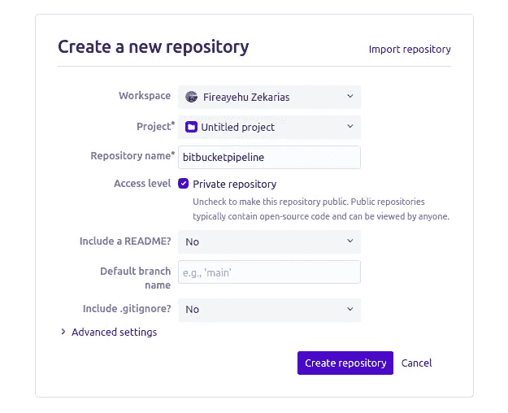

在位桶上创建存储库

## 步骤 3-创建 Heroku 应用程序

现在，我们已经在 bitbucket 上创建了我们的应用程序和一个远程存储库，我们非常接近于建立一个管道并部署我们的应用程序。就像我们在 bitbucket 上做的那样，如果你还没有注册 heroku，就去做那个[https://heroku.com](https://heroku.com)，同样，这个也是免费的。

接下来，我们将为试运行和生产创建两个不同的应用程序。转到您的 heroku 仪表板，单击新建并选择创建新应用程序。你的应用名称必须唯一。我将我的应用程序命名为*bitbucketpipeline-staging*和*bitbucketpipeline-production*。

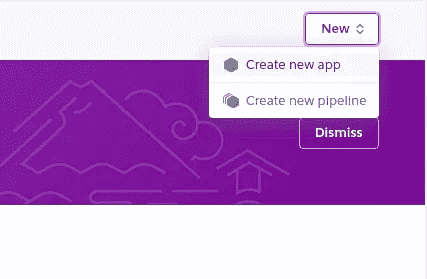

创建新应用程序

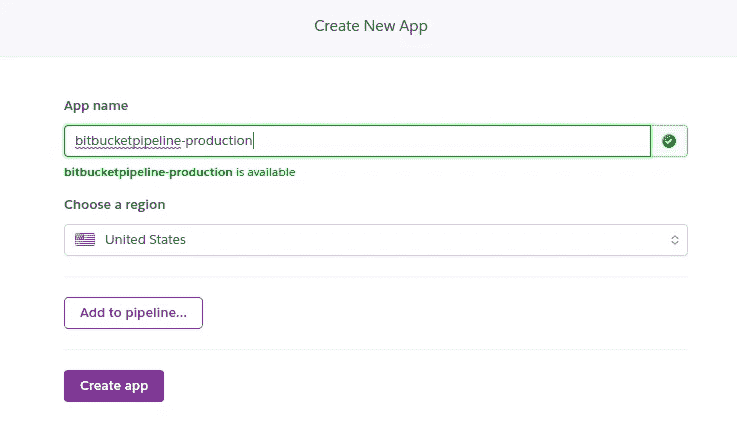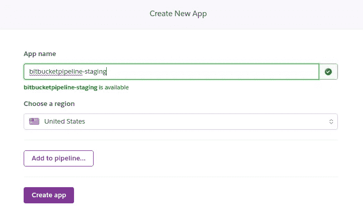

在 heroku 上创建暂存和制作应用程序

当你去你的仪表板时，你必须看到你的应用程序列在那里。

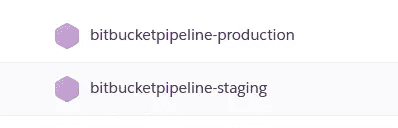

现在，在 heroku 上唯一要做的事情就是获取 API 密钥，并为我们的应用程序添加一个 buildpack。我们需要 API 密匙，这样当我们设置我们的位桶管道时，我们通过密匙得到认证，以便使用管道配置部署我们的代码。

> **Heroku Buildpacks** 是一组开源脚本，用于编译 Heroku 上的应用。它们使您能够扩展 Heroku 的构建系统，以支持您的语言或定制，或者使特定的二进制包可用于运行时

首先，让我们将 buildpack 添加到我们的应用程序中。构建包因我们正在部署的应用程序而异，因为我们将部署 reactjs 应用程序，所以我们将使用**create-react-app-build pack**构建包。

*   转到仪表板并选择应用程序
*   点击应用程序的设置选项卡
*   在构建包部分下的设置选项卡中，添加/选择[https://github.com/mars/create-react-app-buildpack.git](https://github.com/mars/create-react-app-buildpack.git)构建包

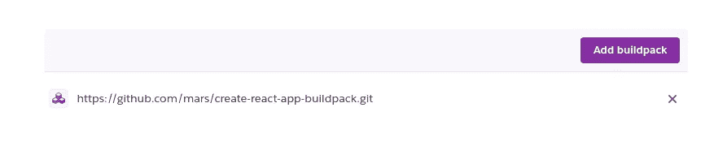

为 staging(*bitbucketpipeline-staging*)和 production(*bitbucketpipeline-production*)应用程序添加构建包。接下来，我们需要获得 heroku 帐户的 API 密钥。

*   在您的个人资料中，转到帐户设置
*   在“API 键”部分下，单击“显示”
*   保存密钥以备后用

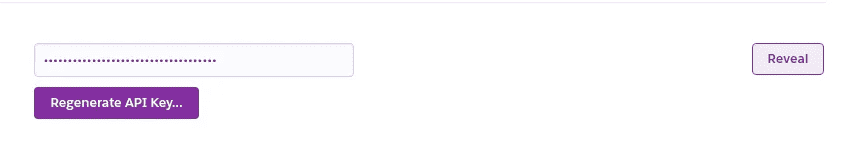

## 步骤 4-使用位存储桶管道进行部署

我们现在处于最有趣的部分。在本节中，我们将为自动化部署设置一个 bitbucket 管道。我们已经有了开始铺设管道所需的一切；bitbucket 存储库、heroku API 密钥和 heroku 应用程序用于暂存和生产。让我们开始吧。

## 步骤 4.1 —启用管道

打开存储库，转到“存储库设置”,向下滚动并找到侧面导航栏上的“管道”部分，单击“管道”部分下的设置选项，并通过打开开关控件为存储库启用管道。

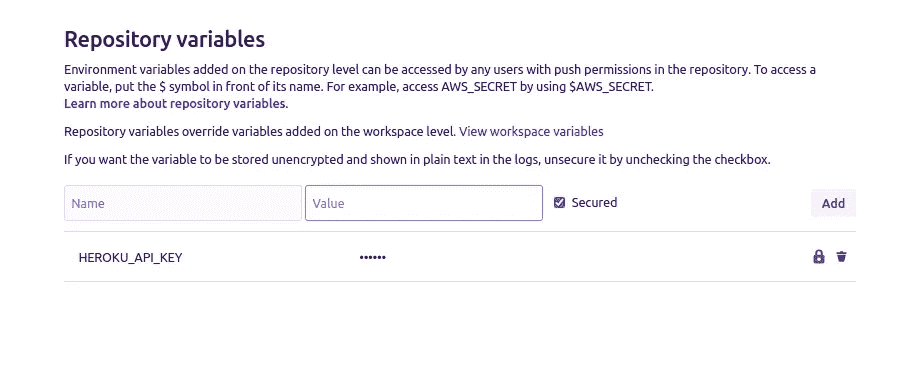

## 步骤 4.2 —添加存储库变量

还记得我们从 heroku 账户设置复制的 API 密钥吗？我们现在将使用 API 密钥。打开您的存储库，转到“存储库设置”,向下滚动并找到侧面导航栏上的“管道”部分，然后单击“管道”部分下的“存储库变量”选项。您可以在那里添加您的键和值对。在我们的例子中，键，值对将是我们的 Heroku API 键。我将把我的键命名为 **HEROKU_API_KEY** (你可以随意命名)，值将是我们从 HEROKU 复制的 API 键。


## 步骤 4.3 —添加暂存和生产变量

我们为存储库设置的任何环境都可以访问我们的存储库变量，默认情况下，bitbucket 有三个环境，即测试、暂存和生产。但是在这些环境下创建的变量只能在特定的环境中访问。我将创建一个用于暂存的变量和一个用于生产的变量。该变量将保存 heroku 应用程序名称。我将我的密钥命名为 **HEROKU_APP_NAME** ，其值将为 heroku app name(即用于暂存*bitbucketpipeline-暂存*和用于生产*bitbucketpipeline-生产*)。

打开您的存储库，转到“存储库设置”,向下滚动并找到侧面导航栏上的“管道”部分，然后单击“管道”部分下的“部署”选项。展开登台环境并添加变量，展开生产环境并添加环境。

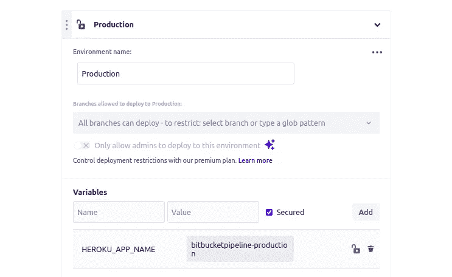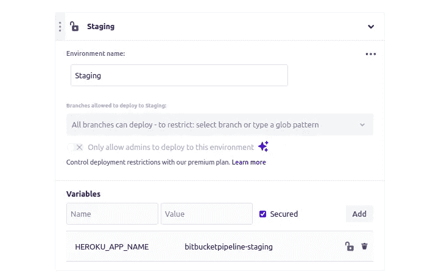

## 步骤 4.4 —配置位桶管道

这将是最后一步，我们将编写一些代码。在您喜欢的代码编辑器上打开您的项目，并在项目的根目录下创建一个名为***bit bucket-pipelines . yml***的文件。文件名必须完全匹配，这是 bitbucket 知道它是管道配置文件的方式。这个文件保存了您的存储库的构建配置。您可以用这个文件做很多事情，所以如果您想了解更多，请查看文档。

下面是关于配置 [*YAML*](https://yaml.org/) 文件你需要了解的基本情况:

*   映像— bitbucket 管道使用 docker 映像来运行您的构建
*   管线-包含所有管线定义
*   分支-为所有特定于分支的构建管线定义一个部分。本节中的名称或表达式与 Git 存储库中的分支相匹配
*   缺省(default )-包含与另一部分中的管线定义不匹配的所有分支的管线定义
*   步骤—定义构建执行单元。步骤按照它们在 **bitbucket-pipeline.yml** 文件中出现的顺序执行
*   名称(name )-为每个步骤定义一个名称，以便在显示中更容易看到每个步骤在做什么
*   脚本—包含按顺序执行的命令列表。脚本按照它们在步骤中出现的顺序执行
*   工件-定义由某个步骤生成的文件，例如您希望与后续步骤共享的报告和 JAR 文件
*   部署—为您的部署步骤设置环境类型，并在您的位存储库的部署仪表板中使用
*   pipe——它通过在幕后完成大量工作，使复杂的任务变得更加简单。它就像一个附加产品
*   变量-包含启动管道时提供的变量

在我们的例子中，我们将使用 nodejs 映像，因为我们需要它来构建 reactjs 应用程序。我们将有两个分支，即试运行和生产，我们还有一个默认分支，以便在推送到其他分支时运行测试步骤。staging and production 分支将有三个步骤，第一步运行测试，第二步构建我们代码的归档文件，第三步也是最后一步将归档代码部署到 heroku。默认情况下只有一个步骤，该步骤负责运行测试。

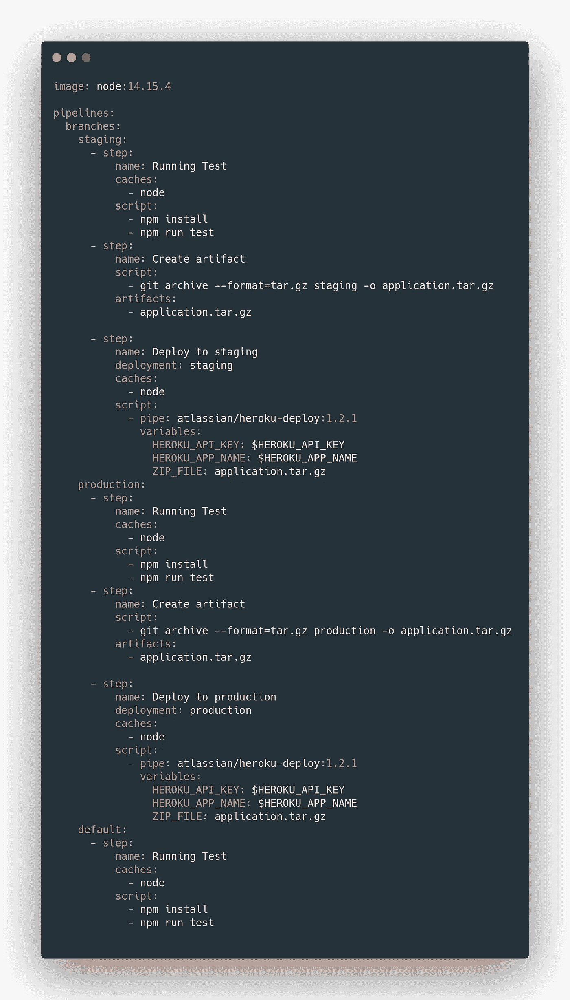

最后，让我们将代码提交并推送到远程存储库，但在此之前，将您的 bitbucket 存储库作为远程存储库添加到 reactjs 应用程序中。在根目录下打开终端，输入您的代码，不要忘记用您的用户名和存储库名称替换＄{您的用户名}和＄{存储库名称}。之后提交你的代码，并把它推到 bitbucket。

```
git remote add origin [https://${your-username}@bitbucket.org/${your-username}/${repository](https://${your-username}@bitbucket.org/${your-username}/${repository)-name}.gitgit add .git commit -m 'Bitbucket pipeline configuration'git push -u origin master
```

在推送代码之后，转到您的存储库的 pipeline 选项卡，因为我们第一次推送构建配置文件，并且我们推送的分支是驻留在 bitbucket 构建配置文件的 default 部分中的主分支，所以不会执行默认的管道，但是下次您将代码推送至主分支时，管道将自动执行。我们还可以手动执行管道，转到存储库的 pipeline 选项卡，单击 Run pipeline，然后选择主分支和默认管道。

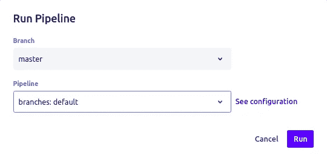

当您单击 run 时，它将启动管道，如果运行默认管道成功，您应该会得到这个结果。

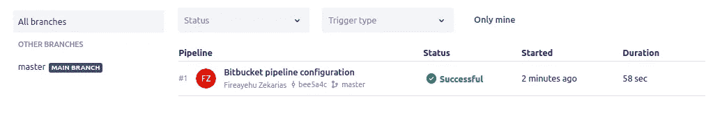

现在，让我们为暂存管道创建一个暂存分支，转到存储库的“分支”选项卡，单击“创建分支”,并用以下信息填充显示的对话框。

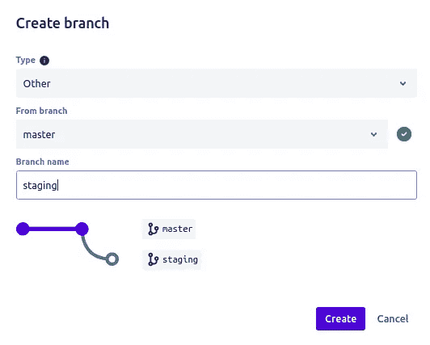

一旦登台分支的创建完成，登台管道就开始了，打开存储库的管道部分，并查看正在进行的管道。

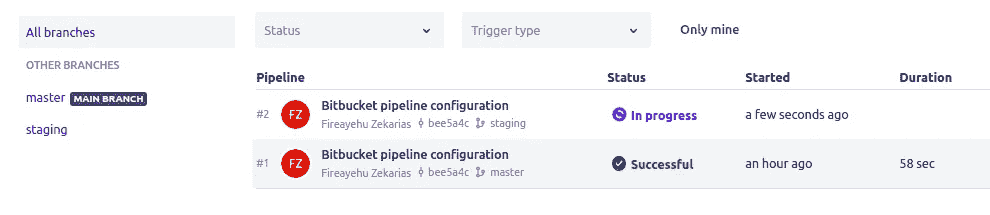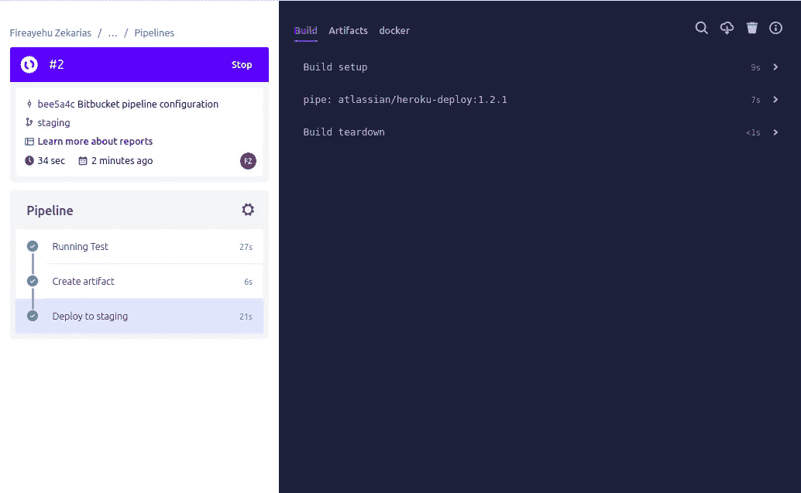

接下来，进入 Heroku dashboard，点击 staging app，你就可以在 Heroku 上看到你的 app 的部署过程。

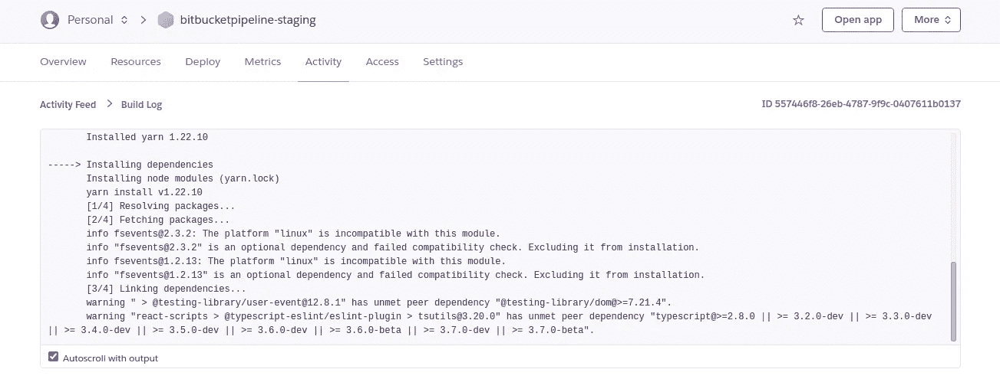

等待 heroku 完成构建并将您的应用程序部署到他们的服务器，当构建成功完成时，打开您的应用程序并单击打开按钮，它将在一个新的选项卡上打开您的网站。

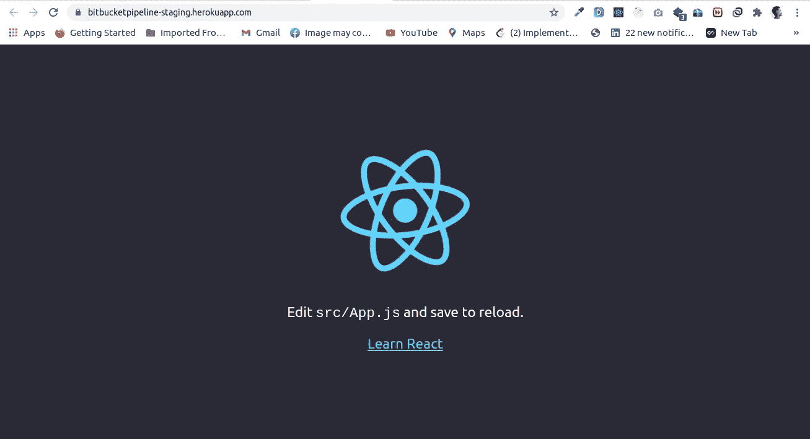

对生产分支也执行相同的步骤，然后您可以使用生产管道将您的代码部署到生产应用程序中。从现在起，无论何时您将代码推入或者将分支合并到登台分支或者生产分支，相应的管道都将运行。当您将代码推送到其他分支时，将运行默认管道。

Fireayehu Zekarias

埃塞俄比亚亚的斯亚贝巴大学软件工程专业毕业生。

[LinkedIn](https://www.linkedin.com/in/fireayehu-zekarias-b82576106/) [Twitter](https://twitter.com/Fireayehu)

谢谢你