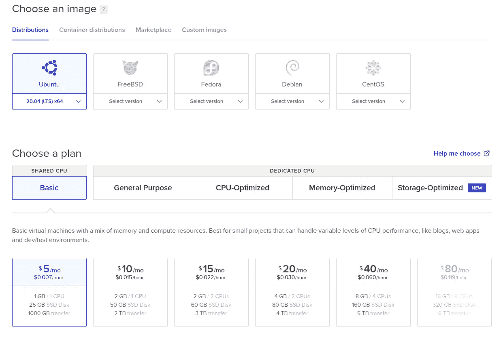
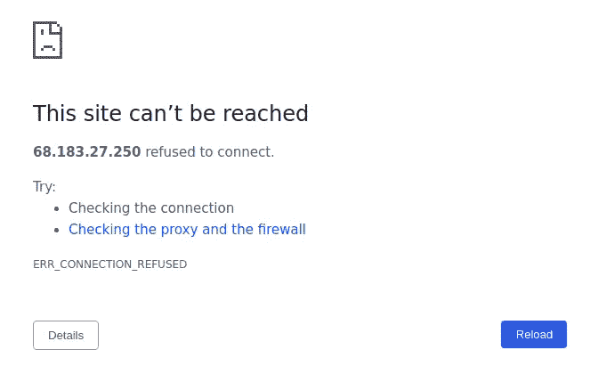
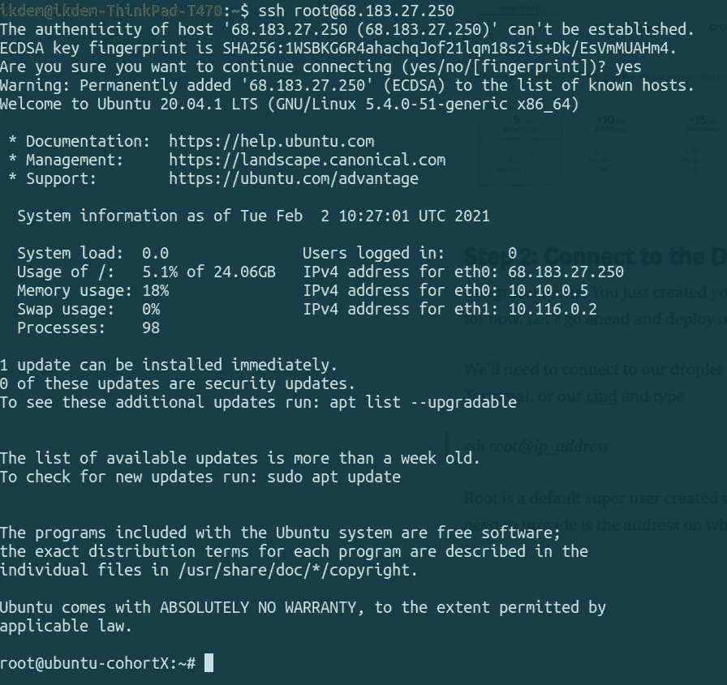
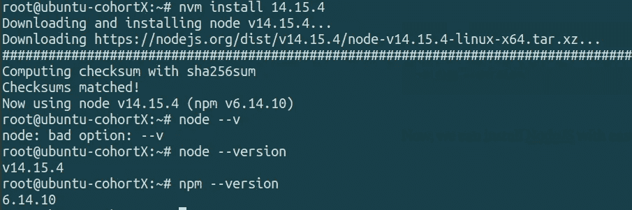
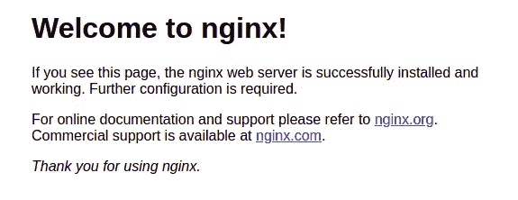

# 将 NodeJS 应用程序部署到数字海洋水滴||分步指南

> 原文：<https://medium.com/nerd-for-tech/deploy-your-nodejs-application-to-a-digital-ocean-droplet-step-by-step-guide-3f6f928f776?source=collection_archive---------0----------------------->


# 入门指南

作为一名开发人员，在完成应用程序的设计和开发后，您很可能会问自己一个非常著名的问题:“现在做什么？我该如何让用户可以访问它？”。你仍然可以在你的机器上本地运行你的应用程序，并给出你的 IP 地址，让人们从他们的浏览器访问它。然而，考虑到你需要时不时地关掉你的机器，这并不是最好的选择。第二个也是最好的选择是拥有另一台一直运行的机器。这正是我们今天要用数字海洋做的事情。

为了能够遵循本指南，我假设您熟悉基本的 Linux 命令(因为我们将使用它们)，您有一个现成的 Nodejs 应用程序，最重要的是，您有一个 github 帐户，其中有一个包含该应用程序的 repo。

首先，Digital Ocean 是一家云提供商，允许我们租用服务器并在其上部署我们的应用程序。这基本上就是我们所说的“基础设施即服务”，简称 IaaS。这是当我们不再像网络发展初期那样购买硬件来部署我们的应用程序时，我们可以去云提供商，如 AWS、Azure 或 Google Cloud，并从他们那里租赁我们需要的硬件。这样，我们将只为我们需要的资源付费。如果有一天，我们需要更多，我们可以租更多。这就是我们所说的“量入为出”。

对于开发者来说，数字海洋是一个很好的选择。借助我们易于使用的控制面板和 API，您可以构建更多功能，减少管理基础设施的时间。

# 步骤 1:在数字海洋上创建一个水滴

首先要做的是在数字海洋上创建一个帐户。为此，你需要向他们提供你的信用卡信息。这只是一次常规检查，他们不会向你收费的。有一种方法可以让你在注册后获得 100 美元的免费信用，有效期为两个月。这对你开始使用云将是一个很好的促进。

> [***点击此链接获得 100 美元信用***](https://www.digitalocean.com/?refcode=155ccaa445c8&utm_campaign=Referral_Invite&utm_medium=Referral_Program&utm_source=CopyPaste)

让我们现在创建我们的第一个水滴。这将是我们谈到的远程机器。它位于数据中心内的某个地方，可能离您的家有数百英里远。但是，您可以随时随地访问它。

你应该点击右上角的创建并选择水滴。出于本教程的目的，我将选择 Ubuntu 作为我的发行版，我将选择每月 5 美元的基本共享 CPU 计划。然后，您需要选择一个数据中心区域，并选择一种身份验证方法。用 SSH 密钥更安全。但是如果你不知道如何生成一个，这些链接会指导你在[](https://www.digitalocean.com/community/tutorials/how-to-set-up-ssh-keys-on-ubuntu-20-04)**和*[***Windows***](https://phoenixnap.com/kb/generate-ssh-key-windows-10)*上做。**

**

# *步骤 2:连接到 Droplet*

*恭喜你！你刚刚创造了你的第一滴。但是这个液滴现在是空的。如果你用你的浏览器导航到 droplet 的 IP 地址，你会发现那里什么也没有。让我们开始部署我们的应用程序吧！*

**

*我们需要通过 SSH 连接到我们的 droplet。要做到这一点，让我们打开我们的终端，或我们的 cmd 和类型*

> *ssh 根@ip 地址*

*Root 是在 droplet 中创建的默认超级用户。我们需要提供的 IP 地址就是创建 droplet 的地址。*

**

*如果您看到#号，这意味着您现在以根用户的权限在 droplet 的终端内。现在，让乐趣开始吧！*

# *步骤 3:安装 NodeJS*

*现在，我们将开始安装应用程序所需的软件。当然，首先想到的是 nodeJS，因为它是我们的应用程序需要的运行环境。在本教程中，我将使用 [**nvm**](https://github.com/nvm-sh/nvm) (节点版本管理器)来选择要安装的版本。这样，我们将确保本地机器和 droplet 上的版本不会不匹配。运行此命令安装带有 curl 的 nvm。*

```
*curl -o- https://raw.githubusercontent.com/nvm-sh/nvm/v0.37.2/install.sh | bash*
```

*然后，运行这个命令来更新 bash 命令并访问 nvm。然后，您可以确保 nvm 已成功安装。*

```
*~# source ~/.bashrc~# nvm --version*
```

*现在，我们可以轻松地安装 NodeJS 了。我将安装 node 的 v14.15.4 版本，因为这是最后一个带有 **LTS(长期支持)**的版本，也是我用来在本地机器上开发应用程序的版本。然后您可以运行 **node -v** 和 **npm -v** 来检查是否安装了正确的版本。*

```
*~# nvm install 14.15.4
~# node --version
~# npm --version*
```

**

# *步骤 4:从 Github 克隆您的存储库*

*在 droplet 上安装了 nodeJS 和 npm 之后，我们可以从 github 存储库中取出代码并运行它。Git 默认安装在 droplet 上，所以我们可以简单地从终端运行 git clone。*

```
*~# git clone https://github.com/{ownerName}/{repoName}.git*
```

*当然，您需要用存储库的正确链接替换这个链接。如果成功了，我们可以在本地目录中找到我们的应用程序。让我们使用 ***cd*** 导航到该目录(更改目录)，并在其中运行 npm install 来安装我们的应用程序需要的 ***package.json*** 文件中的所有依赖项。*

```
*~# cd ./directory-name
~# npm install*
```

*现在，如果我们运行 ***npm start*** (假设我们在我们的 ***package.json*** 中定义了 start 脚本)，应用程序将在我们在服务器中指定的 ***端口*** 上开始运行。
这意味着，如果我们通过运行应用程序的端口导航到 droplet 的 ip 地址，我们将找到我们的应用程序！万岁！
但是等等，用户是不是应该输入带 url 的端口号？😮此外，当我关闭本地机器上的终端时，如何避免终止应用程序？*

*这就是我们在接下来的两步中要回答的问题！🚀*

# *第五步:添加 pm2*

*[***PM2***](https://pm2.keymetrics.io/)对于 nodeJS 来说是一个非常伟大的生产流程经理。它将允许我们的应用程序继续运行，即使我们关闭我们的终端。让我们先把它作为一个全局依赖项来安装。*

```
*~# npm i -g pm2*
```

*现在，我们可以用 pm2 而不是 node 和 nodemon 来启动我们的应用程序。在我的例子中，我的启动命令是运行“node。/server.js "。因此，要用 pm2 启动我的应用程序，我需要运行:*

```
*~# pm2 start ./server.js*
```

*现在，即使您关闭了您的终端，该应用程序仍将运行，并且可供所有用户随时访问。现在，是时候解决我们的港口问题了。*

# *步骤 6:添加和配置 Nginx*

*为了使我们的应用程序在不指定端口号的情况下可用，我们将使用一个名为[***Nginx***](https://www.nginx.com/)***的*** 负载平衡器。
让我们从把它安装到我们的 droplet 开始，和我们安装 mvn 和 nodeJS 的方法一样:*

```
*~# apt install nginx
~# apt update*
```

*安装了 Nginx 之后，如果我们现在导航到我们的 ip 地址，我们将会看到这个页面。这是因为我们没有为 nginx 定义默认端口。*

**

*为此，我们需要编辑 nginx 的配置文件。
我将使用 nano 编辑器(默认安装在 ubuntu 中)*

```
*~# nano /etc/nginx/sites-available/default*
```

*进入文件后，我们应该转到 location 并向它提供以下几行:*

```
*location / {
         proxy_pass [http://localhost:8000](http://localhost:5000);
         proxy_http_version 1.1;
         proxy_set_header Upgrade $http_upgrade;
         proxy_set_header Connection 'upgrade';
         proxy_set_header Host $host;
         proxy_cache_bypass $http_upgrade;
}*
```

*请注意，我的应用程序将在 localhost:5000 上运行。您需要根据服务器中的端口号进行更改。*

*现在，我们需要用新的更新测试我们的配置文件*

```
*~# nginx -t
nginx: the configuration file /etc/nginx/nginx.conf syntax is ok
nginx: configuration file /etc/nginx/nginx.conf test is successful*
```

*如果您得到这个输出，这意味着您的语法是正确的。然而，为了让这些变化发生，我们需要重启 nginx。*

```
*~# systemctl restart nginx*
```

*现在，你的水滴已经准备好了！如果您再次导航到 droplet 的 ip 地址，您的应用程序将会出现在那里。*

# *我们完了🎉*

*唷！这不是件容易的事。然而，这是完全值得的，因为现在你的应用程序是在线的，你可以邀请用户与它互动！*

*这可能是你长途旅行的第一步。*

*记住，有更简单的方法用容器来做这件事，并准备使用 droplets。我们可以在未来的博客中讨论它们…*