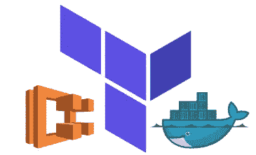
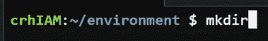
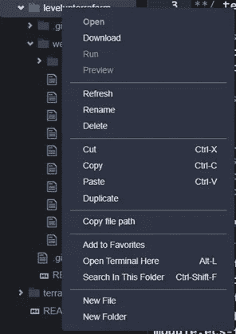
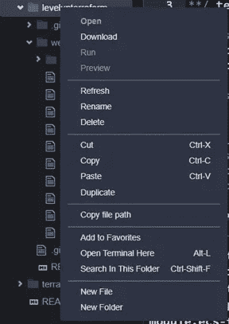
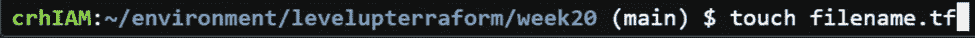
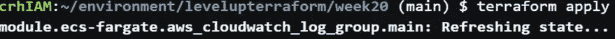
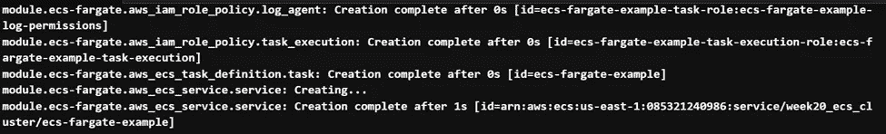
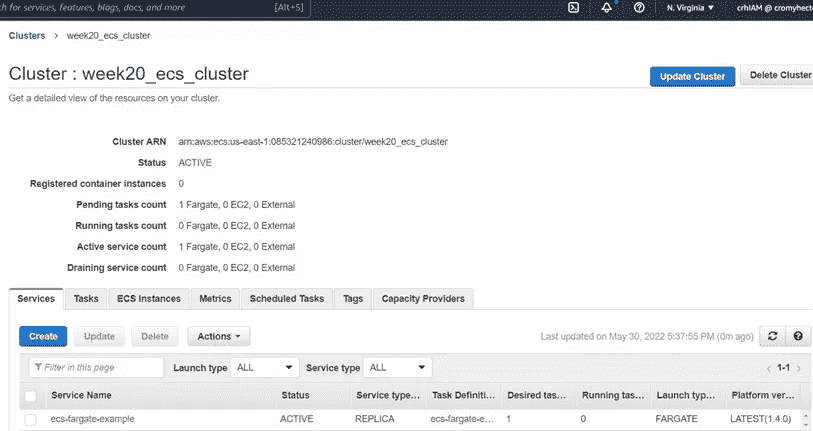
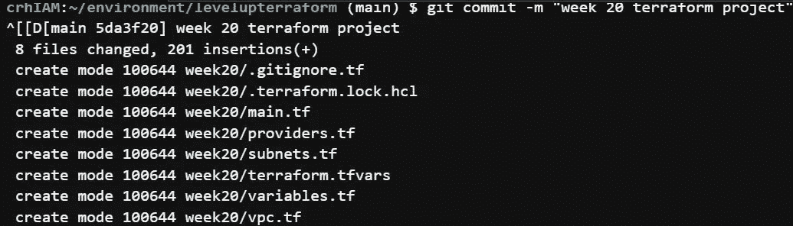

# 使用 Terraform 将 Docker 容器部署到 AWS 集群

> 原文：<https://medium.com/nerd-for-tech/deploying-a-docker-container-to-an-aws-cluster-using-terraform-bffac19716d0?source=collection_archive---------0----------------------->

这是一个初学者友好而广泛的使用 Terraform 将 docker 容器部署到 AWS ECS 集群的演练。但是在我们开始主要活动之前，我们必须先完成一些日常事务。

***基础设施即代码:*** 顾名思义就是将您的基础设施部署为代码。更具体的可读代码。从某种意义上说，它不是一种编程语言，但更像是一套关于如何建立和维护基础设施的易于遵循的指令。这类似于说“嘿，Siri 播放…”。抓住我的要点。

***Terraform:*** 是一个开源的基础设施代码工具，用于提供完整的云基础设施。

***Docker:*** 是一个开源平台，允许开发者在可以在主机操作系统上运行的容器上轻松构建和部署他们的应用。简单地说，Docker 解决了一个老问题:“它不能在我的操作系统或机器上运行”。

***AWS ECS:*** 据[https://aws.amazon.com/ecs/](https://aws.amazon.com/ecs/)称，亚马逊 ECS 是一种完全托管的容器编排服务，让您可以轻松部署、管理和扩展容器化的应用程序。

既然我们已经讨论了细节，让我们开始我们的项目吧。

***要求:***

1.从 Docker 注册表中调出 centos 图像。

2.使用 docker 映像和 terraform 创建 ecs 集群。

***先决条件:***

1.您选择的 IDE。

2.AWS 账户。

3.已经安装并配置了 Terraform。

***第 0 步:创建目录。***

我假设和我一样，你们这些读者可能正在从事许多不同的项目。为了保持有序，必须创建一个新的文件夹或目录。如果使用 Cloud9 作为您的 IDE，这可以通过两种方式完成:右键单击并选择“ ***新文件夹*** ”或在 IDE 的终端部分输入命令“ ***mkdir*** ”。(参考下图)。

***第一步:创建附带文件。***

创建文件夹或目录后，在所述目录中创建以下文件:providers.tf、variables.tf、vpc.tf、subnets.tf、main.tf、terraform.tfvars 和 last .gitignore。这些文件可以通过右键单击并选择“ ***新文件*** ”或通过在 IDE 的终端部分输入命令“ ***触摸 filename.tf*** ”来创建。(参考下图)。

***第二步:providers.tf.***

根据 Terraform.io 提供者是允许 Terraform 与服务、云提供者和其他 API 交互的插件。简单地说，可以把它看作是 Terraform 和其他服务之间的桥梁。考虑到我们从 Docker 中提取映像并将其部署到 AWS 集群，我们需要确保这两个服务都被列为我们的提供者。我们的访问密钥和秘密密钥是作为变量输入的，具体原因我们稍后会谈到。

***第三步:variables.tf.***

什么是变量。与大多数编程语言类似，变量是赋值或传递值的一种方式。在这个文件中，我们设置了我们的区域，我们的 CIDR 块，以及我们的访问和密钥。说到 access 和 secret key，变量. tf 将存放在我们的 repo 中，其他人可以看到，我们的 access 和 secret 的值不会在这个文件中赋值。相反，这些值将存储在 terraform.tfvars 中。Sensitive 将设置为= true，以避免显示任何敏感信息。

***第四步:VPC . TF&subnets . TF .***

当使用 ECS 部署容器时，强烈建议在 vpc 内部进行。

***第五步:main.tf***

要创建你的 main.tf 文件，点击下面的[链接](https://registry.terraform.io/modules/umotif-public/ecs-fargate/aws/latest)，并用作参考。

***第六步:terraform.tfvars &。git ignore***

。gitignore 是一个文件文本，它告诉 Git 在向 Github 提交项目时要忽略哪些文件或目录。我们的 terraform.tfvars 文件将被忽略，因为它包含我们的密钥和访问密钥。

请注意，将我们的密钥和访问密钥添加到 variable.tf 文件中，并通过 terraform.tfvars 传递这些值，肯定会帮助您在尝试部署集群时避免 IAM 错误。

***第七步:命令***

创建完所有文件后，请从终端运行以下命令。

Terraform init —为了初始化包含 Terraform 代码的工作目录

Terraform 计划—用于在执行我们的 terraform 代码之前预览我们的基础设施。

Terraform apply —用于将计划中指定的所有更改应用到 motion 中。

***第八步:在*控制台再次检查**

现在让我们转向管理控制台，以确保我们所有的资源都已创建。在搜索栏上，键入 ECS，在显示 ECS 控制面板后，单击“cluster”检查您的群集是否已创建。瞧啊。！！

***第九步:消灭。***

一旦您确认成功创建了资源，为了避免不必要的费用，请确保销毁所有资源。这可以通过在终端中输入 Terraform destroy 命令来实现。

旁注:养成将代码提交给回购的习惯。从经验上来说，这样做的习惯肯定能帮你省下一些心痛和时间。这可以通过输入:git commit -m 命令，然后输入 git push 命令来完成。

如果您已经做到了这一步，并且遵循了上面的步骤，那么您已经成功地并且应该知道如何使用 Terraform 将 Docker 容器部署到 AWS ECS 集群

谢谢你的时间

直到下一次，

你友好的邻居云开发工程师。