# 在 Google Cloud 上部署 Gitlab 存储库和 Runner 服务器。

> 原文：<https://medium.com/nerd-for-tech/deploying-a-gitlab-repository-and-runner-server-on-google-cloud-57b9d490c975?source=collection_archive---------4----------------------->


本教程是本帖的一个子部分，在这里你可以找到如何运行你的 Android 工具测试，以及如何使用 Gitlab 可视化合并请求上新代码的覆盖率。在这篇文章中，你会发现如何设置两个服务器，一个用于 Gitlab 仓库，另一个用于 Google Cloud 上的 Gitlab Runner。

# **建筑**

我们将使用以下架构:

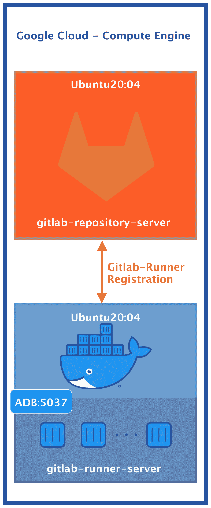

我们需要两台服务器，第一台用作 Git 资源库: *gitlab-repository-server* ，第二台将运行我们的管道: *gitlab-runner-server*

这只是在 Gitlab 上启用 CI/CD 的一种方式，事实上，您可以在您的本地机器上注册跑步者或使用类似 [Kubernetes](https://docs.gitlab.com/runner/executors/kubernetes.html) 的东西，这背后的美妙之处在于模块化和可用的倍数选项。

打开您的 Google Cloud 帐户，进入计算引擎>创建实例。

对于本教程，我将选择一个 e2-standard-4，100 GB SSD 磁盘和 ubuntu20:04，这种 CPU/RAM 配置对于概念验证来说是可以的，但如果您打算将它用作团队的 Git 存储库，您肯定需要更多的功率。

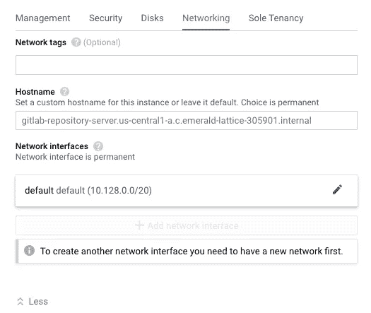

获取一个静态外部 Ip，如果没有，google 将在每次重启服务器时为您重新分配一个可用的 IP 地址，您必须重新配置许多东西，单击*管理、安全性、磁盘、网络、单独租赁*并转到*网络*选项卡，选择编辑图标并在外部 IP 下选择保留静态 IP 地址，保留其他选项为默认。

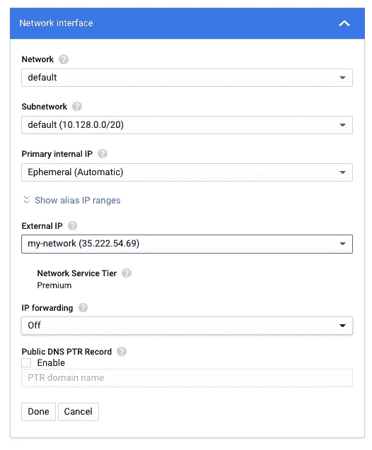

您的最终设置应该是这样的，不要忘记标记允许 HTTP 流量，现在，我们不会设置 HTTPS:

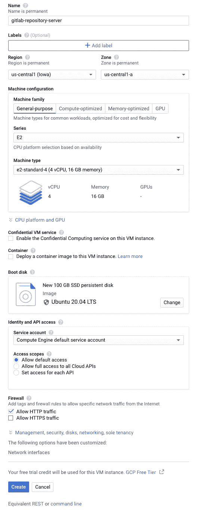

# **允许来自端口 5037 的流量**

对于 ADB 守护进程，我们必须允许端口 5037 上 *gitlab-runner-server* 和您的笔记本电脑之间的流量。在左侧面板中，在网络上选择 VPC 网络和防火墙:

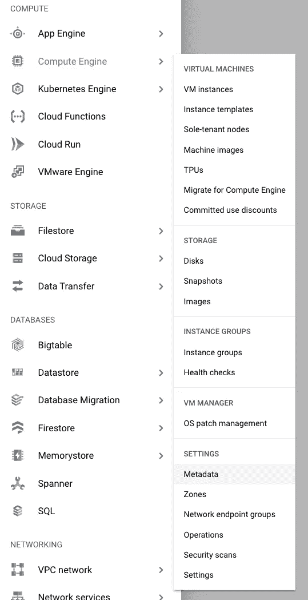

> 这些规则对于生产环境来说太宽泛了，我们允许来自所有网络的各种流量从所有实例到达我们的端口 5037。您必须设置一个特定规则，允许您团队中的少数人访问该端口，并与您公司的安全团队一起检查防火墙规则，否则，您可能会在您公司的网络上引入一个漏洞。

这是入口流量的设置:

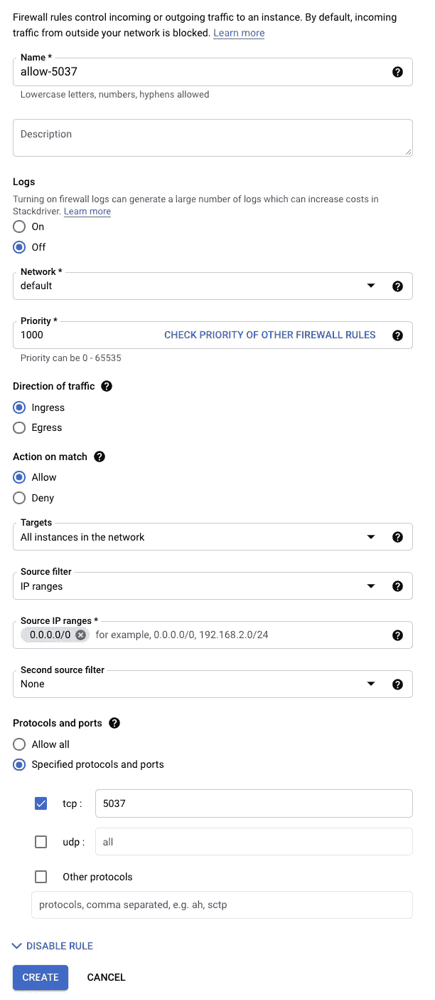

对于处理出口流量，重复上述步骤，稍作修改，首先将名称改为类似于 *allow-5037-egress，*选择出口作为流量方向。

**向服务器添加 ssh 元数据。**

在 linux/osx 上，检查 ssh 的本地文件夹，您应该会看到一个以。酒馆，在您的终端上:

ls ~/。嘘

如果没有，您应该创建一个新的密钥，键入:

ssh-keygen

输入所需数据或按 Enter 键跳过每个提示，在生产中，您必须使用具有强密码的密钥。这个命令将为您生成两个文件 id_rsa 和 id_rsa.pub，您不能与任何人共享文件 id_rsa，因为这是您的私钥，请妥善保管。

当您完成后，获取您的全新密钥，我们将使用它，以便您的服务器可以与您的笔记本电脑通信，而无需每次询问密码。

猫~/。ssh/id_rsa.pub

复制所有输出并粘贴到计算引擎>设置>元数据 SHH 键选项卡，编辑按钮，添加项目，并保存。在该部分下保存用户名，我们将使用它通过 ssh 进行连接。

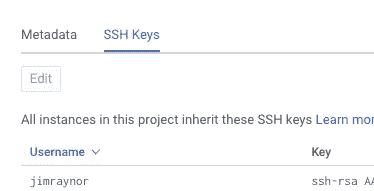

我将使用 jimraynor 用户连接到服务器。

# **配置 Gitlab 存储库服务器。**

打开一个终端，我们将使用 ssh 连接到我们的 gitlab-repository-server，我的用户是 jimraynor，来自我的服务器的外部 IP 是 77.111.24.77，第一次它会提示询问“是一个安全的地方”键入 yes::

宋承宪 jimraynor@77.111.24.77

[git lab 网站上的说明](https://about.gitlab.com/install/?version=ce#ubuntu):

*sudo apt-get install-y curl OpenSSH-server ca-certificates tz data perl*

*sudo apt-get install -y 后缀*

我们不打算配置电子邮件，因此单击“否”

*curl-sS*[*https://packages . gitlab . com/install/repositories/gitlab/gitlab-ce/script . deb . sh*](https://packages.gitlab.com/install/repositories/gitlab/gitlab-ce/script.deb.sh)*| sudo bash*

您可以为该地址配置 DNS，并将 EXTERNAL_URL 设置为 domain，但目前我们不会这样做。现在复制您的外部 IP，在我的例子中是 77.111.24.77，注意不要使用服务器本地 IP(以 10.xxx.xxx.xxx 开始)，否则，您无法从 google intranet 的外部连接，除非进行一些额外的步骤:

sudo EXTERNAL _ URL = " http://77 . 111 . 24 . 77 " apt-get 安装 gitlab-ce

等待大约 10 分钟，你现在在谷歌云上有一个 Gitlab 存储服务器，从你的外部 URL 访问它，在我的例子中是 http://77.111.24.77

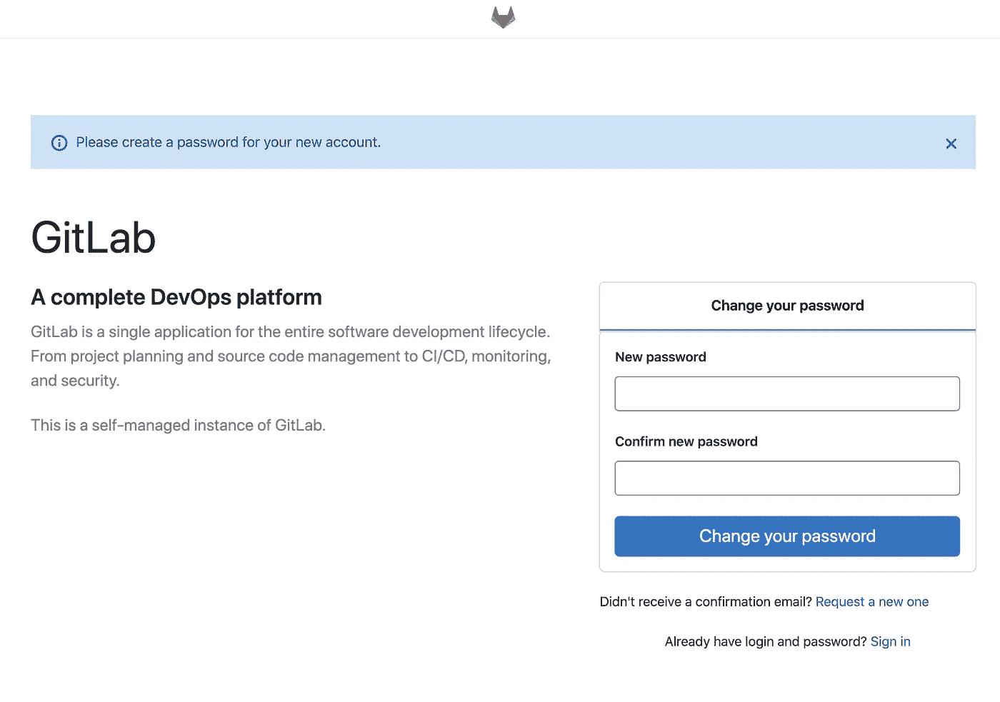

Gitlab 安装完成

您必须设置您的 root 密码。使用 root 作为用户名登录。

我们应该添加我们的公钥，单击您的个人资料图像、首选项、ssh-keys，并添加密钥，这样我们就可以克隆、拉和推，而无需每次在笔记本电脑上使用 Gitlab 凭据进行身份验证。

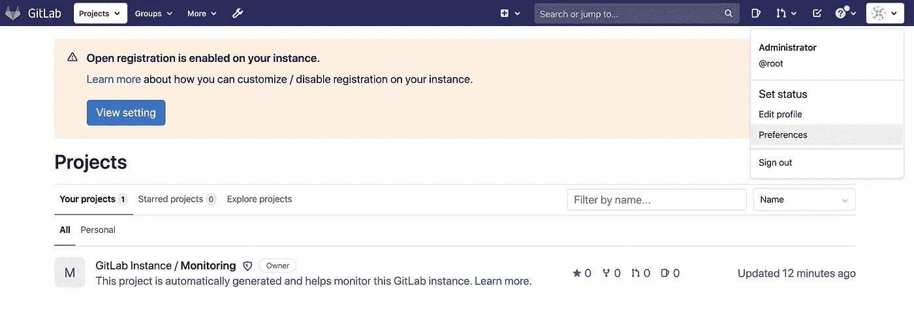

你完了！Gitlab 存储库已启动并运行，让我们开始使用 Gitlab Runner 服务器吧！

# **配置 Gitlab Runner 服务器。**

在这个服务器中，我们需要 Docker 来运行管道，按照来自 Docker.com 的[指令](https://docs.docker.com/engine/install/ubuntu/#install-using-the-repository)使用您的用户名和服务器的外部 IP 通过 ssh 连接到您的实例:

【jimraynor@104.128.137.30 宋承宪

在终端上:

```
*sudo apt-get update**sudo apt-get install -y apt-transport-https ca-certificates curl gnupg lsb-release*curl -fsSL https://download.docker.com/linux/ubuntu/gpg | sudo gpg --dearmor -o /usr/share/keyrings/docker-archive-keyring.gpgecho \
  "deb [arch=amd64 signed-by=/usr/share/keyrings/docker-archive-keyring.gpg] https://download.docker.com/linux/ubuntu \
  $(lsb_release -cs) stable" | sudo tee /etc/apt/sources.list.d/docker.list > /dev/null*sudo apt-get update**sudo apt-get install -y docker-ce docker-ce-cli containerd.io*
```

我们有码头工人！接下来，用 Android 的工具箱(命令行工具，平台工具等)拉一个图像，我将使用这个[图像](https://gitlab.com/ciandroidinstrumentationtest/android_build_container)，但是你可以选择任何让你使用 ADB 和 gradle 的。

在 *gitlab-runner-server* 的终端上:

*sudo docker image pull Andres maca/Android _ build _ container:1.0*

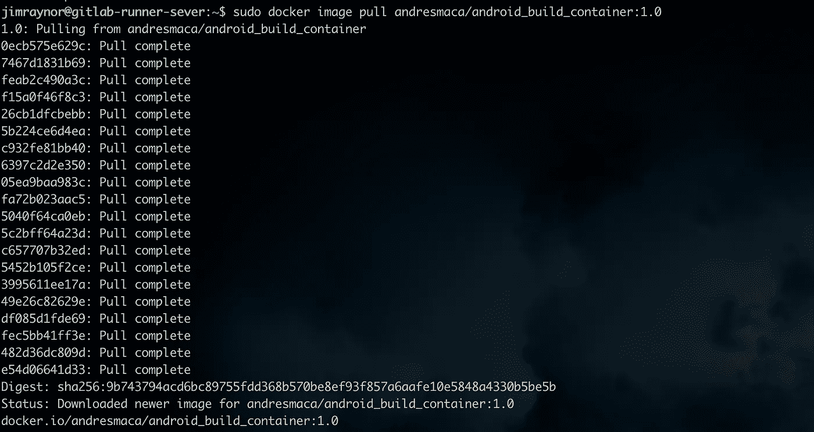

将一部安卓手机连接到你的笔记本电脑，然后[启用开发者选项](https://developer.android.com/studio/debug/dev-options#enable)。在本地计算机上打开终端，并键入:

adb 设备


目标是参赛者可以使用您本地计算机的 adb@localhost:5037，在您本地计算机的终端上实现:

*ssh -XC -v -R 5037:本地主机:5037 jimraynor@104.128.137.30*

将 jimraynor 和 IP 地址替换为你的用户名 Gitlab Runner 服务器的外部 IP 地址，不要关闭终端，因为这是“桥”。

在新的终端窗口中，通过 SSH 再次连接到 Gitlab Runner 存储库，并键入:

```
sudo docker run -it --network=host andresmaca/android_build_container:1.0 /bin/bash
```

一旦你进入集装箱，你就可以使用 ADB。


**在 Gitlab 项目中注册跑步者。**

使用实例的外部 IP 地址通过浏览器访问 Gitlab 实例。选择一个项目以添加您的跑步者，然后进入设置> CI/CD >跑步者。

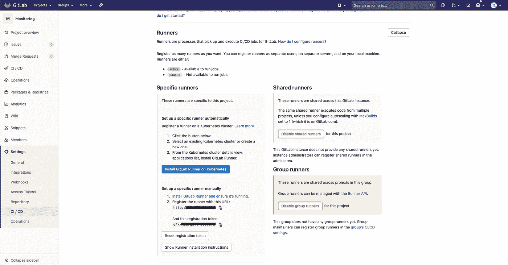

现在通过 ssh 访问您的 Gitlab Runner 实例，我们必须添加 gitlab runner 并注册它。在控制台上:

```
sudo docker volume create gitlab-runner-configsudo docker run -d --name gitlab-runner --restart always     -v /var/run/docker.sock:/var/run/docker.sock     -v gitlab-runner-config:/etc/gitlab-runner     gitlab/gitlab-runner:latestsudo docker run --rm -it -v gitlab-runner-config:/etc/gitlab-runner gitlab/gitlab-runner:latest register
```

并用 Gitlab 存储库实例数据填充表单:

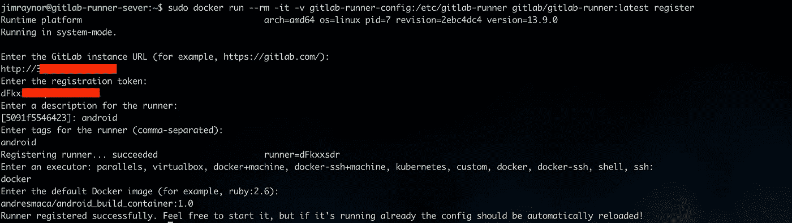

我们必须为 runner 更改 docker 网络，我们安装了一个 docker 卷，因此我们必须使用 sudo 来修改它:

```
sudo su
cd /var/lib/docker/volumes/gitlab-runner-config/_data
vim config.toml
```


在 runners.docker 下添加 network_mode="host "

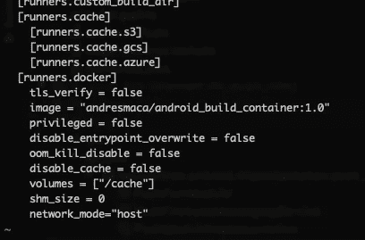

使用“esc”键和“:wq”退出，重新启动 docker 容器:

```
docker restart gitlab-runner
```

仅此而已！开始使用 Gitlab 的 DevOps 并享受其中的乐趣！如果你想知道这对你的团队绩效和指标有什么帮助，去[我的另一篇文章](/@andresmaca/android-continuous-integration-and-coverage-visualization-on-gitlab-4a15d58f624c)

如果你对你的开源/ONG 项目有任何疑问或者需要帮助，你可以在 linkedIn 上点击我的 DM。

如果有用的话，别忘了按拍手按钮！