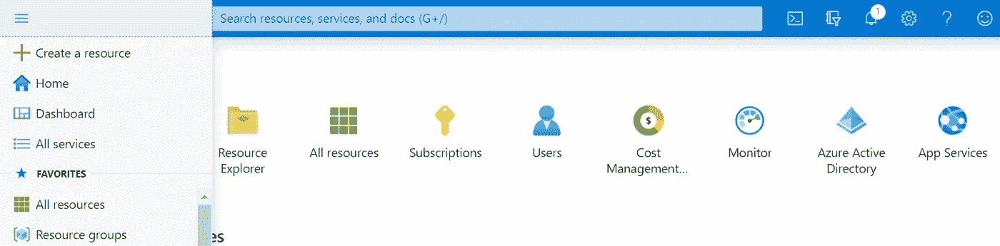
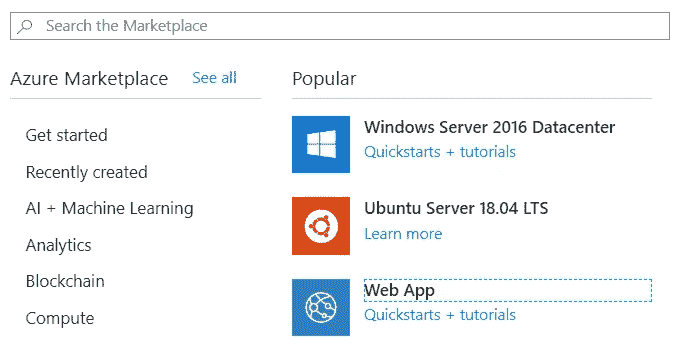
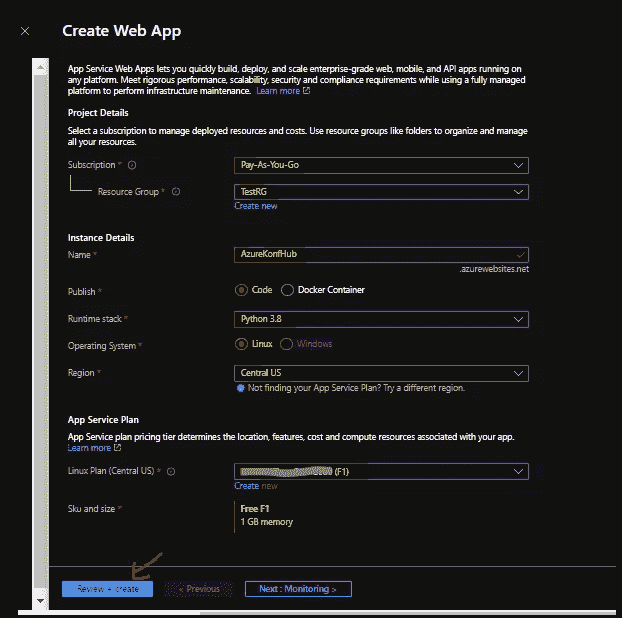
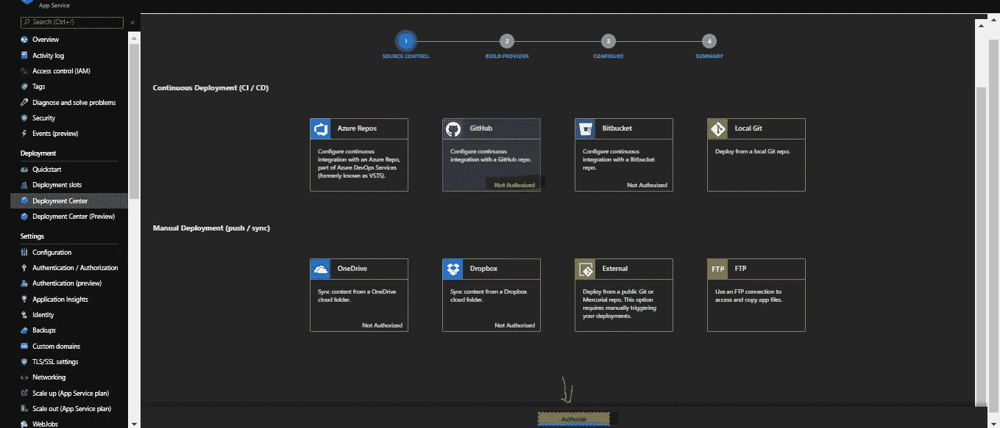
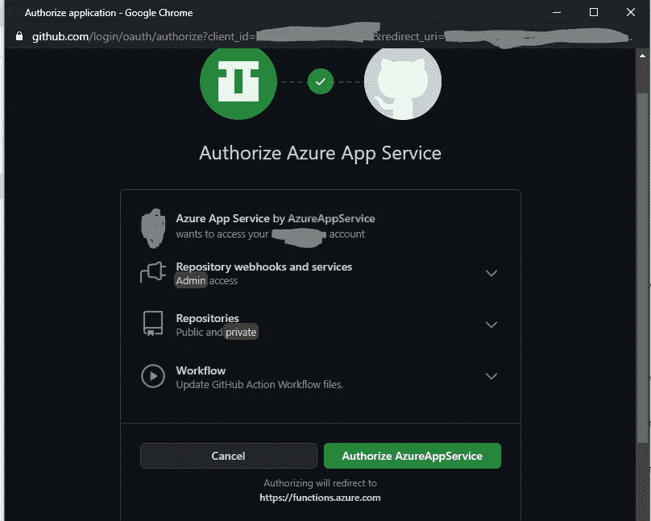
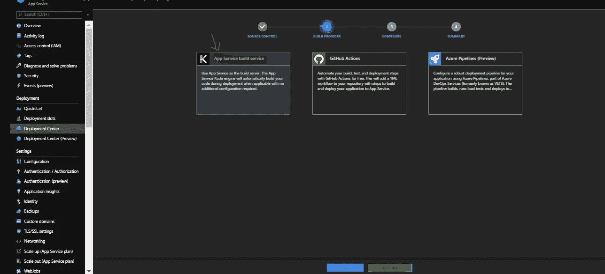

# 在 Azure 中部署简单的 FASTAPI

> 原文：<https://medium.com/nerd-for-tech/deploying-a-simple-fastapi-in-azure-79c59c430064?source=collection_archive---------2----------------------->

*我与 KonfHub 的恋爱关系大赛*[*# azure deporties*](https://twitter.com/intent/tweet?url=https%3A%2F%2Fdevstories.konfhub.com%2F&text=Hey%F0%9F%96%90%EF%B8%8F%20I%20am%20taking%20part%20in%20%23azuredevstories%20)

Konfhub 举办了一个技术博客竞赛暨学习项目，所有参与者都必须完成任何一个 MS Learn 课程。我已经完成了天蓝色赛道上的 Python。该计划的目标是培养开发者在 MS Learn 上学习新技术的技能，并创建内容分享他们在 Azure 上的经验。

Joshua Aragon 在 [Unsplash](https://unsplash.com?utm_source=medium&utm_medium=referral) 上拍摄的照片

为了更好地理解 Azure App 服务，我创建了一个简单的快速 API 应用程序部署到 Azure。

 [## dini-rockz93/FastAPi_azure

### 在 azure 上创建快速 API 服务。通过在…上创建帐户，为 dini-rockz93/FastAPi_azure 开发做出贡献

github.com](https://github.com/dini-rockz93/FastAPi_azure/blob/main/README.md) 

先决条件:

1.  Azure 帐户
2.  Github 帐户(了解任何框架)
3.  Git 的基础知识

# 步骤 1:在 Azure 上创建应用服务

前往[portal.azure.com](https://portal.azure.com/)并登录(如果没有，请注册)。点击左侧边栏中的*“创建资源”*。

搜索“*Web App”*并点击。

并按照您的帐户设置填写如下所示的详细信息(**注** : *您可能会为复制本教程*时创建的一些资源付费)。

**订阅**:已有订阅名称。
**资源组**:新建并命名它(在我的例子中是*“TestRG”，它已经是一个现有的资源组*)。
**名称**:您选择的应用名称

**发布:**选择*代码*。
**运行时栈**:挑' *Python 3.8* '。
**操作系统**:挑选'*Linux*'
'**地区**:挑选'*美国中部*'或 F1 应用服务计划层级可用的任何其他地区。

**应用服务计划::
Linux 计划(美国中部)**:创建一个新计划(*在我的情况下，它已经存在/您可能需要创建一个新计划。* )
**SKU 和尺寸:** *自由 F1* **(** 1 GB 内存)【挑这个尺寸】

点击**查看并创建**，确认后点击**创建**按钮。Azure 部署所需资源可能需要一段时间。

步骤 2:配置应用服务的部署设置

部署过程完成后，您可以在 Azure Dashboards 的“所有资源”选项卡中看到之前创建的应用服务。

单击该资源并转到资源侧栏中的部署中心。

选择 **Github** 作为源代码管理提供者。如果你还没有从 Azure 授权 Github，它会通过要求你授权来打开一个新窗口。

通过提供您的 Github 凭据点击授权，然后点击'**授权/批准**'。

关闭 GitHub 授权后，你可以看到 Azure 中的**‘继续’**选项，如上图所示。之后，您将选择构建提供者小部件。

选择' **Kudu** '作为您的构建提供者，并再次点击' **Continue** '。

您将被带到**配置**选项卡，以选择您的 GitHub 帐户中您想要发布到 Azure App 服务的相应回购。

**注意:** *如果你的 GitHub 里没有基于 Python 的 Web App，那么从* [*这里*](https://github.com/dini-rockz93/FastAPi_azure/) *把它分出来，然后用它部署到 Azure App Service 里。*

点击**继续**，将进入部署配置的最后一步，即查看摘要。您可以在这里看到哪个存储库将被推送到应用服务。

最棒的是，你甚至可以在 Azure 中优化应用服务计划，以确保有多个部署槽用于不同的目的。例如，如果配置有效，在同一个应用服务中可以有一个生产部署槽和一个临时部署槽。

这就是我们如何在短时间内从 GitHub Repos 到 Azure 配置和部署基于 python 的 web 应用程序。

照片由 [Rendy Novantino](https://unsplash.com/@novantino?utm_source=medium&utm_medium=referral) 在 [Unsplash](https://unsplash.com?utm_source=medium&utm_medium=referral) 上拍摄

这是我在 Azure 的第一次尝试，让我知道任何改进点

编辑:完成工作后，不要忘记删除资源

[https://docs . Microsoft . com/en-us/azure/azure-resource-manager/management/delete-resource-group？tabs=azure-powershell](https://docs.microsoft.com/en-us/azure/azure-resource-manager/management/delete-resource-group?tabs=azure-powershell)

> az 资源删除—详细— id<id_name></id_name>

**最后的话**
通过 KonfHub 举办的这个技术博客竞赛，我坚信每个软件工程师都会认真阅读文档/博客/文章/参考资料，这有助于探索处理错误的专业方法。谢谢你，KonfHub，让我有如此美好的经历。