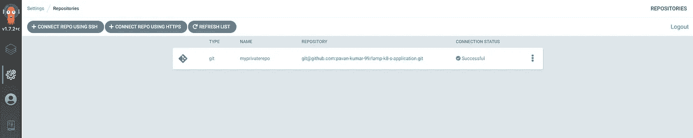
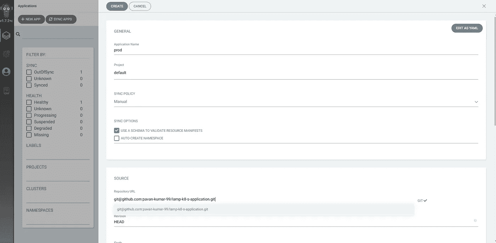
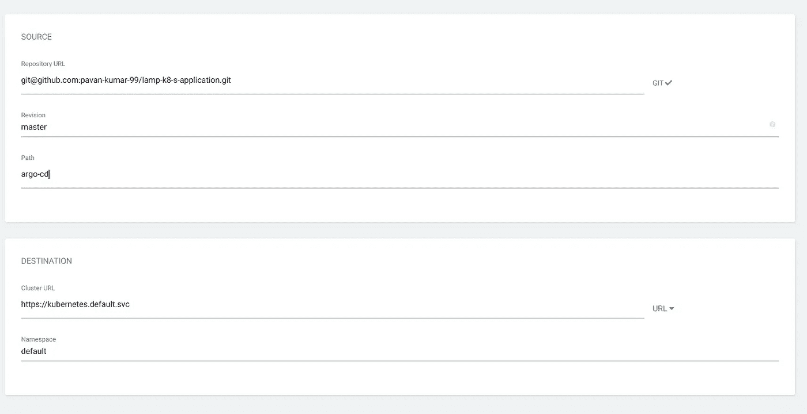
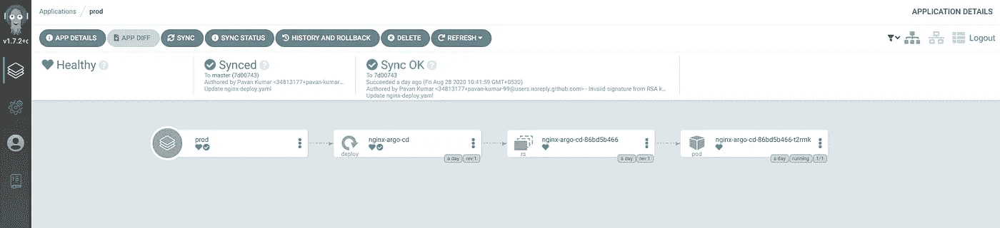
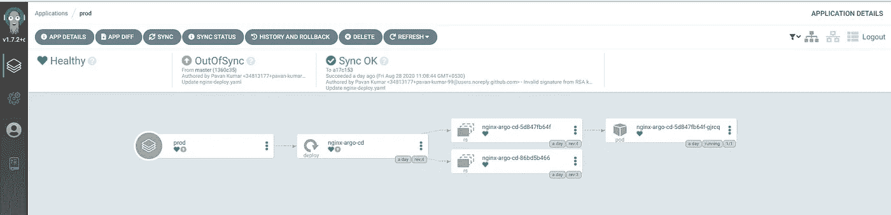

# 使用 Argo CD 在 Kubernetes 中部署应用程序

> 原文：<https://medium.com/nerd-for-tech/deploying-applications-in-kubernetes-using-argo-cd-ab004a8cdb5e?source=collection_archive---------0----------------------->

什么是 Argo CD？

Argo CD 是一个用于 Kubernetes 的声明式 GitOps 连续交付工具。那么什么是 GitOps 呢？是市场上的新工具吗？GitOps 为开发人员提供了一种使用 Git 来管理 Kubernetes 操作工作流的方法。这完全是关于在 Kubernetes 中使用版本控制系统来部署应用程序。所以开发者可以直接把代码从 Git 这样的版本控制系统推到生产中。此外，任何更改都可以很容易地跟踪和恢复，以防出现任何混乱。市场上有多种运行 GitOps 的工具。今天在这篇文章中，我们将实验一种叫做 Argo CD 的工具。

Argo CD 是一个用于 Kubernetes 的声明式 GitOps 连续交付工具。它支持在

1.  草泽
2.  舵图
3.  YAML 货单
4.  ksonnet 应用
5.  jsonnet 文件

让我们看看阿尔戈光盘的结构

Argo CD 架构

现在我们已经熟悉了 Argo CD 的概念，让我们在 Kubernetes 集群中安装 Argo CD。

按照 Argo CD 官方文档中指定的步骤在您的 Kubernetes 集群中安装和配置 Argo CD。

在第一步中，让我们配置与我们的私有 Github 存储库相关的私有密钥。这一步使得我们的 Argo CD 服务器可以访问我们私有的 Github 库中的所有清单文件。这可以通过发出一个简单的 argocd 命令来完成

> **argocd repo 添加 git @ github . com:pavan-Kumar-99/lamp-k8-s-application . git—ssh-private-key-path id _ RSA ~/。ssh/argo_priavate_key**

让我们也从 Argo CD 控制台验证这一点

亚斯。！到我们私有存储库的连接现在成功了。让我们继续将应用程序部署到我们的 Kubernetes 集群中。

在 UI 中，通过单击新应用程序图标创建一个新应用程序。

阿尔戈 CD 用户界面

在上面的快照中，您可以看到配置应用程序的各种参数。

1.  应用程序名称:Argo CD 中应用程序的名称
2.  项目:要在其中部署应用程序的项目
3.  同步策略:从 GitHub 同步清单应该是自动的还是手动的。(现在让我们把它当作手动的，因为我们将在 Argo CD 中探索历史和回滚功能)
4.  资源库 URL:您的 GitHub 资源库的 URL
5.  修订版:GitHub 存储库中使用的分支。

集群的选择

6.集群 URL:您希望将应用程序部署到的 Kubernetes 集群。

7.名称空间:应用程序必须部署到的名称空间。

我的 GitHub repo 中的 agro-cd 文件夹有一个简单的 Nginx 部署文件，其映像版本为 **1.18。**现在让我们手动同步我们的应用程序。一旦同步成功，您将在 Argo CD 控制台中看到类似这样的内容

Argo CD 控制台

您可以在这里找到清单文件中定义的所有组件。同步输出表明应用程序与 GitHub 存储库同步。现在让我们尝试在 GitHub 中将 Nginx 镜像的版本改为 **1.19** 。由于自动同步功能被禁用，更改不会立即复制。否则，一旦更改在 GitHub 中被更改，并被合并到项目中指定的分支，这些更改就会被立即复制到 Kubernetes 集群中。

做出更改后，您会看到同步状态为**不同步**。让我们通过单击 App Diff 部分来查看 Argo CD 控制台中的更改。

因为可以清楚地看到图像已经被改变。让我们将这一变化与我们的集群同步。现在你可以看到同步状态回到了与 GitHub 同步。现在一切都很好，突然你的容器开始失效。当您发现您的代码在版本 1.19 中有问题，并且您想要回滚到应用程序的前一个版本时。单击控制台中的历史和回滚选项，并选择您想要回滚到的版本。现在，您可以看到您的应用程序回滚到旧版本，同步状态变为不同步。

状态被设置为不同步，因为 Argo CD 的状态与 GitRepo 中的清单不一致。在 Git Repo 中进行更改将会改变 Argo CD UI 中的状态。

还有一些其他场景，我将在下一篇文章中介绍。

# 被推荐的

 [## Istio 服务网格简介

### 什么是 Istio 服务网格？

medium.com](/@pavan1999.kumar/introduction-to-istio-service-mesh-2bc68d2ffdac)  [## 在 Kubernetes 中使用 vault-k8s 保护您的秘密—第 1 部分

### Kubernetes secrets 允许您存储和管理敏感数据，如密码、ssh 密钥、Tls 证书等。然而…

medium.com](/@pavan1999.kumar/securing-your-secrets-using-vault-k8s-in-kubernetes-part-1-de3d7378e226)