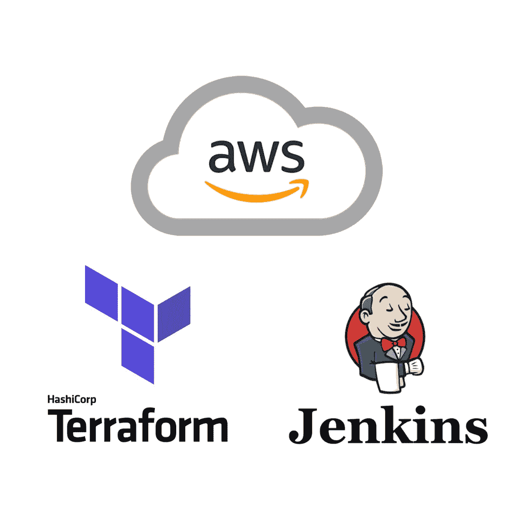

# 使用 Terraform 和 Jenkins 管道部署 AWS 资源

> 原文：<https://medium.com/nerd-for-tech/deploying-aws-resources-using-terraform-and-jenkins-pipeline-1c706f1a2e7c?source=collection_archive---------0----------------------->

## 将（行星）地球化（以适合人类居住）

HashiCorp Terraform 是一个用于构建、更改和版本化基础设施的工具，它有一个开源的企业版。与只能在 AWS 上使用的 AWS CloudFormation 不同，Terraform 与云无关，可用于创建多云基础架构以及内部部署。它是以人类可读、机器可消耗的方式编写的…