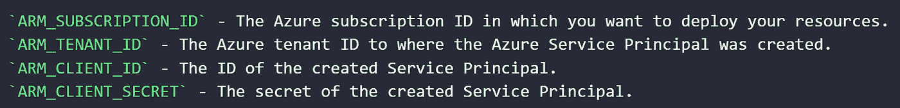

# 使用 ARM 模板在 Terraform 中部署 Azure 流分析以包含 SQL 参考数据

> 原文：<https://medium.com/nerd-for-tech/deploying-azure-stream-analytics-in-terraform-using-arm-templates-to-include-sql-reference-data-afbcca362fff?source=collection_archive---------4----------------------->

我不想用你的标准“数据”或“计算机”图片。所以这是一种接近“流”的东西。已经感受到禅意了？—由[巴斯金创意工作室](https://www.pexels.com/nl-nl/@raebaskinphotos?utm_content=attributionCopyText&utm_medium=referral&utm_source=pexels)通过[像素](https://www.pexels.com/nl-nl/foto/time-lapse-fotografie-van-lake-1480807/?utm_content=attributionCopyText&utm_medium=referral&utm_source=pexels)拍摄。

# 🧭简介

在这个场景中，我们想要创建一个 Azure 流分析作业，它从 Azure Event Hub 获取输入数据，**使用来自 Azure SQL 数据库**的参考数据，然后在转换成服务总线主题后输出数据。我们希望使用 [Terraform](https://www.terraform.io/intro/index.html) 来部署资源，原因很简单，因为它是一个令人敬畏的基础设施代码(IaC)工具，允许您构建、更改和版本化基础设施。

部署它的挑战是什么？如[本期](https://github.com/terraform-providers/terraform-provider-azurerm/issues/9231)所述，`azurerm` Terraform provider 目前不包括对 SQL 引用数据查找的支持——它目前只支持 Azure blob 存储引用数据查找。此外，也不支持本[问题](https://github.com/terraform-providers/terraform-provider-azurerm/issues/6660)中所述的[兼容级别 1.2](https://docs.microsoft.com/azure/stream-analytics/stream-analytics-compatibility-level#compatibility-level-12) 。

但是不用担心！还有另一种方式在 Terraform 中部署包含 SQL 参考数据的 Azure Stream Analytics:使用 [ARM 模板部署](https://docs.microsoft.com/azure/stream-analytics/quick-create-azure-resource-manager)。

查看 GitHub 的[repo，获取本文的代码示例。](https://github.com/zoekdestep/deploy-asa-in-tf-using-arm)

# 🍿要求

在开始之前，请确保以下事项已准备就绪:

*   您希望在其中部署资源的 Azure 订阅 ID 和租户 ID。你可以使用 [Azure CLI](https://docs.microsoft.com/cli/azure/manage-azure-subscriptions-azure-cli) 或 [Azure Portal](https://docs.microsoft.com/azure/media-services/latest/setup-azure-subscription-how-to?tabs=portal) 找到这些信息。
*   与上述租户 ID 对应的 Azure 服务主体 ID 和机密。您可以使用 [Azure CLI](https://docs.microsoft.com/en-us/cli/azure/create-an-azure-service-principal-azure-cli) 来创建它。
*   将这四个秘密添加到 [GitHub 秘密](https://docs.github.com/en/actions/reference/encrypted-secrets)中，这样它们就可以作为环境变量在 [GitHub 动作工作流](https://github.com/zoekdestep/deploy-asa-in-tf-using-arm/blob/main/.github/workflows/terraform-github.yml)中进行认证。请确保按如下方式命名您的机密:

*   Terraform 需要一个地方来存储它的状态文件。因此，添加五个额外的 GitHub 秘密，它们描述了将要添加状态文件的所需资源组名称、存储名称和容器名称、状态文件的名称以及想要部署这些状态文件资源的区域。请注意:这些资源还不需要存在。

# 🏭它是如何工作的

一旦运行了 [GitHub Actions 工作流](https://github.com/zoekdestep/deploy-asa-in-tf-using-arm/blob/main/.github/workflows/terraform-github.yml)，接下来的步骤就开始了。

*   使用`state-resources.sh`，存储 Terraform 状态文件的资源被创建(或者，如果它们已经存在，什么都不会发生)，使用您在 GitHub Secrets 中定义的参数。
*   Terraform 设置、检查文件格式、初始化，然后生成执行计划。该执行计划(创建、更新或销毁资源)基于`main.tf`中定义的资源。在这种情况下，它创建一个单独的资源组，在其中部署资源；Azure 事件中心，用于 Azure 流分析的潜在数据输入；Azure 流分析使用的潜在参考数据的空 Azure SQL 数据库；潜在数据输出的服务总线主题；以及包括必要的 blob 存储的 Azure 流分析作业。
*   我们没有部署 [Terraform Azure 流分析作业](https://registry.terraform.io/providers/hashicorp/azurerm/latest/docs/resources/stream_analytics_job)，而是在 [main.tf](https://github.com/zoekdestep/deploy-asa-in-tf-using-arm/blob/main/main.tf) 中部署了 [Terraform Azure 资源组模板部署](https://registry.terraform.io/providers/hashicorp/azurerm/latest/docs/resources/resource_group_template_deployment)。这个部署模板引用了一个 [ARM 模板](https://github.com/zoekdestep/deploy-asa-in-tf-using-arm/blob/main/stream-analytics/asa-template.json)，它指定了要创建的 Azure 流分析实例。ARM 模板引用部署模板中提供的参数——具体来说，对于我们的用例，它使用`referenceQuery`参数(引用 SQL 引用数据查找查询)并将其定义为 Azure Stream Analytics 作业的引用数据。*请删除* [*ARM 模板*](https://github.com/zoekdestep/deploy-asa-in-tf-using-arm/blob/main/stream-analytics/asa-template.json) *中的注释，因为它们会导致编译错误，但出于解释目的，它们包含在此 repo 中。*
*   然后，当有推送到`main`分支时，计划被执行。
*   回购还包括 [Azure Stream Analytics 单元测试](https://github.com/zoekdestep/deploy-asa-in-tf-using-arm/blob/main/stream-analytics/test)和[相应的管道](https://github.com/zoekdestep/deploy-asa-in-tf-using-arm/blob/main/.github/workflows/asa-ci.yml)——因为测试是很好的实践:)你可以在这里找到更多关于测试 Azure Stream Analytics [的信息。](https://www.npmjs.com/package/azure-streamanalytics-cicd)

请注意，上述设置不包括任何流数据。因此，定义的 Azure 流分析和 SQL 查询是虚构的。

# 🚿清理

为了避免不必要的成本，不要忘记破坏创造的资源。

# 💛感谢您的阅读！

如果你觉得这有用，一些👏将非常感谢进一步传播这个词。此外，如果您有其他问题或想法，请在评论中告诉我，或者在 [GitHub](https://github.com/zoekdestep/deploy-asa-in-tf-using-arm) 中投稿。谢谢大家！