# 在 AWS EKS 上部署 Joomla、Prometheus 和 Grafana

> 原文：<https://medium.com/nerd-for-tech/deploying-joomla-prometheus-grafana-on-aws-eks-37177a116acb?source=collection_archive---------1----------------------->

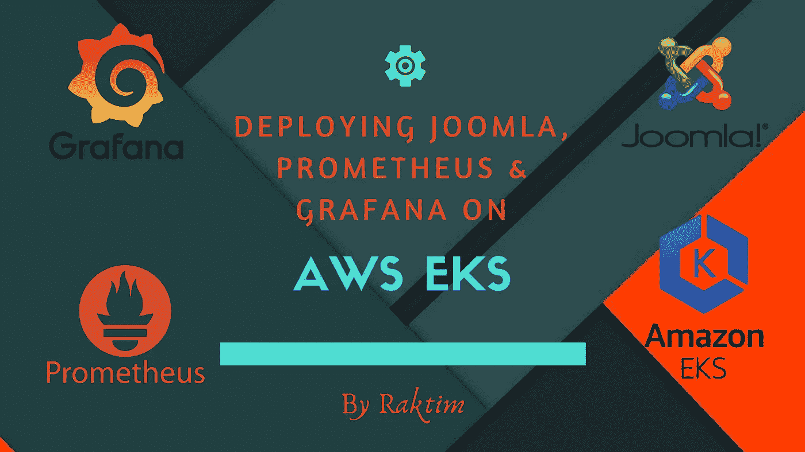

由 Raktim 创建

在这篇文章中，您将了解如何在 AWS EKS 上部署 Joomla、Prometheus 和 Grafana。我将详细讨论每一件事，并向你展示示范。所以让我们开始…

**下面是任务的视频演示:**

[](https://www.linkedin.com/posts/raktim00_awscloud-awseks-kubernetes-activity-6689262931009404928-frrO) [## Raktim M .发布在 LinkedIn 上

### ⭕很高兴与大家分享，我在 AWS EKS 培训下完成了一项伟大的任务。😊 🔶简要介绍我的任务…

www.linkedin.com](https://www.linkedin.com/posts/raktim00_awscloud-awseks-kubernetes-activity-6689262931009404928-frrO) 

## 什么是 AWS EKS？？？

Amazon Web Services 俗称 AWS，是一家云服务提供商。我不想在这里谈论太多关于 AWS 的事情，但是如果你想知道更多关于 AWS 的事情，你可以看看我下面的文章。

[](/@raktim00/getting-started-with-aws-terraform-293e9125dff) [## AWS & Terraform 入门。

### 如何入门使用 Terraform 在 AWS 中构建基础设施？

medium.com](/@raktim00/getting-started-with-aws-terraform-293e9125dff) 

在 AWS，我们完全管理称为 EKS 的 Kubernetes 服务(弹性 Kubernetes 服务)。EKS 最大的特点是可以创建多节点集群，你不需要自己设置任何东西。在这里，您只需告诉 EKS 您想要使用哪些资源，EKS 就会自动提供这些资源，并自动为您设置一切。

## Joomla 是什么？？？

Joomla 是一个用于创建 Web 内容的开源内容管理系统。它是用 PHP 编写的，使用 MySQL 数据库存储数据，并使用面向对象的编程技术。我们将使用预先创建的 Joomla 和 MySQL 的 Docker 图像。

## 普罗米修斯是什么？？？

Prometheus 是一个用于事件监控和警报的免费软件应用程序。它在使用 HTTP 拉模型构建的时间序列数据库中记录实时指标，具有灵活的查询和实时警报。我们将使用它来监控我们的多节点集群。

## Grafana 是什么？？？

Grafana 是一个多平台开源分析和交互式可视化 web 应用程序。它可以通过一个插件系统进行扩展。终端用户可以使用交互式查询构建器创建复杂的监控仪表板。我们将通过 Grafana 连接 Prometheus 数据库服务器，以监控我们的多集群节点。

# 正在设置 AWS EKS 集群…

## 先决条件:

*   您应该有一个 AWS 帐户，并且应该在您的系统中安装 AWS CLI。接下来，您应该用您的访问密钥和秘密密钥配置 AWS CLI。
*   接下来，您应该在系统上安装“eksctl”程序。eksctl 是一个可以非常容易地创建 EKS 集群的程序。
*   你还应该在你的系统上安装“kubectl”程序。kubectl 是一个客户端程序，它与运行在 AWS 上的 Kubernetes 主程序联系，以满足我们的需求。

## 写入 yml 文件以创建 EKS 集群:

要使用 eksctl 创建集群，我们需要创建一个 yml 文件。在下面你可以看到这个文件。别担心，我会讨论如何写这个文件。

*   在这个文件中的前两个选项(kind 和 apiVersion)你可以认为是默认选项。在元数据中，我们提到了我的集群的名称，以及我们希望我们的集群部署在哪个区域。
*   接下来在节点组中，我们提到了我们需要哪种类型的节点。在这里，我用 3 种不同的资源创建了 3 种节点组。这取决于您的应用程序负载，您希望提供哪种资源。

## 创建 EKS 集群:

您只需运行一个 CMD 来创建集群。在 cluster.yml 文件所在的文件夹中，打开 CMD 提示符并运行下面提到的 CMD 命令。

```
eksctl create cluster -f cluster.yml
```

接下来在下面提到的图片中，你可以看到我运行 CMD。

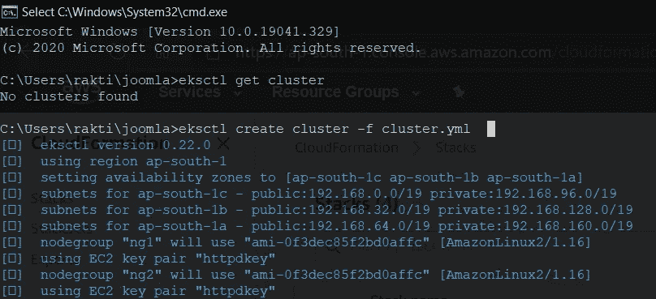

接下来，如果我转到 AWS 并转到 EKS，我们可以看到群集已经创建。

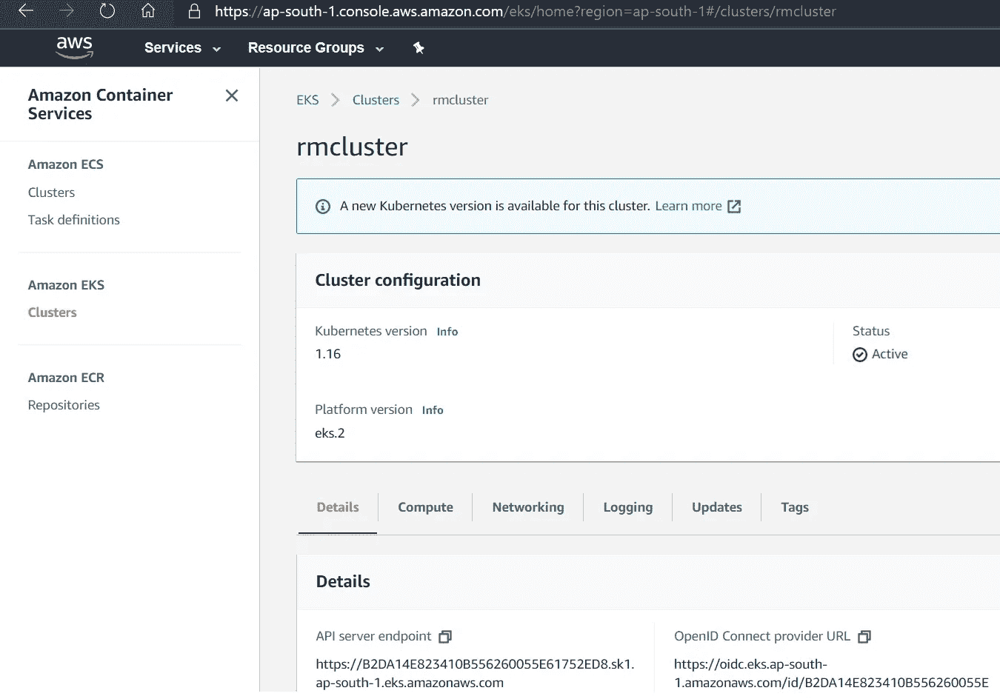

如果我转到 AWS 中的云形成，我们可以看到云形成创建了集群、节点组、VPC 和所需的一切。

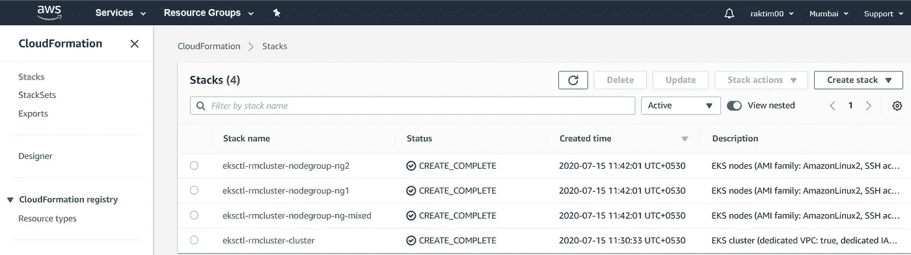

另外，如果我转到 EC2，我们可以看到总共有 5 个实例已经成功部署。


因此，集群终于可以使用了。

## 配置 kubectl:

因此，我们将运行下面提到的 cmd 来设置 kubeconfig 文件。

```
aws eks update-kubeconfig --name rmcluster 
```

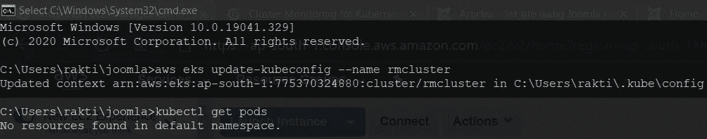

恭喜，我们完成了 Kubernetes 的全部设置。现在，我们可以轻松地部署我们的应用程序。

# 正在部署 Joomla…

我们必须创建 3 个 yml 文件来部署 Joomla。我将逐一讨论所有的文件。

## MySQL 部署文件:

使用下面提到的文件，我们将创建 MySQL pod，它将作为 Joomla 的数据库。

*   我已经讲述了 apiVersion、kind 和元数据。现在在 spec 中，我们告诉了 MySQL 的工作端口，以及我们希望 MySQL 使用哪种 Kubernetes 服务。现在我不希望外人能访问我的数据库。所以，我用了 clusterIP 服务。
*   接下来，我创建了一个永久保存我的 MySQL 数据的 pvc。意味着如果由于任何原因我的吊舱被终止，我不会失去任何东西。
*   接下来，我创建了一个部署文件来部署 MySQL pod。这里我们可以注意到 MySQL 的密码来自另一个文件。通常我们会创建一个秘密文件，在里面安全地保存我们的密码，并给出文件的位置。现在，我部署自动从该文件中检索密码。还有一件事，我把 pvc 附加到“/var/lib/mysql”文件夹中，因为 mysql 把它的数据保存在这个文件夹中。

## Joomla 部署文件:

使用下面提到的这个文件，我为前端 Web 应用程序 Joomla 创建了 pod。

*   这也是我以前讨论过的每一点。但在这里，我没有使用集群 IP，而是使用了负载平衡器，因为这是我们的前端应用程序，这个负载平衡器将为我提供一个公共 DNS，我们将其提供给客户端，以便客户端可以看到我的站点。
*   这里还有一件事，我们提到了我们的数据库细节，以便 Joomla 可以连接到数据库。
*   还有最后一件事，我让我的“/var/www/html”文件夹持久化，因为我们在 Apache webserver 上使用 Joomla。Apache webserver 将其数据存储在这个文件夹中。

## Kustomization 文件:

这是我们必须写的最后一个文件。这个文件会自动找出其他文件并运行它们。你可以认为这是一个小的自动化。我们不是手动运行每个文件，而是简单地提到其中的文件名。记住一件事，这个文件的名字是固定的。

*   在这个文件中还有一件事，我们提到了我们传递给 MySQL 和 Joomla 的秘密密钥。所以，这将为我们生成秘密。

## 让我们运行这些文件，看看如何访问 Joomla:

首先，为每个目的创建名称空间总是一个好的做法。这使得事情井井有条。我首先还创建了一个名为 Joomla 的名称空间，使用

```
kubectl create namespace joomla
```

然后我将默认名称空间改为 Joomla，使用

```
kubectl config set-context --current --namespace=joomla
```

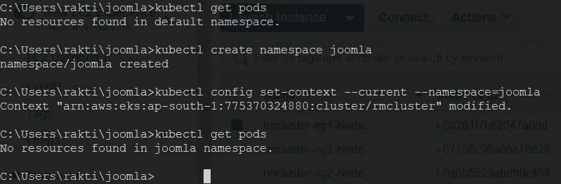

接下来，我运行一个简单的 CMD 来部署 MySQL 和 Joomla。CMD 是

```
kubectl create -k .
```

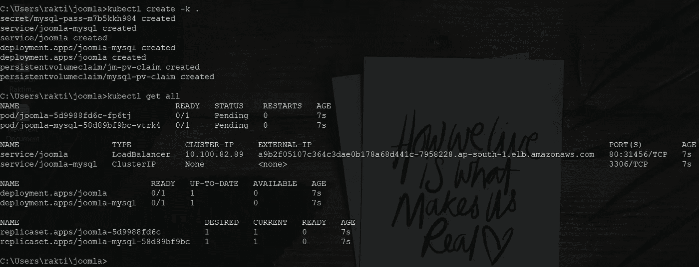

所以，我的完整设置终于准备好了。现在我运行“kubectl get all”并获得了外部 IP。现在，如果我在 5 分钟后转到这个 IP，我们将看到 Joomla 正在运行。这需要 5 分钟，因为 AWS 创建了一个负载平衡器。

# 让我们看看如何设置 Joomla…

在第一页，只需填写基本信息，如网站名称，电子邮件，用户名和密码。

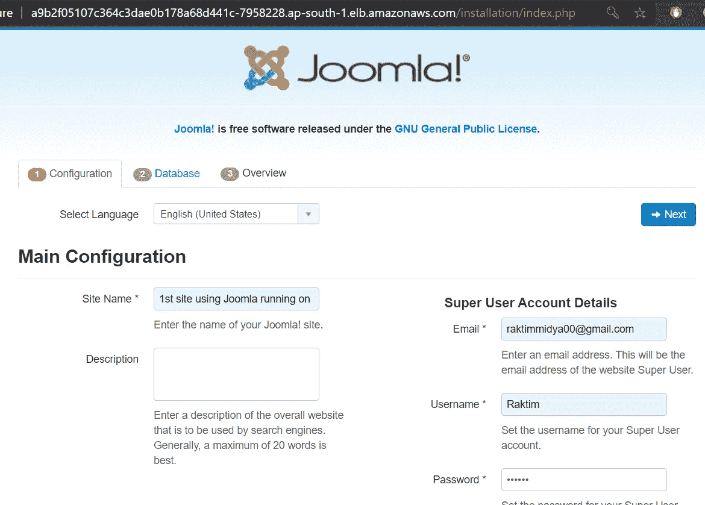

在下一页中，我们必须设置数据库详细信息。在主机名中键入“joomla-mysql ”,因为这是我们的 mysql 部署的名称。接下来，在用户名中键入“root”。您也可以在数据库中创建一个用户，但为此您必须在 MySQL 部署文件上多写几行。在密码中，给出您存储在秘密文件中密码。在数据库名称中输入“joomla ”,它将创建一个名为 joomla 的数据库。

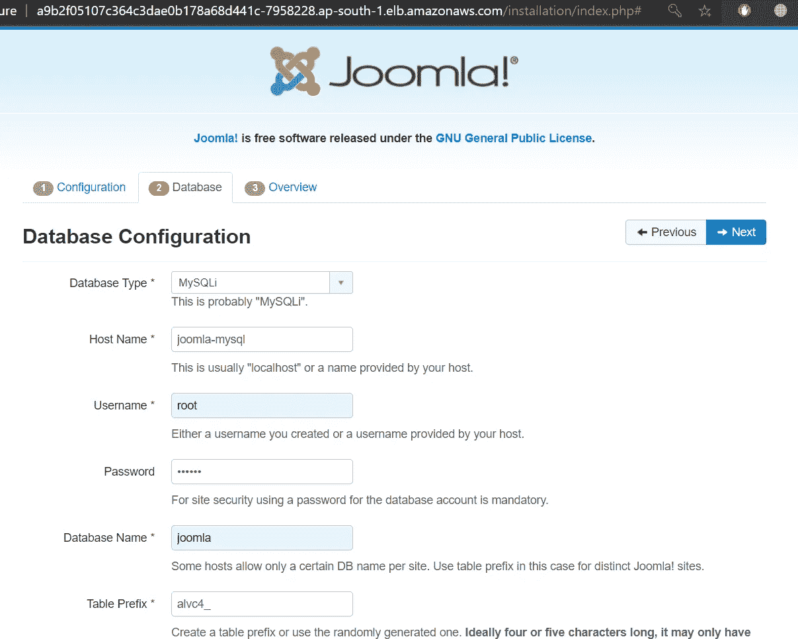

最后运行安装程序，几秒钟后你的网络应用就可以使用了。接下来，您将看到一个登录屏幕，只需登录，您将看到下面给出的这种页面。

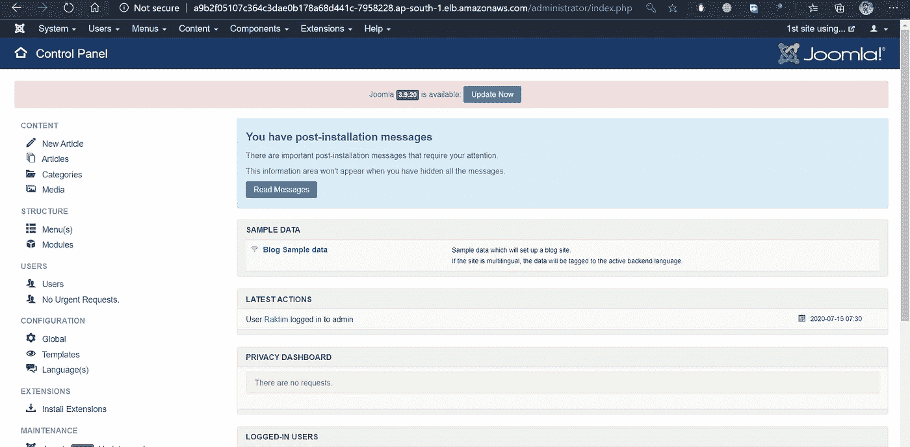

# 部署普罗米修斯…

## 先决条件:

*   你需要有舵和舵程序安装在你的系统上。在部署普罗米修斯之前，我们要设置舵和舵杆。

## 设置舵:

你只需要运行 3 CMD 来设置舵。下面提到了这些命令。

```
helm inithelm repo add stable [https://kubernetes-charts.storage.googleapis.com/](https://kubernetes-charts.storage.googleapis.com/)helm repo update
```

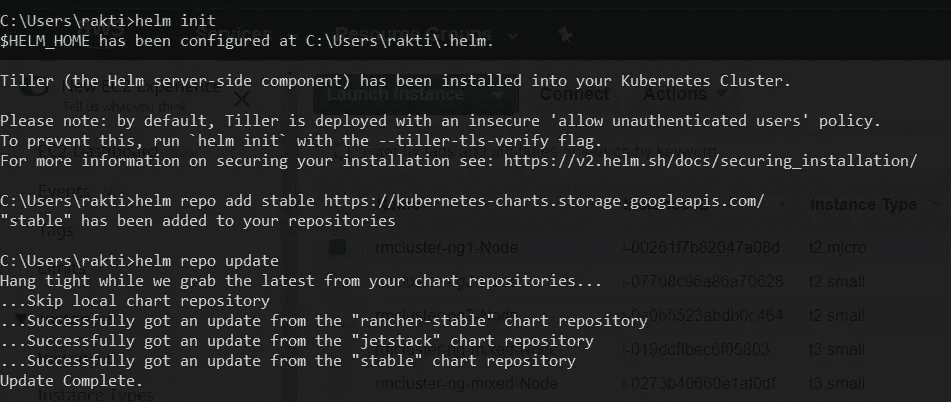

## 设置舵杆:

这里我们也要运行几个命令。这将为 tiller 创建一个服务帐户，以便 tiller 可以部署我们所需的资源，如 pod、pvc 等。cmd 如下所述。

```
kubectl -n kube-system create serviceaccount tillerkubectl create clusterrolebinding tiller — clusterrole cluster-admin — serviceaccount=kube-system:tillerhelm init — service-account tillerhelm init — service-account tiller --upgrade
```

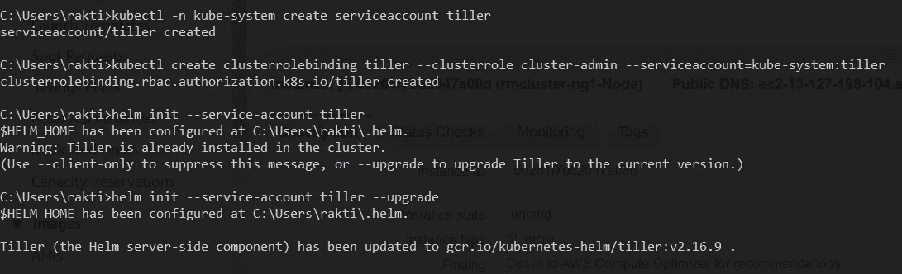

## 普罗米修斯使用头盔展开:

现在我们可以使用头盔轻松部署普罗米修斯。因此，这里我们运行三个命令来部署 Prometheus。第一个是为 Prometheus 创建一个名称空间，然后部署下一个名称空间，最后一个是获取 IP one Prometheus 服务器，以便我们可以将其与 Grafana 集成。

```
kubectl create namespace prometheushelm install stable/prometheus --namespace prometheus --set alertmanager.persistentVolume.storageClass=”gp2" --set server.persistentVolume.storageClass=”gp2"kubectl get svc -n prometheus
```

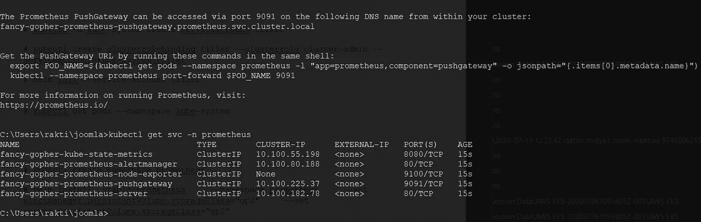

所以，最后你会看到普罗米修斯已经成功部署。

# 部署和设置 Grafana…

## Grafana 使用头盔展开:

与我们为普罗米修斯所做的一样，这里我们也将运行 3 个命令。

```
kubectl create namespace grafanahelm install stable/grafana --namespace grafana --set persistence.storageClassName=”gp2" --set adminPassword=grafana --set service.type=LoadBalancerkubectl get svc -n grafana
```

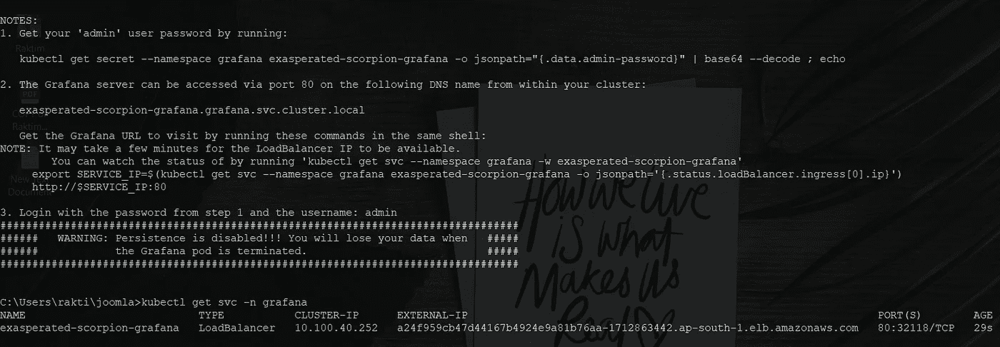

有一点需要注意，在 Grafana 中，默认登录用户名是“admin”。在运行 grafana 的 helm cmd 时，我们将管理员帐户密码设置为“Grafana”。你想怎么设置都可以。接下来，我们获得外部 IP，现在让我们转到这个 IP 来探索 Grafana。

## 设置 Grafana:

第一次登录 Grafana，登录后你会发现一个名为数据资源的选项。点击并选择普罗米修斯。现在我们必须提供 Prometheus 服务器的主机地址。所以，这里给出普罗米修斯服务器的 IP 地址并保存它。

下面我展示了截图。

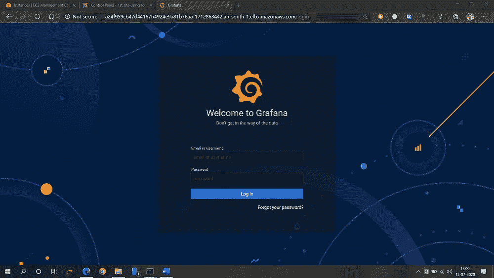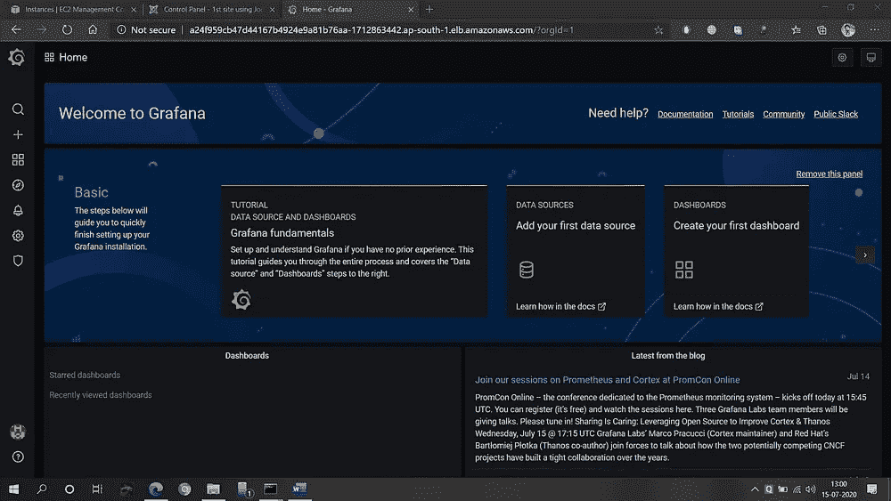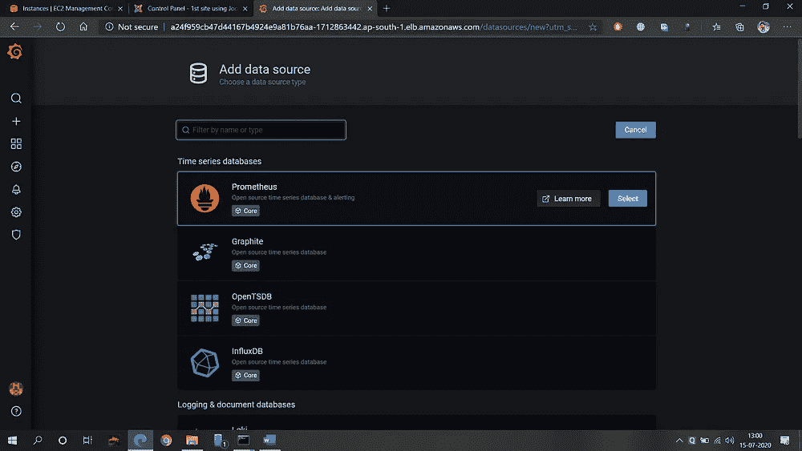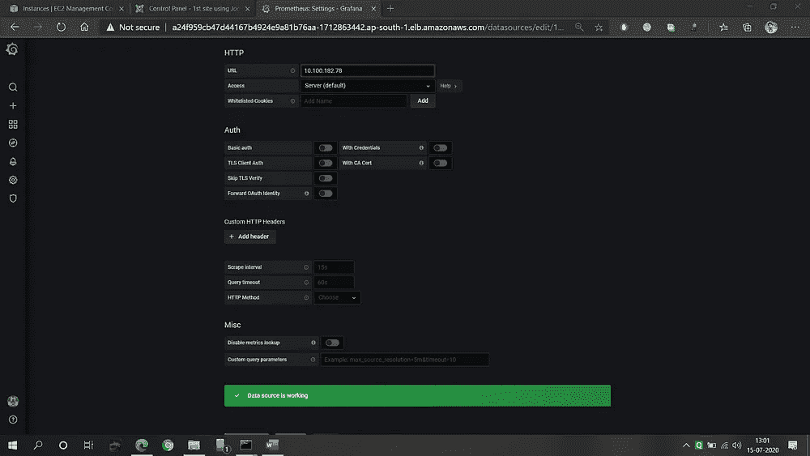

接下来，单击左侧的加号图标(+)，然后单击导入。接下来给出值“10000”。实际上，这是为 Kubernetes 多节点集群预先创建的控制面板。接下来选择普罗米修斯，然后点击导入。然后，您将能够看到对 Kubernetes 所有集群和一切的完整监控。

下面是截图，仅供参考。

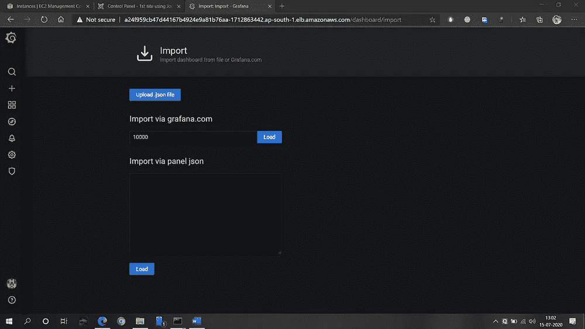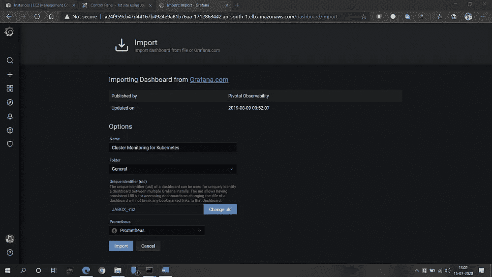

## 所以，终于完成了。这就是任务。

# 现在，我将向你展示我们可以多么容易地完全摧毁完整的任务…

让我们摧毁我们所有的部署意味着让我们摧毁 Joomla，MySQL，Prometheus 和 Grafana。

为了摧毁 Joomla 和 MySQL，我们将运行 3 个命令。实际上第一个 CMD 就足够删除 Joomla 和 MySQL 了。但是我们也会删除 pvc 和 secrets。cmd 如下所述。

```
kubectl delete all --allkubectl delete pvc --allkubectl delete secrets (secret name)
```

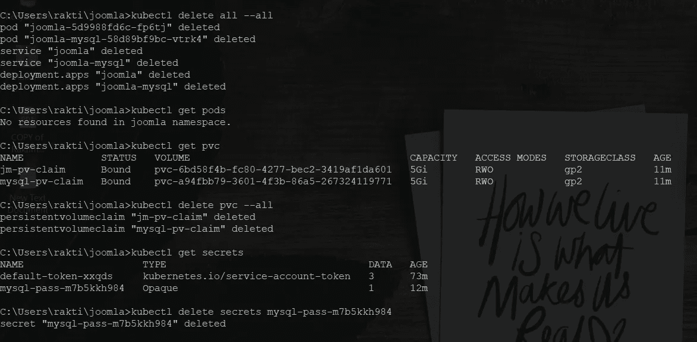

接下来，我们为普罗米修斯和格拉夫纳使用头盔，所以我们不需要手动删除一切。只有两个命令，一切都会被摧毁。

```
helm listhelm del (name of your deployment) --purge
```


## 现在，让我们删除完整的 EKS 集群:

我们只需要运行一个 CMD，整个群集就会被销毁。

```
kubectl delete cluster -f cluster.yml
```

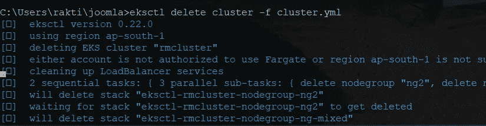

现在，如果您在 AWS 上看到云的形成，您会看到它启动了删除过程。

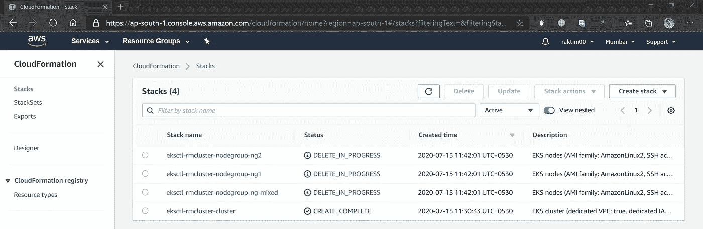

好了，谢谢大家的阅读。我真的很喜欢做这个任务。暂时停止。拜拜👋…

