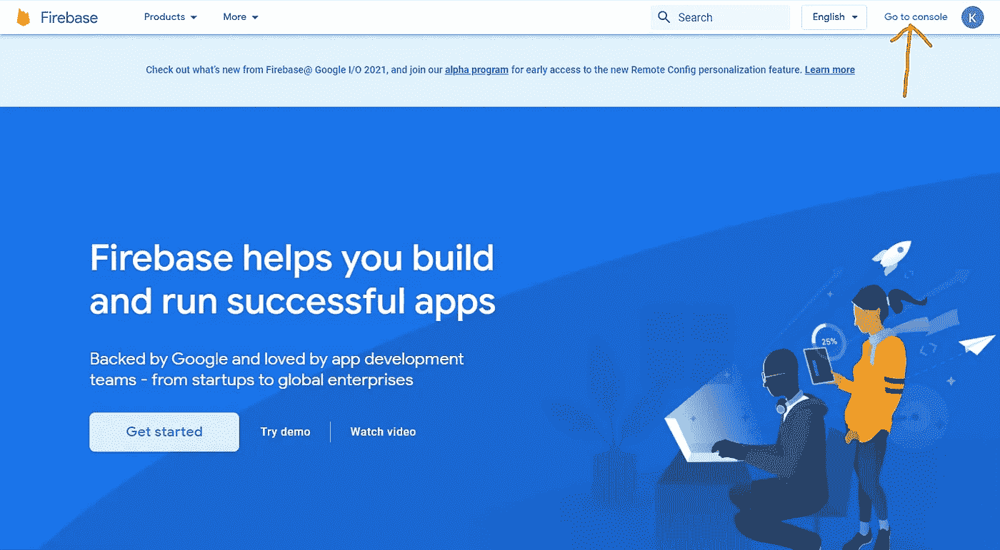
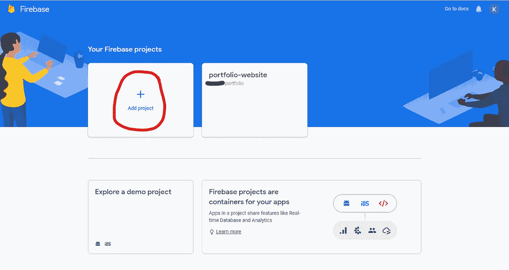
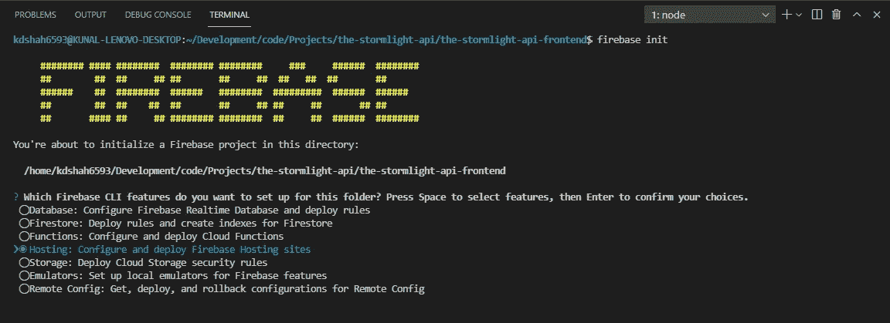
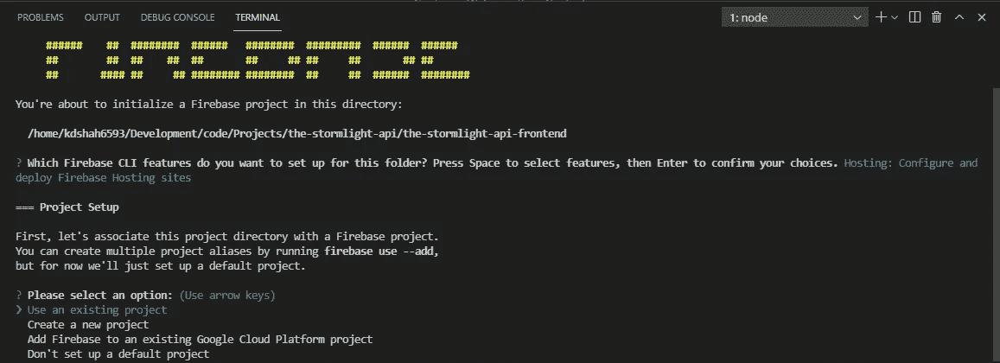
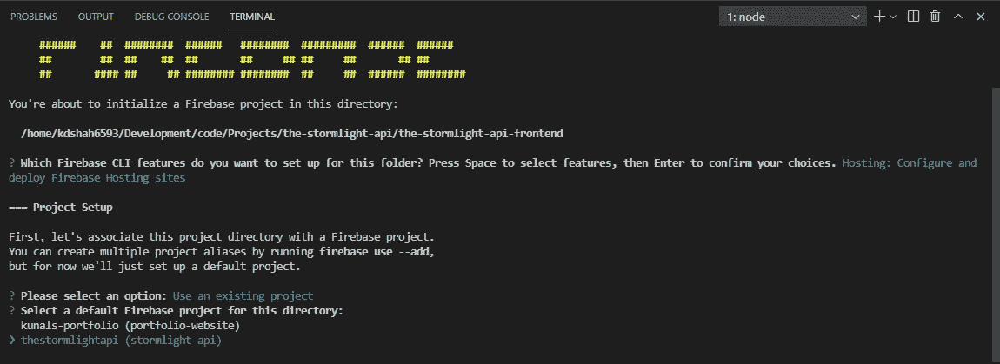
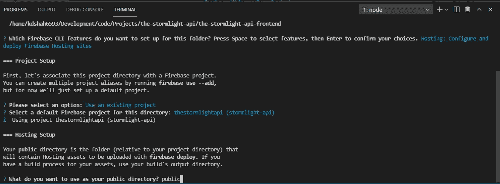
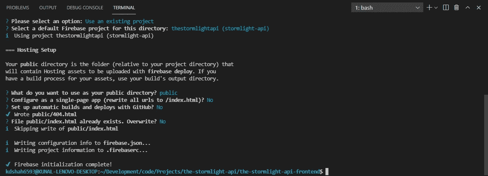

# 将您的 GatsbyJS 或 Create-React-App 站点部署到 Firebase

> 原文：<https://medium.com/nerd-for-tech/deploying-your-gatsbyjs-or-create-react-app-site-to-firebase-cfe3671073cf?source=collection_archive---------18----------------------->

您刚刚完成了网站、web 应用程序、前端等的构建，现在您想使用 Google 的 Firebase 来部署它。下面的说明是给盖茨比的。如果您正在使用 Create React App，请滚动到底部查看不同之处。

# 设置 Firebase 帐户和 Firebase 项目

1.  如果你还没有，在 Firebase 上创建一个帐户(如果你有一个 Google 帐户，那么你可以用它自动登录)。

2.然后，您需要点击窗口右上角的**转到控制台**



3.点击**添加项目**平铺



4.为您的项目命名。

补充说明:firebase 网站的 URL 是[http://website-name . web . app .](http://website-name.web.app.)如果你想编辑“网站名称”，使其与 Firebase 生成的内容不同，请确保点击下面的小椭圆(黄色箭头)，一旦你键入项目名称，就会生成该内容。

*   Firebase 将此称为项目 ID——项目的全局唯一标识符。
*   这将允许你编辑你想要的“网站名称”。
*   如果您已经有了一个自定义的域 URL，那么您可以在项目设置完成后使用它。
*   点击“继续”后，您将无法更改项目 ID。


5.选择是否为您的站点启用 Google Analytics，然后单击继续。如果您选择启用此功能，下一个屏幕将询问您使用哪个帐户。我只需选择 Firebase 的默认账户**。**

然后点击**创建项目**


# 在您站点的目录中设置 Firebase CLI

1.  打开您的终端并全局安装 Firebase CLI

```
npm install -g firebase-tools
```

2.安装后，连接您的 Firebase 帐户

```
firebase login
```

这将询问您 Firebase 是否可以收集使用情况或错误报告' *y'* 或' *n* '(我选择了 no)。然后它会打开一个谷歌登录页面。选择您的帐户以允许 Firebase CLI 访问您的帐户。如果它连接，您将看到一个成功连接的屏幕。此外，在终端中，您应该会看到一条消息，显示**成功**！**以您的[email]@email.com 身份登录**

3.导航到项目的根目录，并在中初始化 firebase

```
firebase init
```

4.它将询问"**您希望为此文件夹设置哪些 Firebase CLI 功能？**“按向下箭头键，直到“**托管:配置和部署 Firebase 托管站点**”选项以蓝色突出显示。按空格键选择它，然后按 Enter 键



5.然后，它将为您提供将项目目录与 Firebase 项目相关联的选项。使用向上和向下箭头键突出显示“**使用现有项目**”，然后按回车键。



6.您应该会看到 Firebase 项目的列表。使用向上和向下箭头键选择之前在上面创建的选项，然后按 Enter 键



7.它会问"**你想用什么作为你的公共目录？**"键入' **public** '并按回车键



8.是否配置为单页应用程序，键入' **n** '并按回车键

9.如果要求覆盖任何内容，键入' **n** '并按回车键

10.如果要求用 GitHub 设置自动构建和部署，现在输入' **n** '。(这可以在以后更改)



11.然后将您的所有更改提交到您的存储库中

```
git add .
git commit -m "Initialized Firebase"
git push
```

# 将您的站点部署到 Firebase

1.  当您的 Gatsby 站点准备好进行部署时，运行以下命令

```
gatsby clean
gatsby build
firebase deploy --only hosting
```

2.如果你正在使用 Create-React-App，操作说明是非常相似的，所以请按照“在你的站点目录中设置 Firebase CLI”中的步骤 7 进行操作。然后注意下面的差异:

*   不要把你的公共目录叫做' public '，而是写成' **build** '。
*   如果您计划使用客户端路由，则将单页应用问题设置为' **y** '而不是' n '。
*   最后，在`firebase.json`文件中，您需要为`service-worker.js`文件设置适当的 HTTP 缓存头，否则您将无法看到第一次部署后的更改。在`"hosting"`键中添加以下代码:

```
{
  "hosting": {
    ...
    "headers": [
      {"source": "/service-worker.js", "headers": [{"key": "Cache-Control", "value": "no-cache"}]}
    ]
    ...
```

然后，您可以运行生产构建和部署。

```
npm run build // or yarn buildfirebase deploy --only hosting
```

恭喜你。您的站点已正式部署。你的终端应该显示一个“主机 URL ”,这样你就可以导航到你的站点。

编码快乐！