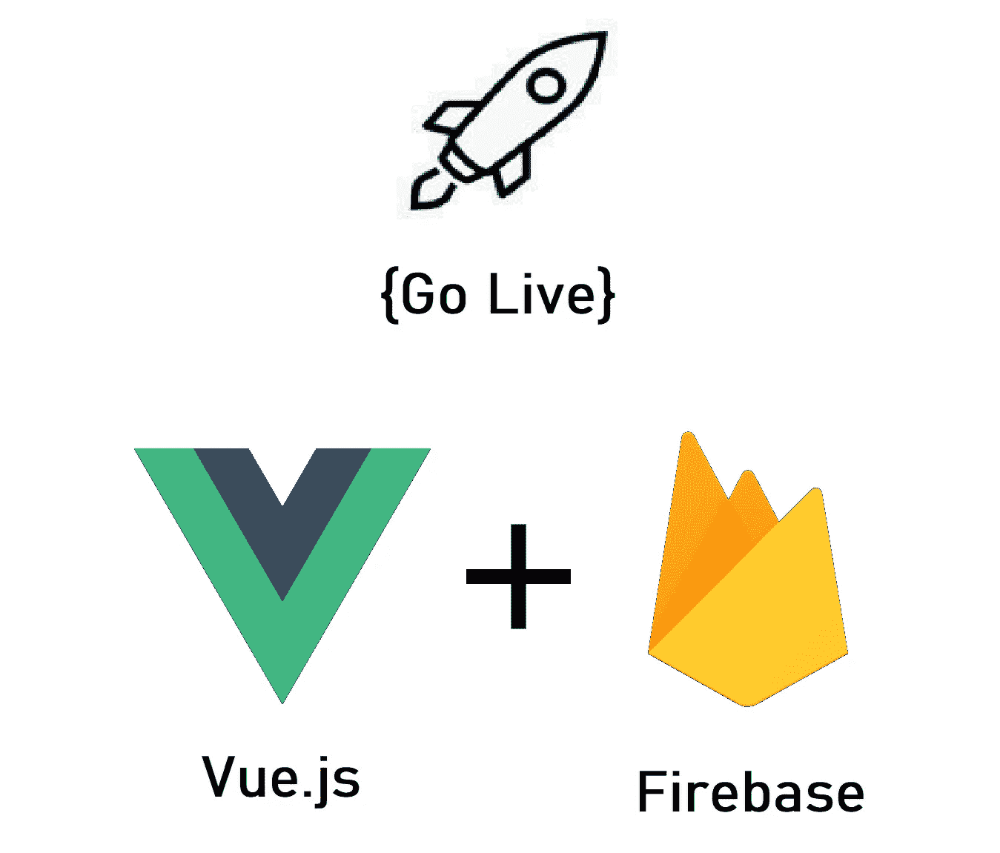
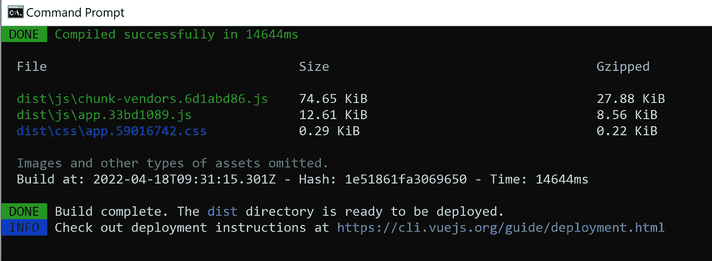
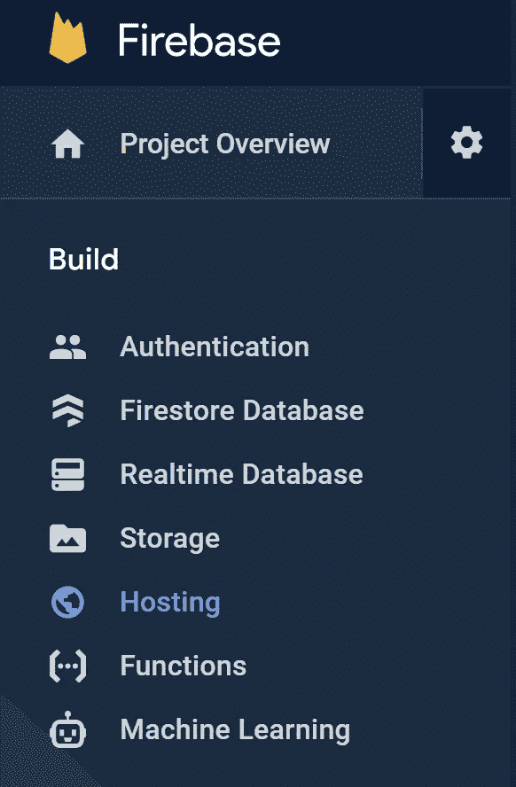
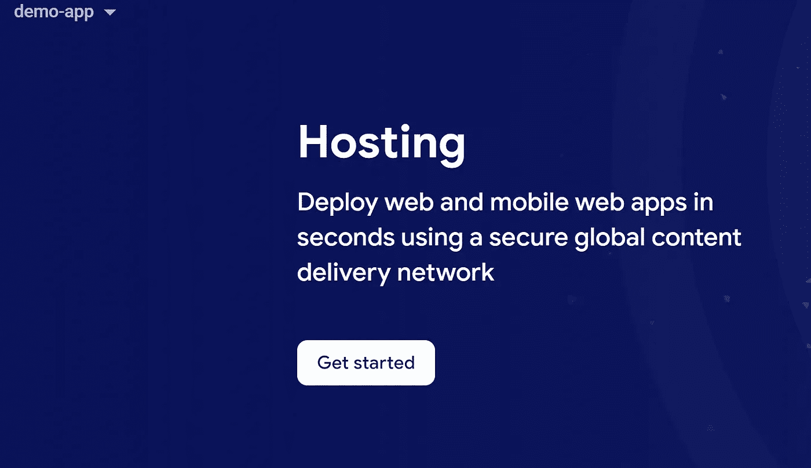
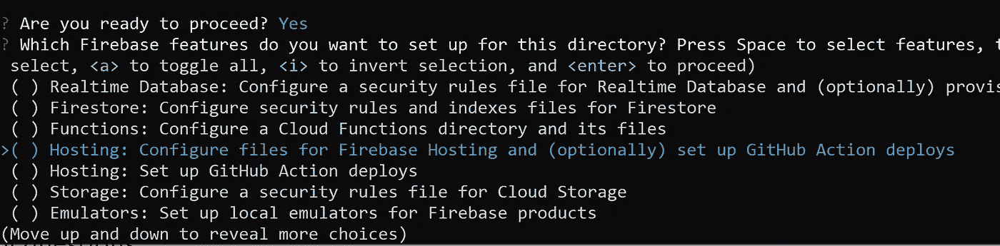
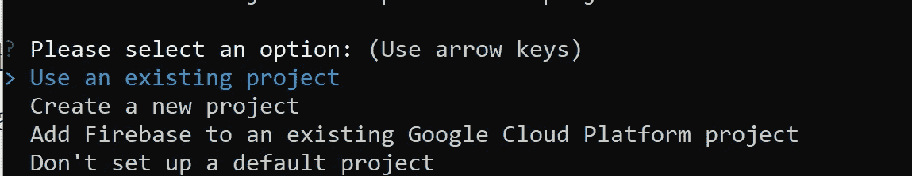
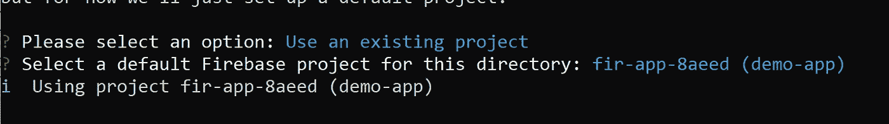
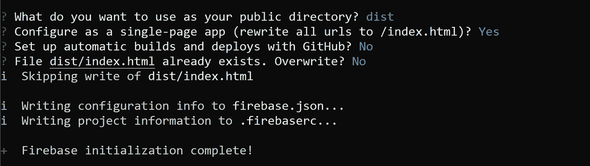
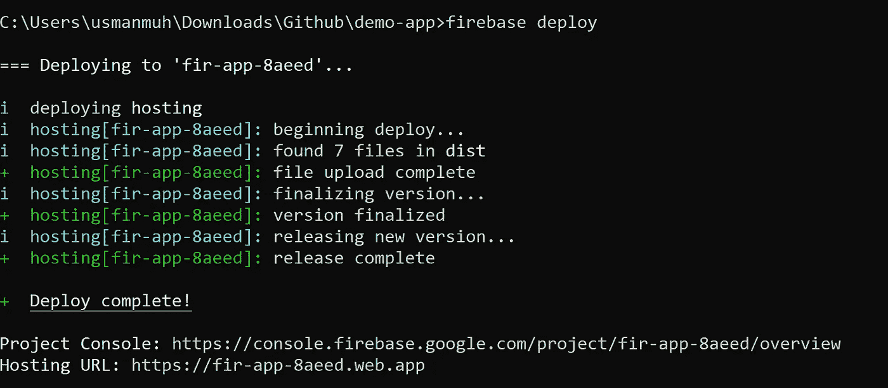
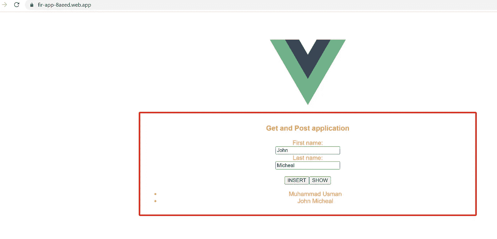

# 使用 Firebase 部署/托管 Vue.js 应用程序

> 原文：<https://medium.com/nerd-for-tech/deployment-hosting-of-vue-app-using-firebase-20d2f6a6819b?source=collection_archive---------2----------------------->

想要实时部署或托管您的应用程序？你不知道 DevOps 工程公司吗？放心吧！您可以使用 Firebase 在 10 分钟内部署或托管您的应用程序。



> Firebase 托管为您的 web 应用程序、静态和动态内容以及微服务提供快速、安全的托管。
> 
> Firebase Hosting 是面向开发者的生产级 web 内容托管。只需一个命令，您就可以快速部署 web 应用，并向全球 CDN(内容交付网络)提供静态和动态内容。您还可以将 Firebase 托管与云功能或云运行配对，以在 Firebase 上构建和托管微服务。
> 参考:[https://firebase.google.com/docs/hosting](https://firebase.google.com/docs/hosting)

这是我上一篇文章《 [***Vue.js 遇上 Firebase:不写后端*** 如何开发一个应用？](https://betterprogramming.pub/vue-js-firebase-how-to-develop-a-app-without-writing-backend-11f9de6f76bc)即发表在 [***更好的编程***](https://medium.com/better-programming) ***。*** 这个博客的目的是让我们的应用程序现场托管！本专栏的成果是使用 Firebase 部署我们的应用程序。读者将获得应用程序如何部署的实验性知识，并投入使用。

这篇文章可以用来托管任何应用框架，无论是 Angular、Vue 还是 React to Firebase。这里，我正在使用我在上一篇博客中开发的应用程序。所以，是 Vue.js app。

**参考** : [*Vue.js 遇上 Firebase:不写后端如何开发一个应用*？](https://betterprogramming.pub/vue-js-firebase-how-to-develop-a-app-without-writing-backend-11f9de6f76bc)

如果一个项目是用 Vue CLI 创建的，它被认为是复杂的项目，因为它有许多配置文件、组件等。第一步是在部署之前优化我们的项目。' ***build*** '命令自动优化代码，稍后使用这些文件进行部署。

您可以检查您的' *package.json'* 文件，其中包含由 serve、build 和 lint 关键字组成的' *scripts* ' JSON 对象。到目前为止，我们使用' *serve* 命令来运行项目。为了执行“*构建*，使用构建脚本。

## 构建项目

打开终端，确保你在项目目录中。运行下面的命令。成功构建项目后，您会在控制台上得到如图 1 所示的输出。

```
$ npm run build
```



图 1:构建命令的控制台输出

一旦构建过程完成，它将创建一个由 HTML 文件、CSS 和 JS 文件夹组成的' *dist* '文件夹。这个文件夹包含我们的浏览器可以理解的应用程序的优化/最小代码。不要改变“*区*文件夹中的任何东西。

## 建立燃烧基地

1.  在浏览器上打开 Firebase，【https://console.firebase.google.com】的*。*
2.  点击左侧面板中' ***下的' ***托管*** '选项，如图-2 所示。***



图 2:在 Firebase 中开发面板

它打开了图 3 所示的视图。点击**按钮*进入*按钮**。



图 3:初始主机视图

在 Firebase 上托管应用程序可以分三步完成:

> **1。安装 Firebase CLI:** 运行以下命令。该命令将在您的系统上全局安装 Firebase 工具，稍后我们将使用该工具上传我们的项目。

```
npm install -g firebase-tools
```

> **2。** **初始化您的项目:** 初始化步骤还需要两步，
> 
> **a .登录 Google** :运行下面的命令，它会将你重定向到浏览器，获取 Firebase 使用你的 Google 帐户的访问权限。

```
firebase login
```

> **b .启动您的项目:**使用 Google 帐户成功完成身份验证后，运行下面的命令来初始化 Firebase。

```
firebase init
```

> 它会问一些问题，比如你想使用哪种服务。如图 4 所示选择主机。



图 4:从 firebase CLI 中选择主机

> 下一个问题与项目有关。选择现有项目，如图 5 所示。



图 5:选择项目选项

> 然后从 Firebase 中选择哪个项目。如图 6 所示，请适当选择。



图 6:选择项目名称

> 公共目录问题中的 type **dist** 配置为单页 app，不需要自动构建和部署，也不需要覆盖，如图-7 所示。Firebase 初始化完成。



图 7:完成初始化步骤

> 3.**部署到 Firebase 主机:** 准备好之后，部署您的 web 应用程序。然后，从应用程序的根目录运行以下命令:

```
$ firebase deploy
```

> 一旦部署过程完成，它会在控制台上显示主机 URL，如图 8 所示。



图 8:部署完成

> 复制此主机 URL 并在浏览器上打开它。您的应用程序是托管在浏览器上的，如图 9 所示。



图 9:互联网上的实时应用

感谢您阅读这篇文章，现在您已经很好地了解了如何在 Firebase 上部署/托管 web 应用程序。