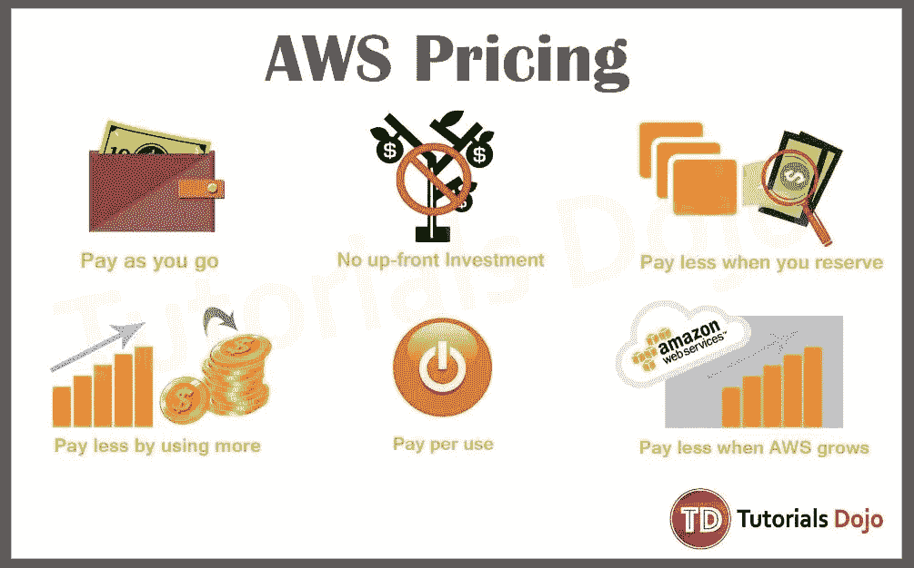

# 描述 AWS 定价模型。

> 原文：<https://medium.com/nerd-for-tech/describe-aws-pricing-model-74bed324dbde?source=collection_archive---------2----------------------->

在这里，我们将详细了解 AWS 计费

*   今天，我们将从广泛的角度来看 RDS 定价模式。
*   当我们创建 RDS 实例时，我们必须根据我们的应用程序需求选择以下组件

**1。实例类型**

*   它可以是按需实例或保留实例。

**2。发动机类型**

*   我们必须根据我们的项目要求选择数据库引擎，可能是 Postgresql、Mysql、Oracle、Maria、SQL server 或 Aurora。

**3。数据库实例**

*   我们可以根据您的资源需求来选择实例玻璃，例如根据我们的应用程序需求需要多少 CPU 或多少 IO 能力。

**实例类型:**

1.  按需:(按每小时计算能力付费)

2.保留实例:这是一个折扣很大的保留实例，所以我们可以将您的实例保留一到三年，与 on 实例相比，我们可以获得巨大的折扣。

**存储:**

*   将快照备份或导出到 S3 的费用是每月存储 Gb。

**I/O(每百万次请求):**

*   我们必须为每百万次请求支付 I/O 费用，类似于其他数据库服务。

**可用区域:**

*   如果使用 **Multi-AZ** 选项启动 RDS，它将确保 RDS 自动创建主数据库(DB)实例，并将数据同步复制到不同 AZ 中的实例。当检测到故障时，Amazon RDS 会自动故障转移到备用实例，无需人工干预。
*   单个 AZ:DB 将在那个特定的 AZ 中创建和维护

**图片来源:教程道场**