# 描述统计学

> 原文：<https://medium.com/nerd-for-tech/descriptive-statistics-81c9dce06da0?source=collection_archive---------9----------------------->

描述性统计用于描述研究中数据的基本特征。它们提供了关于样本和测量的简单总结。与简单的图形分析一起，它们构成了几乎所有数据定量分析的基础。

描述性统计用于以可管理的形式呈现定量描述。在一项调查研究中，我们可能有许多衡量标准。或者我们可以用任何标准来衡量大量的人。描述性统计帮助我们以合理的方式简化大量数据。每个描述性统计将大量数据简化为一个简单的摘要。例如，考虑一个简单的数字来总结击球手在棒球比赛中的表现，即击球率。

# 什么是统计学？

统计学是一门收集数据并对其进行分析以推断人口比例(样本)的科学。换句话说，统计是解释数据，以便对人口做出预测。

**统计分支:**

统计学有两个分支。

*   描述性统计:描述性统计是描述数据的统计或测量。
*   推断统计学:使用从总体中随机抽取的数据样本来描述总体并做出推断，这称为推断统计学。

# 常用措施

1.  集中趋势测量
2.  离差(或可变性)的度量

# 集中趋势测量

集中趋势的度量是数据的一个数字摘要，通常描述数据的中心。这一数字摘要有三种类型。

1.  **均值:**均值定义为数据中所有观测值之和与观测值总数的比值。这也被称为平均。因此，平均值是一个数字，整个数据集围绕它分布。

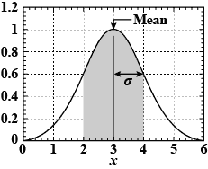

卑鄙。

1.  **中位数:**中位数是将整个数据分成相等两半的点。一半数据小于中位数，另一半数据大于中位数。中位数是通过首先按升序或降序排列数据来计算的。

*   如果观察值的数量是奇数，则中位数由排序形式的中间观察值给出。
*   如果观察值的数量是偶数，则中位数由排序形式的两个中间观察值的平均值给出。

需要注意的重要一点是，数据的顺序(升序或降序)不会影响中位数。

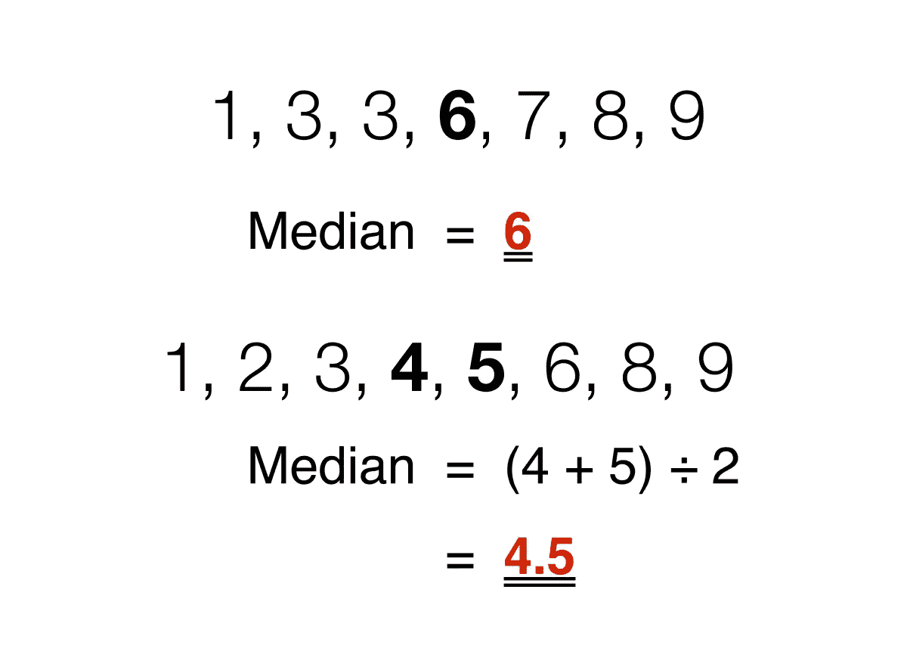

中位数

**3。** **众数:**众数是在整个数据集中出现次数最多的数，或者换句话说，众数是出现次数最多的数。数据可以有一种或多种模式。

*   如果只有一个数字出现最大次数，则数据有一种模式，称为**单峰**。
*   如果有两个数字出现的次数最多，则数据有两种模式，称为**双峰**。
*   如果有两个以上的数字出现最大次数，则数据有两种以上的模式，称为**多模式**。

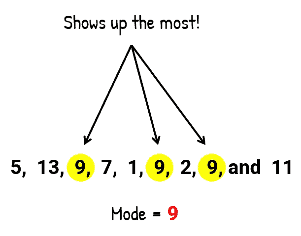

模式。

> *计算集中趋势测度的例子*

考虑以下数据点。

**17，16，21，18，15，17，21，19，11，23**

*   平均值-平均值计算如下

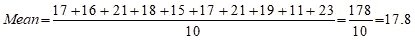

*   中位数—为了计算中位数，让我们按升序排列数据。

11, 15, 16, 17, 17, 18, 19, 21, 21, 23

由于观察次数为偶数(10)，因此中位数由两次中间观察(此处为第 5 次和第 6 次)的平均值给出。

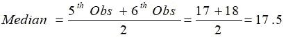

*   模式—模式由出现最大次数的数字给出。在这里，17 和 21 都出现了两次。因此，这是双峰数据，模式是 17 和 21。

*注-*

1.  由于中位数和众数并不采用所有的数据点进行计算，因此它们对于异常值是稳健的，即它们不受异常值的影响。
2.  与此同时，由于考虑了所有数据点，平均值向异常值移动。这意味着如果异常值很大，均值会高估数据，如果异常值很小，则数据会被低估。
3.  如果分布是对称的，均值=中位数=众数。正态分布就是一个例子。

# 离差(或可变性)的度量

离差的度量描述了数据围绕中心值的分布(或中心趋势的度量)

1.  **与平均值的绝对偏差** —与平均值的绝对偏差，也称为平均绝对偏差(MAD)，描述了数据集中的变化，也就是说，它给出了数据集中每个数据点的平均绝对距离。其计算方法如下

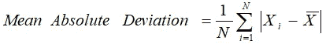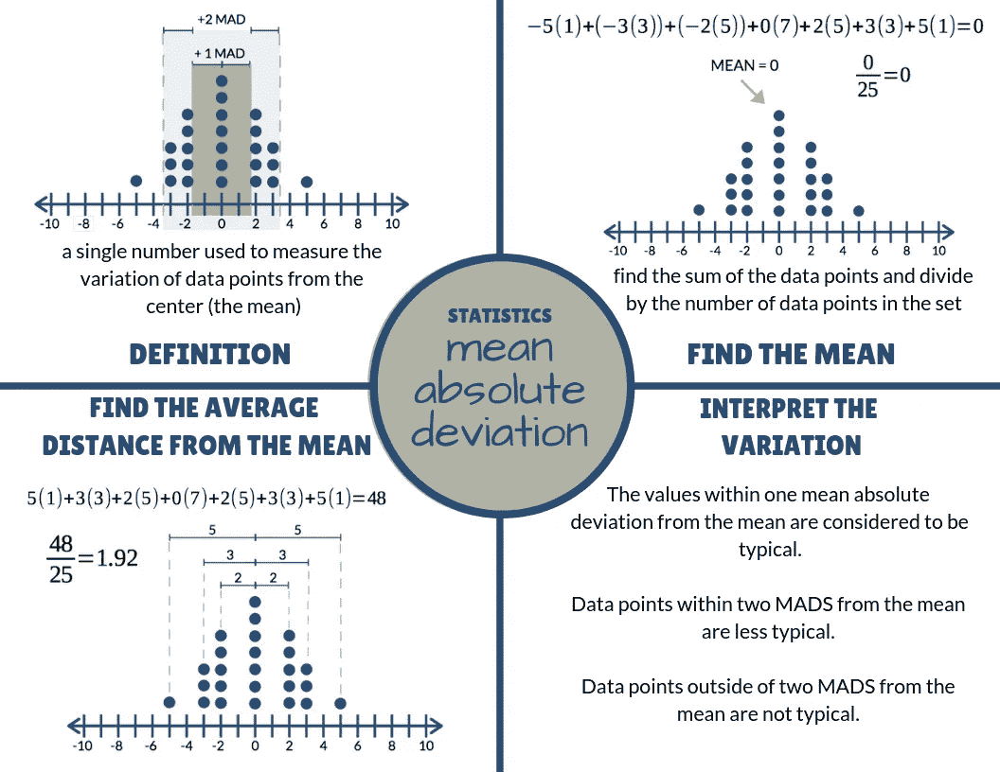

**2。方差** —方差衡量数据点偏离平均值的程度。高方差表示数据点分布广泛，而低方差表示数据点更接近数据集的平均值。其计算方法如下

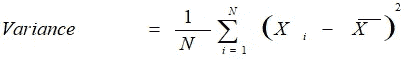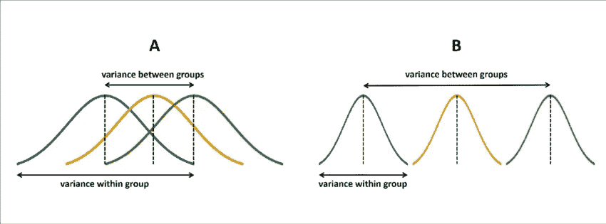

**3。标准差** —方差的平方根称为标准差。据计算

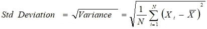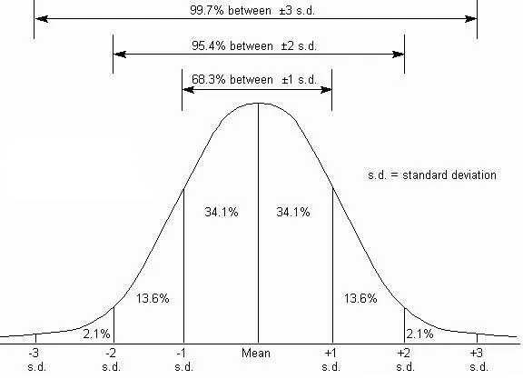

**4。范围** —范围是数据集中最大值和最小值之间的差值。它被给定为

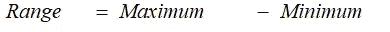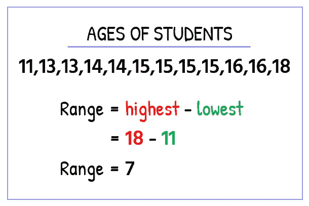

**5。四分位数** —四分位数是数据集中将数据集分成四个相等部分的点。Q1、Q2 和 Q3 是数据集的第一、第二和第三个四分位数。

*   25%的数据点低于 Q1，75%高于它。
*   50%的数据点位于 Q2 下方，50%位于其上方。Q2 不过是个中等水平。
*   75%的数据点位于 Q3 以下，25%位于 Q3 以上。

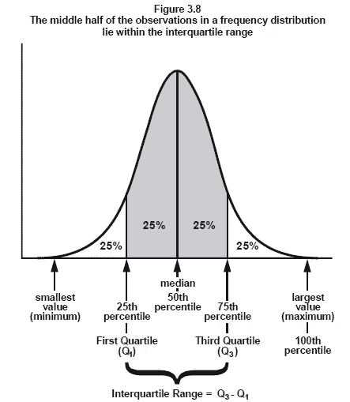

6。偏斜度 —概率分布中不对称的度量由偏斜度定义。它可以是正数、负数或未定义的。

*   **正偏斜** —曲线右侧尾部大于左侧尾部的情况。对于这些分布，平均值大于众数。
*   **负偏斜** —曲线左侧的尾部大于右侧的尾部就是这种情况。对于这些分布，平均值小于众数。

计算偏斜度最常用的方法是

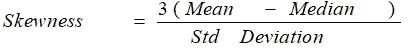

如果偏斜度为零，则分布是对称的。如果是负的，分布是负偏态的，如果是正的，分布是正偏态的。

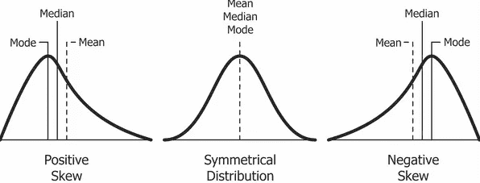

**7。峰度** —峰度描述与正态分布相比，数据是轻尾(缺少异常值)还是重尾(存在异常值)。峰度有三种:

*   **中峰度** —这是峰度为零的情况，类似于正态分布。
*   **尖峰值** —这是分布的尾部较重(存在异常值)且峰度高于正态分布的时候。
*   **Platykurtic** —这是指分布的尾部较轻(无异常值)，峰度小于正态分布的峰度。

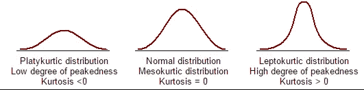

感谢阅读！！