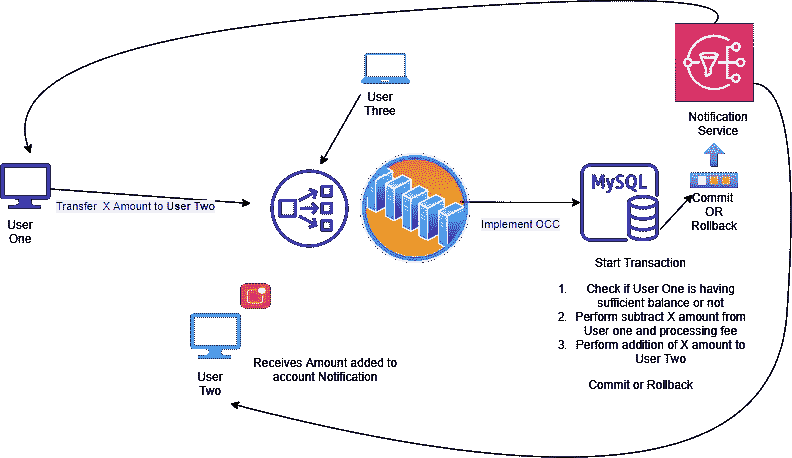
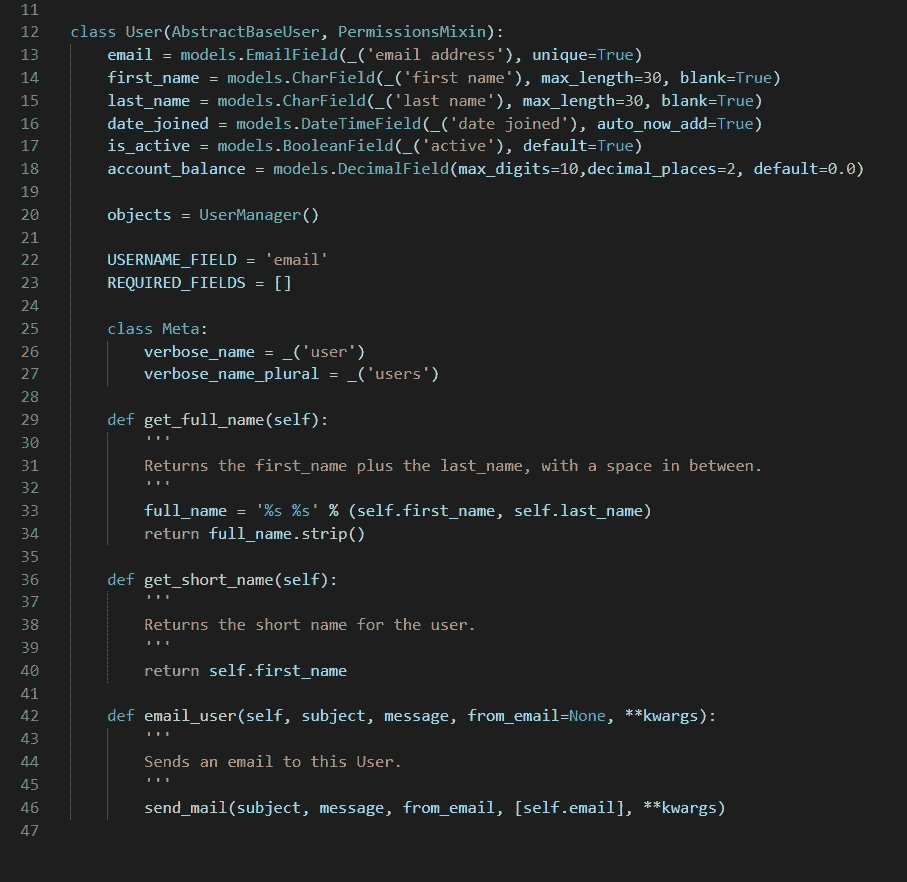
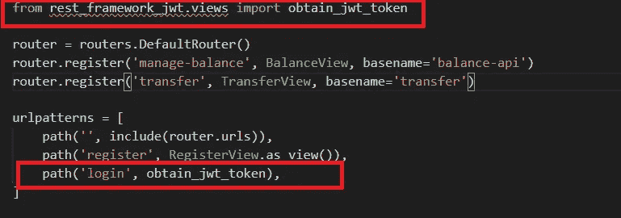
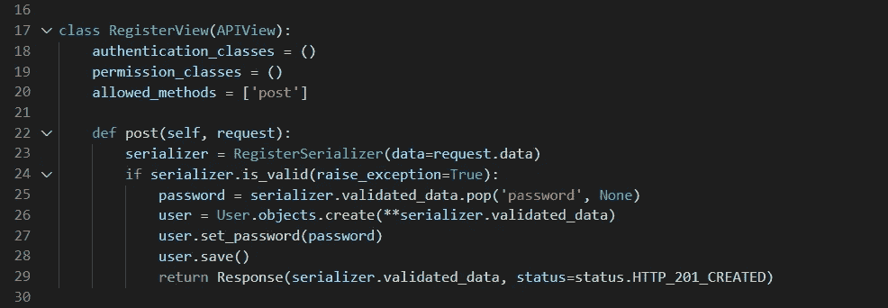
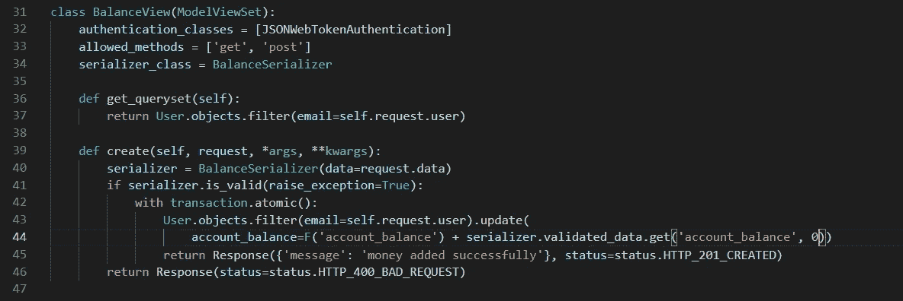
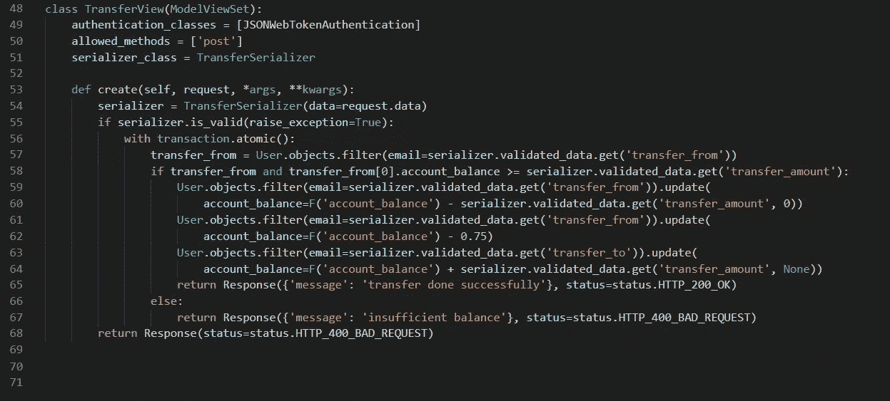

# 使用 Django Rest 框架设计一个支付系统

> 原文：<https://medium.com/nerd-for-tech/design-a-payment-system-using-django-rest-framework-bf8e36c3955?source=collection_archive---------0----------------------->

在这篇文章中，我们将使用 Django Rest 框架设计一个支付系统 API。在继续之前，我想让您了解一下 DBMS 中的 MVCC 沃尔。你也可以通过[链接](/swlh/django-and-isolation-40d28f469aa)。到现在为止，我猜你对沃尔或 MVCC 已经有了相当的了解了吧？

# 让我们来谈谈我们的建筑

这就是我们的建筑看起来的样子，它不是一个理想的建筑，但却是我们容易理解的基础建筑。在此图中，我们没有添加其他功能，如异步任务队列或缓存层等。



让我们假设，在我们的系统中有三个用户**用户一、用户二和用户三。**用户一正试图向用户二支付 X 金额。

用户一发起支付请求，它将通过负载均衡器到达我们的服务器。在数据库级别，我们将以事务组的形式执行命令。如果该组的任何命令失败，它将回滚到其先前的状态，或者特定的事务不会发生，并且用户将收到其事务的最终状态的通知。

# 让我们看看单个事务是什么样子的

当把钱从一个账户转移到另一个账户时，这些操作将被执行。

1.  检查用户 1 的账户中是否有足够的余额。如果是，那么我们将继续交易或将提出一个错误说**余额不足。**
2.  下一步是从用户一个帐户中减去 X 金额。
3.  减去我们的支付处理费示例:0.75
4.  将相同的 X 金额添加到用户二的帐户。

现在，如果我们没有遇到任何错误，那么该事务将提交到数据库，否则没有任何内容进入数据库。

# 让我们进入实现部分

在跳转到实际的代码实现之前，让我们快速总结一下我们将要开发的所有端点或者需要什么数据库等等。在这篇文章中，我们将使用 MySQL 作为数据库。

后端 API 端点

```
POST /register
POST /login
GET /balance
POST /balance
POST /transfer
```

Auth API 是公共端点，任何人都可以访问它们，而 balance 和 transfer 端点是受保护的端点，只有经过身份验证的用户才能使用它们。

## Django 用户模型

让我们保持我们的模型简单明了。我们将在用户模型本身中存储 account_balance。这是我们的用户模型的样子。我意识到我忘了在用户模型中添加 created_at & updated_at。让我们暂时忽略它，继续前进。



用户模型

## 授权 API

对于认证，我们使用一个名为[**rest _ framework _ jwt**](https://jpadilla.github.io/django-rest-framework-jwt/)**的包。**使用这个包，我们实际上不需要实现登录 API，因为它开箱即用。我们只需要导入登录视图并使用它。



登录 API

对于注册 API，我们需要编写一个 API 视图



注册 API 视图

在 auth API 之后是我们系统中最重要的部分。

## 平衡 API



平衡 API 视图集

在第 42 行，我们调用`transaction.atomic`作为上下文管理器。你可能会想，在给我们的账户增加余额时，我们为什么要使用交易？为了防止多个并发请求到达服务器时出现不一致，我们将它实现为一个事务。这个 API 将服务于两个目的，获取我们的帐户余额或添加钱到我们的帐户。

## 交易 API



在这个视图集中，我们首先检查用户帐户余额是否足够，然后启动事务并在数据库中更新它，否则返回错误作为响应。我们将 3 个操作作为单个原子事务命令来执行。它将确保原子性和耐久性。

# 包扎

我希望你是这篇文章给你一个公平的想法，实现一个服务器级的支付系统。显然，这可以进一步即兴创作。如果帖子有问题。请让我知道。如果想了解 WAL 在 python 中的基本实现。你可以在这里浏览代码提及[http://web . MIT . edu/6.033/2018/www docs/assignments/wal-sys . py](http://web.mit.edu/6.033/2018/wwwdocs/assignments/wal-sys.py)

如果你已经做到了这一步，请考虑留下你的想法或建议，我可以做些什么不同的评论。

以后还会有这类帖子的连载，敬请关注！