# 设计并创建一个 AWS 三层架构

> 原文：<https://medium.com/nerd-for-tech/design-and-create-an-aws-three-tier-architecture-9f85c9402ae6?source=collection_archive---------0----------------------->

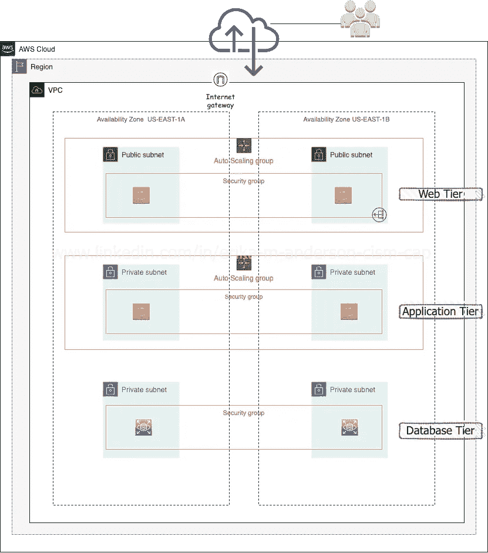

**简单来说什么是三层架构，有什么好处？**

表示层是用户界面，在这里结果被转换成用户可以理解的东西。应用层是处理数据的地方。应用层也称为逻辑层，因为它执行计算并做出逻辑决策。数据层是存储应用程序层中正在处理的信息的地方，可以从该层检索数据，将数据传递回应用程序层，最终返回给用户。三层架构可以提供改进的可伸缩性、可靠性和安全性。

**前言:**

这是我正在做的一个项目，是为了提升科技领域的[](https://www.linkedin.com/company/level-up-in-tech/)**，*如果你想学习一套新技能，掸去旧技能的灰尘，过渡到云端，或者只是简单地学习一些新东西，看看它们。点击上面的技术中的*升级，在 LinkedIn 上关注并联系他们。**

*要完成这个项目，你必须至少具备 AWS 的基础知识，一个 AWS 帐户，访问终端，以及一些 linux 知识，网络和研究能力😉。为了让自己更好地理解项目、层的目的等——我单独构建了层。*

***项目要求:***

****Web 层****

1.  *2 个公共子网*
2.  *自动扩展组中至少有 2 个 EC2 实例，带有您选择的操作系统(自由层)。*
3.  *EC2 Web 服务器安全组允许来自 internet 的入站权限。*
4.  *引导静态网页或创建一个已经包含静态网页的自定义 AMI。*
5.  *创建一个公共路由表，并将两个公共子网关联起来。*

****应用层****

1.  *2 个私有子网*
2.  *自动扩展组中至少有 2 个 EC2 实例，带有您选择的操作系统(自由层)。*
3.  *EC2 应用程序服务器安全组允许来自 Web 服务器安全组的入站权限。*
4.  *与私有路由表相关联。
    注意:这不是一个真正的应用层，因为我们没有提供任何代码在 EC2 实例上运行。*

****数据库层****

1.  *使用免费的 MySQL RDS 数据库。*
2.  *数据库安全组应该允许来自应用服务器安全组的 MySQL 入站流量。*
3.  *2 个私有子网。*
4.  *与私有路由表相关联。
    注意:不需要使用多 AZ，但一定要记录下如何添加它*

*第一步:我创建了我的 VPC。我**只选中了 VPC，给我的 VPC 起了个名字。我将 IPv4 CIDR 闭塞无线电设置为手动输入，并将 10.10.0.0/16 分配给 IPv4 CIDR。我没有理会其他的事情，而是点击了“创建 VPC”按钮。***

*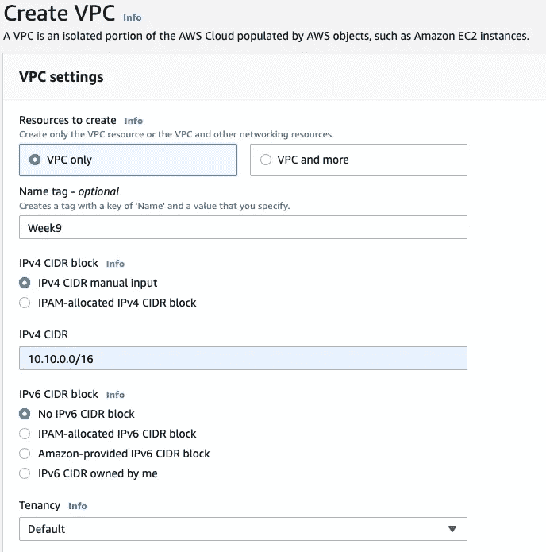*

***第二步:我创建了自己的子网。**两个公共子网和四个私有子网。我使用 US-East-1a 和 US-East-1b 作为可用性区域。每一层我都使用这些可用性区域。我还根据子网的层来命名子网。透明性:这一步我遇到了一个问题，因为我不太了解 CIDR 的预订和 CIDR 的计算。*不要评判我！我发现 AWS 在解释一切方面做得很好，所以点击[这里](https://docs.aws.amazon.com/vpc/latest/userguide/configure-subnets.html)了解更多信息。**

*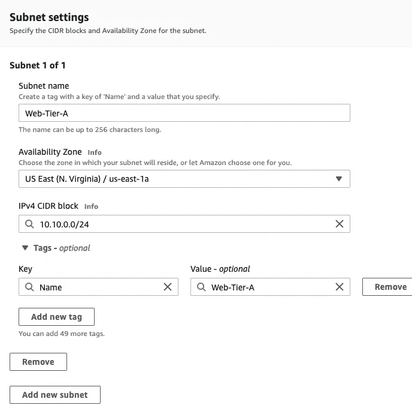**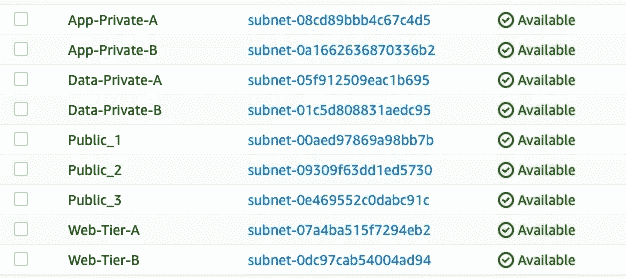*

*第三步:我创建了自己的互联网网关。我通过选择操作，连接 VPC，将我的 VPC 连接到互联网网关。*

*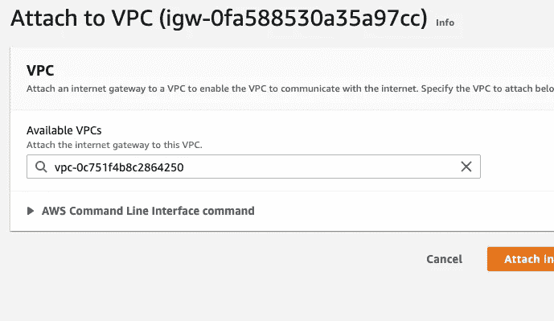*

***步骤 4:我创建了 NAT 网关并添加了路由表。**NAT 网关将允许公共访问，以允许我在私有子网上的实例连接到互联网。我还分配了弹性 IP 地址，以便在另一个实例失败时可以创建另一个实例。每一层都有自己的路由表。这些路由表将决定来自我的子网或网关的网络流量被定向到哪里。创建路由表时，请确保选择正确的 VPC。创建路由表后，我将子网与其路由表相关联。每个表都被设置为到达 internet 网关，除了应用层，在应用层我选择了 NAT 网关。*

***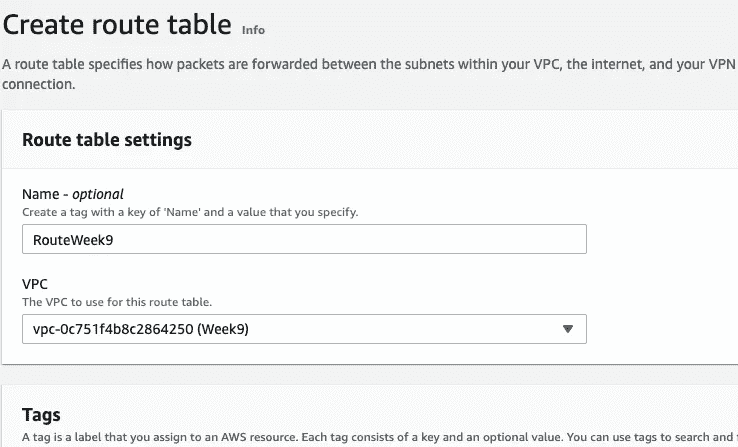**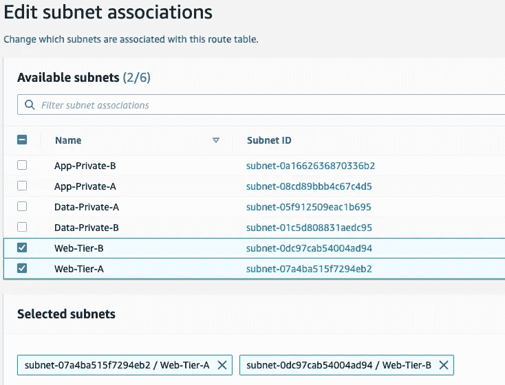**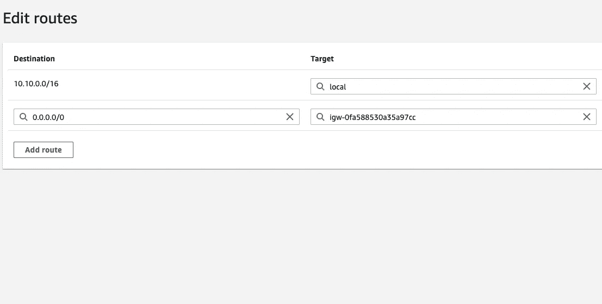*

***步骤 5:我配置了我的启动模板，然后是我的自动缩放组。**我选择了一个 Amazon Linux 2 AMI 和一个 t2.micro 实例类型，新的密钥对，创建了一个安全组，选择了我的 VPC。更详细地说，我将为我的 Apache web 服务器进行引导。对于应用层，在安全组中，我允许使用 0.0.0.0/0 的自定义 TCP 和使用自定义安全组的 SSH。我没有将引导脚本添加到应用层。对于我的自动缩放组，我选择了自己制作的模板、VPC 和子网。有关自动缩放组的更多信息，请点击[此处](https://docs.aws.amazon.com/autoscaling/ec2/userguide/auto-scaling-groups.html)和 EC2 自动缩放[此处](https://docs.aws.amazon.com/autoscaling/ec2/userguide/what-is-amazon-ec2-auto-scaling.html)。*

```
*#!/bin/bash
yum update -y
yum install -y httpd
systemctl start httpd
systemctl enable httpd*
```

*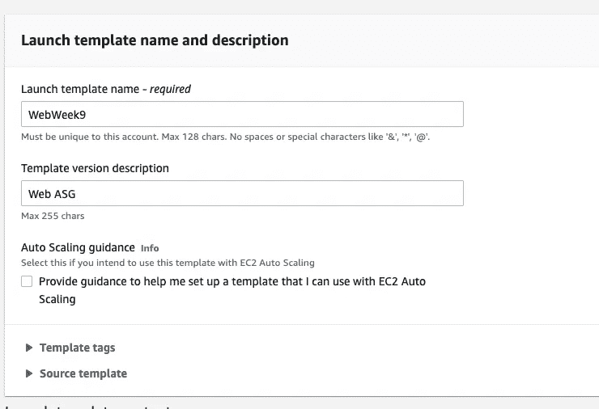**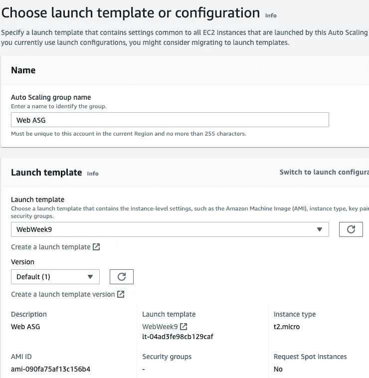**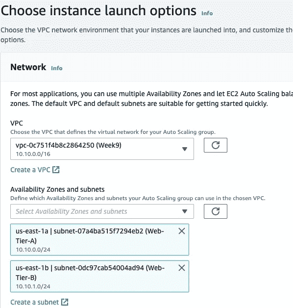**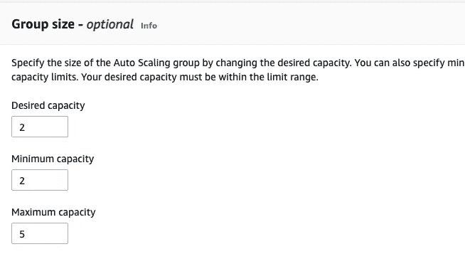*

*然后，我使用 web 层的 EC2 实例来验证它是否正常工作。*

*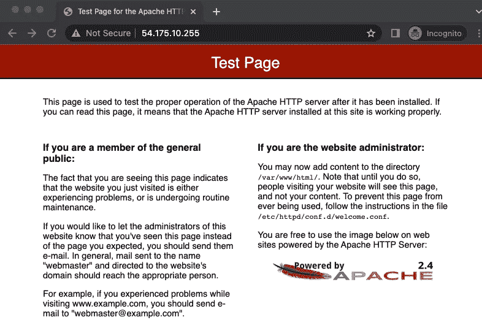*

*步骤 6:我利用 easy peasy 关系数据库服务(RDS)创建了我的数据库层。我命名了我的数据库，选择了 VPC，选择了我的可用区域和子网。然后，我为数据创建方法选择了我的 SQL 自由层选项。我保留了与其他设置类似的命名约定，并为 DB 实例标识符设置了我的主用户名和密码。*

*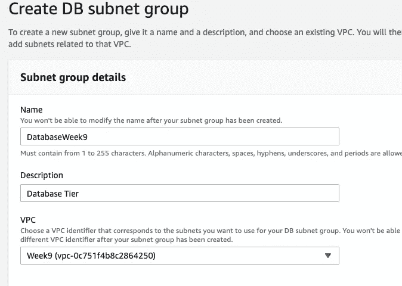**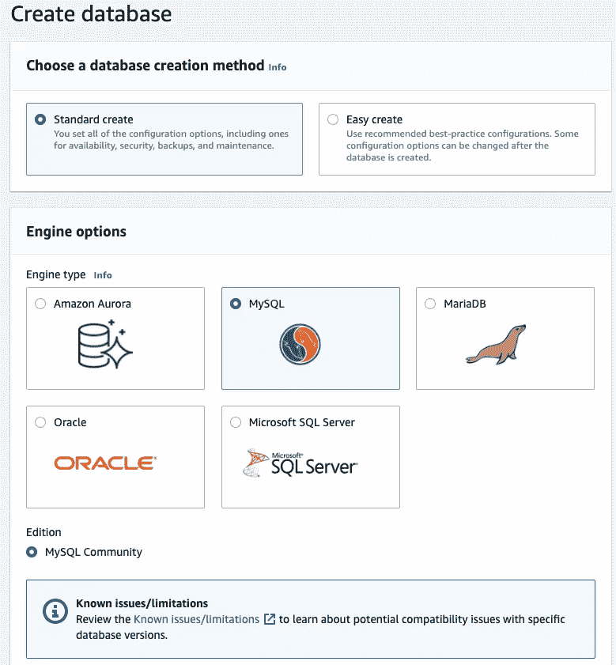**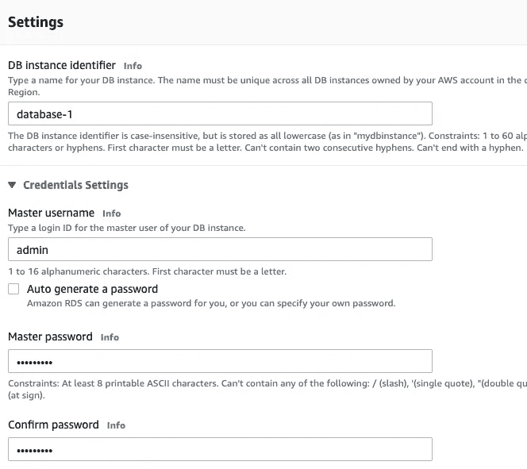*

*然后我去更新连接，所以我选择我创建的数据库，并选择编辑入站规则。然后，我删除了默认规则，并添加了端口范围 3306，这是 mySQL 协议，将用于应用层安全组。*

***第七步:我测试了我的安全性。**我使用以下命令从我的公共 web 实例 pinged 我的私有应用程序实例:*

```
*ping <ip address>*
```

> ****透明度备注****

*这个项目从字面上和比喻上都让我头疼😂。您很容易迷惑自己和/或犯错误，因为在您的三层架构启动并运行之前，有许多步骤需要考虑和完成*(我试图使本文简短)*。*

*您还应该对三层架构以及每一层的工作原理有一个坚实的理解。因此，如果你的家人或朋友不介意你向他们讲述你所学到的东西，那么一定要用他们来解释什么是三层架构及其好处。还要解释你创建它的步骤和原因。*