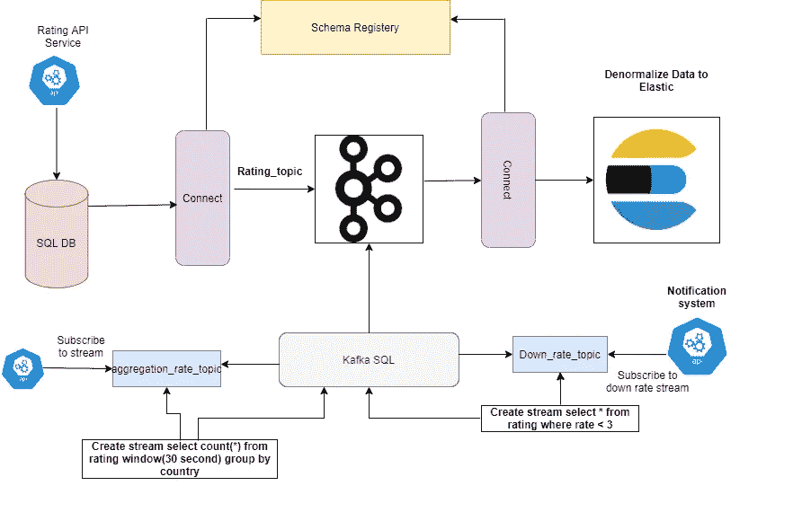

# 用 Kafka 设计流数据管道

> 原文：<https://medium.com/nerd-for-tech/design-data-pipeline-and-streaming-using-kafka-5c6fb1fdc122?source=collection_archive---------3----------------------->



> 在这篇文章中，我将解释一些数据管道用例，以及 Kafka 如何在 concpt 教授如何建立数据流管道中发挥作用。

在许多大中型项目中，您需要使用某种在不同情况下有效的数据系统，例如，您需要 SQLDB 来处理事务并保证软件中的数据一致性，您需要不同的模型来报告、用户事件和 CDC(更改数据捕获)等，您可以通过许多不同的方式来完成这项工作，例如，有些 SQLDB 系统支持实时同步(CDC ),如 Postgres 等，但在本文中，我将重点讨论 Kafka、Kafka streams 和 Kafka connect 在这种情况下的有用程度。假设我们有一个软件，如产品评级系统，我们有 SQLDB，它将客户评级存储在 SQL 结构中，另一方面，我们需要将这些数据发送到我们的报告数据系统，将用户事件发送到 Casandra DB，并记录到弹性搜索或时间序列，如 Influx DB 等，我们有不同的系统，例如通知系统，它可以监听低于 3 的用户评级，以联系他们，以及许多不同的用例。

解决这个问题的传统思路是编写某种从 SQL 到 elastic API 的数据传输应用程序，不管有没有 Kafka 等等。

**那么什么是卡夫卡？**

Kafka 本身不是本文的重点，但简而言之，Apache Kafka 是一个开源的分布式事件流平台，被数千家公司用于高性能数据管道、流分析、数据集成和任务关键型应用程序。

**为什么是卡夫卡？**

可扩展、耐用和容错的 Kafka 可以与 Spark Streaming、Storm、HBase、Flink 和 Spark 配合使用，以实时摄取、分析和处理流数据。Kafka 是一种数据流，用于供给 Hadoop BigData 湖。Kafka 经纪人支持海量信息流，以便在 Hadoop 或 Spark 中进行低延迟的后续分析。

我推荐阅读我的文章来理解卡夫卡的关键概念

 [## 理解卡夫卡的关键概念

### 首先，这篇文章是写给现在使用 Kafka 或者可能会在未来的项目中使用 Kafka 的人的…

regoo707.medium.com](https://regoo707.medium.com/understanding-kafka-key-concepts-7ba021a3c08c) 

现在，我们如何减少构建在数据系统之间传输数据的服务的工作量，正如你在顶部的设计中看到的，我使用了 Kafka connect。

**什么是卡夫卡连接？**

Kafka Connect 是一个工具，用于在 Apache Kafka 和其他数据系统之间可扩展和可靠地传输数据。它使得快速定义将大型数据集移入和移出 Kafka 的连接器变得简单。Kafka Connect 可以接收整个数据库或从所有应用服务器收集指标到 Kafka 主题中，使数据可用于低延迟的流处理。导出连接器可以将 Kafka 主题中的数据传递到二级索引(如 Elasticsearch)或批处理系统(如 Hadoop)中，以便进行离线分析。

【Kafka connect 如何工作？

您可以将 Kafka Connect 部署为在单台机器上运行作业的独立进程(例如，日志收集)，或者部署为支持整个组织的分布式、可伸缩、容错服务。Kafka Connect 提供了较低的准入门槛和较低的运营开销。您可以从用于开发和测试的独立环境开始，然后扩展到完整的生产环境，以支持大型组织的数据管道。

Kafka Connect 包括两种类型的连接器

*   **源连接器**接收整个数据库，并将表更新传输到 Kafka 主题。source connector 还可以从所有应用程序服务器收集指标，并将它们存储在 Kafka 主题中，从而使数据可用于低延迟的流处理。
*   **Sink connector** 将 Kafka 主题的数据传递到二级索引(如 Elasticsearch)或批处理系统(如 Hadoop)以进行离线分析。

正如你在上面的架构中看到的，我们使用了 SQLDB source connector，可能是 Postgres、MSSQL、MySQL 或其他，我们使用了另一个 sink connect 将数据从 Kafka 推送到 Elastic search，等等。

我们需要什么？

1-带有 zookeeper 的 Kafka 集群您可以使用 Docker 进行 POC

2- debezium Kafka 连接器在本文中，我以 Postgres 为例，所以我使用 debezium Kafka 连接器来捕获从 Postgres 到 Kafka 的数据更改(插入/更新/删除),以便稍后使用 elastic sink connect 将其发送到 elastic

3-模式注册汇合模式注册为您的元数据提供了一个服务层。它为存储和检索 Avro、JSON 模式和其他模式提供了一个 RESTful 接口。它基于指定的主题名称策略存储所有模式的版本化历史，提供多种兼容性设置，并允许根据配置的兼容性设置和对这些模式类型的扩展支持来发展模式。它提供了插入 Apache Kafka 客户端的序列化程序，这些客户端处理以任何支持的格式发送的 Kafka 消息的模式存储和检索。在本文中，我们将使用 Avro。

4- JAVA(可选)，因为我们讨论的是仅在 java Kafka 客户端上支持的流应用 Kafka-streams API，也许您会发现其他编程语言上的某种客户端支持流 API，但我不认为它像 JAVA 客户端一样强大或完整，如果我们将编写像通知系统一样的流 API，我们只使用 JAVA her。

5- KAFKA-SQL(可选)Confluent KSQL 是针对 Apache Kafka 实现实时数据处理的流式 SQL 引擎，KSQL 是可伸缩的、弹性的、容错的，并且它支持广泛的流式操作，包括数据过滤、转换、聚合、连接、窗口等等。

**卡夫卡流是什么？**

Kafka Streams 是一个用于构建流应用程序的库，特别是将输入 Kafka 主题转换为输出 Kafka 主题的应用程序(或者调用外部服务，或者更新数据库，等等)。它允许您以分布式和容错的方式用简洁的代码来实现这一点。流处理是一种计算机编程范式，相当于数据流编程、事件流处理和反应式编程，它允许一些应用程序更容易地利用有限形式的并行处理。Kafka 流支持某种无状态 API，如过滤器、映射、平面映射..另一方面支持有状态 API，如计数、窗口、分组等

因此，在运行所有组件后，我们需要使用 docker 或其他方式，我们需要做以下工作

1-在 SQL source connect 上创建作业，该作业捕获对 Kafka 的表单表的更改，为此我们将调用 connect API

```
[http://localhost:8083/connectors](http://localhost:8083/connectors) POST
{"name":"rating-system-connector","config":{"connector.class":"io.debezium.connector.postgresql.PostgresConnector","database.hostname":"localhost","database.port":"5433","database.user":"postgres","database.password":"P@ssw0rd","database.dbname":"rating_system_demo","database.server.name":"ratingserver","table.whitelist":"rating.rates","key.converter.schemas.enable":"true","key.converter": "org.apache.kafka.connect.storage.StringConverter","value.converter": "io.confluent.connect.avro.AvroConverter","value.converter.schema.registry.url": "http://schema-registry:8081","value.converter.schemas.enable": "true"}}
```

我们调用 connect API 来创建一个后台作业，并告知 connect 有关数据库连接的信息，如服务器、用户名、密码、数据库名称、表等，以及模式注册 URL 和转换器类型 AVRO，如我们之前在模式注册中所解释的。( **Avro** 是一个开源的数据序列化系统，有助于系统、编程语言和处理框架之间的数据交换。 **Avro** 帮助定义数据的二进制格式，并将其映射到您选择的编程语言)

通过创建一个作业，表中所做的每一个更改都将通过 after/before 模式推送到 Kafka，例如，如果您插入一个新记录，则在对象为 null 之后和之前将包含作为 JSON 对象结构的插入记录数据，在更新之前和之后以及删除之前等等。此外，如果您只是不时地对表单数据进行快照，例如，每隔 7 天，您可以使用合流 JDBSOURCE 连接器，在这种情况下，您也可以调用另一个连接器来创建作业

```
{"name": "jdbc_source_mysql_01","config": {"connector.class": "io.confluent.connect.jdbc.JdbcSourceConnector","connection.url": "jdbc:postgres://localhost:5432/customers","value.converter.schema.registry.url": "http://schema-registry:8081","connection.user": "root","connection.password": "P@ssw0rd","topic.prefix": "customer-events-","table.whitelist" : "customer_events","timestamp.column.name": "created_on","transforms":"createKey,extractInt","transforms.createKey.type":"org.apache.kafka.connect.transforms.ValueToKey","transforms.createKey.fields":"id","transforms.extractInt.type":"org.apache.kafka.connect.transforms.ExtractField$Key","transforms.extractInt.field":"id","mode":"bulk"}}
```

2-我们需要 sink 来连接消费来自 Kafka 的数据，并通过弹性搜索 API 或报告数据库等推送数据。调用 elastic-sink-connect 端点创建作业

```
{
 "connector.class": "io.confluent.connect.elasticsearch.ElasticsearchSinkConnector",
 "tasks.max": "1",
 "topics": "example.elasticsearch.data",
 "name": "example-elasticsearch-connector",
 "connection.url": "http://elasticsearch:9200",
 "type.name": "_doc"
}
```

我们刚刚告诉 connect 我们的弹性 API URL 和 index _doc 类型，或者可能是 log。

现在我们制作了一个数据管道系统，我们可以使用 KSQL 对流进行一些连续的查询，或者构建一个 java 流应用程序。例如，如果我们需要获得基于地区或国家或时间基础的比率计数，我们需要在 Kafka 主题之上创建一个流

```
CREATE STREAM RATES_STREAM
  (id BIGINT,
   customer_name VARCHAR,
   Country_name VARCHAR
   rate INT)
  WITH (KAFKA_TOPIC='RATES',
        VALUE_FORMAT='AVRO')
  EMIT CHANGES;
```

首先，我们从我们的主题创建了一个流，然后我们可以创建另一个流

```
CREATE STREAM RATES_COUNT AS
      SELECT COUNT(*), Country_name FROM RATES_STREAM
      GROUP BY Country_name 
      EMIT CHANGES;
```

然后你可以很容易地从流中选择

```
SELECT * FROM RATES_COUNT EMIT CHANGES;
```

或者您可以创建您的流应用程序，例如，如果我们需要使用 JAVA 中的 Kafka stream API 来捕获在我们的产品上添加低费率的客户

```
Properties config = *getConfig*();
StreamsBuilder streamsBuilder = new StreamsBuilder();
KStream<String, Rate> stream = streamsBuilder.stream("rates");
stream.peek(OrderServiceApplication::*PrintAll*)
      .filter((k,v)-> v.rate < 3)
      .peek(OrderServiceApplication::SendNotification);

Topology topology = streamsBuilder.build();
KafkaStreams streams = new KafkaStreams(topology, config);
streams.start();
```

更多..，所以我将在另一篇文章中深入解释 streams 和 KSQL 技巧

最后，我希望本文能帮助您设计流式数据管道系统。