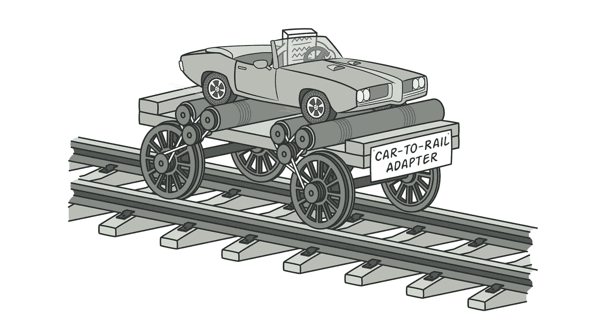
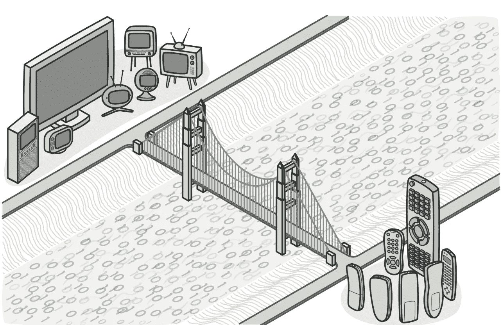
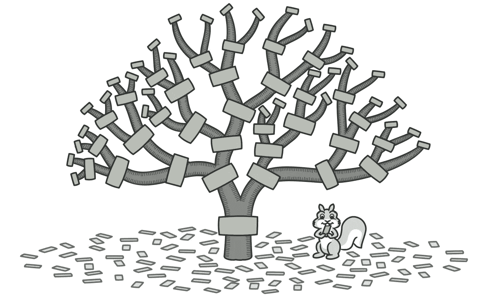
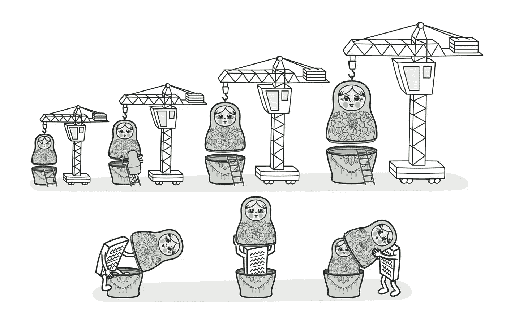
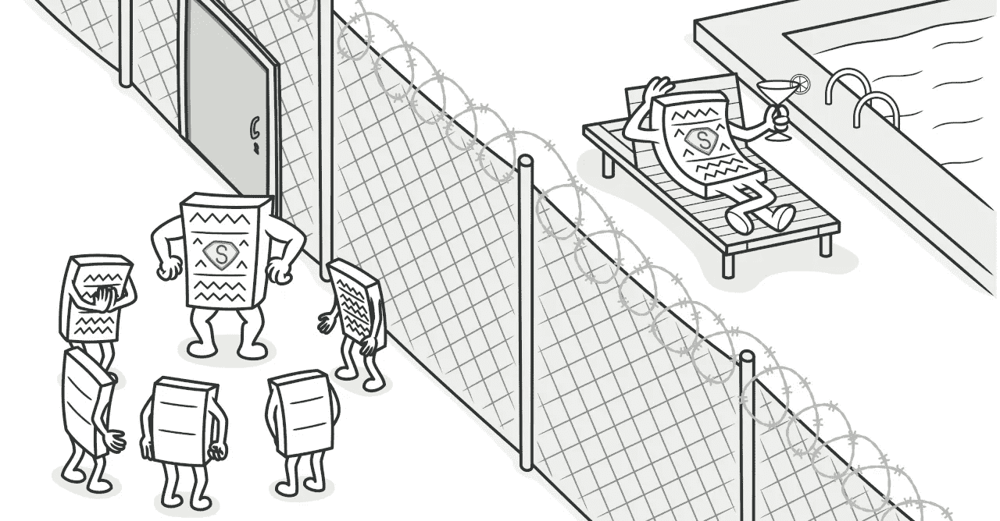
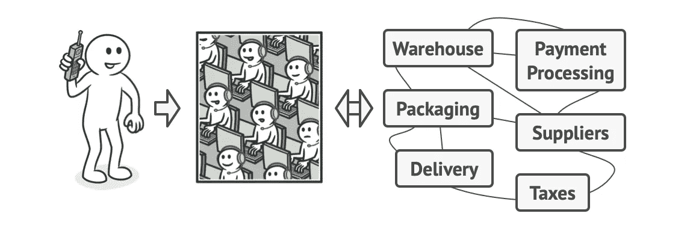
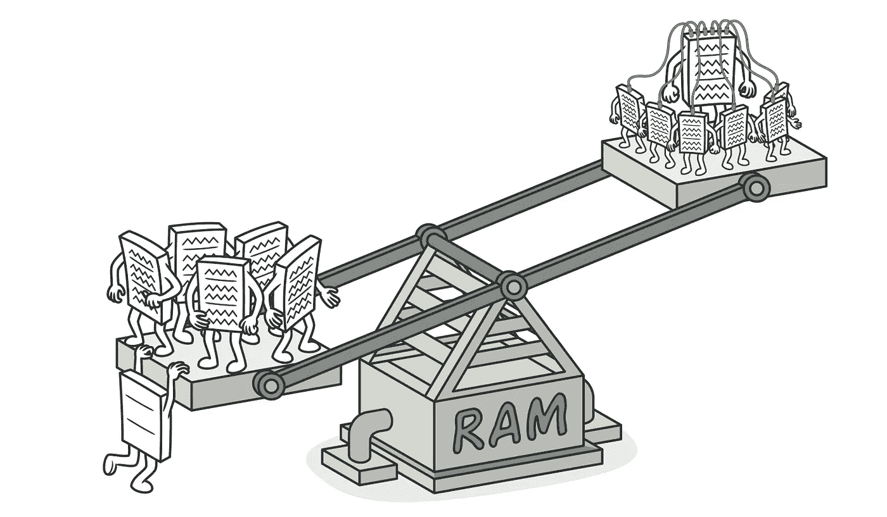

# 设计模式分类第 2 部分—结构模式

> 原文：<https://medium.com/nerd-for-tech/design-pattern-classifications-part-2-structural-pattern-7b1dd1b199b4?source=collection_archive---------18----------------------->

在我以前的文章中，我们讨论了 GoF，设计模式，并回顾了创建模式。在这篇文章中，我们将在仔细研究结构模式之前简要回顾一下设计模式的分类。将概述七种(经典的)结构设计模式以及每种模式的优缺点。

# 分类审查

设计模式不仅有用，而且被有经验的面向对象软件开发人员视为最佳实践。由于设计模式在细节层次、复杂性和适用范围上有所不同，因此根据它们的意图或目的对它们进行分类是很重要的。目的标准反映了模式的作用。三组主要模式是*创造*模式、*结构*模式和*行为*模式。然而，出于本文的目的，我们将把重点放在结构设计模式上。

# 结构模式

结构模式解释了如何将对象和类组装成更大的结构，同时保持这些结构的灵活性和高效性。这些模式有助于确定一种简单的方法来实现实体之间的关系。让我们回顾一下以下结构模式的适用性、好处和关注点。

# 适配器

适配器模式允许具有不兼容接口的对象进行协作，本质上是在它们已经设计好之后让它们工作。基本上，适配器通过转换(*适应*)一个对象的接口使另一个对象能够理解它来实现这一点。这是通过适配器包装其中一个对象来实现的，隐藏了后台发生的复杂转换，而被包装的对象并不知道。适配器不仅可以帮助具有不同接口的对象进行协作，还可以将数据转换成各种格式。

*   *对象适配器* —利用对象组合原理实现一个对象的接口，包装另一个对象。这可以用于任何流行的编程语言。
*   *类适配器* —使用继承实现同时从两个对象继承接口。这只有在编程语言支持多重继承的情况下才能应用。与对象适配器不同，它不需要包装任何对象，因为它继承了客户端和服务的行为。

> 赞成的意见

*   *单一责任原则* —将数据转换的接口与程序的主要逻辑分离
*   *打开/关闭原则* —只要它们通过客户端接口与适配器一起工作，您就可以在不破坏现有代码的情况下将新类型的适配器引入到程序中

> 骗局

*   代码的复杂性随着您向代码中引入的每个新接口和类而增加。

# 桥

桥模式是预先设计的，将一个大类(或一组相关类)分成抽象和实现两个层次，这两个层次可以不同，因为它们可以彼此独立地开发。如果您想要将对象的接口从其实现中分离出来，或者如果您想要划分和组织一个具有某些功能的多个变体的整体类，那么应该考虑这种模式。如果您需要能够在运行时切换实现，或者希望在几个独立的维度上扩展一个类，这种设计也可能是有效的。

> 赞成的意见

*   *单一责任原则* —关注抽象中的高级逻辑
*   *开放/封闭原则* —相互独立地引入新的抽象和实现
*   创建独立于平台的类

> 骗局

*   通过将模式应用于高度内聚的类，可能会使代码变得复杂

# 复合材料

这种复合模式允许您将对象组合成树结构，然后像处理单个对象一样处理这些结构。当您想要实现类似树的对象结构时，应该应用这种模式，因为它提供了共享公共接口的两种基本元素类型。因为一个容器可以由[叶子和其他容器](https://www.geeksforgeeks.org/composite-design-pattern/)组成，这让你可以构建嵌套的递归对象结构(就像一棵树)！如果您希望客户机代码统一处理简单和复杂的元素，这是一个很好的方法。

> 赞成的意见

*   *打开/关闭原则*——引入新元素类型而不破坏现有代码
*   利用[多态性](https://stackify.com/oop-concept-polymorphism/)和[递归](https://www.geeksforgeeks.org/recursion/)来获得优势

> 骗局

*   当功能差异很大时，为类提供一个公共接口可能是一个挑战
*   为两个不同的接口过度概括组件接口的可能性会使理解变得更加困难

# 装饰者

这种模式的目的是允许您将新行为附加到对象上，方法是将它们放在包含这些行为的特殊包装对象中。*包装器*是一个表达模式主要思想的对象，可以与一些目标对象链接。如果您希望独立于实际使用数据的代码来压缩和加密敏感数据，这是一个很好的实现模式。使用装饰模式的其他机会是当您需要在运行时给对象分配额外的行为而不破坏代码时。本质上，这种模式动态地给对象增加了职责。

> 赞成的意见

*   单一责任原则(Single respons ibility Principle)——将实现许多可能的行为变体的单一类划分为更小的类
*   通过将一个对象包装到多个装饰器中来组合多个行为
*   扩展对象的行为而不创建新的子类
*   在运行时添加或删除对象的责任

> 骗局

*   从包装器堆栈中移除特定的包装器可能很困难
*   层的初始配置代码可能看起来不太好
*   如果装饰器的行为不依赖于装饰器堆栈的顺序，很难实现装饰器

# 代理人

这种结构模式是一个类，通过为另一个对象提供占位符来表示另一个类的功能。代理的模式控制对原始对象的访问，允许您在请求到达原始对象之前或之后执行某些操作。换句话说，这个模式控制和管理对它们所投射的对象的访问。有许多情况需要考虑代理设计。例如，当您只希望特定的客户机能够使用服务对象，希望保留历史记录或对服务对象的请求，或者需要能够在没有客户机使用重量级对象时消除它时。

> 赞成的意见

*   *开/关原理*
*   不依赖于服务对象准备就绪或可供其工作
*   当客户不关心服务对象时，管理服务对象的生命周期
*   在客户端不知道的情况下控制服务对象

> 骗局

*   随着每个新类的引入，代码变得更加复杂的风险很高
*   服务响应延迟的可能性

运营商充当公司所有服务和部门的门面

# **立面**

facade 模式是一个对象，它为更大的代码体提供简单的接口，如库、框架或更复杂的底层对象，而不引入任何新功能。本质上，这是一个单独的类，它代表了整个子系统，而子系统并不知道外观。如果您需要一个有限但简单的复杂子系统接口，或者想要将子系统组织成多个层，那么通常建议使用这种方法。

> 赞成的意见

*   将您的代码与子系统的复杂性隔离开来

> 骗局

*   门面成为一个 app 所有类的 [*神物*](https://en.wikipedia.org/wiki/God_object) (知道的太多或者做的太多的对象)的可能性。

# 轻量级

Flyweight 用于高效共享，因为它通过在多个对象之间共享状态的公共部分，而不是将所有数据保存在每个单独的对象中，让您可以将更多的对象放入可用的 RAM 中。换句话说，flyweight 模式通过与相似对象尽可能多地共享来最小化内存使用或计算开销。Flyweight 还解释了何时以及如何共享状态对象。当一个程序必须支持大量几乎不适合可用 ram 的对象，需要产生大量相似的对象，或者如果具有重复状态的对象可以被提取并在多个对象之间共享时，经常使用这种模式。

> 赞成的意见

*   如果你的程序有几个相似的对象，它可以节省大量的内存

> 骗局

*   代码复杂性的增加
*   当每次调用 flyweight 方法都需要重新计算一些上下文数据时，可能会在 CPU 周期上交换 RAM
*   新的团队成员可能想知道为什么实体的状态以这种方式被分离

# 结论

总之，结构设计模式关心的是如何将类和对象组合成更大的结构。这些模式关注于类如何相互继承，并通过识别关系来简化结构。既然您已经熟悉了七种结构化设计模式的应用、优点和缺点，我鼓励您继续深入研究(下面提供了更多资源)，并且只实现简化代码的设计模式。

*敬请关注设计模式分类第 3 部分——行为模式*

**往期文章:**

*   [四人帮:设计模式介绍](https://avelonpang.medium.com/gang-of-four-design-patterns-intro-e884af24b85f)
*   [设计模式分类第 1 部分——创造模式](https://avelonpang.medium.com/design-pattern-classifications-part-1-creational-pattern-cddcff302d29)

**其他资源:**

*   [教程](https://howtodoinjava.com/design-patterns/structural/)
*   结构设计模式— [计算机科学](https://www3.cs.stonybrook.edu/~pfodor/courses/CSE260/L41-StructuralDesignPatterns.pdf)
*   深入探究结构模式— [PDF](https://startertutorials.com/patterns/dpresources/notes/Unit7-Structural-Patterns.pdf)
*   [主要区别](https://www.baeldung.com/java-structural-design-patterns) —代理、装饰、适配器和桥模式

编码快乐！