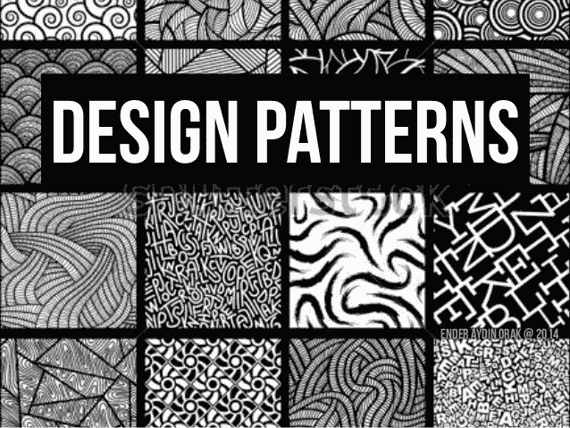
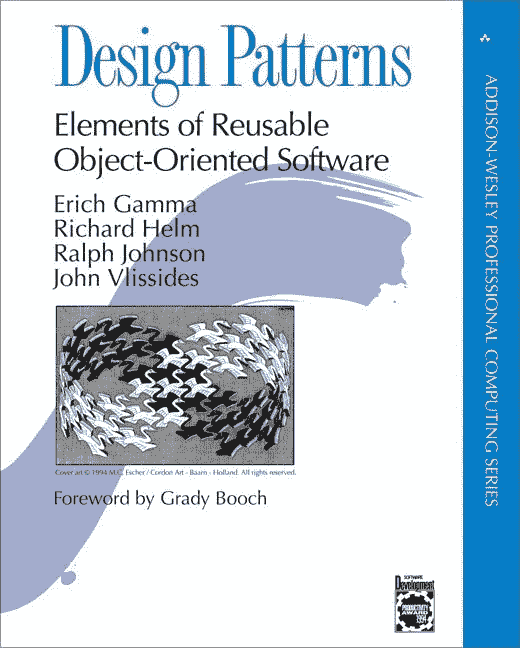
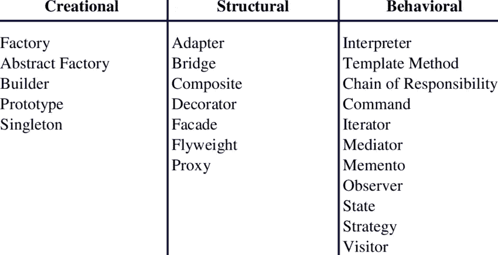

# 设计模式

> 原文：<https://medium.com/nerd-for-tech/design-patterns-f6ee70d13296?source=collection_archive---------3----------------------->

嘿，伙计们！这篇文章可能对未来的软件工程师有用。我们将讨论模式并解释为什么使用它们。如果你不了解模式，不要担心。事不宜迟…

在软件工程中，设计模式是对软件设计中经常出现的问题的可重复的解决方案。设计模式不是一个完整的模式；它不能直接转换成代码。模式是一个模板，可以用来解决不同情况下的问题。我们有不同的模式来实现*撤销*特性，其中之一是**纪念**模式。因此，设计模式向您展示了用户应该如何构造这些类，以及这些类应该如何相互通信。从历史上来说，软件工程师忽略了使用现有的模式，而是设计他们自己的问题解决方案。造成这种状况的原因之一是缺乏针对常见软件体系结构和设计问题的易于使用的标准解决方案。今天有许多不同类型的模式可用。

有 23 种设计模式最初在 90 年代被记录在一本名为*设计模式，可重用面向对象软件的元素*的书中。这本书是由四位作者写的，通常被称为“四人帮”。因此，这 23 种设计模式通常被称为四人组模式。我个人推荐你读这本书。

有 3 种设计模式类型，创造型、结构型和行为型。创造模式是关于创造对象的不同方法。结构模式是关于这些对象之间的关系。这些对象之间协商和交流的行为模式。别忘了，这些设计模式并不能代表所有的模式及其工作，有非官方的，也有未记录的，但这些都是每个软件工程师必须了解的经典模式。

在介绍一些模式之前，让我们看看为什么软件工程师应该研究这个主题。首先，它有助于在抽象层次上与其他开发人员交流，例如，告诉您的同事，我们需要*命令*模式来改进这段代码，只需提及它的名称。第二，它使你成为一个更好的设计者，你学习如何构建可重用、可扩展和可维护的软件。最后但同样重要的是，它们帮助你更快地学习和使用新的框架。

在开始学习模式之前，我恳请您学习并复习一下关于 OOP 的知识；类，接口，封装，抽象，继承，多态，UML。

创造性的设计模式都是关于类的实例化。

*    **抽象工厂创建几个家族类的实例**
*   **[**构建器**](https://sourcemaking.com/design_patterns/builder)
    将对象构造与其表示分离**
*   **[**工厂方法**](https://sourcemaking.com/design_patterns/factory_method)
    创建几个派生类的实例**
*   **[**对象池**](https://sourcemaking.com/design_patterns/object_pool)
    通过回收不再使用的对象来避免昂贵的资源获取和释放**
*   **[**原型**](https://sourcemaking.com/design_patterns/prototype)
    被复制或克隆的完全初始化的实例**
*   **[**Singleton**](https://sourcemaking.com/design_patterns/singleton)
    只有一个实例存在的类**

****结构**关于类和对象如何组合的设计模式，以形成更大的**结构**。**结构**设计**模式**通过识别关系来简化**结构**。**

*   **[**适配器**](https://sourcemaking.com/design_patterns/adapter)
    匹配不同类的接口**
*   **[**桥**](https://sourcemaking.com/design_patterns/bridge)
    将一个对象的接口从其实现中分离出来**
*   **[**复合**](https://sourcemaking.com/design_patterns/composite)
    一个树形结构的简单复合对象**
*   **[**装饰者**](https://sourcemaking.com/design_patterns/decorator)
    动态地给对象添加职责**
*   **[**外观**](https://sourcemaking.com/design_patterns/facade)
    代表整个子系统的单个类**
*   **[**Flyweight**](https://sourcemaking.com/design_patterns/flyweight)
    用于高效共享的细粒度实例**
*   **[**私有类数据**](https://sourcemaking.com/design_patterns/private_class_data)
    限制访问器/赋值器的访问**
*   **[**代理**](https://sourcemaking.com/design_patterns/proxy)
    一个对象代表另一个对象**

****行为**设计模式与算法和对象间的责任分配有关。**

*   **[**责任链**](https://sourcemaking.com/design_patterns/chain_of_responsibility)
    一种在对象链之间传递请求的方式**
*   **[**命令**](https://sourcemaking.com/design_patterns/command)
    将一个命令请求封装为一个对象**
*   **[**解释器**](https://sourcemaking.com/design_patterns/interpreter)
    一种在程序中包含语言元素的方式**
*   **[**迭代器**](https://sourcemaking.com/design_patterns/iterator)
    顺序访问集合中的元素**
*   **[**中介**](https://sourcemaking.com/design_patterns/mediator)
    定义了类之间的简化通信**
*   **[**Memento**](https://sourcemaking.com/design_patterns/memento)
    捕捉并还原一个对象的内部状态**
*   **[**空对象**](https://sourcemaking.com/design_patterns/null_object)
    旨在充当对象的默认值**
*   **[**观察者**](https://sourcemaking.com/design_patterns/observer)
    一种通知多个类变化的方式**
*   **[**状态**](https://sourcemaking.com/design_patterns/state)
    当对象的状态改变时，改变其行为**
*   **[**策略**](https://sourcemaking.com/design_patterns/strategy)
    将一个算法封装在一个类里面**
*   **[**模板方法**](https://sourcemaking.com/design_patterns/template_method)
    将算法的确切步骤推迟到子类**
*   **[**访问者**](https://sourcemaking.com/design_patterns/visitor)
    定义了一个新的操作，对一个类没有改变**

**非常感谢，敬请关注新文章。Peace✌🏼**

** [## 设计模式和重构

### 在软件工程中，设计模式是对软件中常见问题的通用可重复解决方案

sourcemaking.com](https://sourcemaking.com/design_patterns)  [## 设计模式

### 设计模式是软件设计中常见问题的典型解决方案。每个图案就像一个蓝图，你…

重构大师](https://refactoring.guru/design-patterns)  [## 设计模式-概述

### 设计模式代表了有经验的面向对象软件开发人员使用的最佳实践。设计模式…

www.tutorialspoint.com](https://www.tutorialspoint.com/design_pattern/design_pattern_overview.htm)  [## 所有开发人员都应该知道的 3 种设计模式(每种模式都有代码示例)

### 什么是设计模式？设计模式是针对我们软件工程师经常遇到的问题的设计级解决方案…

www.freecodecamp.org](https://www.freecodecamp.org/news/the-basic-design-patterns-all-developers-need-to-know/) 

北卡罗来纳州罗赞斯基(2014 年)。*软件系统架构:使用观点和视角与涉众合作*。出版地点不明:艾迪生-卫斯理。**