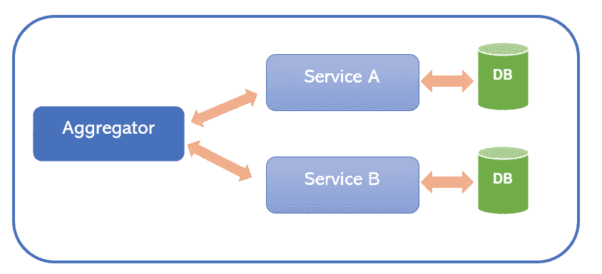
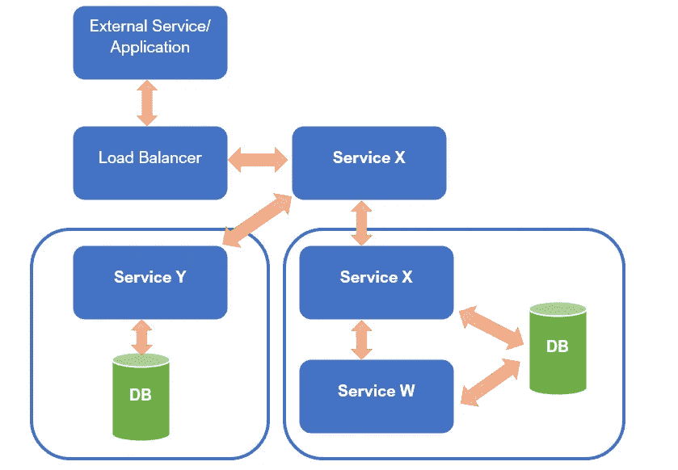
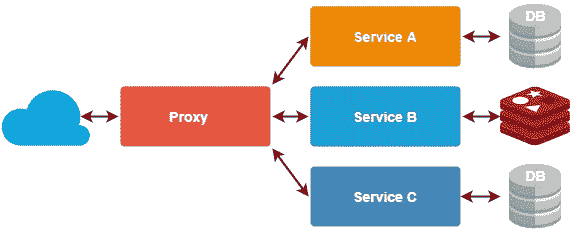

# 微服务的设计模式——聚合器模式和代理模式

> 原文：<https://medium.com/nerd-for-tech/design-patterns-for-microservices-aggregator-pattern-99c122ac6b73?source=collection_archive---------0----------------------->

由 [Kirana Kepakisan](https://unsplash.com/@photography37?utm_source=medium&utm_medium=referral) 在 [Unsplash](https://unsplash.com?utm_source=medium&utm_medium=referral) 上拍摄的照片

在当今的软件工程行业，微服务架构已经成为现代应用开发最有利的选择。众所周知，微服务可以解决开发人员在开发单片应用程序时面临的各种挑战。然而，当我们使用这种架构时，它有几个缺点。因此，我们需要学习这些问题中的常见模式，并用可重用的解决方案来解决它们。因此，我们有几种微服务设计模式。因此，在本文中，我将讨论微服务架构中的两种流行设计模式:**聚合器模式** & **代理模式。**

如果你是微服务新手，我强烈推荐你去翻翻我之前的两篇文章: [***微服务简介***](/geekculture/introduction-to-microservices-9dcaafa5d882)&[***微服务架构最佳实践***](/geekculture/best-practices-for-microservices-architecture-9cd896fb41b5) ***。***

# 为什么设计模式在微服务架构中很重要？

在微服务架构中选择合适的设计模式，决定了您的应用程序能否正常工作。正如我上面提到的，微服务架构有几种设计模式。因此，你需要选择一个正确的，因为它将真正有利于你。但是如果你没有为你的情况选择合适的设计模式，那么整个系统将会不稳定并且性能很差。

# 01)聚合器模式

在微服务架构中，我们将一个大型、复杂的应用程序拆分为小型、自治、可独立部署的服务。因此，有必要考虑如何协作每个服务返回的数据。在 IT 行业，聚合器是指收集相关数据项并显示出来的网站或程序。因此，在微服务中，聚合器设计模式是一种服务，它接收请求，然后发出多个服务的请求，组合结果并响应发起的请求。

图:聚合器设计模式的表示

在聚合器模式中，有三种方法可以在微服务应用程序中实现它。

1.  分散聚集模式
2.  链式图案
3.  分支模式

为了更清楚地解释这一点，我将使用下面的例子。

假设您是一名软件工程师，您的团队被分配为一所大学开发微服务应用程序。然而，他们已经有了一个单片系统，你要做的就是将这个单片系统转换成微服务应用。假设您必须开发如下 4 种服务，

*   获取学生信息的服务
*   获取分数及其相关信息的服务
*   获取会员信息的服务
*   获取成绩信息的服务

此外，对于这 4 项服务，您有两个消费者，分别名为:**、【分级系统】、**、【丰富计划系统】、**。**

## 问题:

当涉及到实现时，您的团队可能会为每个系统创建一个微服务，因为这就是我们应该如何实现微服务应用程序。但问题是，当“分级系统”需要学生信息和分数信息，或者“充实计划系统”需要会员和成绩信息时，会发生什么呢？

## 解决方案:

所以，你可以做的是，创建一个服务来消费“学生信息”和“分数信息”服务，并给消费者所需的响应(评分系统)。基本上，新创建的服务将接受来自“评分系统”的请求，并调用这两个服务来聚合它们的响应，并将其发送回“评分系统”在聚合器模式中，有两种方法可以实现这个解决方案。

**解决方案 01:** 当您调用评分系统的服务时，您可以向“学生信息”和“分数信息”服务发送一个并行调用，并获取这些响应，将它们聚合为一个响应。现在我们可以将这个响应发送回分级系统(消费者)。所以，这是第一种解决方案，它被称为“分散聚集模式”

**解决方案 02:** 假设标记信息服务依赖于学生信息服务。在这种情况下，您不能使用分散聚集模式。因此，我们可以做的是调用“学生信息”服务，获取学生代码和响应，然后传递给“标记信息”服务。最后，将分数及其相关信息和响应返回给评分系统。所以，这是第二个解决方案，它被称为**“链式模式”**但是，这种模式比分散聚集模式慢。

# 01.1)分支模式

这种微服务模式是聚合器和链设计模式的混合，允许来自两个或更多独立微服务的同时请求或响应。如您所知，一个微服务可能需要从包括其他微服务在内的多个来源获取数据。分支模式扩展了聚合器模式，并提供了从多个链或单个链生成响应的灵活性。当您需要将大型单片应用程序转换为微服务应用程序时，这种设计模式非常方便。为了让事情更清楚，请查看下图。

图像:分支设计模式的表示

如您所见，服务“X”充当聚合器，同时它分支成两个独立的分支。第一个分支包含一个独立的微服务(服务“Y”)，第二个分支包含一个服务链，其中有 2 个微服务。

## 使用聚合器模式的好处

*   x 轴和 z 轴的可扩展性
*   易于理解和实施
*   内部服务的微服务签名灵活性
*   为微服务提供单一接入点

# 02)代理设计模式

假设您的客户有一个单一的应用程序，他们决定将其迁移到微服务架构中。在这种情况下，您的团队可能会被指派开发多个服务并持续部署这些服务。在开发这些微服务时，可能会有一些服务需要更改的场景，比如更新它们的功能。更新特定的服务会影响使用该服务的其他服务。因此，这可能会导致整个系统崩溃，同时也会阻碍应用程序的开发。然而，对于这种情况，我们有一个众所周知的解决方案:代理设计模式。

## 什么是代理设计模式？

这种模式非常类似于聚合器设计模式，甚至被认为是它一种变体。但是在这种情况下，不需要在客户端进行聚合，但是可以根据业务需求调用不同的微服务。**代理模式也能够像聚合器模式一样在 x 轴和 z 轴上独立缩放。**因此，这种模式背后的主要思想是，不要向消费者公开每个微服务，而是应该通过一个接口。

图像:代理模式的表示(tsh.io)

让我们举一个例子来理解代理模式在微服务应用程序中是如何工作的。假设有一个员工管理系统，它有一个获取员工休假信息的服务。此外，这个 leave-service 与其他几个服务一起工作，它们已经在使用它。但是，您决定部署这个 leave-service 的新版本，只做了很少的更改。这些变化的结果是，休假服务的消费者将会崩溃，因为他们没有获得新休假服务版本所需的更新。这就是代理模式派上用场的地方。

为了克服代理模式的上述情况，我们必须为这个特定的服务(离开服务)创建一个代理服务。因此，所有的消费者都必须通过这个代理服务来传递离开服务。因此，开发者不需要在消费者端做任何改变。因为，如果消费者需要与旧版本的离开服务通信，代理将把请求定向到旧版本，如果消费者需要与新版本通信，代理将把请求定向到新版本的离开服务。但是，如果您看不到该服务旧版本的任何流量，您可以停用该特定版本。

## 语义版本控制

微服务应用中的版本控制是非常关键的部分，因为它有许多不同版本的服务。正如我们上面讨论的，我们可能需要部署同一个服务的几个版本。因此，语义版本控制非常方便。

语义版本化是一种技术，它使用三个非负整数值来标识版本类型。在这种技术中，版本格式表示为**“主要.次要.补丁”.**

图像:语义版本化的基本语法(devopedia.org)

> 我在下面的文章中讨论了“版本化微服务”。更多详情请参考。

 [## 微服务架构的最佳实践

### 在我的上一篇文章:微服务简介中，我讨论了微服务架构，它的…

medium.com](/geekculture/best-practices-for-microservices-architecture-9cd896fb41b5) 

## 服务发现

当在您的微服务应用程序中使用代理模式时，最好使用服务发现工具来搜索服务。因为，如果微服务应用中的基础设施发生变化，主机名和 IP 地址也会发生变化。但是，如果您有一个服务发现工具，代理可以请求它找到正确的版本及其 IP 地址、主机名等。有几个流行的工具，如， **WSO2 治理注册表，领事，**和**动物园管理员。**

> 请参考以下链接，查看和比较现有的最佳服务发现工具。
> 
> [https://www.g2.com/categories/service-discovery](https://www.g2.com/categories/service-discovery)

所以，这是我的文章的结尾，我希望你喜欢它。快乐编码👨‍💻。

# 参考

 [## 微服务设计模式|微服务模式| Edureka

### 在当今的市场上，微服务已经成为构建应用程序的首选解决方案。众所周知，它们可以解决…

www.edureka.co](https://www.edureka.co/blog/microservices-design-patterns#Branch)  [## 微服务的设计模式

### 微服务可以对你的企业产生积极的影响。因此，了解如何处理微服务是值得的…

dzone.com](https://dzone.com/articles/design-patterns-for-microservices-1)