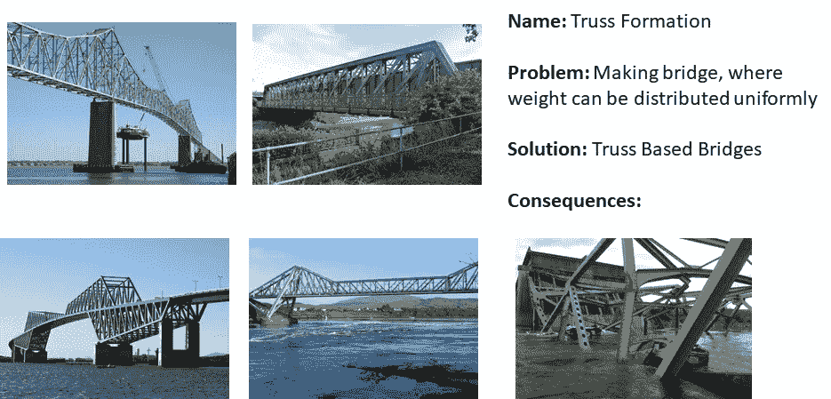

# Django 1.1 中的设计模式

> 原文：<https://medium.com/nerd-for-tech/design-patterns-in-django-1-1-b74fc38a877b?source=collection_archive---------1----------------------->

数据取自以下书籍。[https://doc . lagout . org/programmation/Django/Django % 20 design % 20 patterns % 20 and % 20 best % 20 practices % 20% 5 bravindran % 202015-03-26% 5d . pdf](https://doc.lagout.org/programmation/Django/Django%20Design%20Patterns%20and%20Best%20Practices%20%5BRavindran%202015-03-26%5D.pdf)

我是以概括的方式转发上述书的想法。如需深入研究，请阅读该书。

由[费迪南·斯托尔](https://unsplash.com/@fellowferdi?utm_source=medium&utm_medium=referral)在 [Unsplash](https://unsplash.com?utm_source=medium&utm_medium=referral) 上拍摄的照片

模式是一种定期出现的结构或重复的设计。模式实际上是对常见问题的通用解决方案。我们被不同领域的各种模式所包围。下面给出一个例子:

模式的真实例子

正如您在这里看到的，这并不能保证该模式总能给您带来积极的结果。模式解决方案的正确选择非常重要。在软件工程领域，模式存在于软件代码的不同抽象层次。术语“设计模式”是由 [GoF](https://en.wikipedia.org/wiki/Design_Patterns) ( [Erich Gamma](https://en.wikipedia.org/wiki/Erich_Gamma) 、Richard Helm、 [Ralph Johnson](https://en.wikipedia.org/wiki/Ralph_Johnson_(computer_scientist)) 和 [John Vlissides](https://en.wikipedia.org/wiki/John_Vlissides) 引入的。GoF 介绍了 23 种在面向对象软件开发中常见的设计模式。设计模式是基于面向对象系统的类之间的关系模式。我们不打算讨论这些设计模式。我们将继续关注 Django 设计模式。

如果你不知道 ***姜戈*** 那么请访问以下链接:[https://www.djangoproject.com](https://www.djangoproject.com/)。它是一个基于 python 的 web 应用开发框架，目前正受到高度关注。开发者把这个技能收入囊中会非常有用。与传统的设计模式不同，Django 设计模式(DDP)不是严格意义上的类间模式。DDP 实际上是 Django 开发人员遵循的最佳实践。在深入研究模式之前，我们需要一些关于 Django 应用程序各种组件的基础知识。

一个基本的 Django 应用程序有四个基本组件。

1.  **Models**(Models . py):POPOs(**p**lain**o**LD**p**ython**o**objects)类，以面向对象的方式与数据库通信并保存数据。
2.  **Forms** (forms.py):从用户那里收集数据。
3.  **视图** (views.py):中央控制器，处理用户的请求并与模型对象通信。它就像 JavaEE 的“servlets”。
4.  **模板** (templates 文件夹):以通用结构显示对用户的响应，带有定制信息。

除了上述组件，还有一些其他文件和文件夹与本讨论无关。DDP 主要位于上述四个组件中。15 DDPs 分类如下:

1.  **模型 DDP:** 模型下的 DDP 细分为结构模式和检索模式。

1.1 结构化:这些模式处理我们的模型类的结构和组织。通常，我们在一个 models.py 文件中定义所有的类。

1.1.1 规范化模型: Django 遵循 ORM(对象关系映射)的概念。我们首先定义自动生成数据库表的模型类。如果你学过数据库管理系统的课程，那么和你讨论 DDP 是一件小事。简而言之，我们以这样一种方式创建我们的类和属性，这种方式导致一个不太冗余、高度一致和持久的数据库。例如，我不会将用户的地址存储在单个字符串中。我将为他/她提供国家、州、城市的选择列表，以及街道信息的单个字符串输入，这将保持我的数据的一致性，减少冗余。

**1.1.2 模型混合:**很多时候我们会遇到不同类中共同出现属性的问题。Python 具有多重继承的灵活性。不要在多个模型类中重复相同的属性集，而是创建一个父类并将这些公共属性保存在父类中。所有必需的类都将继承父类。但问题是，我们不想在数据库中为这个父类创建一个表。“抽象继承”是解决这个问题的方法。在父类**的 ***元内部类中将父类标记为“抽象”其余工作将由 Django 完成。*****

****1.1.3 用户配置文件:**一个 web 应用程序可以有多种类型的用户，这些用户具有不同级别的访问权限。每种用户类型都有其专用的页面集。我们如何在模型级别管理它！！。一个额外的类 UserProfile 可以解决这个问题。每当用户登录应用程序时，我们可以根据其配置文件值允许或拒绝用户访问数据。**

****1.1.4 服务对象:**本次 DDP 与**胖款**问题有关。当大量与任何模型类都不直接相关的代码(仅仅是实用程序代码)可以被转储到任何模型类中时。这不必要增加我们模型的大小。提取所有这些实用程序代码块，并以方法的形式放入一个通用的实用程序类中。将所有方法标记为“static ”,因为这些方法与任何模型类都不相关。为了更好地理解，创建单独的文件 utils.py/服务. py 来存储实用程序类。示例:生成基于 JSON/XML 的响应，生成供下载的 PDF 文件，与外部系统通信。**

**所以，这就是这篇文章的内容。我们将在下一篇文章中继续讨论。我们刚刚讨论了一些 DDP 的一般概念。详情和基于代码的例子请浏览上述书籍。感谢您阅读帖子。访问下面的工作示例链接:[https://github.com/DjangoPatternsBook/superbook](https://github.com/DjangoPatternsBook/superbook)。**

**【代码作者:阿伦·拉文德兰(GitHub id: arocks)】**

**点击此处查看[第二部分](/@sawanrai777/design-patterns-in-django-1-2-c57c6e1d23c8)。**