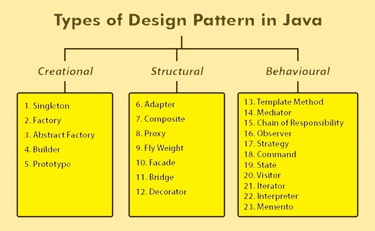

# 设计模式-简介

> 原文：<https://medium.com/nerd-for-tech/design-patterns-introduction-7022b8d384c6?source=collection_archive---------1----------------------->

在这一节中，您将清楚地了解我们在软件解决方案中需要使用设计模式的内容和原因。

其实那也不是逼你用的东西。设计模式是一种东西，你会学到，发现它的好处并渴望用在每一个可能的地方。

# 什么是设计模式？

不需要深入了解，我们可以通过一个真实的例子来了解这一点。

当病人去看医生时，医生有一系列的问题，他会一个一个的问。之后，他将确定病人的问题。这是怎么发生的，医生知道可能的疾病和症状是什么。所以他们有一套问题来识别问题，然后他们会确定问题。

就像那样，软件开发人员在不同类型的项目中也会有不同类型的问题需要解决。同样的问题有同样的解决方案。

在软件解决方案中，开发人员可以解决软件问题，并提供具有可能的设计模式的解决方案。

实际上什么是设计模式？

> **设计模式为软件设计中的常见问题提供了一种通用的可重用解决方案。**

# **我们什么时候需要使用设计模式？**

对此没有直接的解释。但是有一种方法可以使为某种问题选择设计模式变得容易。

根据四人帮作者的观点，设计模式被分为三种类型。

**设计模式的类型**

1.  创建->创建对象的方法有哪些
2.  结构->类和对象的结构
3.  行为->物体如何相互作用

所有的设计模式都有一个。当问题是如何创建对象时，就用创建模式吧。

如果问题与类和对象的结构有关，选择一种结构模式。

伴随着物体如何相互作用而产生的问题，就跳到了行为模式上。