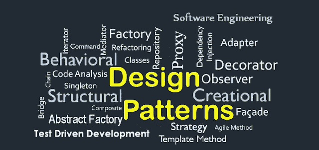

# 设计模式第 1 部分—单例模式

> 原文：<https://medium.com/nerd-for-tech/design-patterns-part-1-singleton-pattern-2eca51192757?source=collection_archive---------17----------------------->



(来源:[https://www.hojjatk.com/2014/08/design-patterns.html](https://www.hojjatk.com/2014/08/design-patterns.html))

这是我要讲的一个新话题。大多数开发人员可能听说过设计模式或者这个词。在面试中，你也会被问到设计模式，甚至是助理职位。

## 什么是**设计模式？**

它是软件设计中常见问题的通用解决方案，更像是一个预先设计好的模板，我们可以定制它来解决问题。你不能直接转换成代码，因为它只是一个解决具体问题的一般概念。为了更容易理解，你知道美元是全球经济的标准货币。同样，这些设计模式是软件设计中的标准最佳实践，通过这一点，开发人员能够使用易于理解的术语进行软件设计交互。最重要的是，设计模式是语言独立的。在 1994 年， [Erich Gamma](https://en.wikipedia.org/wiki/Erich_Gamma) 、 [John Vlissides](https://wiki.c2.com/?JohnVlissides) 、 [Ralph Johnson](https://en.wikipedia.org/wiki/Ralph_Johnson_(computer_scientist)) 和 Richard Helm 出版了一本名为《 [**设计模式:可重用面向对象软件的元素**](https://www.amazon.com/gp/product/0201633612/) 》的书，解释了关于编程的设计模式，它由 23 个设计模式组成，解决了软件设计的各种问题，也被称为《 **GoF 书**

## 为什么我们需要设计模式？

我们可以在不同的项目中重用这些设计模式。通过使用它，我们可以给出有助于定义系统架构的解决方案。我们可以在我们的项目中毫无顾虑地使用它，因为它们基于专业软件开发人员的专业知识和经验，并且我们可以构建更好的系统，因为设计模式为设计系统架构提供了适当的澄清。

## 设计模式的分类


设计模式的类型(来源:[http://www . algorithm forum . com/2018/08/Design-Patterns-software-Design-pattern . html](http://www.algorithmforum.com/2018/08/design-patterns-software-design-pattern.html))

在设计模式中主要有三个类别，如创建、结构和行为，如上图所示。

**创建模式** —这种模式以受控的方式提供对象创建机制，有助于降低代码复杂性。

**结构模式**—这解释了如何将对象和类组合成更大的结构，同时保持灵活性和效率。

**行为模式—** 这种模式完全是关于对象之间的交流。

所以这是设计模式的基础，我将在接下来的文章中讨论其中的一些设计模式，这将是一个系列文章。

# 单一模式


什么是"**单例设计模式"，**它实际上意味着每个容器一个实例(唯一实例)，如果你使用 Java，那么每个 JVM 一个实例。可能会有这样的情况，我们必须在一个项目中只使用一个特定对象的实例。因此，这个概念允许我们在整个项目中创建和使用一个实例。例如，假设某人 X 在 ABC 银行有一个账户，并且他/她从他/她的账户**中提取一定金额的钱，同时**某人 Y 将一些钱存入某人 X 的账户。请注意，这一事务发生在同一时间。因此，如果我们在这里没有遵循单例设计模式，就会导致数据不一致。因此，如果我们使用这个 account 对象的一个实例，那么这个事务就会顺利进行。我们在连接数据库时也使用这种模式，因为一次会有对单个表的多个查询更新。


单例模式的类图

在实现这种设计模式时，我们应该遵循某些东西，

*   我们应该为实例创建一个静态变量，它不应该带有任何参数。
*   我们应该创建一个私有构造函数，它可以防止从类外部创建单例类的实例
*   我们应该创建一个静态方法来为 singleton 对象提供一个全局访问点。

让我们看一下代码，

## 早期初始化

从上面的代码中可以看出，我们用私有构造函数和公共方法(`getInstance()`)从`Singleton`类中创建了一个实例(`instance`),以提供对该实例的全局访问。

> 注意— volatile 关键字用于保持多线程场景中的数据一致性。[点击此处](https://www.javatpoint.com/volatile-keyword-in-java)了解有关 volatile 用法的更多信息。

为了测试，我创建了一个名为 **Application** 的类，并分配了两个不同的变量来使用 singleton 对象。如果我运行这个，我会得到如下输出，

```
singletonPattern.Singleton@3830f1c0
singletonPattern.Singleton@3830f1c0
```

即使我给两个不同的变量赋值并在不同的时间调用，它仍然访问同一个实例，因为它是单例的。在第一个文件(`Singleton_1.java`)中发生的是应用程序一加载实例就被创建，这被称为“**早期初始化**”。可能有一种情况，我们并不总是需要 singleton 对象。所以在那种情况下，这将是一个缺点。让我们看看如何克服这一点。

## 惰性初始化

从下面的代码(第 3 行)可以看出，在这里我们没有在开始时创建实例。所以当我们调用`getInstance()`方法时，它检查(第 9 行)是否已经创建了一个实例。如果已经创建，它将返回该实例(第 12 行)，如果没有，它将创建一个新实例(第 10 行)。这意味着它只在我们请求时才创建，这被称为“**惰性初始化**

这里的问题是，如果有两个线程同时进入，第一个线程会转到第 9 行，检查是否创建了实例，因为这是第一个线程，所以它会转到第 10 行。当实例被创建时，第二个线程到达第 9 行，此时实例还没有被创建，所以它允许第二个线程到达第 10 行。所以这不是线程安全的。可能会有这样的情况，多个线程可能会创建这样的实例。为了避免这种情况，我们可以在代码中做一些修改，让我们看看如何做。

## 惰性初始化—线程安全

让我们采用与之前相同的场景(两个线程)，因此第一个线程将到达第 9 行并检查实例是否为空，因为它为空，所以它将到达第 10 行并获取锁，然后它将进入 synchronized 块并再次检查实例是否存在，并在第 12 行创建实例。现在第二个线程转到第 9 行，它将允许，因为实例创建过程正在进行，这意味着它仍然为空。但是当它到达第 10 行时，它会阻止第二个线程继续移动，因为锁已经被第一个线程获得了。所以第二个线程只能在第一个线程释放锁(通过完成执行)之后再进一步。其名为“**双重检查锁定”。**因此第二个线程将被同步块允许，并在其中再次检查，此时 instance 不为空，因此它将返回相同的实例(第 16 行)。

有些人会在 access 方法中使用 synchronized 关键字(getInstance 方法中的 static 关键字旁边)。你可以这样做，但**你不应该**因为这是一个小例子，但在实际项目中，可能有许多代码应该在该方法中执行，所以在那个时候，如果有多个线程并发，每个线程在第一个线程之后必须等待更多的时间来访问该方法。所以最好把同步块放在需要的地方。

这就是**单身模式**，我希望你能理解这一点。我将在下一篇文章中讨论工厂模式。

# 参考

我参考了下面的 YouTube 视频来写这篇文章，它是由 [Krishantha Dinesh](https://medium.com/u/26403c4bd160?source=post_page-----2eca51192757--------------------------------) 制作的

[](https://sourcemaking.com/design_patterns) [## 设计模式和重构

### 在软件工程中，设计模式是对软件中常见问题的通用可重复解决方案

sourcemaking.com](https://sourcemaking.com/design_patterns) [](https://refactoring.guru/design-patterns/what-is-pattern) [## 什么是设计模式？

### 设计模式是软件设计中常见问题的典型解决方案。它们就像是预制的…

重构大师](https://refactoring.guru/design-patterns/what-is-pattern)  [## Java 中的设计模式

### 设计模式是解决特定问题/任务的成熟解决方案。现在，一个问题将会出现在…

www.javatpoint.com](https://www.javatpoint.com/design-patterns-in-java)