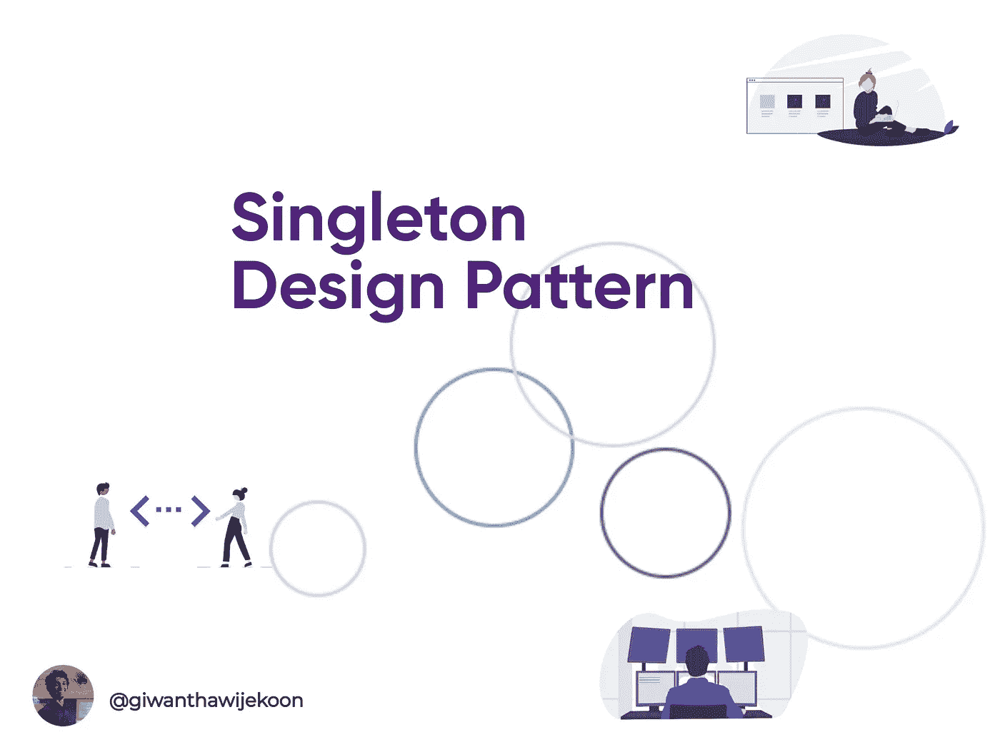
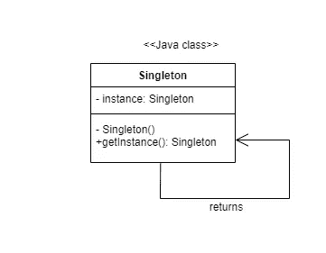

# 设计模式:单例模式

> 原文：<https://medium.com/nerd-for-tech/design-patterns-singleton-pattern-97646e28e80e?source=collection_archive---------4----------------------->

**Singleton** 设计模式也属于**creative**设计模式。单体设计模式的简单定义是**一个类中的一个对象**。它确保您得到的是您所检索的任何类型的相同实例。

如果我们程序中的一个类对于所有客户端都必须有一个实例，那么 Singleton 模式会很有帮助。

现在让我们来看看单例模式的实现。

单体模式的 UML

这里我们将构造函数设为私有，因为这样一来。无法实例化此单例类。此外，我们可以调用 **getInstance()** 方法，而无需通过声明为“static”来实例化该类。

当 **getInstance()** 方法第一次调用时，它创建新的实例并再次返回同一个实例。此外，我们需要注意的是，我们没有提前创建**单例实例**。只有在调用 **getInstance()** 方法时，才会创建**单例实例**。

上面提到的实现的问题不是线程安全的。

我们可以简单地通过同步 **getInstance()** 方法**来解决这个问题。**

它确保只有一个线程可以执行 **getInstance()** 方法。这可能会降低你的程序的性能，但是如果你想要一个完美和简单的解决方案，这是更好的。

这里有一些单例模式的优点和缺点。

# 优势

*   因为不是在每次请求时都创建实例，所以可以节省内存。
*   对唯一实例的受控访问。

# 缺点

*   很难保持跟踪。
*   单元测试时复杂。

希望这篇文章能有所帮助。

谢谢大家！

# 参考

四人组设计模式—[https://edeleastar . github . io/Design-Patterns/topic 00/pdf/c-logica-GoF-catalogue . pdf](https://edeleastar.github.io/design-patterns/topic00/pdf/c-logica-gof-catalogue.pdf)