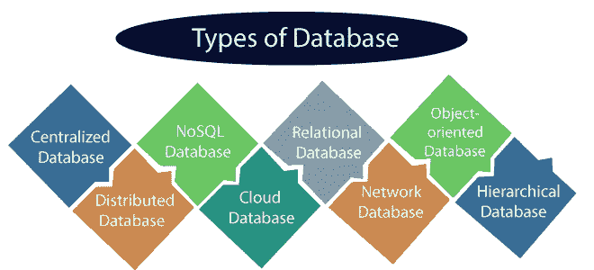

# 设计面向未来的数据库架构:关键考虑因素

> 原文：<https://medium.com/nerd-for-tech/designing-a-database-architecture-for-the-future-key-considerations-c2b4be22cf89?source=collection_archive---------1----------------------->

照片由[王思然·哈德森](https://unsplash.com/@hudsoncrafted?utm_source=unsplash&utm_medium=referral&utm_content=creditCopyText)在 [Unsplash](https://unsplash.com/s/photos/key-consideration?utm_source=unsplash&utm_medium=referral&utm_content=creditCopyText) 上拍摄

应用程序的成功取决于设计一个能够满足组织现在和未来需求的数据库体系结构。

本文将讨论在创建一个可伸缩的、适应性强的、能够满足现在和未来需求的数据库体系结构时需要记住的一些重要因素。

数据库是数据的结构化集合，通常以电子方式存储并从计算机系统访问。数据库使数据管理变得简单。简而言之，数据库就是一个可以存储任何信息的地方。

低效的数据库设计会导致各种各样的问题，比如资源浪费、维护困难和性能低下。因此，拥有一个优秀的数据库模式设计对于高效的数据管理来说是必不可少的。

数据库的类型

您可以在应用程序中利用各种数据库，每种数据库都有自己的优点和缺点。以下是一些典型的数据库类型:

1.  **关系数据库**:关系数据库，如 **MySQL** 和 **Oracle** ，利用表之间的关系来组织数据并将数据存储在表中。它们经常用于需要复杂查询和事务的应用程序中，因为它们非常适合处理结构化数据。
2.  **NoSQL 数据库** : NoSQL 数据库，如 **MongoDB** 和 **Cassandra** ，可以横向扩展以满足高流量应用程序的需求，并且可以处理大量的非结构化数据。它们经常被用在优先考虑高性能而不是复杂的查询和事务的应用程序中。
3.  **图形数据库**:图形数据库，如 **Neo4j** ，用于管理可以可视化为图形的密集连接的数据。它们经常用于要求实时数据处理的应用程序中，非常适合处理复杂的交互。
4.  **内存数据库**:内存数据库，如 **Redis** 和 **Memcached** 等，将数据存储在内存中，是为具有快速数据访问需求的高性能应用程序而设计的。它们经常被用作实时数据存储或缓存。

应用程序的需求将最终决定您选择的数据库类型。认真考虑您的应用程序的需求并选择一个能够满足它们的数据库是至关重要的。

# 主要考虑事项

## 数据模型:

数据模型控制着数据在数据库中的保存和排列方式，是数据库设计的基础架构。创建一个能够处理当前和未来数据需求，同时又具有灵活性、可伸缩性和适应性的数据模型至关重要。

## 可扩展性:

您需要一个能够随着应用程序的扩展和数据需求的变化而扩展的数据库体系结构。如果您想确保您的数据库能够处理不断增长的数据量，可以考虑选择一个可以水平扩展的系统，比如 NoSQL 数据库。

## 可维护性:

随着应用程序的不断变化，您需要升级和维护您的数据库设计。为了能够在不影响应用程序的情况下进行更改，请确保以易于维护和更新的方式设计数据库。

## 数据安全性:

保护您的数据至关重要，尤其是在数据泄露日益频繁的情况下。为了保护您的数据免受不必要的访问，请确保在您构建的数据库体系结构中包含强大的安全功能。

## 云与内部部署:

在开发数据库架构时，选择在云中还是在本地托管数据库是一个至关重要的决定。最佳选择将取决于您特定的业务需求和要求。这两种选择各有利弊。

## 性能:

数据库的性能对应用程序的整体性能至关重要。确保您的数据库架构适合您的应用程序将要管理的工作负载和查询的类型。

## 数据集成:

随着企业越来越依赖大量的数据库和系统来存储和管理数据，考虑这些系统将如何集成至关重要。这可能需要创建一个数据仓库，或者使用 ETL(提取、转换、加载)工具在系统之间传输数据。

## 未来技术:

在创建数据库架构时，考虑技术的未来是至关重要的。这需要考虑到人工智能和机器学习等前沿创新的影响，并确保您的数据库架构足以适应这些发展。

## 结论:

总之，为未来开发数据库体系结构需要仔细规划并考虑几个重要因素。可伸缩性、性能、数据模型、数据安全性、数据集成、云托管与本地托管，以及新兴技术的影响等等。

通过考虑这些因素，您可以创建一个适应性强、可伸缩的数据库体系结构，并且能够满足您公司现在和将来的需求。

我希望这篇文章对你有所帮助。 ***感谢阅读。***