# 设计 REST API

> 原文：<https://medium.com/nerd-for-tech/designing-a-rest-api-3a070398750f?source=collection_archive---------1----------------------->

## 如何创建一个你能学会喜欢的 REST API


设计一个可靠的 REST API 并没有你想象的那么难。但是要做到这一点，首先你必须理解 REST 不是你最熟悉的那种过程 API。它是一个 API，用于读取和写入资源，以及通过网络操纵和传输资源状态。

## 什么是休息？

表述性状态转移不是一个软件工程标准，而是一种架构风格。REST 已经变得流行起来，因为它可以用来实现网络化和支持 Web 的应用程序。

这个术语最初是由[罗伊·菲尔丁](https://en.wikipedia.org/wiki/Roy_Fielding)在 2000 年描述的，作为他[博士论文](https://www.ics.uci.edu/~fielding/pubs/dissertation/top.htm)的一部分。Fielding 是 HTTP 规范的主要作者之一。他是基于网络的软件架构方面的权威，也是 Apache HTTP Server 项目的创始人之一。正如您将看到的，REST 的一些约定是基于使用 HTTP 的经验。

REST 旨在描述一个设计良好的 Web 应用程序的行为方式。它假定了一种模型，通过这种模型，用户或应用程序可以访问、创建、修改或删除网络上的资源。

资源可以是任何具有可以通过网络传输的状态表示的东西。这包括图像、视频、声音、文本、电子表格、数据表、超文本、关系和文档数据库实体、计算结果，甚至过程或程序状态。

表示可以是表达资源的详细状态和语义的任何可串行化的数据格式，使得它可以作为字节数组在网络上传输，并在另一端重新构造，而不会丢失含义或精度。*与 Java 对象不同，表示只描述数据状态，不描述行为*。与过程调用不同，表示与编程语言和执行环境无关。

REST 的名字来源于这样一个命题，即一个事物可以通过它在客户端的表示来创建或操作，并且这个表示可以被传输到服务器来设置它的状态。如果理解和使用得当，它是简单、干净和优雅的。

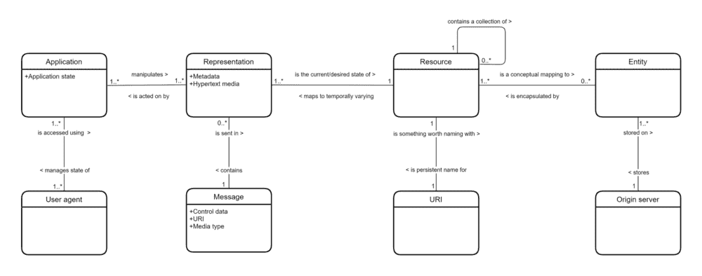

**其余信息模型**

> 与常见的误解相反， **REST 的存在不仅仅是为了与关系数据库或文档数据库进行交互**。它经过精心设计，可以在客户机和服务器之间来回传输多种对象的表示。当我们需要与数据库管理系统对话时，这恰好很有用。

## 我们为什么要用 REST？

蒂姆·伯纳斯·李，可能比任何一个人都更应该对互联网的发展负责，他向 T2 的欧洲粒子物理研究所提出了互联网超文本的概念，并于 1990 年 12 月 20 日发布了世界上第一个网站。

从表面上看，使用超文本的万维网似乎是一个非常简单的想法，但它是一个天才之举，对我们今天所知道的世界产生了巨大的影响。在网络出现之前，互联网主要是学者和国防承包商的领地( [DARPA](https://en.wikipedia.org/wiki/DARPA) )。今天，很难想象没有网络的发达世界。

代表性状态转移是另一个天才之举。REST 扩展了 Web 的超文本概念，为在网络上检索、传输和操作复杂对象的状态提供了一个明确定义和标准化的模型。

很早以前，HTTP 和 HTML 就能够处理[媒体类型](https://en.wikipedia.org/wiki/Media_type)，而不仅仅是超文本和图像。但是，在处理某些类型的对象的表示时，仍然有严重的局限性。

由于开发人员需要创建更复杂、更强大的 Web 应用程序，AJAX(或异步 JavaScript 和 XML)的编程概念增强了与基于服务器的系统进行交互的能力，而不会冻结等待响应的 UI。必须用 JavaScript 操作 XML 远不是理想的解决方案；因此，许多 AJAX 开发人员很快用 JavaScript 对象符号(或 JSON)取代了 XML，这是 JavaScript 的固有特性。

REST 与 AJAX 相结合，提供了一种干净的、架构上一致的方式来与驻留在网络服务器上的复杂对象进行交互。正确实现后，REST 在客户机和服务器之间提供了一个轻量级的契约；这对开发人员和维护人员来说都是无价的好处。

从运行时性能的角度来看，它还将应用程序的大部分工作负载从几台服务器分配到许多客户端，提供了内置的可伸缩性。随着阅读的深入，您将会看到工具 REST 是多么有用和强大，不仅对于基于浏览器的应用程序，而且对于任何需要与服务器交互的网络应用程序。

如果你对 REST 如何积极影响应用程序开发非常感兴趣，你可能会喜欢阅读 [**构建软件系统**](/the-techlife/building-software-systems-2ff5bed06277) ***。***

## 流行的休息方式

在一些开发人员看来，有两种更好的替代 REST APIs 的方法可以考虑:

1.  [**gRPC**](https://en.wikipedia.org/wiki/GRPC) 也称为 *Google 远程过程调用*是一个开源的远程过程调用系统，最初于 2015 年在 Google 开发，作为其 RPC 基础设施的下一代。它使用 HTTP/2 进行传输，[协议缓冲区](https://en.wikipedia.org/wiki/Protocol_Buffers)作为接口描述语言，为多种语言生成跨平台的客户端和服务器绑定(stubs)。gRPC 对 HTTP/2 的复杂使用使得它不可能在浏览器中实现 gRPC 客户端，而是需要一个代理。
2.  [**GraphQL**](https://en.wikipedia.org/wiki/GraphQL) 是一种针对 API 的开源数据查询和数据操作语言，是用现有数据完成查询的运行时。它是由脸书在 2015 年公开发布的。它允许客户端定义所需的数据结构，并且从服务器返回相同的数据结构，从而防止返回过多的数据。*但这已经影响到* [*网页缓存*](https://en.wikipedia.org/wiki/Web_cache) *的查询结果可以有多有效。查询语言的灵活性和丰富性也增加了复杂性，这对大多数应用程序来说可能是不值得的。*

我的观点是，除了在非常有限的情况下，这些都不是 REST APIs 的有用且经济的替代方案，而且这两种替代方案都没有促进请求者和响应者之间的轻量级隐式契约，而这正是 REST 的标志。以下是我的一些理由:

1.  **【gRPC】**当消息(和记录)不自描述时，需要分布式模式管理系统的额外开销和复杂性。协议缓冲区就需要这样的模式管理系统。如果没有模式定义，协议缓冲区消息是完全无法解读的，这使得版本管理成为一个真正的挑战。很少(但有些)应用程序需要协议缓冲区能够提供的极端消息压缩。*JSON 和 GZIP 的结合可以提供大多数应用程序所需的消息压缩；而不会增加 gRPC 的复杂性和成本。*如果压缩要求合理，协议缓冲区也可以与 REST 一起使用。*应该注意的是，GZIP 几乎是整个互联网的标准压缩机制，浏览器和服务器都支持它。*
2.  远程过程调用是一种过时的、不太灵活的 REST 消息传递替代方法。分布式和支持云的应用程序使用消息传递比使用旧 C 函数调用的网络实现更容易设计和实现。*RPC 是严格意义上的点对点协议，通常在负载平衡或网络出现故障时无法进行实时重定向。*
3.  **【graph QL】**早在 20 世纪 80 年代，当 SQL 数据库开始流行时，我们都争先恐后地将 SQL 查询放入我们的应用程序代码中。出于许多原因，我们认识到这是一个坏主意，并开始将 SQL 转移到由数据实体组织的数据库访问层。这种方法最终演变为将 REST APIs 用于 Web 和网络应用程序。我猜 GraphQL 兴奋的支持者将不得不自己重新学习这一课。*即席查询和应用程序数据访问是两回事。查询语言和查询错误最好在应用程序特定的代码之外处理。*
4.  **【graph QL】**您将会看到，在我们设计 REST API 时，有很多 RESTful 方法可以优化所选择的资源以及返回的行数和列数。*这可以在 REST API 中完成，并且不会增加学习和使用单独查询语言的复杂性。*

*您需要判断 gRPC 和 GraphQL 固有的复杂性是否被它们在您的特定用例中的优势所抵消。*

## REST 架构约束

为了满足 REST 架构模式的目标，RESTful 实现应该实施以下架构约束:

1.  **通过促进请求者和响应者之间的轻量级隐式契约，并将其自身用于构建客户机服务器和分布式计算解决方案，将消费者与生产者分离**
2.  **无状态存在**通过确保来自任何消费者的每个请求包含服务该请求所需的所有信息，并且会话状态仅在消费者端维护。资源状态在生产者端维护。
3.  **能够通过确保 HTTP 方法的使用遵循 HTTP 标准规定的安全和等幂规则来利用缓存**。更具体地说，GET 方法总是保证是*安全的*和*幂等的*，以便于缓存管理，并且响应明确地或隐含地标识自己是否可缓存。GET 响应是隐式可缓存的，而所有其他响应都不是。
4.  **利用分层系统**，确保消费者不需要知道他们是直接连接到终端服务器还是通过中介连接，从而更轻松地管理**负载平衡、缓存和安全**策略。
5.  **通过呈现一个清晰、明确、隐含的应用程序接口，利用统一接口**，该接口具有以下特征(见下文)。
6.  **按需编码** ( *超媒体作为应用程序状态(HATEOAS)的引擎*)是 REST 架构模式中有趣的一部分，然而它在常见用法中并不常见。创造性地使用 HATEOAS，可以使服务器用完整的 Web 组件来响应，而不仅仅是数据。

## **统一界面的属性**

REST 的一个主要优势是它所提倡的清晰、明确和隐含的 API:

1.  资源的标识:单个资源在请求中被唯一地标识。资源本身在概念上独立于返回给消费者的表示。例如，服务器可能将数据库中的数据作为 JSON 发送，这不是服务器的内部表示。
2.  **通过表示操纵资源**:当消费者拥有一个资源的表示时，它有足够的信息请求生产者修改或删除资源。
3.  **自描述请求:**请求包含足够的信息来描述生产者如何处理请求，并使用 HTTP 方法来指定期望的意图。

## 设计 REST API 的挑战

挑战在于定义一个清晰、简洁、一致的 API，以一种易于使用、经济、可扩展和可持续的方式满足 RESTful 架构约束和应用程序需求。它应该使开发人员能够读写数据(资源)。使用 RESTful API，开发人员应该能够创建(POST)、读取(GET[uid])、列出(GET[where])、更新(PUT 和 PATCH)和删除(delete)资源。

罗伊·菲尔丁博士论文的第五章， [*【表象状态转移(静止)】*](https://www.ics.uci.edu/~fielding/pubs/dissertation/rest_arch_style.htm) ，非常深入地描述了架构约束的推理。它是作为一篇学术论文来写的，不是为了大众消费——但是它非常值得一读。在这篇文章中，我们将谈到在设计 REST API 时这些原则的实际应用。

> 市场上有一些优秀的 API 管理应用，比如 Mulesoft 的 Anypoint。它们可能是有用的，但是它们源于传统的过程 API，而不是 REST API。它们可以用来记录和管理 REST API，但这不是它们的预期目的，使用它们并不能保证您的 API 就是 REST API。你必须这么做。

## 那么什么是 REST API，我们可以在哪里使用它呢？

REST 架构模式的明确目的是在网络环境中访问、导航和操作资源状态，同时促进客户机和服务器之间的轻量级和隐式契约。因此，REST API 首先关注的是事物(资源)，而不是动作(动词)。*首先我们在网络上创建或定位事物，然后我们可以根据它的状态采取行动。*

REST 的优雅部分在于底层概念的简单性。因为我们可以直接对资源表示本身做任何我们想做的事情——而不是有数百个独特的函数调用来记录和学习，我们只需要有限数量的特定 REST 调用。它们是:

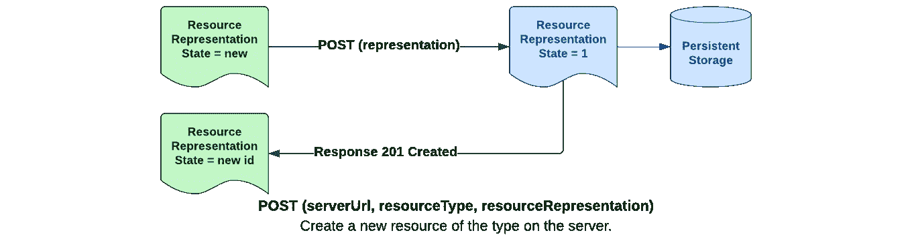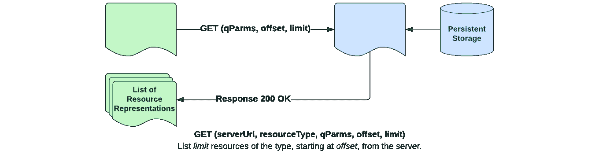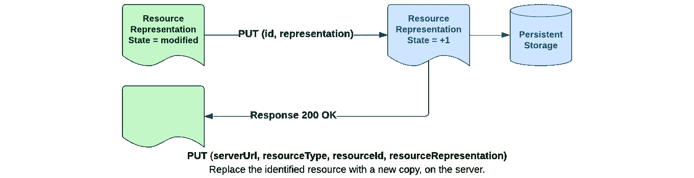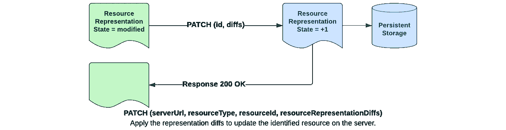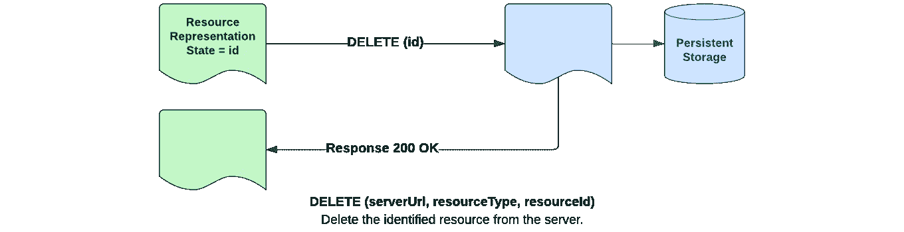

*对于某些人来说，* ***DELETE (serverUrl，resourceType)*** *可能被认为是合法的 REST API 调用，但是由于它会删除某个类型的所有***资源，谨慎的实现通常会拒绝任何没有唯一资源标识符的删除请求。*从另一个角度来看，任何改变资源状态的请求都应该包含一个唯一的资源标识符。*在最低限度上，全包删除应至少要求在呼叫中明确确认意图。**

*如您所见，真正的 REST API 调用肯定不是远程过程调用。它是面向资源表示的，因此具有有限的函数集。REST 促进了请求者和响应者之间轻量级的隐式契约。*

*对于不同的调用，重要的是动词(HTTP 方法)、服务器标识和您正在使用的资源。需要记录的部分是资源表示(有效的数据布局和可接受的值来表示资源状态)；以及您创建的用于优化或修改行为的任何参数。*

*REST 将整个互联网视为一个巨大的资源库，可以对其进行访问和编辑。事实上，尽管我们中的大多数人太年轻而不记得，这就是最初的网络是如何工作的，也是 HTTP 方法 POST、PUT 和 DELETE 存在的原因。当网络仅限于学术界时，几乎不需要安全，几乎任何知道并能访问服务器 URL 的人都可以:*

1.  *向 Web 服务器发布新资源(文档或图像)。*
2.  *从一个网站上获取一个资源，改变它，然后把它放回去。*
3.  *从网站上删除资源。*

*学术界的同辈压力足以最大限度地减少故意虐待。网络上市后，这种田园般的状态绝对不可能持续下去。*

*尽管 REST 最初是为了在互联网上使用而设计的，但它也适用于在任何网络环境中与资源进行交互。Roy Fielding 是 HTTP 规范的主要作者之一，REST 旨在利用 HTTP 的许多属性。然而，Fielding 很小心，没有将 REST 局限于 HTTP。REST 及其近亲[**E**vent**C**arried**S**tate**T**transfer](https://itnext.io/the-event-carried-state-transfer-pattern-aae49715bb7f)可用于许多不同的网络传输。*

*REST 和 ECST 有什么关系？REST 用于发送请求，ECST 用于发布事件。我们使用 REST 来告诉目标我们希望某事发生。我们使用 ECST 来告诉用户发生了一些事情。它们都有一个目标，两者的有效负载都是某个资源状态的标识和表示，再加上一个 HTTP 方法，指定我们希望发生什么或已经发生了什么。对于 REST，目标是一个服务器，对于 ECST，目标是一个事件主题队列。*

## *典型的 REST 场景*

*使用 REST，客户端可以:*

1.  *创建一个特定类型的新资源，方法是**将它的表示发送到服务器。***
2.  ***使用资源类型(有或没有选择标准)从服务器获取资源表示的列表。***
3.  ***使用资源类型和唯一标识符，从服务器获取唯一资源的表示。***
4.  ***使用资源类型和唯一标识符将修改后的资源表示放回服务器。***
5.  ***补丁**是 PUT 的一个网络效率更高的版本，它使用 diffs 而不是完整的表示来传输状态 *(* 参见 [JSON Diffs](https://github.com/flipkart-incubator/zjsonpatch/blob/master/README.md) *)。**
6.  *使用资源类型和唯一标识符从服务器中删除资源。*

*如果客户机是用运行在浏览器上的 JavaScript 编写的，它通常会直接使用资源的序列化 JSON 表示。如果服务器代码是用 Java 编写的，那么使用表示资源的 Java 对象或通过解析 JSON 加载的分层 Java Map 对象通常会很方便。幸运的是，将 Java 对象序列化为 JSON 并将 JSON 反序列化为 Java 对象既快又简单。*

## *代表的力量*

*很多时候，刚接触 REST 的人试图用它实现传统的过程 API 调用。不幸的是，这种方法错过了 REST 架构模式的预期好处——包括通过表示获得的能力。我们听到的许多对 REST 的批评，实际上是对 REST 滥用的批评。让我们尽量避免这个问题，并认识到 REST 表示的真正威力。*

> ****表示*** 可以是表达资源的详细状态和语义的任何可串行化的数据格式，使得它可以作为字节数组在网络上传输，并在另一端重新构建，而不会丢失含义或精度。*

*REST APIs 调用服务。对于单个服务来说，在由[有界上下文](https://levelup.gitconnected.com/whats-the-difference-between-an-aggregate-and-a-bounded-context-85665c28411a)构成的[域驱动设计](https://www.amazon.com/Domain-Driven-Design-Distilled-Vaughn-Vernon-ebook-dp-B01JJSGE5S/dp/B01JJSGE5S/ref=mt_otherstilled-Vaughn-Vernon/dp/0134434420/ref=sr_1_1)中运行是非常有用的。出于使用 REST API 进行设计的目的，将服务视为资源并将其表示为该资源的逻辑数据模型也很有用。*

*举个例子，我们来看一个简单的销售订单。一种方法可能是为创建销售订单所涉及的每个实体实现一个资源及其表示:销售订单、公司、客户、产品、订单行和发票。我们需要底层数据库中的那些资源，所以这可能是个好主意。*

*然而，这确实使销售订单客户机的编码变得相当复杂，因为它需要协调对多个资源的一整套 REST API 调用——以及用户界面管理的隐含需求。幸运的是，REST 利用了分层系统，并且通过表示，可以为我们提供一种更好的方式。*

*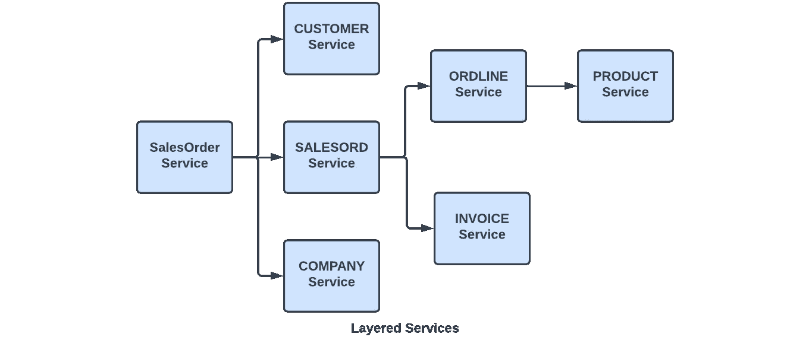*

*在这个场景中，销售订单客户端仅使用销售订单表示向销售订单服务发出 REST 请求。REST 的分层服务对客户机隐藏了底层数据模型的数据导航复杂性，使客户机能够将销售订单作为一个统一的文档来处理，该文档包含客户和公司信息、多个订单行，每个订单行包含一个产品，并最终包含一张发票。*

*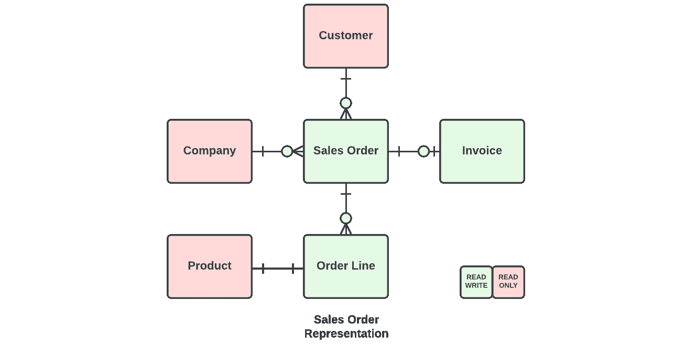*

*为了清楚起见，这个销售订单表示已经相当简单了。但是，希望潜在的概念是清楚的。要使用传统的过程 API 编写客户机，将有许多不同的 API 调用实现的许多函数，每个函数都要学习和使用——并且有许多误解和错误使用它们的机会。对这些 API 调用中任何一个的任何细节的更改都可能破坏客户端。*

*使用 REST 架构风格，需要学习一种表示，即销售订单——以及最多 6 个标准的 REST APIs:创建、列表、获取、上传、修补和删除。在管理复杂性时，利用*分层系统*和*统一接口*的 REST 概念给了我们超越过程 API 的真正优势。销售订单表示强制执行所有数据完整性和关系规则，确保 UI 中的任何验证错误不会进入底层数据存储。*

> **复合结构化资源表示和分层服务的这种使用具有额外的好处，即在顶层服务提供了一种管理数据库事务的方式，以确保底层数据存储不会进入不一致的状态。对于无状态 REST 来说，这是一个困难的挑战。**

## *用 REST 进行版本管理*

*我们如何选择管理 REST 资源的多个版本的共存将影响我们解决方案的可扩展性和可持续性。以下方法适用于 JAX- RS 2.0 URI 路径处理。*

*从概念上讲，有两个版本可供比较:*

1.  *从资源消费者的角度来看,*客户端版本*是资源的版本。它总是请求 URI 的第一部分，即 **/v1/customer/374** 。JAX-RS 使用 URI 部分将请求路由到 Java servlet 和处理它的方法。*
2.  **服务器版本*代表服务器理解的资源版本，并最终标识将处理请求的 Java servlet 和方法。*

*JAX-RS 2.0 预匹配过滤器检查客户端版本，并将请求定向到与该版本兼容的适当 servlet 方法(如果不匹配，则返回 404 错误代码)。客户端请求可以与它所兼容的最新服务版本相匹配。*

**这种方法可以在与单个 servlet 方法一样精细的粒度上实现，即，匹配同一 HTTP 方法但版本不同的多个方法可以共存于同一 servlet 中。**

*该策略要求服务模块版本的目录及其支持的客户端版本可供预匹配过滤器使用。这可以通过定制 Java ***版本(支持客户端版本)*** 在服务模块中标注来实现。服务器通过解析其类路径中的 JAR 文件来构建目录。这需要几秒钟，并且在启动时只发生一次。*

## *休息请求*

*REST 请求在其实现中是一个 HTTP 请求。根据您使用的编程语言，REST API helper 函数的实现会有所不同。这些是你将要工作的重要部分。例如:*

```
***GET: sales.abc.com/v1/SalesOrder?offset=0&limit=100&columns=name,ordId,orderDate&where=[status=Pending]&orderby=name***
```

*   *标识所请求操作的 HTTP 方法(POST、GET、PUT、PATCH 或 DELETE)。方法和资源路径的组合决定了其他输入参数。*

*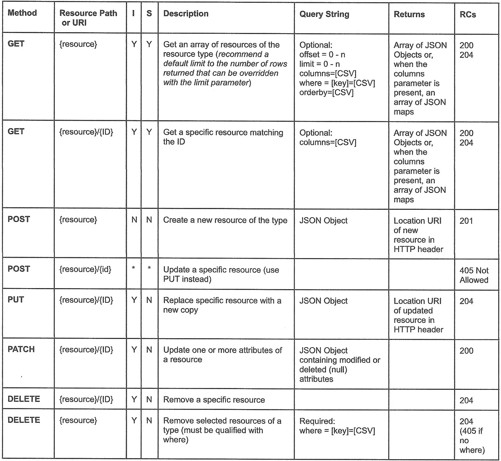*

***表 1 — REST/HTTP 方法***

*   ****服务器地址***(**sales.abc.com**)标识请求将被传递到的特定 REST 服务器。*
*   ****资源路径*** 或**URI**(**/v1/sales order**)标识请求将被交付到的特定资源类型/服务。*客户端版本*(客户端期望的服务版本)始终是 URI 的第一部分。资源路径可以包括单个资源的唯一标识符( **/v1/salesOrder/B214873** )，以获取、放置、修补或删除特定资源。*
*   *一个可选的 ***查询字符串*** ( **？offset = 0&limit = 100&columns =[ordId，name] & orderby=[name，ordId]** )为服务提供额外的输入。*
*   *包含资源表示的可选的 ***主体*** 。只有当 REST 方法是 POST、PUT 或 PATCH 时，才需要主体，以便可以将状态传输到服务器。正文不是请求行的一部分，而是包含在 HTTP 请求的一个单独部分中。*

*除非出现网络分区或灾难性故障，否则到达服务器的任何请求都将在其 HTTP 响应中返回一个响应代码。*

## *休息反应*

*REST 响应被实现为 HTTP 响应。根据您使用的编程语言，REST API helper 函数的实现会有所不同。这些是你将要工作的重要部分。例如:*

*   *指定请求结果的*响应代码*。根据响应的代码和请求类型，响应携带的其他数据会有所不同。通常，一个成功的 GET 请求还会返回一个资源表示数组(因为假设一个查询只返回一个答案是不安全的)。可选地，可以将 POST 编程为返回新创建的资源，或者只返回为其创建的新标识符。**表 2 — REST/HTTP 响应代码** *包含了标准 HTTP 响应代码及其 RESTful 使用的列表。**

*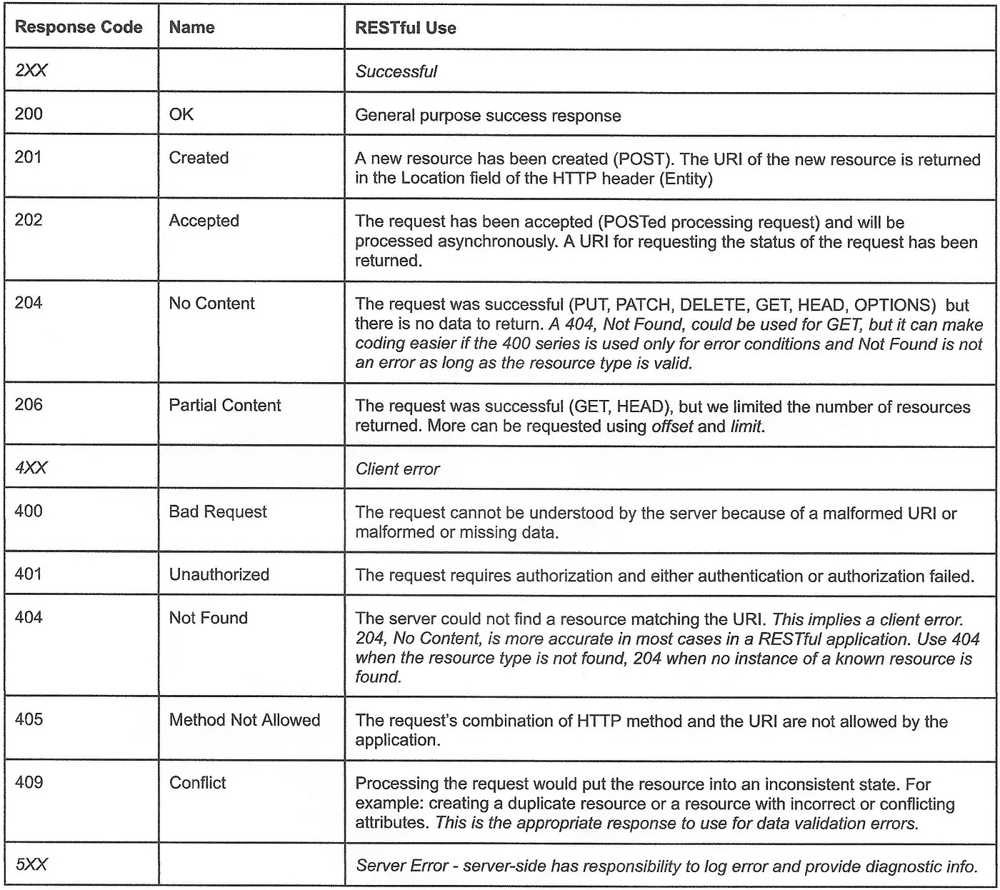*

***表 2— REST/HTTP 响应代码***

*   *一个可选的 ***body*** ，包含响应中返回的资源表示数组。*

## *静止心跳*

*对于 REST 客户机来说，确认它连接到一个响应迅速且健康的服务器通常是很有用的。为了支持这种需求，实现一个低开销的“心跳”服务是很方便的，可以调用这个服务来确认服务器的状态。为此，通常使用 HTTP **HEAD** 方法，因为默认情况下，它返回的数据很少。*

## *REST 查询过滤器*

*查询参数(查询字符串)用于标识在处理请求时要使用的选项。缺少选项不应该导致请求失败，并且在必要时，选项应该具有默认值。*

1.  ***offset=n** 从第 **n** 项(从零开始)开始资源的结果集数组。**偏移**默认为 0。*
2.  ***limit=n** 将资源的结果集数组的大小限制为 **n** 。默认为应用程序分配的值(可能是 20 或 50)。 **-1** 的**限制**表示无限制(注意，可能会导致内存和/或网络问题)。如果当达到限制时还有剩余资源，则返回响应代码 *206 —部分内容*。*
3.  ***列=待选列的逗号分隔值列表**。默认为 ***** 。*
4.  ***where =[key = value pairs separated by commas]**类似于 SQL“where”子句来过滤资源的结果集。不需要默认值。*
5.  ***order by =一个或多个属性名的逗号分隔值列表**对资源的结果集进行排序(遵守**偏移量**和**限制**)。不需要默认值。*

*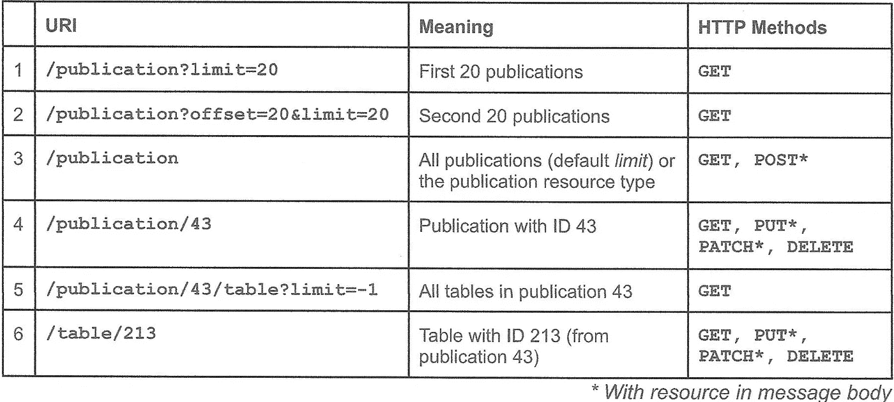*

***表 3 —示例查询过滤器***

*当处理由关系或文档数据库管理系统管理的资源时，这些参数可以实现 GraphQL 支持者所推崇的一些特性，同时遵守 REST 约束。使用这些参数来格式化服务器端查询相对简单。*

## *HTTP 标题*

*HTTP 请求和响应实现了头的概念，头是在请求和响应内在客户机和服务器之间来回传输的 HTTP 消息的一部分。它们本质上是名称/值对，用 Java 方法来设置和获取它们。它们对于在呼叫中传递附加信息非常有用。如果名称以“X”开头，值是一个字符串，那么您可以在 REST API 中以任何方式使用它们。下面的表 4 提供了一些有用的示例。“位置”有一个已经标准化的含义。*

**

***表 HTTP 报头示例***

## *REST API 调用助手*

*直接使用 Java(或其他)API 来操作 HTTP 请求和响应是乏味且容易出错的。在实现语言中创建自己的 API 调用格式，通过底层的 HTTP APIs 发出 REST 请求并处理 REST 响应，会有效得多。*

> *使用 REST API 调用助手的一个非常有说服力的理由是，它们可以让您不必考虑 HTTP。REST 和 ECST 不需要 HTTP。事实上，ECST 通常使用消息队列技术，如 Kafka 或 ActiveMQ Artemis。REST 可以使用您选择的任何网络协议。保留你的选择。*

*助手 API 在调用参数和 HTTP 请求之间进行转换，并将 HTTP 响应转换为开发人员友好的响应。只有一组六个 API 调用，因为使用中唯一不同的是服务器地址、URI、查询字符串和主体。例如:*

```
*RestResponse response = RestAPI.**POST**(String server, String URI, Object body);RestResponse response = RestAPI.**GET**(String server, String URI, String queryStr);RestResponse response = RestAPI.**PUT**(String server, String URI, Object body);RestResponse response = RestAPI.**PATCH**(String server, String URI, Object oldBody, Object newBody);RestResponse response = RestAPI.**DELETE**(String server, String URI);RestResponse response = RestAPI.**HEAD**(String server, String URI);*
```

## *包扎*

*代表性状态转移是跨网络连接客户机和服务器的一种有用而强大的模型。真正的 REST API 调用肯定不是远程过程调用。它是面向资源表示的，因此具有有限的函数集。 *REST 促进了请求者和响应者之间轻量级的隐式契约。**

*很多时候，刚接触 REST 的人试图用它实现传统的过程 API 调用。不幸的是，这种方法消除了 REST 架构模式的预期优势——包括通过表示获得的能力。我们听到的许多对 REST 的批评，实际上是对 REST 滥用的批评。让我们尽量避免这个问题，并认识到 REST 模型的真正威力。*

*对于有兴趣用 Java 实现一个 REST API 的人，我强烈推荐[*RESTful Java with JAX-RS 2.0:设计和开发分布式 Web 服务第二版*](https://www.amazon.com/dp/B00GP44SKS) 针对其编码知识*。它是为 Java EE JAX-RS 2.0 编写的，但是 Jakarta EE REST 库实际上是相同的，除了“Jakarta”而不是“javax”包名。**

*谢谢你。👍*