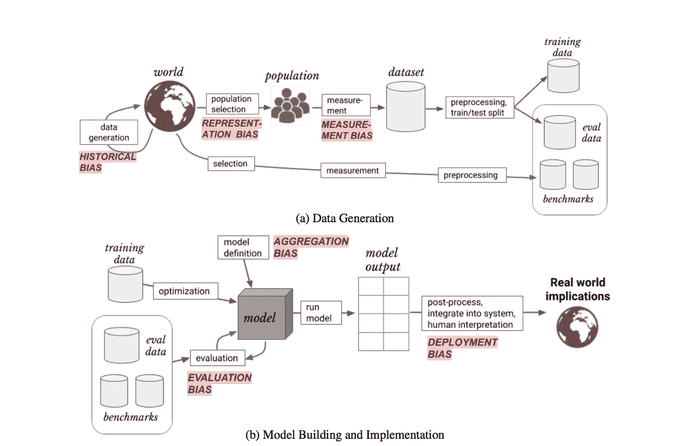
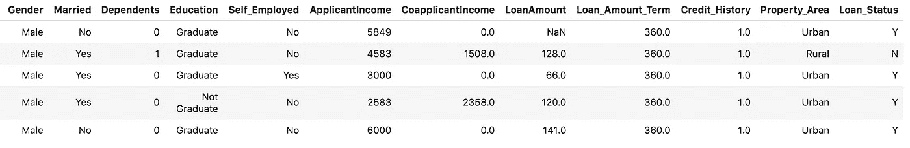
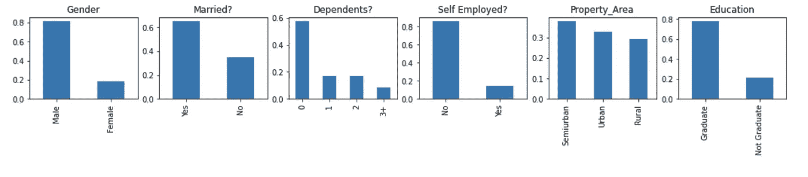
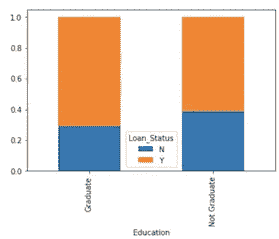
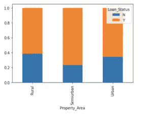
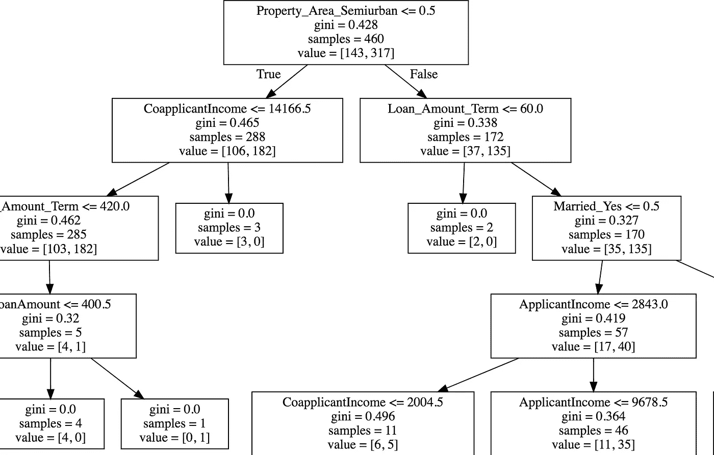
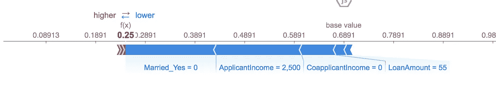

# 设计公平的以人为中心的人工智能系统

> 原文：<https://medium.com/nerd-for-tech/designing-fair-human-centric-ai-systems-e5164a77cca1?source=collection_archive---------22----------------------->

随着越来越多的人工智能模型部署在多个领域，有一种趋势是设计可以解释的道德人工智能系统。想要解释模型的原因是为了防止任何形式的歧视或偏见，这种歧视或偏见可能会导致某些人群由于性别、种族、年龄或其他人口统计特征而获得不利的结果。此外，模型有时会学习垃圾特征，并在应用于新的未知数据集时崩溃，因此，了解模型正在为“正确的原因”学习结果是很重要的。

例如，亚马逊不得不取消一个过滤女性候选人的招聘引擎。虽然大多数行业的技术角色仍然主要由男性主导，但选择候选人的基础是他们是男性而不是同样合格的女性，这可以被认为是一种人工智能偏见。另一个例子是苹果的信用卡，它歧视女性，为女性群体提供较低的信用评分( [2](https://www.bbc.com/news/business-50365609) )。

## AI 模型该不该解释？

这个问题的答案取决于用例、期望的结果以及谁将受到 AI 决策的影响。一直解释人工智能模型也不是那么简单。这里我们列出了人工智能可解释性的一些挑战。

1.  **模型可能非常复杂:**深度学习技术越来越多地被用来处理文本、图像和音频等非结构化数据集。当数据集不是表格格式时，解释模型中的内容可能会非常困难。即使是表格数据集也有许多特征的组合和排列，使得模型难以理解。此外，如果我们训练一个卷积神经网络来识别物体，我们可能能够可视化网络的一些内层，如上所示，但解释它们可能很难。
2.  人工智能设计需要以人为中心的方法，其中模型的目的和结果是关键:用人类或最终目标来训练模型意味着什么？在一个有趣的应用程序中对物体进行错误分类，告诉你一张照片是一只猫还是一只狗还是一辆车，这不会影响任何人，所以解释这个模型可能很有趣，但不是必不可少的。然而，如果从闭路电视摄像头接收数据的人工智能模型未能检测到刀或任何其他武器，其后果可能是致命的。类似地，在招聘过程中分配信用分数或歧视某人确实会对某人的生活产生影响，并且应该加以解释。请注意，解释模型并不等同于仅仅公开模型的所有底层内容。
3.  设计人工智能系统时，必须充分理解公平目标:模型的“公平”程度将由我们试图实现的人类结果决定。为了通过工作实例理解这一点，IBM Fairness 360 toolkit 提供了一些有用的公平性定义(4)。我们是在试图最大化**个人公平**还是**群体公平？如果最大化个人公平性，人工智能模型应该确保相似的个人获得相似的治疗和结果。然而，如果最大化群体公平，目标可能是提高无代表群体的成功机会。这两种结果之间有细微的差别。**
4.  **模型的稳健性和安全性是必须的:**任何一款新产品进入市场，都需要在不同条件下进行压力测试，以确保产品的安全性。对于人工智能模型，这意味着我们应该在不同的上下文环境中训练模型，以确保它们不会崩溃，并在部署之前让独立的验证者审查它们。此外，数据集可能存在历史偏见(下一节将解释偏见)，因此当模型的结果对某人的生活产生重大影响时，应控制此类情况。

## 人工智能模型中有哪些不同类型的偏差？

Kaggle 最近发表了一篇关于人工智能伦理课程的介绍，更深入地探讨了这些问题。

解释人工智能模型中不同类型的偏差。原始纸张见(7)

**历史偏差:**当输入样本数据有缺陷，导致模型可能选择一个组优于另一个组时。例如，STEM 职业中女性相对于男性的比例历来较低。

**表示偏差:**如果一个类在训练数据中没有足够的实例，就会发生这种情况。例如，如 kaggle 教程(5)所述，> 65 岁的人比年轻人群的智能手机使用率低。因此，根据智能手机数据训练的模型可能只代表年轻群体的偏好，而排除了那些老年人。在医疗诊断中，我们可能希望使用人工智能来检测患有罕见遗传疾病的患者，但这种情况在数据中非常罕见，因此该模型将准确检测健康的患者，并可能将患病的患者归类为健康的，因为数据中缺乏代表性。

**测量偏差:**当您无法直接测量数量时，代理数据会出现测量偏差。例如，如果仅使用医院账单作为代理来预测去医院就诊的患者的健康状况的严重性，我们可能会排除有潜在疾病但不信任或无力支付健康账单的少数人群。

**聚集偏差:**如果我们正在测量一个模型的准确性，该模型预测谁有可能在贷款上违约，根据基线，只有 5%的个人违约，多数模型将有 95%的准确性。因此，每个类别的召回率或准确性很重要，因为合计两个数量不会反映模型的真实性能。

**评估偏差:**一个模型可能对已知数据集表现得很好，但如果应用于新的未知数据，就会失效。例如，面部检测系统可以很好地识别单一种族的面部，但是如果暴露于新的种族，则该系统会崩溃。

**部署偏差:**一个算法可能对一个给定的用例非常有效，但是如果在部署时用于不同的预期目的，就会失效**。**例如，为预测谁将购买特定产品而训练的模型可能不适合预测谁将拖欠贷款，尽管这两种用例之间可能有一些重叠或关联，但当出于非预期目的部署时，模型可能会崩溃。

## 公平如何适用于贷款申请？(探索分析 Vidhya 的贷款数据集)

鉴于本文篇幅有限，对数据集的全面探索可以在[这里](https://www.kaggle.com/purswaninuri/xai-loan-data)找到。在本例中，我们利用了 Analytics Vidhya 发布的教程中的[房屋贷款数据集](https://courses.analyticsvidhya.com/courses/loan-prediction-practice-problem-using-python?utm_source=practice_problem_Loan_Prediction-III&utm_medium=Datahack)。虽然还不清楚这些数据是真实的还是模拟的，但它可以帮助我们理解一些公平的例子&人工智能的可解释性。

发布在 Kaggle 上的分析 Vidhya 的房屋贷款数据集预览

正如我们从示例中看到的，数据集包含许多人口统计属性。这些属性包括婚姻状况、性别、教育程度、受抚养人数等等。贷款状态标志确定贷款是否被授予该个人。对数据的进一步研究表明，大约 65%的贷款获得批准。在下图中，我们显示了贷款申请人的一般情况。

分析 Vidhya 房屋贷款数据集分类输入的一般数据探索

该数据可能包含一些代表性偏差，因为历史上申请贷款的女性少于男性。此外，大多数贷款申请人是大学毕业生，他们大多来自城市或半城市地区，而不是农村。将贷款结果叠加到这些特征上是有用的，这样可以查看数据中是否存在任何偏差。所以我们可以看看一个群体内赞同的比例。如数据所示，毕业生群体以及半城市和城市群体的认可率略高。原因可能是历史和代表性偏见的结合，但也受到其他因素的驱动，如贷款金额、整体风险或某些申请人没有信用历史。

毕业生群体的贷款批准比例略高

越来越多的贷款批准来自城市和半城市地区的申请人，而不是农村地区

深入细节和特征之间的相关性将是更好地理解数据的一个好步骤。然而，退一步，从最终用户的角度考虑一下:如果一家银行要部署一个人工智能代理来决定谁获得贷款，而申请人对结果提出质疑，银行将如何向贷款申请人解释输出结果？

在这个例子中，我训练了一个决策树分类器来预测任何给定的申请人是否会得到贷款。这不是我能训练的最准确的模型，但是如果我向最终用户解释它的输出，即使是银行的员工也不会解释它，如果我向他们展示下面的图表来解释模型的输出。

显示模型的潜在特征并不意味着它是可以解释的…

尽管这个模型的内容是公开的，但是将它转换成人类可以理解的可消费的解释仍然是需要考虑的事情。我们可以可视化模型输出的另一种方式是通过查看 [SHAP 值](https://www.kaggle.com/dansbecker/shap-values)。如下例所示，应该彻底检查用受保护属性训练的模型，因为在这种情况下，机器学习模型拒绝了贷款。拒绝的一个关键特征是这个人是未婚的。虽然可能有更重要的因素，如贷款额或收入门槛，但如果有人对此进行解读，并说…“模型拒绝了你的申请，因为你没有结婚”，这就说不通了，对吗？因此，当设计人工智能驱动的决策支持系统时，用户应该总是站在最前沿来决定模型需要的解释水平。

模型拒绝贷款的申请人的 SHAP 值。在这种情况下，真正的标签是批准。

## 结论

虽然这是一个虚拟的例子，因为有一个错误的分类错误，但这个例子表明，在模型设计过程中，当把最终用户放在心上时,“为什么”和“是什么”一样重要。此外，模型的可解释性并不总是等同于“可理解性”。有不需要模型解释的情况，但也有需要的情况。因此，理解两者之间的区别是很重要的。

总之，在模型上保持强大的人工智能治理并教育人工智能从业者是必要的。如果偏见是一个问题，许多偏见缓解方法，如 IBM 的 Fairness 360 toolkit，提供了处理带有历史和表示偏见的不平衡数据集的方法。其次，提出更具视觉吸引力和以人为中心的方法来解释模型，对于增加对使用人工智能工具进行决策支持的信任至关重要。最后，在决定需要哪一级别的解释以及了解谁是最终用户谁将受到决策的影响之前，应该预先确定机器学习模型的用例的后果或重要性。

## 参考

(1)[https://www . Reuters . com/article/us-Amazon-com-jobs-automation-insight-iduscn1 MK 08g](https://www.reuters.com/article/us-amazon-com-jobs-automation-insight-idUSKCN1MK08G)

②https://www.bbc.com/news/business-50365609

④https://aif360.mybluemix.net/resources#glossary

(5)[https://www.kaggle.com/var0101/human-centered-design-for-ai](https://www.kaggle.com/var0101/human-centered-design-for-ai)

(6)[https://www.kaggle.com/alexisbcook/identifying-bias-in-ai](https://www.kaggle.com/alexisbcook/identifying-bias-in-ai)

(7)[https://arxiv.org/pdf/1901.10002.pdf](https://arxiv.org/pdf/1901.10002.pdf)

贷款预测教程(分析 Vidhya):

 [## 贷款预测练习题(使用 Python)-免费课程

### 1 课程简介目录问题陈述假设生成练习 2 |讨论获取…

courses.analyticsvidhya.com](https://courses.analyticsvidhya.com/courses/loan-prediction-practice-problem-using-python?utm_source=practice_problem_Loan_Prediction-III&utm_medium=Datahack)