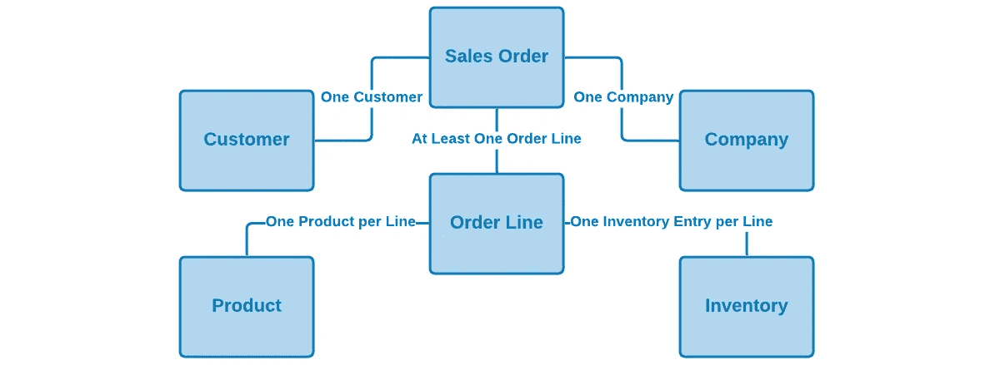
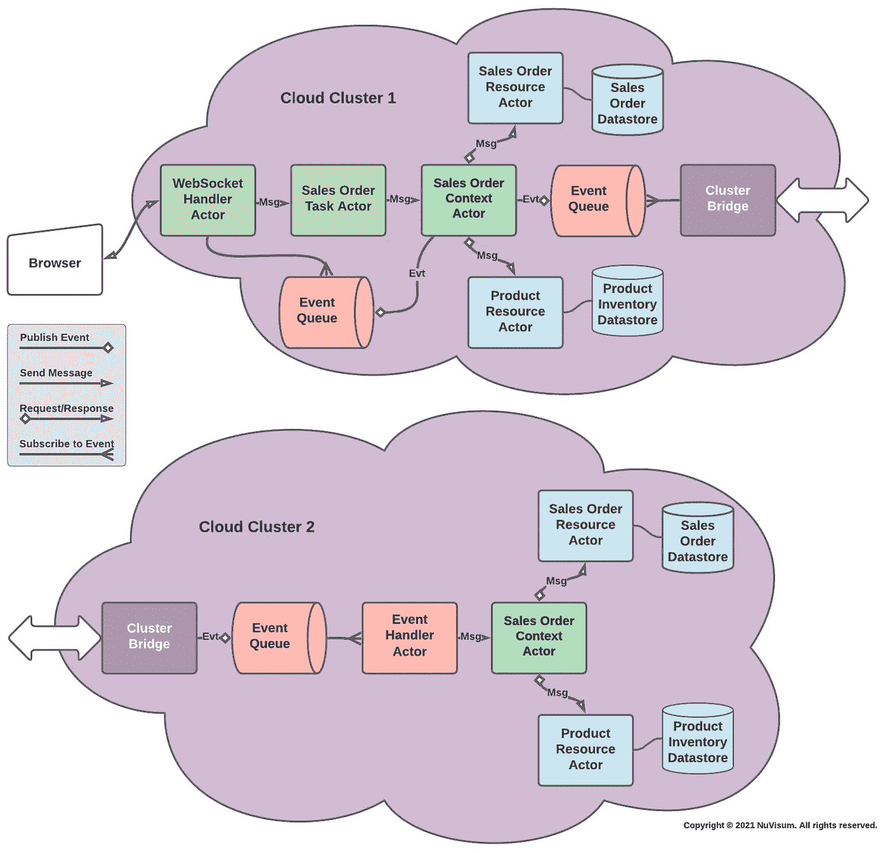
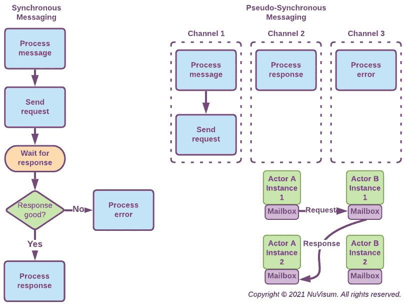

# 设计微服务

> 原文：<https://medium.com/nerd-for-tech/designing-microservices-4130bc41c046?source=collection_archive---------1----------------------->

## 设计和构建微服务的实用方法

***如何做好微服务实现最难的部分:将遗留应用功能或新的应用需求转化为真正发挥微服务架构模式优势的微服务。***

## 首先，微服务为什么重要？

在某种程度上，现代生活中的几乎一切都受到计算和计算机软件的影响。令人衰弱的软件开发积压已经是一个普遍的问题——计算正处于向*混合云*的重大范式转变中。在应对竞争挑战和机遇时，严重缺乏速度和敏捷性是不可避免的结果。这很像穿着厚重的靴子赛跑，而你的对手却穿着运动鞋。

我们需要新的软件设计和架构模式，以更好地解决开发积压和混合云的优势。*微服务架构模式*是那些重要的新模式之一。

## 微服务解决什么样的问题？

微服务架构模式通过以下方式针对当今一些更紧迫的软件开发、部署和操作问题:

*   **通过优化*敏捷软件开发、交付和维护*实践，缩短软件开发周期**。
*   **通过简化软件*测试*、*持续集成*和*持续交付*，实现快速应用特性迭代**。
*   **利用云*容器*和*容器编排*提供的自动化部署、伸缩和故障转移**功能。

其理念是，通过增加软件组件之间的隔离，微服务可以快速独立地交付系统的小型离散部分，通过利用 [*容器和容器编排*](https://www.ibm.com/cloud/learn/containerization) 可以跨云集群交付高度的水平可伸缩性和容错能力。

## 那么什么是微服务呢？

微服务架构模式是将应用程序需求分解成可管理的、可独立部署的组件的有效方法，这些组件可以连接在一起形成完整的应用程序。这种模式被称为*微服务*是因为它的组件往往比传统的[**服务-* ***O*** *面向* ***A*** *架构**](https://en.wikipedia.org/wiki/Service-oriented_architecture) *服务更小，但它不仅仅是更小。*

*如果做得正确，微服务模式满足或超过了著名备忘录的所有要点和目的，这有助于为亚马逊无与伦比的业务敏捷性奠定基础。这份 [***备忘录***](/nerd-for-tech/the-memo-amazons-secret-sauce-e99bdc37c65f#6f9a) *非常值得花点时间去阅读。这是微服务具有良好商业意义的根本原因。**

*单个微服务:*

*   *在单个**域有界上下文**中实现一个**任务**(或一组密切相关的任务)。这是微服务的一个基本特征，它促进了高层次的*粒度*和*关注点分离*，从而保留了微服务的*自主性*和*独立可部署性*。*
*   ***是松耦合的**，通过消息传递或事件进行通信，并且很少或不需要了解其他微服务的定义——强制*关注点分离*。*
*   *是**自主的**，并且可以在相关开发团队之间较少协调的情况下进行开发和修改——促进合理的*敏捷开发实践*。*
*   ***可独立部署**并且可以单独测试、部署和回滚，而不会影响其他微服务——支持基于云的*自动化部署、扩展和故障转移*。*

*记住这四个基本约束。如果一个应用组件不满足这些要求，它可能仍然是一个服务，但是它不是微服务，而且它不太可能提供微服务架构模式所承诺的所有好处。*

## *微服务即服务*

*重要的是要明白，尽管微服务是一种面向服务的架构,communication%20protocol%20over%20a%20network.)*，但并不是所有的 SOA 实现都是微服务。使用流行的 SOA 框架很难实现微服务的全部承诺。**

> *****讨论:***[*Spring Boot*](https://spring.io/projects/spring-boot)是一家名为 [Pivotal Software](https://www.crn.com/slide-shows/virtualization/5-things-you-need-to-know-about-vmware-s-acquisition-of-pivotal) 的公司维护的开源微框架。它为 Java 开发人员提供了一个平台，可以开始使用一个可自动配置的生产级 Spring 应用程序。有了它，开发人员可以更快地提高工作效率，而不会浪费时间来准备和配置他们的 Spring 应用程序。 *Spring Boot* 通过隐藏构建和配置在 Java servlet 容器中运行的服务的复杂性，使得创建 SOA 服务更干净、更容易——而 *Spring Boot* 创建可在云容器中部署的可执行 JAR 文件。但是 *Spring Boot 的*单个服务不是*可独立部署的*，它的可执行 jar 在几秒内启动，而不是微服务所需的几毫秒。Spring Boot 是构建和部署传统 SOA 应用程序的绝佳选择，但是每个 Spring Boot 生成的可执行 JAR 都包含一个嵌入式 Web 服务器和 Spring 框架的一个子集。不是*微服务*。**

**云原生应用经过专门实施，可在私有、公共和混合云中提供一致的开发、部署、自动化管理和通信模型。它们旨在利用通过容器和容器编排提供的自动化部署、伸缩和故障转移功能。传统的 SOA 框架不能很好地支持这一点。**

## **是什么让微服务设计与众不同？**

**微服务是一个松散耦合的、自治的、可独立部署的组件。这些属性并不是微服务独有的。让微服务更具设计挑战性的是，微服务完全在域[有界的上下文](https://levelup.gitconnected.com/whats-the-difference-between-an-aggregate-and-a-bounded-context-85665c28411a)中运行。**

**微服务唯一能看到或修改的数据要么在它的有界上下文中，要么在它所响应的消息中。微服务是被动的、无状态的和可重入的。它对消息作出反应，并且从一个消息到下一个消息不保持任何状态。除非数据已经通过微服务的有界上下文写入持久存储，否则在消息之间没有数据存活。**

**直到你习惯了它们，这些约束看起来是相当有限的。那么它们提供了什么好处呢？我们得到了什么使得约束值得学习使用？让我们继续读下去。**

## **什么是域有界上下文？**

**微服务设计的第一个挑战是为每个微服务划定界限。这就是理解 [*领域驱动设计*](/better-programming/why-domain-driven-design-203099adf32a) 概念的一个 [*有界上下文*](https://levelup.gitconnected.com/domain-driven-design-in-software-development-f92c3f58d012) 非常有用的地方。**

**简单地说，语境指的是某事发生或存在的规则和条件。我们使用*有界上下文*将单个微服务的功能与业务组织边界、规则和数据所有权联系起来。这样，微服务可以由其团队开发、部署和修改，而与其他微服务开发团队的干扰最小。我们使用它来实现高层次的*粒度*和*关注点分离*，从而保持微服务*自治性*和*独立可部署性*。**

**那么，我们该如何施展这个魔法呢？正如你将看到的，我们通过利用 [*演员模型*](/nerd-for-tech/building-cloud-native-apps-part-1-393d250cf107#963b) 的能力来尊重真实商业组织的真实组织边界和规则。**

## **为什么要用演员模型？**

**早在云计算出现之前，[*actor model*](https://en.wikipedia.org/wiki/Actor_model)*就是专门为*设计的，并且已经被证明能够满足*多云应用的基本需求——并发性、故障转移和可伸缩性。严肃的云应用程序开发人员现在将它作为微服务组件模型来工作，以满足当今的需求。***

> **演员模型微服务是无状态和反应式的，通过*输入通道*处理输入消息，通过*输出通道*发送消息和发布事件。所有消息和事件 IO 都通过一个 actor 附属的*邮箱*传递。**

***Actors* 接近于分布式微服务的理想组件模型，因为:**

*   **角色实例是*反应型的*，只有当*对消息*做出反应*时，才执行规则、逻辑和数据转换。***
*   *Actor 实例是绝对*可重入*和*无状态*。它们一次只对一条*消息*做出反应，并且不存储之前处理过的*消息*。对*消息*作出反应所需的所有数据必须在*消息*本身中或在持久数据存储中。*
*   *当需要执行某些操作时，执行元实例会将*消息*传递给其他执行元实例。*
*   *当 Actor 实例需要告诉相关方一些事情时，它们会发布*事件*。*
*   *受一个上下文约束的 actor 实例可以将*消息*传递给受另一个上下文约束的 actor 实例，或者为其发布*事件*——使其能够使用由其他团队开发、部署和维护的微服务。*

**

***图 1:某演员模特微服***

*actor 模型创建反应式微服务，其属性在 [***反应式宣言***](https://www.reactivemanifesto.org/) 中有深入讨论。17 分钟的 YouTube 视频，标题为 [***什么是反应式系统？***](https://youtu.be/eRxLfUIMJwk) ，很好的解释了反应式系统的优点。*

## *微服务应该有多大？*

*简单的回答是越小越好。但是这个答案有两个部分:*

*   *简单的部分是为了促进动态*伸缩*和*故障转移*我们需要保持容器足够小，以最小化启动它们所需的计算资源和时间。微服务容器启动时间应该以毫秒而不是秒来度量。如果不是，很可能是太大了。*
*   *更复杂的部分是，要成为*自治的*和*可独立部署的*，微服务必须专注于实现单个任务(或一组密切相关的任务)，该任务在其问题域内被明确定义的上下文(数据含义、所有权和责任)紧密绑定。单个服务尝试做的事情越多，或者它的环境越广，它就越不可能是一个有效的微服务。如果一个微服务开始变大，您可能需要重新评估它的有界上下文和它所分配任务的范围。越小越好。*

> ****讨论:*** 请记住，大型、复杂的任务通常可以分解成单独的子任务——每个子任务都由自己的微服务实现。根据它们的用途，可以通过消息传递或发布事件来调用这些新的微服务。*将微服务更多地视为通过消息或事件调用的方法、功能或子例程，而不是传统的程序，这很有用。**

## *微服务部署单元*

*微服务架构模式的许多好处来自于它的单元可以被实现和部署的细粒度。部署和管理真正的微服务(相对于 Spring Boot SOA 服务)需要[容器化](#ff29)和 [Kubernetes](https://kubernetes.io/docs/tutorials/kubernetes-basics/) 这样的容器编排器。*

*简单来说，*容器*是一个虚拟化的可执行映像。该映像可以被推送到一个集中的容器注册中心，Kubernetes 使用该注册中心将容器实例部署到一个云集群的 pod 上。容器注册中心的概念极大地简化了由多个小容器组成的 pod。*

*一个 *pod* 可以被看作是容器实例的一种包装器。每个 pod 都有自己的 IP 地址，通过该地址它可以与群集中的其他 pod 进行交互。通常，一个 pod 只包含一个容器。但是如果容器需要共享资源，一个 pod 可以包含多个容器。如果一个 pod 中有多个容器，这些容器通过 *localhost* IP 地址相互通信。*

*在实现微服务架构模式时，一个 pod 至少包含一个应用程序容器和一个 [*message broker 代理*](#126e) sidecar 容器(以将其连接到应用程序的其余微服务)。通常，主微服务容器将与它直接发送消息的任何从属微服务容器一起打包在一个 pod 中。*

**

***图 2:典型的微服务吊舱组成***

> ****讨论:*** 术语 ***容器*** 不应与 ***Web 容器*** (也称为 ***servlet 容器*** )混淆，后者是与 Jakarta Servlets 交互的 Web 服务器的组件。Web 容器创建 servlet 实例，加载和卸载 servlet，创建和管理请求和响应对象，并执行其他 servlet 管理任务。*

*关于微服务的一个常见问题是多个容器的运行时开销以及它们之间连接的延迟。实际上，对于设计合理的微服务来说，这很少是个问题。*

*这是众多 [**基准**](https://drive.google.com/file/d/1ImWL0y-ZT7_oIALw69wJAn-yB94u_g3W/view?usp=sharing) 中的一个，表明容器在 CPU 性能、内存吞吐量、磁盘 I/O、负载测试和操作速度方面比虚拟机表现更好。容器针对快速启动小型可执行文件进行了优化。同一集群内的微服务之间的消息传递延迟可以忽略不计。*

## *微服务参与者的类型*

*单个微服务可以通过它们执行的服务种类来描述，非常类似于传统分层架构系统的层次——没有旧架构的开发、部署和运行时限制。应用系统中的大多数微服务参与者都属于这些类别之一，并通过消息传递相互通信:*

*   ***应用任务**参与者从用户的角度实现离散的应用任务。他们往往是最不稳定的参与者，也是与应用程序特性关系最密切的微服务。任务参与者只能通过上下文处理者参与者来访问、创建和修改持久数据。*
*   ***上下文处理器**角色由任务角色使用，用于通过表示特定域边界上下文的逻辑视图来创建、读取、写入和删除数据。他们可以使用单个资源处理程序或多个资源处理程序。上下文处理器向任务参与者实例呈现有界上下文的逻辑可执行模型，并与资源处理器交互以映射、存储和检索物理数据模型中的数据。*上下文处理程序及其相关资源处理程序为应用程序的其余参与者执行分布式数据管理(故障转移、扩展、复制、一致性)的繁重工作。**
*   ***资源处理器**角色被上下文处理器用作持久物理数据模型的适配器。上下文处理程序使用它们来将资源映射到持久存储和从持久存储映射资源，非常类似于像 [Hibernate](https://hibernate.org/orm/) 这样的对象关系映射器，将对象映射到关系数据库和从关系数据库映射对象。资源处理程序负责资源缓存管理。*资源是驻留在非易失性存储中的东西，如文件、键值存储和数据库。**
*   ***消息代理**角色是连接各个角色的线路，通过组织它们之间的消息传递，并作为*断路器*来停止级联错误情况。 ***代理管理云角色模型的故障转移、伸缩和自组织能力。当一个代理运行时，它向所有其他可到达的代理广播它的存在。代理跨云集群联合，并相互共享状态信息。一个小的**代理**在每个 actor pod 中作为边车存在，以便于 actor 注册和使用许多潜在代理中的最优代理传递消息。代理接收寻址到特定 actor *type* 的消息，并将它们路由到该 actor 类型的最佳实例的物理地址。一个 ***邮箱*** 与每个单独的 actor 实例配对，为 actor 缓冲传入的消息，并代表 actor 实例发送消息并与代理服务器通信。 ***通常只有一个 message broker 微服务 actor 类，但是在每个云集群中至少有一个(通常更多)正在运行的 message broker 微服务实例。*******
*   *事件发布者演员通过分布式流队列系统发布事件消息，如 Kafka 或 Apache ActiveMQ Artemis。它们通过*主题*向事件队列发送事件消息。发布者对他们的订阅者一无所知，他们把流媒体队列的技术细节留给了排队软件。*
*   ***事件处理者**参与者订阅指定*主题*的消息队列。处理程序按顺序从队列中读取每条消息，并将其转发给适当的 actor 实例。*
*   ***web socket handler**actors 是[*web socket*](https://en.wikipedia.org/wiki/WebSocket)*服务器*，它们接受请求并将它们作为消息路由到适当的任务 actor 实例。如果 WebSocket 处理程序收到响应消息，它会匹配并将其发送给原始请求者。超时由请求者处理。WebSocket 处理程序是*内部边缘*角色，支持从云集群外部进行访问。*web socket 处理程序可用于实现进出外部或基于浏览器的应用程序的安全全双工消息传递，但可在必要时将对话降级为同步 HTTP。**
*   ***集群桥**参与者在云集群之间移动消息，实施和加强集群间安全性，并优化集群间消息传递。*这对卡夫卡的表演尤为重要。**
*   ***实用程序处理器**分布式记录器、错误处理器和事务监视器等角色在大多数微服务部署中执行实用程序功能。*
*   ***stranger facade**actors 为[*stranger Fig 模式*](https://docs.microsoft.com/en-us/azure/architecture/patterns/strangler-fig) 实现了一个基于规则的 facade**，并且可以在成熟应用逐渐转变为多云应用时，将遗留 API 调用重定向到新的支持云的应用。***

> ***分层架构模式的所有优势都可以通过微服务的明智设计来实现——没有紧耦合的缺点，也不需要大型可执行文件的整体部署——同时支持云友好的*自动化部署、扩展和故障转移*。***

## ***关键的设计理念***

***有效的微服务设计和实现中最关键的元素是域限制上下文。有界上下文必须为负责该上下文的组织单元提供保证该上下文数据的完整性和安全性的方法，同时使其可供其他组织单元的微服务访问和使用。***

***实现这一点的一种方法是让有界上下文成为一级角色。这意味着实现有界上下文的微服务参与者由开发团队创建、部署和维护，该团队对拥有数据的组织单位负责。使用该上下文的所有其他微服务只能通过上下文发布的微服务来访问它。这意味着任何微服务——由任何开发团队创建、部署和维护——只能使用数据所有者定义和实施的规则读写上下文的持久数据。***

******

*****图 3:销售订单上下文实体*****

***上下文处理器的概念有助于解决支持云的微服务的设计者面临的两个更复杂的挑战:***

*   ***通过为微服务任务描述和实现有效的域约束上下文，上下文处理器将数据(以及构成上下文的规范、关系、规则和行为)汇集在一起，以便创建可单独部署和可重用的组件。***
*   ***通过管理分布在多个集群中的多个数据存储实例来实现扩展和故障转移。上下文处理器负责发布连接的云集群中的上下文处理器使用的上下文更改事件，以便同步它们的持久数据存储实例。***

## ***传递的消息和事件***

***微服务是松散耦合的，通过消息传递或事件进行通信。这一点，加上无状态和可重入性，使它们能够很好地作为分布式组件运行。从单个微服务的角度来看，它所响应的消息是传递的消息还是事件的负载并没有什么不同。[事件承载的状态转移](https://prateek-ashtikar512.medium.com/microservices-design-patterns-event-carried-state-transfer-c4b66a58df00)(或 ECST)模式对于实现这个概念很有用。***

****使用 REST 和 ECST 进行消息传递简化了 API 设计和实现——同时减少了必须记录和管理的单个消息格式的数量。****

> ***微服务消息应该是可序列化的，这样它们就可以很容易地在网络上传输。为了避免分布式模式管理的复杂性，它们也应该是自描述的。为了安全起见，应该对它们进行加密和数字签名。JSON、GZIP 压缩和 TLS 的结合有助于满足这些要求。***

***当我们想要做某事的时候，一个信息被传递。当我们需要报告已经发生的事情时，事件被发布到一个主题。传递的消息由单个目标参与者处理。事件由订阅其主题的所有参与者处理。***

******

*****图 4:带有上下文处理器的微服务*****

***如果我们看一下上面的*图 4:具有上下文处理器*的微服务，我们可以看到，在云集群 1 中，销售订单上下文参与者通过更新两个数据库并发布一个销售订单事件来对添加销售订单消息做出反应，其中添加销售订单消息作为其有效负载。云集群 2 中的事件处理者 Actor 订阅销售订单添加事件，提取其添加销售订单消息，并将其传递给其本地销售订单上下文 Actor，后者进而更新其两个本地数据库，最终将更改镜像到云集群 2 上的云集群 1 的数据库。***

****销售订单上下文参与者可以由任何开发团队编写的任何微服务使用，这些微服务需要实现与销售订单相关的任务，而销售订单上下文数据仍然受到销售订单上下文参与者所实现的规则的保护。****

## ***同步与异步消息传递***

***微服务通过消息传递进行通信，而不是通过函数调用、方法调用或远程过程调用。由于许多原因——有些与消息传递可能对系统性能产生的影响有关——消息传递是异步的。一个 actor 实例不会等待响应，所以它不会占用可执行线程。这对性能来说很好，但实际上，我们用计算机做的很多事情都涉及请求和响应。我们该如何处理？***

******

*****图 5:伪同步消息传递的优势*****

***一种方法是通过使用*伪同步*消息传递(*图 5:伪同步消息传递*的优点)，其中响应角色实例向请求角色类型实例发送*响应类型*消息，请求角色类型实例将使用辅助通道处理该消息类型。因为 actor 实例是无状态的，所以请求 actor 类型的任何实例都可以完成这项工作，并且没有人需要等待响应。它被称为伪同步消息传递，因为从用户的角度来看，它完全像一个普通的请求-响应，但是它的机制是完全异步的。***

## ***消息通道构造***

***一个**输入通道**是一个附加了消息处理逻辑的输入消息流，参与者使用它来对单个消息*类型*和*类别*做出反应。*类型*是一种特定于应用的消息格式。*类别*有三种类型:***

*   *****任务**类别消息调用参与者的主要任务逻辑。它们类似于传统的 API 调用。任务消息也可以是事件的有效负载。***
*   *****响应**类别消息传达来自另一个参与者的成功响应(带有数据)。***
*   *****错误**类别消息传达来自另一个参与者的错误响应(带有数据)。该错误可能是应用程序错误或消息传递失败。***

*****输出通道**是一个输出消息流，参与者使用它来:***

*   ***向特定执行元类型发送任务消息。***
*   ***向特定事件主题发布事件消息。***
*   ***向特定的执行元类型发送响应消息。***
*   ***向特定的执行元类型发送错误消息。***

***通道支持反应式逻辑，并促进异步、伪同步和事件消息传递，同时将参与者与特定的 I/O 和排队技术隔离开来。***

## ***可观察性***

***天下没有免费的午餐。软件架构是关于权衡的。为了回报微服务架构模式的好处，我们必须有效地配置和管理更多的单个组件以及组件之间的更多连接。***

***可观察性是微服务实现的一个重要属性，因为它为管理复杂性提供了更多的工具。有两种级别的可观察性:***

*   ***首先是**监控**底层系统资源的能力，比如 CPU、内存、数据库和网络。这些测量需要系统级的工具，而不是应用级的可观察性。***
*   ***第二是能够**观察**应用程序组件的实际交互和性能。这种可观察性必须通过记录消息、事件和错误来设计和构建到应用程序本身中，以便可以将它们的性能与所需的性能规格进行比较。***

***我们利用观察应用程序组件行为的能力来:***

*   ***实施动态自组织、故障转移和扩展。***
*   ***确定由应用程序设计、体系结构或系统资源问题导致的弱点和瓶颈。***
*   ***系统出现故障后，重放应用程序事件以恢复应用程序状态。***

***我们利用监控系统资源的能力来:***

*   ***了解并解决系统资源可用性和调整问题。***
*   ***调试应用程序组件问题。***

## ***自组织***

***与大多数其他架构方法相比，微服务架构模式倾向于生成更多的独立组件。因此，复杂性是成功实施微服务的主要限制因素。随着事物(微服务、资源)的数量以及它们之间的连接的增长，复杂度非线性增长**【c = n(n-1)/2】**。大多数系统中实施的自顶向下的分级控制不适合处理这种复杂性。需要更好的解决方案。***

***我们可以创建越来越大、越来越复杂的应用程序，对分布在云上的数据进行集成和操作——只要我们能够管理它们。大多数如此复杂的工作系统都存在于自然界。我们需要看看*自组织系统*，自然处理复杂性的方式。自组织系统从自下而上的相互作用中产生，不像自上而下的层级系统，后者不是自组织的。***

***[***消息代理***](#126e) 可用于实现联合微服务之间的动态耦合(联合微服务在启动时向最近的代理注册)。通过这种方式，控制分布在整个系统中，所有部分都为最终的功能做出贡献，这与通常依赖于单个协调实体的集中式结构相反。*单个微服务不需要知道它与之通信的任何其他微服务的网络地址，只需要知道它向其注册的消息代理的 IP 地址。****

***这种分散的结构，是自组织系统所固有的，赋予了它们弹性和健壮性。当任何一个元件失效时，可以很容易地用一个类似的元件来代替。一个成功的云原生架构模仿有机的、活的系统的分散结构，其中复杂的功能可以从相对简单的部分的交互中出现，同时最大限度地降低配置和部署的复杂性。***

## ***容器和容器编排***

***如果没有容器和容器编排，部署、管理和运行许多微服务所需的开销甚至会高得令人望而却步。如果不是因为容器和容器编排，对微服务架构模式的许多批评都是合理的。为了设计有效的微服务，我们必须了解这种使能技术。***

***这些是实用微服务所依赖的主要技术:***

*   *****容器化**是一种使用微服务在容器中运行分布式应用的虚拟化方法。将应用程序容器化需要一个基础映像，该映像可用于创建容器的实例。一旦应用程序的映像存在，就可以将其推送到一个集中的容器注册中心，Kubernetes 可以使用它在集群的 *pods* 中部署容器实例。***
*   *****豆荚**是 Kubernetes 建筑的最小单元，可以被视为一种容器的包装。每个 Pod 都有自己的 IP 地址，通过该地址它可以与群集中的其他 Pod 进行交互。通常，一个 Pod 只包含一个容器，但是如果这些容器需要共享资源，那么一个 Pod 可以包含多个容器。如果 Pod 中有多个容器，这些容器可以通过 localhost 相互通信。***
*   *****服务**将相同的 pod 组合在一起，以提供一致的访问方式。例如，一个人可能有三个服务于一个网站的 pod，所有这些 pod 都需要在端口 80 上可访问。服务可以确保在该端口可以访问所有的 pod，并且可以在这些 pod 之间进行流量负载平衡。此外，服务可以允许从互联网访问应用程序。每个服务都有一个 IP 地址和一个相应的本地 DNS 条目。此外，服务跨节点存在。如果您在一个节点上有两个复制窗格，在另一个节点上有一个附加的复制窗格，则该服务可以包括所有三个窗格。***
*   *****部署**能够保持一定数量的副本单元正常运行。部署还可以通过滚动更新的方式更新这些窗格，使其类似于所需的状态。例如，如果想要将容器映像更新到较新的版本，可以创建一个部署，控制器将逐个更新容器映像，直到达到所需的状态。这确保了在更新或更改 pod 时不会停机。***

## ***包扎***

***在其核心，微服务架构模式是一个覆盖在通信模型上的分布式组件模型。它展示了这种系统的优点和缺点。这不是一个特别难学习和使用的模型，但是对大多数开发人员来说是不同的和新的——并且受到过度宣传和误解的困扰。***

***享受它真正的优势需要理解它的约束，并有工程纪律来遵守它们。这需要学习和练习。一旦你到了那里，微服务就变得快捷易用，你会奇怪为什么你要用其他方式去做。如果你想挖掘得更详细一点，你可能想看一看 [***解剖一个微服务***](/nerd-for-tech/anatomy-of-a-microservice-c52b3cb30d30) 。名为 [***微服务的问题***](https://youtu.be/zzMLg3Ys5vI) 的 18 分钟 YouTube 视频也非常值得观看。***

***谢谢你。***

## ***点击此链接查看[微服务设计目标](https://drive.google.com/file/d/1IfnQD3Pl1SJNMgBrkHGuHoLNu2ghneAs/view?usp=sharing)***