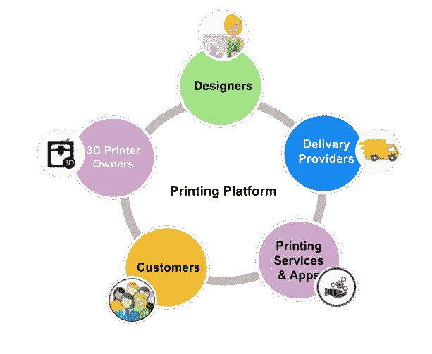
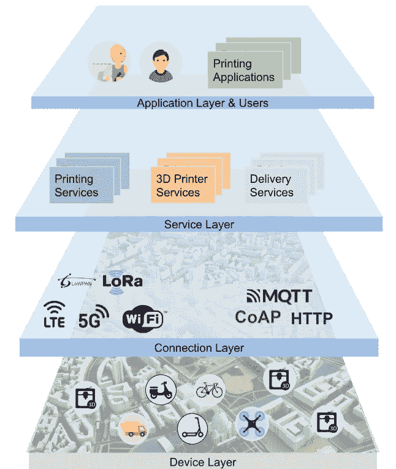
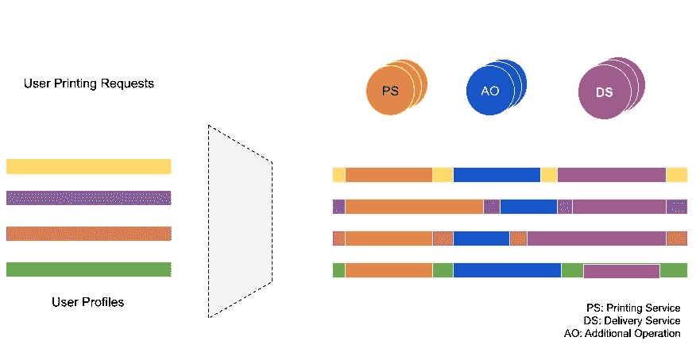
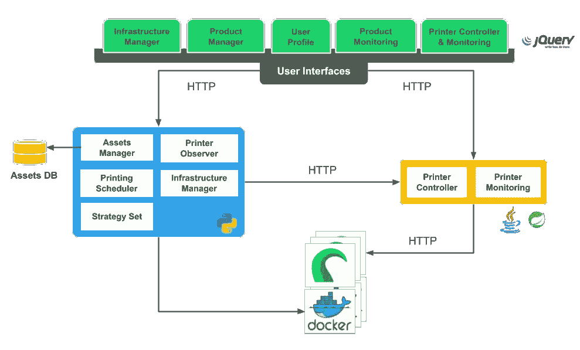
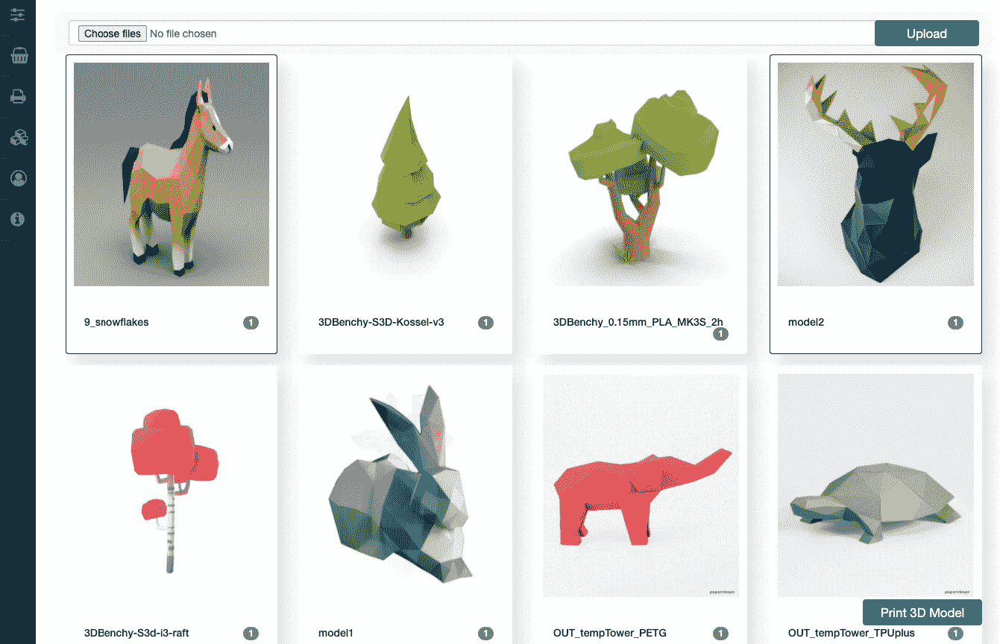
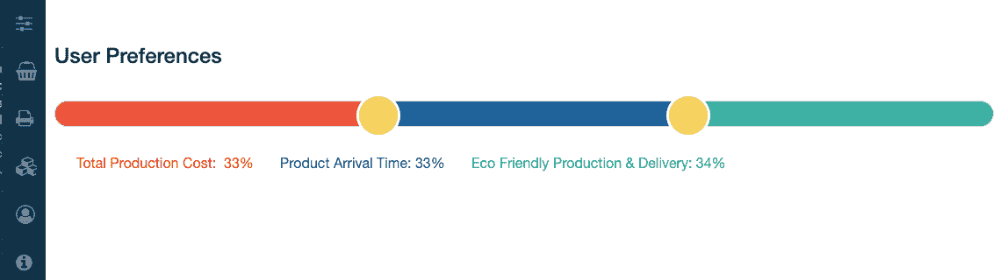
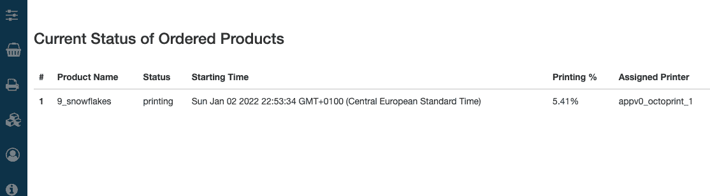
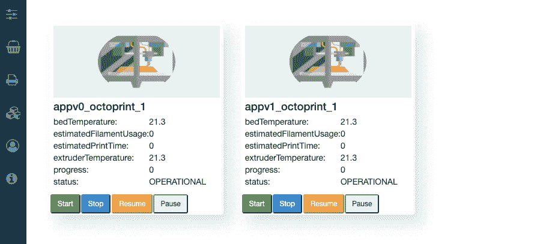

# 设计面向用户的下一代 3D 打印平台

> 原文：<https://medium.com/nerd-for-tech/designing-next-generation-3d-printing-platforms-for-3d-printer-owners-and-customers-2b9d961ae706?source=collection_archive---------6----------------------->

**前言:**本文旨在向读者展示下一代 3D 打印机的概念和 3D 打印机模拟环境，其中包括概念中描述的部分功能。如果打算学习编码部分，建议从系统架构部分开始。

**外卖可以列举如下:**

*   *概念视角:*对下一代 3D 平台的展望，理解这种平台的调度复杂性和组件
*   *技术视角:*通过 javascript 进行前端开发，通过 python 中的 REST API 实现控制/启动/停止 dockers，通过基于 spring-boot 的 Java 应用与 [octoprint](https://octoprint.org/) dockers 交互，…

# **简介**

3D 打印技术在过去几十年里发生了巨大的变化，现在我们已经非常接近一个时代，在这个时代，3D 打印可以应用于许多领域，从简单的物体、建筑物到人体器官。需要连续生产步骤的复杂而稳定的产品的创建可以通过使用不同材料的 3D 打印机轻松打印，甚至在生产过程中使用的人工干预也可以由于自主打印过程而减少到最低程度。尽管 3D 打印机广为人知，并被业余爱好者积极利用，但它有巨大的潜力成为家庭和办公室的标准智能设备。不断降低的成本、不断提高的打印质量和不断增加的可打印材料种类使得 3D 打印机对大多数人来说都具有足够的吸引力，这将导致在不久的将来城市中 3D 打印机拥有者的数量增加。如果一个城市中有相当数量的市民拥有用于不同目的的 3D 打印机，这些人中的绝大多数可以成为专业的 3D 对象制作者。打印机所有者可以主动打印对象并将它们单独出售给感兴趣的客户，而不是关闭打印机。然而，这里的主要问题是如何在打印机所有者和客户之间建立联系，以及最终客户满意度如何取决于打印质量、交付时间、成本等。可以保持在合理的水平。考虑到所有这些问题，提出了下一代打印平台概念，它解决了上述挑战，满足了平台利益相关者的要求，最后但同样重要的是旨在提高资源利用率。

# 谁是利益相关者？

从订购产品到客户收到产品，需要多个利益相关方的合作。如图 1 所示，他们是设计者、交付服务、打印机所有者、客户、打印服务提供商和基础设施提供商，他们的角色解释如下。值得一提的是，利益相关者的数量并不限于此。

**图 1:** 打印平台利益相关者

**设计师:**3D 对象的建模可以通过多个设计师来创建，他们可以与打印服务/应用程序提供商合作，以便让客户可以访问它们。基于设计师和服务提供商之间的合作类型，设计师也可以与其他服务提供商合作，以接触更多的客户。设计师也可以在不同的设计平台上创建一个设计师小组来建模 3D 模型，然后与合作的服务提供商共享。

**3D 打印机所有者:**用户在打印平台上选择的 3D 模型将被传送到一台或多台打印机上。选择哪台打印机将取决于其可用性、特性、所提供的质量、位置、总打印成本以及打印过程中估计的总能耗。

**交付提供商:**打印的 3D 模型的交付因车辆类型而异，如汽车、卡车、飞机、自行车、小型摩托车、无人机等。最合适的交付类型的选择可以取决于车辆的可用性、将 3D 产品交付给客户的估计持续时间、运输成本、运输时消耗的总能量以及要交付的产品类型。不是每种产品都可以用每种运输方式运输，有些产品可能需要特殊条件。

**客户:**所有设计的 3D 模型都将呈现在打印平台上，客户可以选择它们来启动打印过程。每个客户将能够修改她的个人资料页面，在那里他们可以决定三个参数的重要性:成本，时间和环保。每当客户打算打印 3D 模型时，将显示基于前述参数排序的打印选项列表。如果对于客户来说，成本比时间更重要，那么最便宜的打印选项将在选项列表中排名靠前。

**打印服务&应用程序提供商:**这些服务和应用程序应该提供一个环境，客户可以毫不费力地打印 3D 模型，设计师可以上传他们的模型，而交付服务和 3D 打印机可以加入系统以便能够使用。这些服务的基本功能应该考虑用户配置文件、服务的可用性，然后为最终用户提供最匹配的打印选项。选择打印机和送货服务应基于总成本、从订购到送货的时间以及环保的方法。

**物联网平台提供商:**下一代打印平台的实现只有在所有必要利益相关方的整合和互动下才有可能，以创造有针对性的附加值。物联网平台开始扮演这一角色，从设备集成到打印应用，所有步骤都可以在物联网平台上构建。下图描绘了物联网分层架构中所有利益相关方和相关技术的位置。

**图 2:** 基于物联网架构的打印平台分层视图

# 3D 打印平台组件

打印平台可以构建在全功能物联网平台上，以确保所需的功能，因为物联网平台是所有其他组件或服务可以交互的地方，这导致了物联网整体联网的真正附加值的创造。下面，我们将讨论物联网的哪些组件对于构建该平台至关重要。

**通过物联网网关实现设备集成**

所有设备，如 3D 打印机和车辆，都应该连接到物联网平台，它们的服务将在这个平台上相互交互。这种接口主要通过物联网网关提供。设备应该通过物联网网关连接的原因有很多，例如，资源容量有限或在物联网网关上执行边缘计算解决方案。物联网网关的作用是通过 Wi-Fi、蓝牙或 Websocket、HTTP、CoAP 等数据通信协议与物理连接的设备建立通信。之后，设备数据应该通过 MQTT 等通信协议传输到物联网中间件。关键的一点是协调异构数据并将其转换为统一的数据模型，而不丢失设备特性。

在这个用例中，要集成的设备包括:3D 打印机和各种运输工具，如运输车、汽车、摩托车和自行车、踏板车和无人机。除了 3D 打印机，所有其他设备都是移动的，因此它们的连接应该支持无线技术。在未来，无人机或车辆可能会配备 3D 打印机来生产简单的物体，特别是在紧急情况下。

**中间件统一&协调物联网服务**

设备和终端用户应用之间的通信只能通过服务层来执行，其中所有实体都可以理解所使用的通信语言并进行交互。至少需要三种服务类型来表示连接的设备以及管理和处理数据:1)打印机服务表示每个单独连接的打印机，并且包含设备的所有特征，2)递送服务提供可以将分组从生产地递送到客户的可用工具。3)打印服务管理来自客户的所有打印请求，根据可用性、功能、产品要求将它们分配给现有打印机，并最终选择最合适的交付工具和路径。印刷服务必须考虑用户偏好，以便为客户找到最佳匹配。

**最终用户应用**

打印平台提供应满足所有利益相关者要求的打印应用程序。客户应该能够打印模型目录中的产品，在平台中存储她的偏好，并监控生产和交付过程的状态。设计师应该能够为客户添加新产品模型，而系统管理员应该能够观察和控制打印机状态、打印和交付过程。打印机所有者应该监视和控制他们自己的打印机，而递送提供商可以跟踪他们车辆的位置以及要运送的产品信息。

# 对调度问题的详细研究

各种服务的组合需要服务编排来确保它们的可用性。每当客户在终端用户应用程序上选择产品时，所选的打印机服务和交付服务应该在那时可用。如果服务失败，提供的打印时间和成本可能无效。理想的方法是通知客户失败的服务，并向她提供符合用户特征的替代结果。如果打印机出现故障或送货车出现故障，这些设备应通过其服务直接通知服务协调，并替换最合适的服务/设备来完成打印和送货操作。假设编排问题已经解决，并且系统工作正常，但是，作为编排器的一部分，还有第二个重大挑战需要解决，那就是安排产品的印刷和交付。在本节中，我们的目标是确定调度参数，并分析这些参数如何影响调度过程。

调度操作由打印应用/服务(PA)在打印平台中管理，打印应用/服务(PA)接收客户的打印请求，分析打印要求以确定产品是否需要额外的操作，检索可用的交付服务，并最终将它们组合在一起，创建根据用户偏好排序的结果列表。通过这样做，实现了用户特定的调度。

每当客户从列表中选择一个结果时，PA 应保留一台满足 3D 产品要求的打印机、附加操作，如装配服务(如果有)和交付服务(单个或多个)。下图描述了这一过程的可视化。

**图 3:** 打印调度可视化

在下文中，我们分析了三个不同的方面(时间、成本和环境)，这三个方面代表了用户的偏好，以显示它们如何影响整个过程，以及对于某些用例来说，时间安排如何变得非常复杂。

# 时间、成本和环境方面的评估

**时间方面**

客户可能有紧急的打印请求，时间可能是一个关键的考虑因素。例如，机器的一部分在执行操作时损坏，操作必须在很短的时间内完成。在这种情况下，客户会对结果感兴趣，产品可以在短时间内打印和交付。在下文中，评估了侧重于时间参数的不同用例:

**用例 1:** 单个打印机上的单个产品将被打印和交付。所需的时间:

*总时间=等待打印时间+打印持续时间+等待交货时间+交货时间*

**用例 2:** 订购的产品由多件组成，需要在同一地点的不同机器上进行打印操作。该等式可以表述为:

*总时间=打印机等待时间+打印时长+等待组装时间+组装时间+等待交付时间+交付时间。*

**用例 3:** 订购的产品由各种零件组成，每个零件将在不同位置的不同机器上打印。该公式可以定义为:

*总时间=打印机等待时间+打印持续时间+等待交付到装配位置+交付到装配位置时间+等待装配+装配时间+等待交付时间+交付时间。*

从上面的使用案例中可以看出，总持续时间会因打印机、装配中心和交付设备的位置而发生显著变化。

**成本方面**

产品订单的成本取决于多种因素。这里考虑的成本是印刷、组装和运输成本。现在从成本方面评估上述用例，以找出总成本。

**用例 1:** 单台打印机上的单个产品:

*总成本=印刷成本+配送成本*

**用例 2:** 订购的产品由多台机器上的多个零件组成，并且装配在同一地点:

*总成本=印刷成本+组装成本+交付成本*

**用例 3:** 订购的产品由多台机器上的多个零件组成，并且装配在不同的位置:

*总成本=印刷成本+运输成本+组装成本+运输成本*

**环境(生态)方面**

环境方面将使用生产和交付过程中产生的总 CO2 排放量进行评估。如果在这些过程中消耗的能源来自可再生能源，其价值将计为 0。根据发电所用的技术，下面将使用一些标准值。

**用例 1:** 单台打印机上的单个产品:

*CO2 排放总量=印刷排放+运输排放*

**用例 2:** 由多台机器上的多个零件组成的单个产品，且组件位于同一位置:

*二氧化碳排放总量=印刷排放+运输排放*

**用例 3:** 由多台机器上的多个零件组成的单个产品，并且装配在不同的位置:

*二氧化碳排放总量=印刷排放+运输排放(装配)+运输排放(运输者)*

印刷排放和递送排放可以基于所使用的印刷机或递送类型来分类。一些印刷机或印刷技术对于同样的产品会消耗更多的能量。同样的情况也适用于交货类型。根据距离，选择交货类型，如自行车、摩托车、汽车、运输车、电动车、飞机等。会影响二氧化碳的总排放量。由于这个原因，

*印刷排放量=印刷机二氧化碳排放量*

交付排放也可归因于车辆选择的车型。电动汽车可以看作是二氧化碳。

*交付排放=车型二氧化碳排放*

如果消耗的能源来自可再生能源，那么这种排放可以被认为是零。

# 所有关键因素的最终评估

考虑到上述所有方面，我们意识到用户无法以列表的形式接收所有打印选项，所有打印机的计算复杂度以及所有额外的步骤和交付服务为 N。因此，应在过滤不适当的服务后创建排名列表，并且仅将前 10–20 个结果呈现给客户，否则选项的选择将不是用户友好的。由于将生成排名列表，每个打印选项将使用用户首选项值单独计算，如下所示:

*排名值= Time_percentage*(1-(时间/总时间))+ Cost_percentage * (1-(成本/总成本))+CO2 _ percentage *(1-(CO2 _ 排放量/总排放量))*

基于此，用户可以选择其中之一来启动该过程。

# 讨论

文章提出了一种考虑用户偏好的调度机制。这种单独的解决方案对于使用资源来说可能不够有效，即一些资源不能被用户使用或选择，即使它们提供了有效的质量。考虑到这一点，另一种调度机制或更好的编排应该观察资源使用情况，并在用户偏好和整体有效资源使用之间找到平衡。

# 3D 打印平台仿真原型

在本节中，上述用例通过模拟环境部分实现。尽管仿真环境不是按照上面的主要要求在分布式系统上构建的，但是组件的模块化结构允许我们在需要时在分布式系统上运行。准备这个模拟环境的主要动机是提供一个应用了上述用例的基本元素的运行系统，从而促进真实生活中整个用例的可视化。

# 系统结构

仿真环境的架构依赖于五个组件，系统架构的组件图如图 4 所示。

1.  用户界面
2.  基础设施经理
3.  资产经理
4.  打印调度程序
5.  印刷观察家
6.  打印机控制器和监控

**图 4:** 模拟系统概述

# 1.用户界面

模拟环境支持许多用户界面，旨在满足上述用例的所有方面。每个用户界面都应该被看作是一个独立的应用程序，需要详细的功能。

**基础设施控制页面:**该界面用于创建在 docker 容器技术上运行的模拟 OctoPrint 图像。可以指定图像的数量，并且可以监控启动的 docker 容器，如下所述。当前视图不能反映一个已启动的 docker 容器的所有细节，但是，它可以很容易地扩展以支持其他指标。

**图 5:** 基础设施控制页面

**产品经理页面:**用户可以通过选择显示的可打印产品从该页面订购产品。设计师创作的所有产品都列在这个页面上。用户可以选择多个产品。如“技术要求”一节所述，本页的理想流程是展示其他可能性，如打印、交付和用户配置文件的组合。由于复杂性以及打印机在实际打印期间打印产品，因此不涉及这些功能。下图描述了当前的用户界面和应该实现的界面原型。为了简化实现，只从后端检索文件名。

**图 6:** 商品订购页面【图片来自 Pinterest】

**用户简介:**从在可打印产品页面上选择产品到收到产品，如果考虑总打印交付时间、总成本和总 CO2 排放量，用户对所列产品有直接影响。这些参数是主观的，可以从用户的角度改变。下图显示了控制这些参数的实际视图。即使集成调度机制涉及到它们，也不要在调度时直接利用它们。如果打印机是完全模拟的，并且不属于真实打印时间，那么该用户界面的实现将更有意义，或者至少可以更好地理解和测试其功能的目的。

**图 7:** 用户资料页面

**产品监控:**可以在如图 8 所示的用户界面上监控待印刷/印刷和交付/交付的产品。实际的实现并不关注交付持续时间。这个界面对于最终用户跟踪他们的产品至关重要。今天，传统的方法是使用配送服务提供的服务，然而，通知用户从订购到配送对最终用户来说是非常有效和令人信服的方法，因为它增加了整个过程的可见性。

**图 8:** 打印监控页面

**打印机控制器&监控:**适当的最终用户角色可以监控和控制基础设施页面中已启动的打印机。例如，可以暂停、重启或完全取消打印过程。嵌入打印机的传感器信息，如床温、噪音温度等。也被提供给这个接口。还可以看到产品的印刷百分比。

**图 9:** 打印机控制器&监控

# 2.基础设施经理

该组件负责管理运行打印机的 docker 容器。所有的请求都是通过 REST 接口从用户那里接收的，并根据请求执行所需的操作。支持的功能用于控制和监控 docker:

*   码头工人开始/停止/观察码头工人
*   获取所有码头工人
*   获取所有 docker 状态
*   停用/激活码头工人
*   启动/停止码头

控制和监视 docker 环境的当前实现是为小型用例实现的，然而，代码的模块化结构允许添加新的功能。

# 3.资产经理

资产管理器处理从设计器上传的文件和显示在用户界面上的文件。文件上传操作在特定的 web 页面上启动，该页面被导航到后端的 rest 接口。在检查新设计的可用性之后，资产存储在名为 models/的文件夹中。文件的版本不存储在数据库中，但是可以添加，以便进行有效的数据管理。可用的功能有:

*   将资产上传到模型/文件夹
*   从模型/文件夹中获取资产

当前的文件夹模型/可以替换为文件服务器，以便可以直接从服务器检索文件。这个文件服务器可以集成到这个项目中。

# 4.打印调度程序

收到打印请求后，我们会考虑用户需求、打印机和交付服务，询问如何管理所有这些请求。调度机制，实际上它是计划机制的一部分，是按照逻辑顺序打印产品所必需的。在“详细研究调度问题”中，描述了该问题，并给出了解决调度问题的相关数学方程。在本模块中，调度算法的实现没有按照描述的那样实现以降低复杂性，但是，将单独测试所提供的解决方案。

当前实现的调度器从与运行的打印机通信的内部接口接收打印机的可用性，然后下一个产品被随机分配给下一个可用的打印机。每当印刷过程完成时，相关产品将从印刷计划列表中删除。本模块中的可用功能有:

*   使用各种参数安排打印订单
*   触发打印过程

调度的复杂实现是必须集成的未来工作。由于服务的复杂性是 N^(different 服务)，应该创建一些过滤机制来减少服务搜索池，这样用户就不会等待很长一段时间才能收到结果。除了上述三个参数(成本、时间、经济)之外，这些参数包括

*   产品特性
*   打印机特征
*   位置
*   印刷质量
*   …

# 5.印刷观察家

上述调度操作需要来自正在运行的打印机的接近实时的信息，以便为用户订购的产品指定下一个可分配的打印机。这里的挑战是定义一个与所有可用打印机通信的接口，以接收它们的当前状态，即空闲、就绪、打印、暂停等。

该组件包含打印机接口，用于获取打印机的状态，然后根据打印机的状态触发打印调度程序(如果有可用的打印机)。在这样的系统中，理想的解决方案是实现发布/订阅通信机制，然而，OctoPrint 只支持 REST 接口。现有功能包括:

*   检索正在运行的容器的打印状态
*   触发调度程序

# 6.打印机控制器和监控

除了所有其他模块，该程序是单独设计和实现的，通过该程序可以建立与打印机的连接。印刷观察者和用户界面可以接收关于正在印刷的产品或打印机的状态。所有正在运行的打印机都可以按照相关用户界面中的定义进行手动控制和监控。

现有功能包括:

*   打印机的所有剩余操作，如停止/启动/恢复/暂停
*   检索所有打印机或单台打印机的当前状态

**源代码:**【https://github.com/cemakpolat/octoprint-service】T2