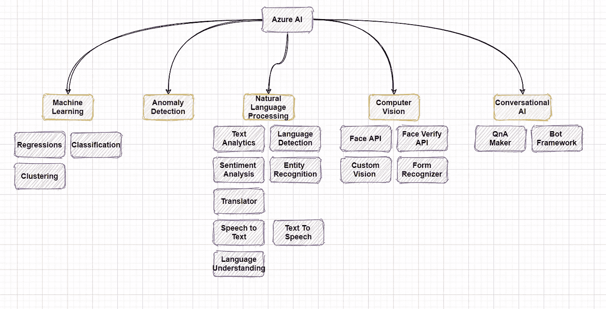
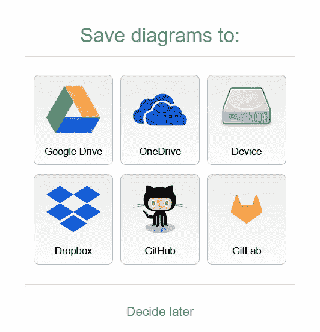
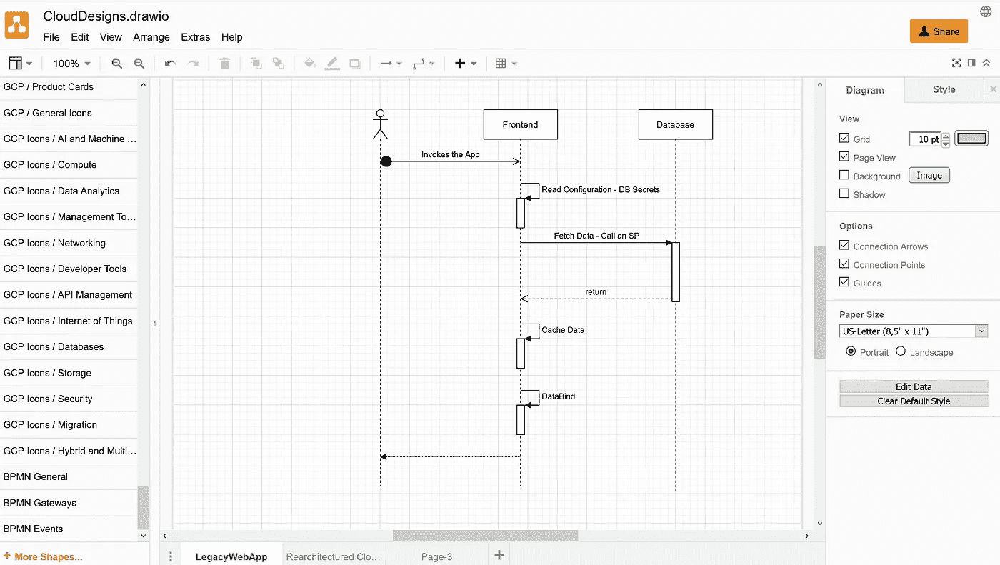
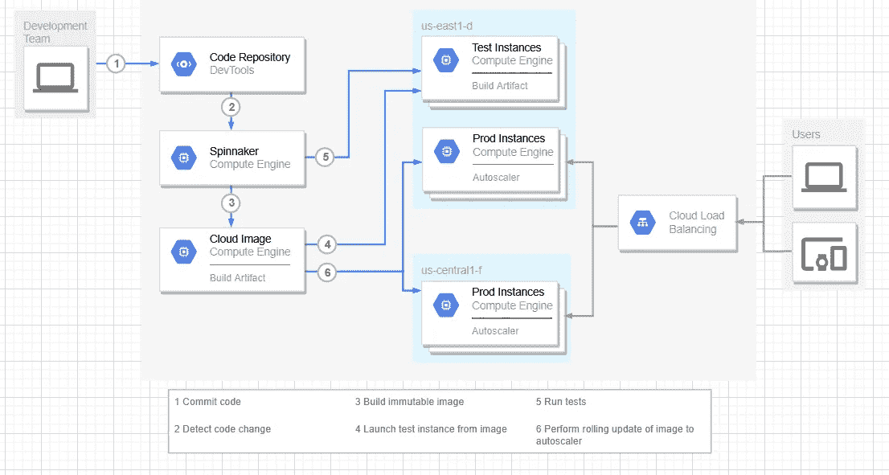
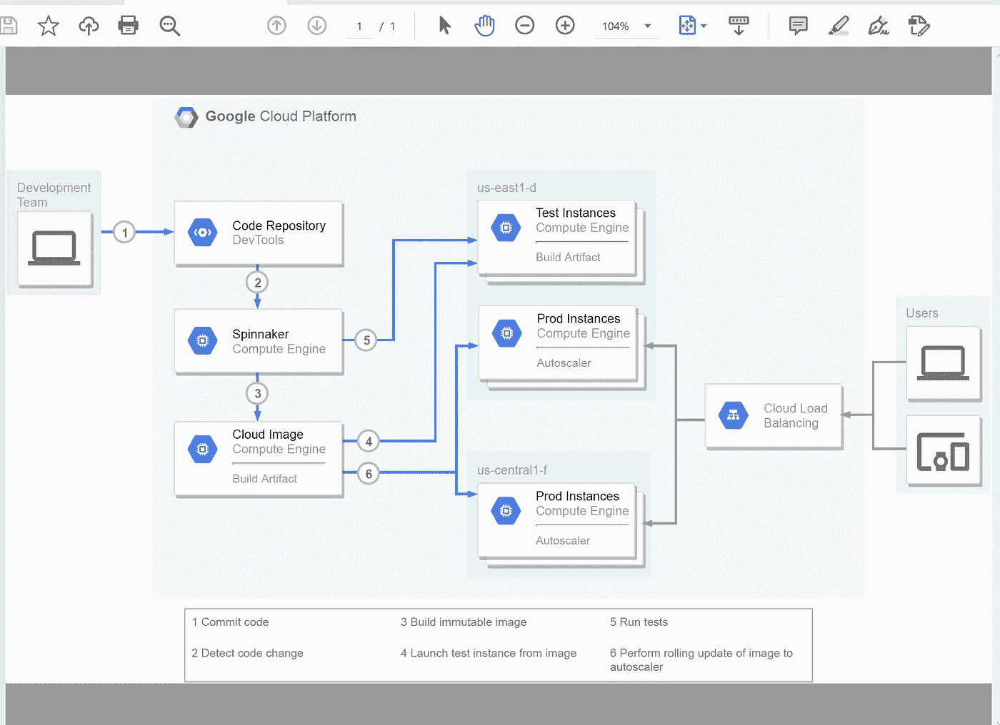
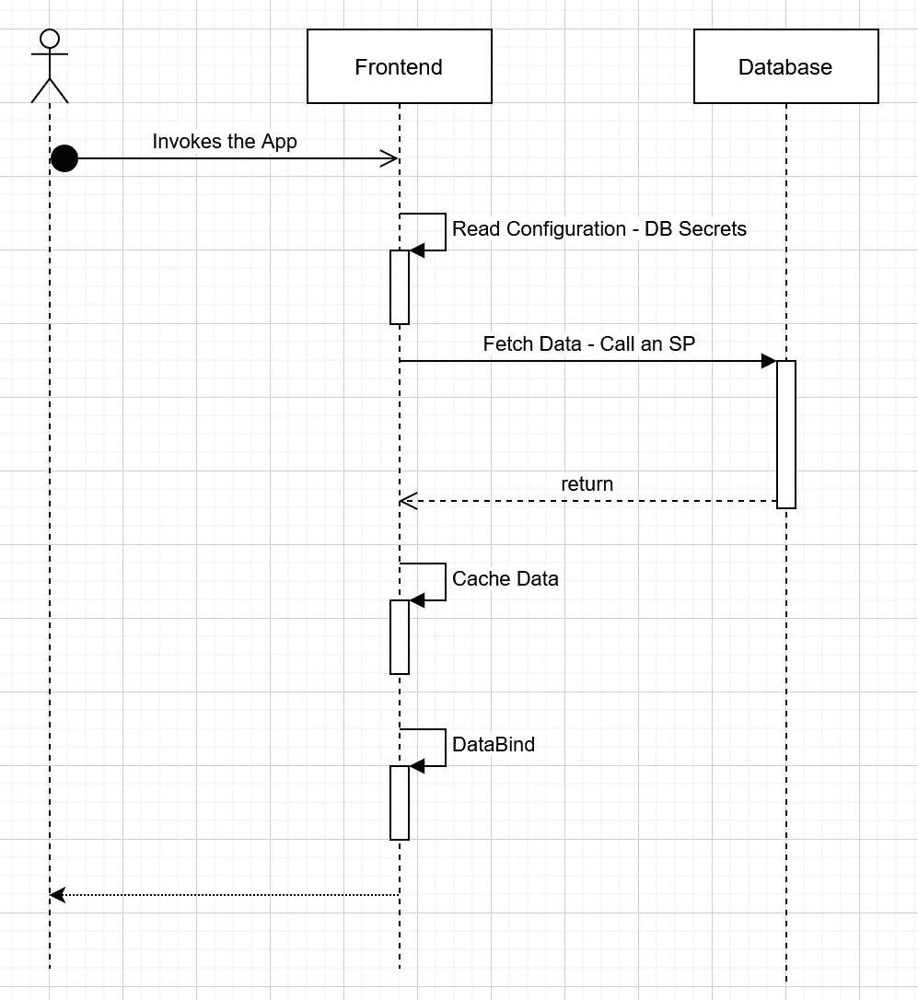
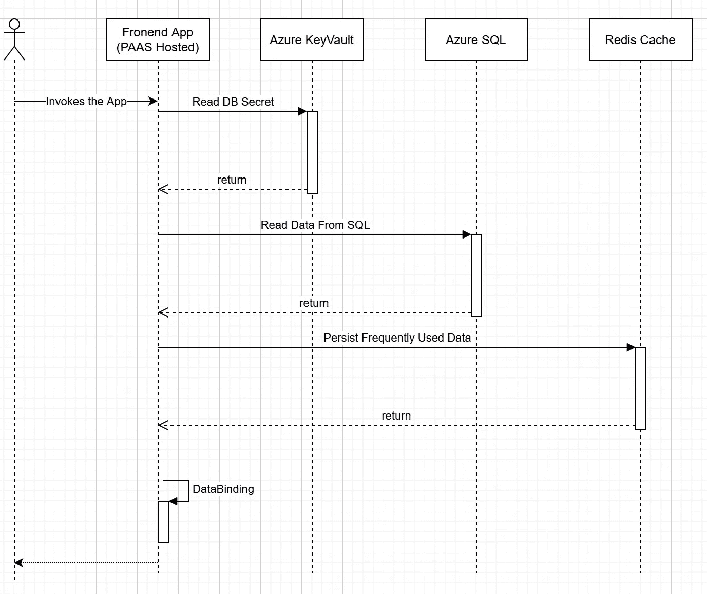

# # design notes:draw . io——为您的云托管应用和基础设施提供的非常出色的设计工具。

> 原文：<https://medium.com/nerd-for-tech/designnotes-draw-io-3cdf48fe9bc?source=collection_archive---------5----------------------->

由 Vaibhav Pandey 使用 Draw.io 创建

*市场上有许多可用的工具，但这款工具的突出之处在于它为三大公共云平台(即亚马逊网络服务(AWS)、微软 Azure 和谷歌云平台(GCP)。在这篇文章中，我将讨论建筑师和设计师如何立即使用 Draw.io 可用的* [*这里*](https://app.diagrams.net/) *作为一个 webapp，或者你可以将它安装在你的工作站上。这两种模式下的体验是非常一致和相同的。*

*请注意，我与提供该工具的公司没有任何商业联系。这篇文章仅仅是我在过去的 6-7 个月里，在我最近的 4-5 个项目设计中使用这个工具的经验。永远记住这个:*

*“一张* ***图片*** *抵得上一千张* ***文字***

*在这篇文章的最后，我还添加了其他可以评估的选项。*

*下面是我能想到的采用这个工具的主要原因*

1.  ****成本*** *:该工具在撰写本文时完全免费。**

***2*。可用性*** *:基于浏览器，可在您选择的任何地方、任何设备上使用。我主要是在装有 windows 10 和 Chrome 或 Firefox 浏览器的 surface pro 上使用它。你不会被要求安装任何特殊的浏览器插件，也不会被要求注册你的个人资料。该工具将为日常设计和架构任务提供非常丰富的功能。您也可以选择该工具的桌面版本。**

****3。轻量级*** *:尽管是浏览器托管的应用程序，但非常轻便，几乎不需要拖动，为标准应用程序提供了广泛的设计选项，绘制标准图表感觉轻而易举。**

***4*。便携式设计*** *:保存您的设计很容易，您可以通过将您的设计文件保存在多个位置来开始您的设计，如工作站、云存储选项或版本控制系统。保存后，您可以在 Teams、Slack 或 Sharepoint Server 等协作平台上与同事共享文件。文件是轻量级的，对于大多数中等复杂的设计只有几千字节。**

**

****网站提供了许多选项来保存您的设计。****

****5。丰富的设计 UX*** *: Draw.io 为建筑师和设计师提供简单、整洁光滑的表面。对于大型和复杂的系统，组件可以在单独的标签上分离，以便清晰地分离和表示**

**

****Draw.io 整洁干净的设计面。****

****6。设计类型*** *:设计草稿文档保存后，您就可以开始进行标准设计了，如:**

1.  **流程图**
2.  **业务流程**
3.  **UML —类和顺序图**
4.  **Azure、AWS 和 GCP 的云架构。**
5.  **手机应用设计**
6.  **业务设计、价值流图等。**
7.  *最近我最喜欢的是机器学习图，是的，它们甚至有适合 ML 工作负载的形状；)*
8.  **思维导图**

****7。现成的模板:*** *Draw.io 还为常见的云原生场景提供了一些入门设计，您可以快速扩展并开始使用，有助于快速响应。**

**

*这是不是很漂亮——非常实用的基于 GCP 的环境图——开箱即用。*

***8。设计版本** *:由于设计可以提取为 XML 文件，在 Draw.io 上设计提供了更容易的维护，将来可以扩展，可以在标准代码版本服务上轻松控制版本，如 GitHub.com。您将使用标准的 Git 命令将您的设计工件推送到设计报告中。这使您更容易保持您设计文档的活力，因为您可以一次又一次地继续增强您的应用程序环境。因此帮助你避免* ***大的前期设计*** *的做法。**

**

****PDF 摘录****

**向组织外的利益相关者共享也很简单，只需导出为 PDF 或通过 Google Drive 或 OneDrive 共享即可。**

****开发架构实践*** *:作为一名架构实践领导者，你可能对开发你的团队软件和服务设计知识和经验感兴趣，在这种情况下，Draw.io 可以极大地帮助你的团队学习不同类型的设计，而无需支付高额的许可费用。虽然，我几乎在最后列出了这个选项，但对我来说，这将是查看这个工具的最大因素之一。**

*下面是我在 medium 平台上为我的技术博客创作的一些设计示例。*

*我已经使用 Draw.io 创建了从简单到复杂的设计图表，并且能够很好地表现它们。一些例子如下:*

## ***勾画思维导图:***

*Azure 人工智能服务产品的非常简单的例子*

**

## ****On Prem 托管 App:****

**

****代表本地托管的 Web 应用程序设计****

## ****Azure 托管云 App:****

**

****代表 Azure 托管的基于 PAAS 的 WebApp****

*对于这个例子，我已经在我的 GitHub 订阅中托管了上面的例子，你可能想要派生我的回购，并根据你的特殊需求随意扩展上面的图表。链接将很快在此位置共享。*

*最后，我要向#Draw.io 的朋友们致敬。*

**可供您选择的其他选项有:**

*   *[*Sparx EA*](https://sparxsystems.com/)*
*   *[*Miro.com*](https://miro.com/)*
*   *[*云斜*](https://www.cloudskew.com/)*
*   *[*Lucidchart*](https://www.lucidchart.com/pages/landing?utm_source=google&utm_medium=cpc&utm_campaign=_en_tier3_mixed_search_brand_exact_&km_CPC_CampaignId=1484560207&km_CPC_AdGroupID=60168114191&km_CPC_Keyword=lucidchart&km_CPC_MatchType=e&km_CPC_ExtensionID=&km_CPC_Network=g&km_CPC_AdPosition=&km_CPC_Creative=442433234360&km_CPC_TargetID=kwd-33511936169&km_CPC_Country=9061667&km_CPC_Device=c&km_CPC_placement=&km_CPC_target=&mkwid=si12MuKjg_pcrid_442433234360_pkw_lucidchart_pmt_e_pdv_c_slid__pgrid_60168114191_ptaid_kwd-33511936169_&gclid=Cj0KCQiApY6BBhCsARIsAOI_GjbDn9A0wsLjJ8OHUlTd49bnLYfIXJg78WPl0mga76vM07JpyQFMOkcaAgRAEALw_wcB)*

**将在以后的另一篇博客中详细阐述以上选项。**