# 使用 Flutter WEB 实现桌面 GUI(第 2 部分:Dock)

> 原文：<https://medium.com/nerd-for-tech/desktop-gui-implementation-using-flutter-web-part-2-dock-3ade96f4af8a?source=collection_archive---------7----------------------->

如果你已经通读了上一篇文章 [**使用 Flutter WEB 实现桌面 GUI(第 1 部分:简介)**](https://achraf-feydi.medium.com/desktop-gui-implementation-using-flutter-web-part-1-introduction-42d21a6e7937) ，我试图说明我在使用 Flutter WEB 实现 [**FlutterGUI**](https://www.fluttergui.com/#/) 时遇到的一些主要困难。


在这一部分中，我们将尝试实现一个类似于我在 FlutterGUI 项目中实现的 dock。

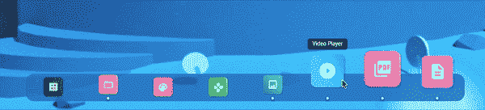

我将重点解释其背后的机制，并用一些例子来说明。我会为你建立一个美丽的花式动画。

*代码与我的 FlutterGUI repo 中的代码不同。这是一个更加简洁的版本*。

*dock 的实现将在 Flutter WEB 和桌面上工作*

到本文结束时，您将能够建造所有这些码头，甚至更多:

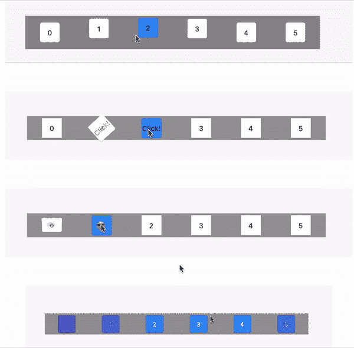

## 目录:

1.  设置基本的 dock
2.  检测鼠标悬停并将其转换为有价值的数据。
3.  刷新您的数学
4.  实现动画
5.  上下文菜单:右键单击！
6.  更多示例

所以，让我们尽情舞动吧！🔥

# 设置基本的 Dock

在下面的代码中，我只是使用**堆栈**和**定位**小部件将 Dock 定位到屏幕底部。

```
@override
Widget build(BuildContext context) {

  return Scaffold(
    appBar: AppBar(
      title: Text(widget.title),
    ),
    body: _getBody(),
  );
}

Widget _getBody() {
  return Stack(
    children: [
      Positioned(
          bottom: 40,
          child: _getDock())
    ],
  );

}

Widget _getDock() {
  // Our dock will go here
}// Default DockItem size (width & hight)
final _dockItemDefaultSize = 40.0;// Dock item size + Padding.
final _dockItemDefaultSizeWithSpacing = 100.0;// List of items I'll be showing in the Dock.
List<int> items = [for(var i=0; i<6; i+=1) i];
```

现在我们将实现 Dock 本身。

代码非常简单，一目了然。

注意:**粗体**中的参数是最重要的。

```
Widget _getBody() {
  return Stack(
    children: [
      Positioned(
          bottom: 40,
          right: 0,
          left: 0,
          child: _getDock())
    ],
  );

}

Widget _getDock() {
  return Center(
    child: Container(
      color: Colors.*black38*,
      width: **_dockItemDefaultSizeWithSpacing*values.length**,
      child: Row(
        mainAxisAlignment: **MainAxisAlignment.spaceEvenly**,
        children: _getChildren(),
      ),
    ),
  );
}

List<Widget> _getChildren() {

  List<Widget> items = [];
  for(var i = 0; i< values.length;i++){
     items.add(_generateItem(i));
  }

  return items;
}

Widget _generateItem(int index) {

  return Container(
    width: **_dockItemDefaultSizeWithSpacing**,
    child: Center(
      child: Card(
        child: Container(
          height: _dockItemDefaultSize,
          width: _dockItemDefaultSize,
          child: Center(child: Text(values[index].toString()),),
        ),
      ),
    ),
  );

}
```

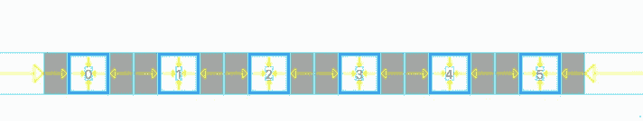

# 检测鼠标悬停并将其转换为有价值的数据

我们将从声明两个变量开始:

*   **_offset** :将鼠标的位置保持在 dock 上。
*   **_currentIndex** :将持有悬停的 Dock-Item。

*(这些变量的使用将在后面说明)*

为了检测鼠标位置，我们可以在 MouseRegion 小部件中扭曲 Dock。

```
var _offset = 0.0;
var _currentIndex = -1;Widget _getDock() {
  return Center(
    child: MouseRegion(
      onHover: (event){
        setState(() {
          _offset = **event.localPosition.dx**;
          _currentIndex =  (_getOffset()).toInt();
        });
      },
      onExit: (event){
        setState(() {
          _offset = 0 ;
          _currentIndex = -1;
        });
      },
      child: Container(
        color: Colors.*black38*,
        width: _dockItemDefaultSizeWithSpacing*values.length,
        child: Row(
          mainAxisAlignment: MainAxisAlignment.spaceEvenly,
          children: _getChildren(),
        ),
      ),
    ),
  );
}double _getOffset(){
  return _offset/_dockItemDefaultSize;
} 
```

**_getOffset()** 方法会将 **_offset** (取 0 和 **width_of_Dock 之间的值)**转换为 0 和 6 之间的值(项目数)。这只是简单的数学！

为了得到 **_currentIndex** ，我们只需去掉 **_getOffset()** 的小数部分

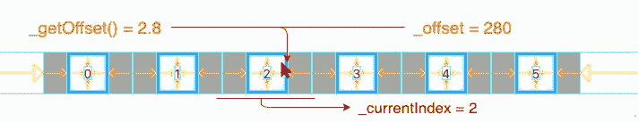

# 刷新您的数学

假设我们的鼠标悬停在第 3 项上。

让我们假设我们希望我们的通用动画取 0 到 1 之间的值。因此，我们希望项目 3 由 1 激活，他的邻居 2 和 4 由 0.5 激活，其他邻居不激活。

这种行为可以很容易地用圆的方程式来表示。

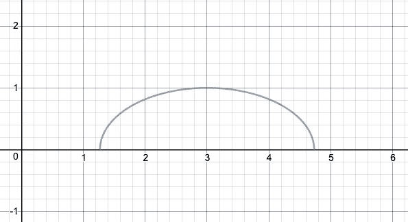

**圆心(x0，y0)** 和**半径 r** 的圆的方程式为:

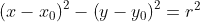

我们希望我们的圆以鼠标在 x 轴上的位置为中心。我们希望它在 y 轴上以 0 为中心。

因此，x0 将采用 _getOffset()值，y0 将等于 0。

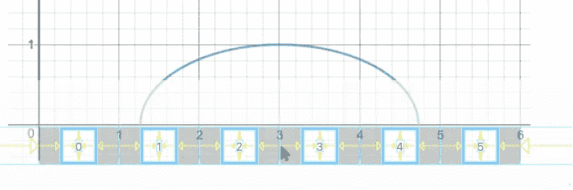

我们可以很容易地从这个等式中推导出 y 的值:

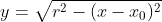

上面的等式描述了圆心(x0，0)和半径 r 的圆的上半部分。

在这种情况下， **y** 将根据**x**(Dock 项的位置)和 **x0** (鼠标的位置)取 0 到 r 之间的值。

因为我们需要 0 到 1 之间的值来制作动画，所以我们可以将 **y** 除以 **r** 。

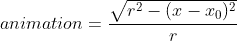

或者我们可以简单地做:

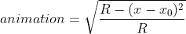

现在回到编码:

```
double _getVariation(int x, double x0,double radius){
  if(_offset==0) return 0 ;
  var z = radius - (x - x0)*(x - x0);
  if(z<0) return 0 ;
  return sqrt(z/radius);
}
```

# 实现动画

现在让我们制作一个简单的动画来测试我们的代码。

我们将使用 _getVariation 公式计算出的动画值来为每个项目的底部添加边距。

我们认为:

*   **x**:index+0.5 = Dock 项的中心。
*   **x0** : _getOffset =光标的位置。
*   **r** :等于 3 =我们希望动画影响以 x0 为中心的 3 个项目。

```
Widget _generateItem(int index) {

  double dx = _getVariation(index + 0.5 ,_getOffset(),3);
  return Container(
    width: _dockItemDefaultSizeWithSpacing,
    margin: EdgeInsets.only(bottom: dx * 20 ),
    child: Center(
      child: Card(
        color: index==_currentIndex? Colors.*blue*:Colors.*white*,
        child: Container(

          height: _dockItemDefaultSize,
          width: _dockItemDefaultSize,
          child: Center(child: Text(values[index].toString()),),
        ),
      ),
    ),
  );
```

我们到了:

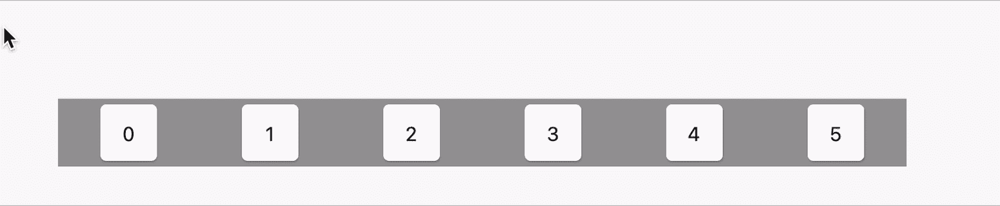

# 上下文菜单:右键单击！

如果您使用的是 Flutter Web，请将这行代码添加到 main 方法中，以禁用浏览器中的默认右键单击。

```
import 'dart:html';

void main() {
  window.document.onContextMenu.listen((evt) => evt.preventDefault());
  // ...
}
```

[](https://stackoverflow.com/questions/62244113/can-i-change-right-click-action-in-flutter-web-application) [## 我可以在 flutter web 应用程序中更改右键单击动作吗？

### 在如何在 flutter web 应用程序中实现通过鼠标右键调用的工作上下文菜单的说明下面:导入…

stackoverflow.com](https://stackoverflow.com/questions/62244113/can-i-change-right-click-action-in-flutter-web-application) 

现在，我们将扭曲侦听器小部件中生成的项目，以检测右键单击事件。

```
List<Widget> _getChildren() {

  List<Widget> items = [];
  for(var i = 0; i< values.length;i++){
     items.add(Listener(
         onPointerDown: (event){
           _onPointerDown(event,_currentIndex);
         },
         child: _generateItem(i)));
  }

  return items;
}Future<void> _onPointerDown(PointerDownEvent event,int currentIndex) async {

  List<PopupMenuEntry<int>> menuItems;

    menuItems = [
      PopupMenuItem(child: Text('apply +1'), value: 1),
      PopupMenuItem(child: Text('apply -1'), value: 2),
      PopupMenuItem(child: Text('set to 0'), value: 3),
    ];

  if (event.kind == PointerDeviceKind.mouse &&
      event.buttons == kSecondaryMouseButton) {
    final overlay =
    Overlay.*of*(context).context.findRenderObject() as RenderBox;
    final menuItem = await showMenu<int>(
        context: context,
        items: menuItems,
        position: RelativeRect.fromSize(
            event.position & Size(48.0, 48.0), overlay.size));

    switch (menuItem) {
      case 0:
      // open;
        break;
      case 1:
      // add 1;
        values[currentIndex] = values[currentIndex] +1  ;
        break;
      case 2:
      // minus 1 ;
        values[currentIndex] = values[currentIndex]  - 1  ;
        break;
      case 3:
      // set to 0;
        values[currentIndex] = 0  ;
        break;
      default:
    }
    setState(() {});
  }
}
```

结果:

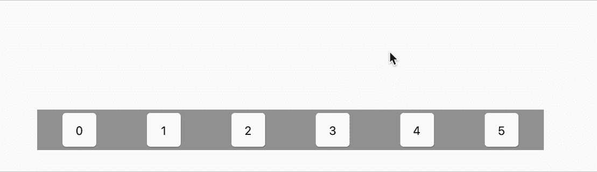

# 更多示例

## 旋转动画

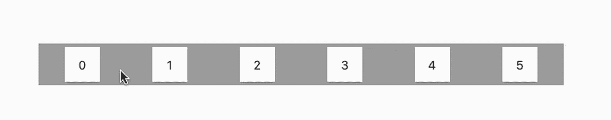

```
Widget _generateItemWithRotate(int index) {
  double dx = _getVariation(index + 0.5, _getOffset(), 1);
  print(dx);
  return Container(
    width: _dockItemDefaultSizeWithSpacing,
    child: Center(
      child: Transform.rotate(
        angle: dx * pi / 2,
        child: Card(
          color: index == _currentIndex ? Colors.*blue* : Colors.*white*,
          child: Stack(
            children: [
              Positioned.fill(
                child: Transform.rotate(
                    angle: -pi / 2, child: Center(child: Text("Click!"))),
              ),
              Opacity(
                opacity: 1 - dx,
                child: Container(
                  color: Colors.*white*,
                  height: _dockItemDefaultSize,
                  width: _dockItemDefaultSize,
                  child: Center(
                    child: Text(values[index].toString()),
                  ),
                ),
              ),
            ],
          ),
        ),
      ),
    ),
  );
}
```

## 翻转动画

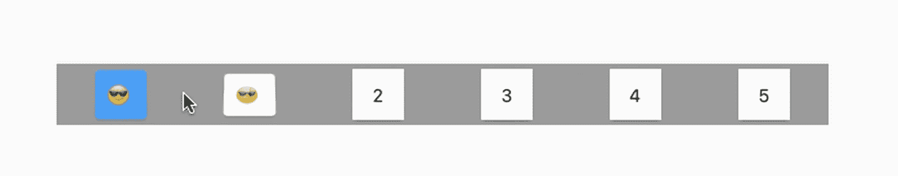

```
Widget _generateItemWithFlip(int index) {
  double dx = _getVariation(index + 0.5, _getOffset(), 1);
  print(dx);
  return Container(
    width: _dockItemDefaultSizeWithSpacing,
    child: Center(
        child: Transform(
      alignment: FractionalOffset.*center*,
      transform: Matrix4.identity()
        ..setEntry(3, 2, 0.002)
        ..rotateX(pi * dx),
      child: Card(
        color: index == _currentIndex ? Colors.*blue* : Colors.*white*,
        child: Stack(
          children: [
            Positioned.fill(
              child: Transform.rotate(
                  angle: pi, child: Center(child: Text("😎"))),
            ),
            Opacity(
              opacity: 1 - dx,
              child: Container(
                color: Colors.*white*,
                height: _dockItemDefaultSize,
                width: _dockItemDefaultSize,
                child: Center(
                  child: Text(values[index].toString()),
                ),
              ),
            ),
          ],
        ),
      ),
    )),
  );
}
```

## 彩色动画

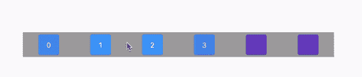

```
Widget _generateItemColored(int index) {
  double dx =
      _getVariation(index + 0.5, _getOffset(), values.length.toDouble());

  return Container(
    width: _dockItemDefaultSizeWithSpacing,
    child: Center(
      child: Card(
        color: Color.*lerp*(Colors.*deepPurple*, Colors.*blue*, dx),
        child: Container(
          height: _dockItemDefaultSize,
          width: _dockItemDefaultSize,
          child: Center(
            child: Text(
              values[index].toString(),
              style: TextStyle(
                  color: Color.*lerp*(Colors.*deepPurple*, Colors.*white*, dx)),
            ),
          ),
        ),
      ),
    ),
  );
}
```

[](https://github.com/achreffaidi/dock_demo) [## achreffaidi/dock_demo

### 新的颤振应用。这个项目是颤振应用的起点。一些资源让你…

github.com](https://github.com/achreffaidi/dock_demo) 

# 下一步是什么？

在这一系列文章中，我将解释我是如何在这个项目中实现一些复杂的小部件的。希望能帮助其他开发者做出又酷又**有用的**项目。

你可以在下面找到所有的链接。一旦文章准备好，我会及时更新:

*   [**第一部分:简介**](https://achraf-feydi.medium.com/desktop-gui-implementation-using-flutter-web-part-1-introduction-42d21a6e7937)
*   **第二部分:坞站**
*   [**第三部分:可拖动&可调整大小的窗口**](https://itnext.io/desktop-gui-implementation-using-flutter-web-part-3-draggable-resizable-windows-46ea26049605)
*   **第四部分:Windows XP 崩溃**
*   **第五部分:全屏动画**
*   **第 6 部分:Github 页面和自定义 URL**