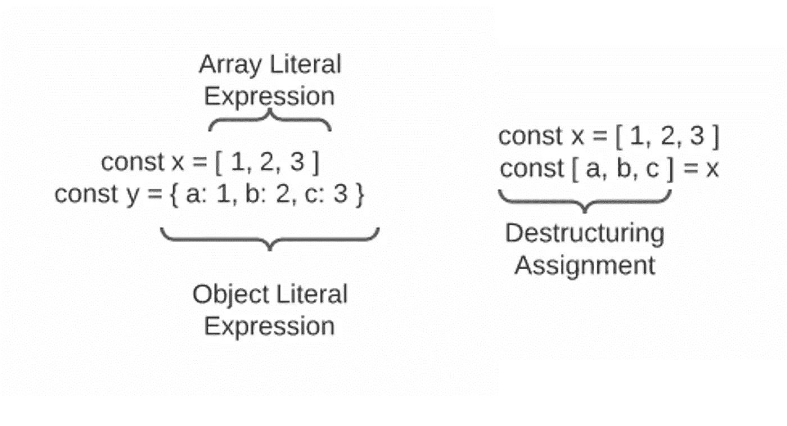

# 用 JavaScript 进行析构

> 原文：<https://medium.com/nerd-for-tech/destructuring-with-javascript-es6-a194d458da4a?source=collection_archive---------12----------------------->


图片由 [La-Rel 复活节](https://unsplash.com/@lastnameeaster)途经【unsplash.com】T2

编码者喜欢他们的代码是干巴巴的(不要重复你自己)，部分原因是因为我们懒惰，这是一种好的方式，但也因为这使我们的代码更容易阅读。谁知道谁会在你之后从事某个项目，或者你要过多久才能回到自己的项目中来？不管什么时候，什么人，重要的是代码要清晰、简洁、易于准备。

我给你举两个例子，让你决定哪个更好看。如果您是析构的新手，现在请相信我的话，这两个代码块实现了相同的目标，我们将很快深入细节。

```
First Example1\. let team = {
2\.   name: "Kansas City Chiefs",
3\.   superbowls: 2,
4\.   mvp: "Patrick Mahomes"
5\. }6\. let name = team.name
7\. let superbowls = team.superbowls
8\. let mvp = team.mvp9\.  console.log(name) => "Kansas City Chiefs"
10\. console.log(superbowls) => 2
11\. console.log(mvp) => "Patrick Mahomes"
```

现在是第二个问题。

```
Second Example1\. let team = {
2\.   name: "Kansas City Chiefs",
3\.   superbowls: 2,
4\.   mvp: "Patrick Mahomes"
5\. }6\. let {name, superbowls, mvp} = team7\. console.log(name) => "Kansas City Chiefs"
8\. console.log(superbowls) => 2
9\. console.log(mvp) => "Patrick Mahomes"
```

你更喜欢读哪一本？好吧，这是一个有内涵的问题，第二个更简洁，假设你理解析构更快阅读，同时仍然达到相同的目标。

这里到底发生了什么？在第二个例子中，我们从团队对象中创建一个名称、superbowls 和 mvp 变量，该变量等于具有匹配名称的键值。我们*将*对象解构为多个变量！

析构是在 [ECMAScript 2015](https://262.ecma-international.org/6.0/#sec-destructuring-assignment) 中引入的，通常被称为 ES6，对对象和数组都有效。本质上，它允许您将对象或数组中的属性或值赋给变量，而不必通过使用析构赋值来逐行写出每个变量赋值。

析构赋值应该看起来很熟悉，因为它非常类似于数组和对象文字表达式，只是它是从赋值操作符的右边翻转到左边的。



数组/对象文字表达式与析构赋值

via[giphy.com](https://giphy.com/gifs/cbc-schittscreek-schitts-creek-fjxbR0y8fscok9UgiM)

现在我们知道了什么是析构，我想和你分享一下我是如何经常使用它的。我对 JavaScript 和 React 世界相对较新，但根据我的经验，我发现最有用的应用是在 React 中使用*功能组件*时。

您可以在参数中使用对象析构，并在函数中直接引用每个属性，而不是传递一个属性参数并使用点符号来深入每个属性。在编写代码时，这是一个很小的效率增益，但是我只关注小的，*增量改进*随着时间的推移累积起来！

让我们快速对比一下每种方法。我们将假设我们正在向每个函数传递道具`wave`和`sayHello`，并且每个道具分别有一个键`hand`和`greet`。

```
Functional Component Comparison// Without Destructuring1\. const withProps = (props) => {
2\.    return (
3\.       <div>
4\.          {props.wave.hand}
5\.          {props.sayHello.greet}
6\.       </div>
7\.    )
6\. }// With Destructuring1\. const withDestructuring = ({wave, sayHello}) => {
2\.    return (
3\.       <div>
4\.          {wave.hand}
5\.          {sayHello.greet}
6\.       </div>
7\.    )
6\. }
```

就像我说的，当只写两行的时候没有很大的区别，但是想象一下有五个或者十个你多次引用的道具，这就增加了。还要注意的是，在使用析构的时候，我们知道在处理`withDestructuring`的时候哪些道具是可用的。如果您是项目的新手，您可以通过快速浏览可用的道具来了解组件的意图，而不必在文件之间来回跳转。

析构可以用在很多不同的方面，包括解构数组。其机制类似于我们用对象演示的，但是我们没有使用键作为变量名，而是创建了一个变量名。析构数组时要注意的一点是顺序很重要！让我们看一个例子。

```
1\. let animals = ['dog', 'cat', 'fish']2\. let [stella, whiskers, nemo] = animals3\. console.log(stella) => 'dog'
4\. console.log(whiskers) => 'cat'
5\. console.log(nemo) => 'fish'
```

这里我们按照动物指数的顺序给每个变量赋值，这就是顺序很重要的原因。这也允许我们做一些很酷的事情，比如在析构数组时跳过值，如下所示。

```
1\. let animals = ['dog', 'cat', 'fish']2\. let [stella, , nemo] = animals3\. console.log(stella) => 'dog'
4\. console.log(nemo) => 'fish'
```

析构数组时要小心。因为**数组的顺序和长度很重要**，所以准确知道里面存储了什么非常关键。这将它的实际应用限制在阵列被控制并且每次都相同的情况下。

还有很多其他很酷的析构应用，所以我强烈推荐你去看看关于这个问题的 MDNs 页面。像往常一样，请在下面的评论中留下一些反馈或其他你认为有用的实例！