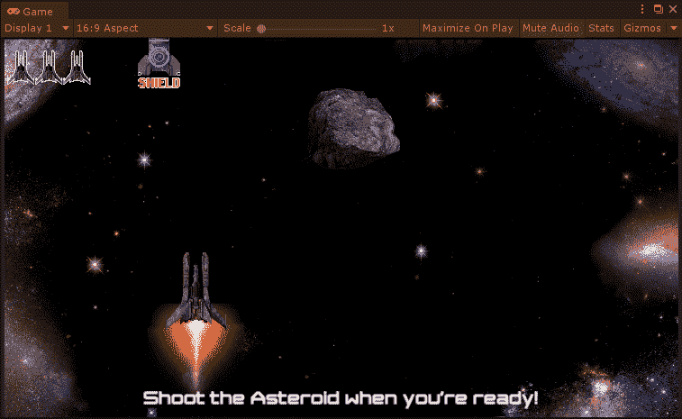
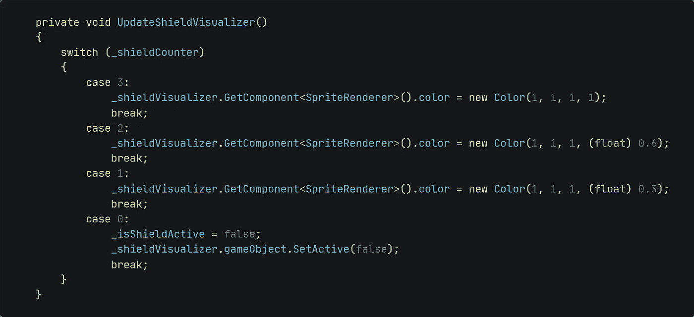
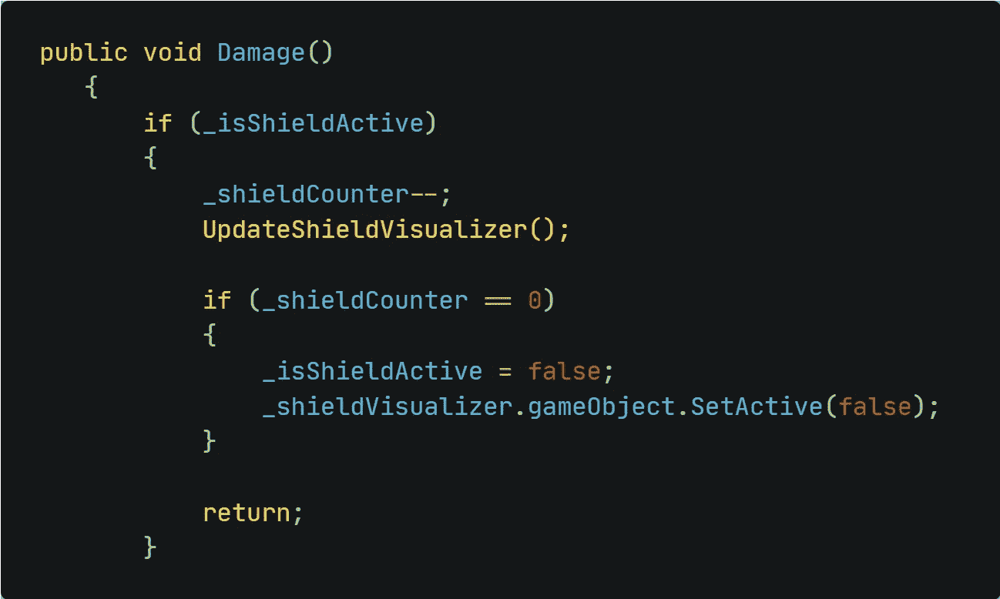
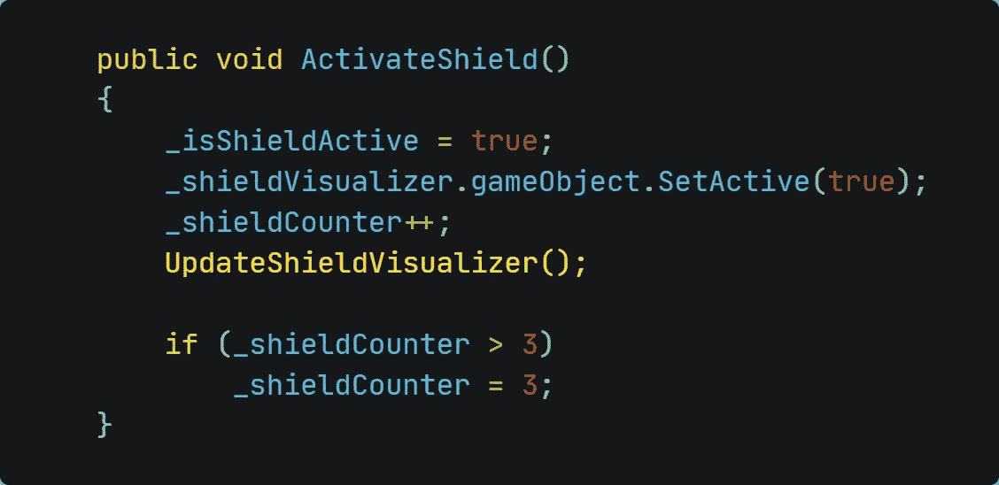

# 细节-可视化护盾强度

> 原文：<https://medium.com/nerd-for-tech/details-visualizing-the-shield-strength-5b543fca5c7?source=collection_archive---------23----------------------->

## 更多护盾？那就加大马力。

我们刚刚实现了同时激活多个护盾的能力，现在是时候添加一些细节了。我们已经有了代表当前盾量的 UI 元素。但是，播放器上的盾牌可视化工具保持不变。让我们改变这一切！

作为参考，这就是我们将要实现的内容:

实现完成得相当快！我们只需要一个新的方法来处理屏蔽可视化的不透明度。为此，让我们快速看一下如何在脚本中改变颜色。

我们需要访问*精灵渲染器*组件来操作*颜色*属性。然后，我们使用介于 0(无)和 1(全)之间的 RGBA 值指定一种新颜色。由于我们只想改变不透明度，我们只需要改变 A 值，并可以保持 RGB 值为 1。

我们最多能有三个护盾。我们不使用三种不同的 if 语句，而是使用 switch 语句来获得更清晰的代码。
每一个盾牌都会增加三分之一的不透明度。因此，一个盾牌有 33%的不透明度，两个盾牌 67%，三个将有 100%。

由于 RGBA 值通常有一个*整数*数，我们需要将 33%和 67%的值转换为类型 *float* 。这可以通过简单地在数字前加上'*(float)'【T10]来实现。*

**在正确的地方调用方法** 最后要做的事情是每当我们收集盾牌或受到伤害时调用方法。

调用 void Damage()内部的方法

调用 void ActivateShield()中的方法

添加了这几行代码后，我们现在已经成功实现了我们想要的行为。护盾现在会根据我们拥有的护盾数量动态更新。