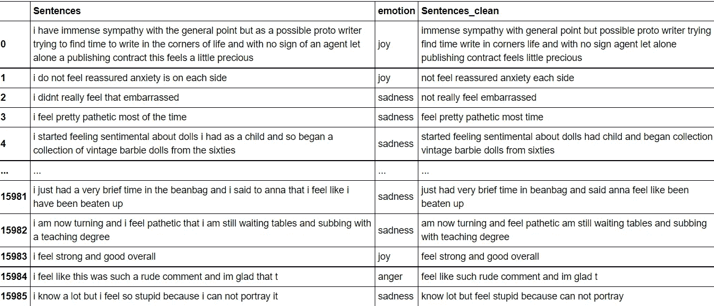
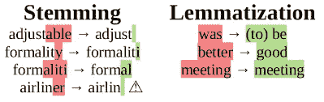
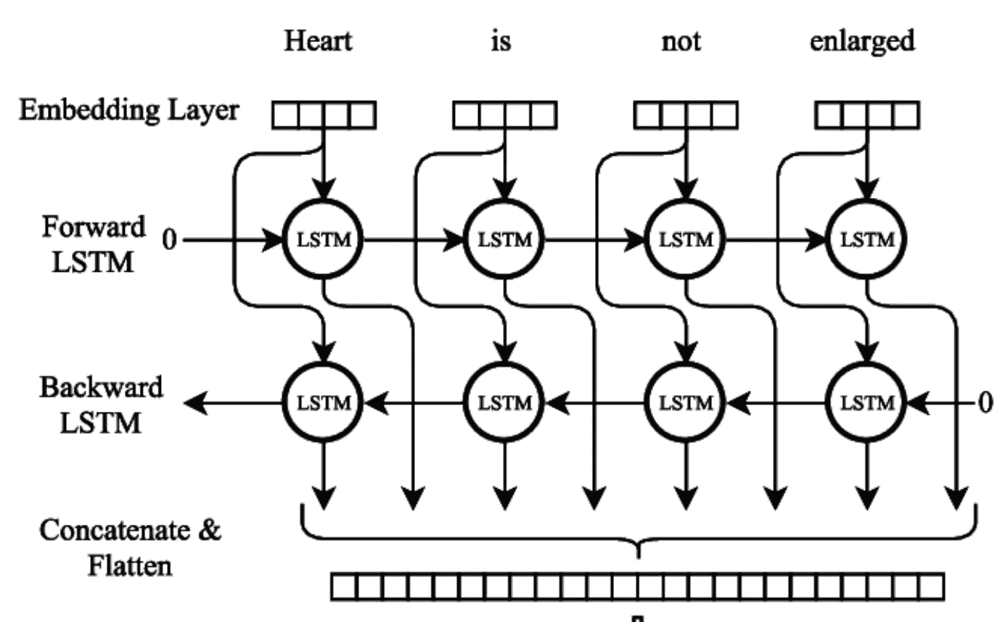
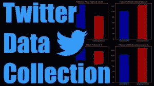

# 利用机器学习检测推文中的情感

> 原文：<https://medium.com/nerd-for-tech/detecting-sentiments-in-tweets-with-machine-learning-376a5010b4dc?source=collection_archive---------22----------------------->


想要在深度学习的帮助下检查 Twitter 上人们的情绪吗？你来对地方了，因为这就是我们在这个项目中要做的。

先决条件:对 Python、Tensorflow/Keras 有很好的了解，对神经网络如何工作有基本的了解。

Twitter 是一个如此疯狂的地方。人们分享他们的生活，公开表达他们对政治、娱乐、教育等的看法。你可以通过从这个应用程序抓取信息来了解正在发生的事情，另一个好处是这个应用程序给你充分的自由来抓取它的内容。

**我们的项目将如何进行的简要概述**:首先，我们将在包含句子及其情感作为标签的数据集上训练我们的神经网络。然后，我们将使用我们训练有素的网络来检测推文中的情绪，我们将从 twitter 中收集这些情绪。

所以，没有任何进一步的麻烦，让我们开始吧。

**指数**

1.  读出数据
2.  数据清理和分析
3.  数据预处理
4.  文本转换
5.  建立神经网络
6.  训练神经网络
7.  抓取文本(收集 Twitter 数据)
8.  清理和处理 twitter 数据
9.  使用训练的模型来检测推文中的情绪

## 数据

对于数据，你可以使用互联网上的任何数据集，这些数据集包含句子和标签，这些标签分别说明了句子中的情感，如爱、恨、悲伤等。

# 数据清理和分析

**由于我们将处理包含标点符号、特殊字符等的文本数据，数据清理和处理是项目**的一个非常重要的部分，必须仔细完成以确保我们的模型给我们最好的结果。


首先，我们将使用 Python 中的正则表达式库删除不必要的东西，如逗号、标点符号和特殊关键字，因为它们不会影响句子的情感。

```
**import** **time**
*# Text Processing Libraries* **import** **spacy**
**import** **re**
**import** **string**

**def** clean_text(text):
    *'''Make text lowercase, remove text in square brackets, remove       links, remove punctuation and remove words containing numbers.'''*

    text = re.sub('\[.*?\]', '', text)
    text = re.sub('https?://\S+|www\.\S+', '', text)
    text = re.sub('<.*?>+', '', text)
    text = re.sub('[**%s**]' % re.escape(string.punctuation), '', text)
    text = re.sub('**\n**', '', text)
    text = re.sub('\w*\d\w*', '', text)
    **return** text.lower()
```

**删除停用词**

通常，英语句子中有许多停用词，如“to”、“the”、“this”等，它们几乎无助于句子的情感，所以我们将从所有句子中删除它们。

下图会让你对去掉停用词后的句子有所了解。



Sentences_clean 是去掉停用词后的句子。

## 把…按屈折变化形式进行归类

在处理文本数据时，这是一个非常重要的步骤，但是很多人都没有这样做。



到底什么是引理化？出于语法原因，文档将使用一个单词的不同形式，如*组织*、*组织*和*组织，但我们知道它们都有类似的意思。因此，对于词汇化，我们只是将它们规范化为单词 organize 的最常见形式。*

要更深入地了解词汇化，请点击这里的[](https://nlp.stanford.edu/IR-book/html/htmledition/stemming-and-lemmatization-1.html#:~:text=Lemmatization%20usually%20refers%20to%20doing,is%20known%20as%20the%20lemma%20.)****。****

## **文本转换**

**在将我们的数据输入模型之前，需要将其转换成模型可以理解的格式。所以我们必须将所有的文本数据转换成数字形式。**

**现在有很多方法可以做到这一点，如矢量化，一键编码等。我们还有高级的单词向量表示，如 Glove vectors 等，其中单词被表示为多维向量，它们有助于根据单词在句子中的出现情况理解不同单词之间的相似性，如 Boy-King、Girl-Queen。你可以在这里 **了解更多 [**。**](https://towardsdatascience.com/light-on-math-ml-intuitive-guide-to-understanding-glove-embeddings-b13b4f19c010)****

**我用了一个简单的方法。Keras 为准备文本提供了一个更复杂的 API，可以适合和重用来准备多个文本文档。。它提供了[标记器类](https://keras.io/preprocessing/text/#tokenizer)，用于准备深度学习的文本文档。必须构造记号赋予器，然后使其适合原始文本文档或整数编码的文本文档。**

**因此，我们将使用 Keras Tokenizer API 将句子转换为长度相等的整数序列。关于我在下面代码块中所做的更多详细信息，你可以查看这个 [**博客**](https://www.kdnuggets.com/2020/03/tensorflow-keras-tokenization-text-data-prep.html) **。****

```
tokenizer = Tokenizer(num_words = 20000, oov_token= 'OOV')
tokenizer.fit_on_texts(sentences_list)

#convert text to sequence 
train_sequences = tokenizer.texts_to_sequences(sentences_list)#pad all sentences to equal length
train_padded = pad_sequences(train_sequences, maxlen=30, padding= 'post', truncating='post')
```

**以上是将文本转换成序列的简单方法。但它有很多缺点，因为它只是给词汇中的单词分配唯一的整数值，而没有显示出像男孩王、女孩王这样的单词之间的任何关系，所以有更多更好的方法来做标记化，如我之前所说的，例如使用 word2vec、Glove vectors 等。但是初学者使用 Keras 文本对 API 进行排序是一个很好的开始。**

****

**文本清理和处理中重要步骤的简短可视化**

## ****将我们的标签转换为独热码编码向量****

**在我们的数据集中，我们有“愤怒”、“爱”等标签，所以首先我们必须将这些字符串转换成整数值。**

```
*#converting the emotion labels into numbers.*
dic = {'joy':0, 'anger': 1, 'love':2, 'fear':3, 'surprise':4, 'sadness' :5}#labels list is the list of all sentiments.
labels_list_to_num = [dic.get(n, n) **for** n **in** labels_list]
```

****标签的一次热编码****

**在将标签转换成整数值之后，将它们转换成一个热编码向量，因为这是一个多分类问题(多于 2 个标签)。**

```
*#Converting integer labels to One hot encoded vectors to fit in the model.*
**from** **keras.utils.np_utils** **import** to_categorical   

categorical_labels = to_categorical(np.array(labels_list_to_num), num_classes=6)
```

****

**一个热编码做什么**

## **神经网络(双向 LSTM)**

****

**现在，我们的数据得到了很好的清理、分析和转换。所以，是时候建立神经网络了。**

**我使用了流行的双向 LSTMS 架构。我更喜欢这种架构的原因是，它比简单的 rnn 和单向 lstm 更好地理解上下文，因为使用它们(双向 lstm)将以两种方式运行您的输入，一种是从过去到未来，另一种是从未来到过去，因此它还可以获得短语或句子的未来单词的上下文，而不像普通的 rnn 只能获得过去的上下文。**

**现在我不会深入他们实际做什么，因为这不是这个项目的重点。如果你想了解这个架构的深入运作，你可以阅读这个[**博客**](/@raghavaggarwal0089/bi-lstm-bc3d68da8bd0) ，里面一切都解释得很好。**

**我的模型的代码示例**

****训练模型****

**在我们的 LSTM 模型建立后，我们将在我们清理和转换的数据上训练它。我已经训练它 15 个纪元了。**

```
*#train* 
history = model.fit(train_padded, categorical_labels,validation_data = (val_padded, categorical_labels_val) epochs=15)
```

**在训练模型，并获得良好的准确性后，现在是时候使用它进行一些预测了。**

## **是时候使用我们训练好的模型对一些真实的 twitter 数据进行预测了。**

****

**现在，我们将使用经过训练的模型来检测测试数据中的情感。首先，我们将从 twitter 上抓取推文。**

**从 twitter 中提取数据有多种方法，比如使用 beautifulsoup 库、Python 中的 twitter_scrapper 库等。你可以从你朋友的账户、名人或任何随机的人那里搜集数据。**

```
**from** **twitter_scraper** **import** get_tweets
test_list = []
clean_test_list = []

*#scraping some of your friends tweets*
**for** tweet **in** get_tweets('your_friends_account', 5):
       *#list oh his/her recent tweets.*
       test_list.append(tweet['text'])

       *#clean and then lemmatize text.*
                      clean_test_list.append(lemmatizer.lemmatize(clean_text(tweet['text'].replace("**\n**"," ").strip())))
```

**同样，我们从 twitter 上搜集的推文会有很多标点符号、特殊字符和我们不需要的东西。因此，就像我们在训练数据中所做的一样，在将句子放入模型之前，我们也将处理和清理文本。**

**因此，首先抓取推文，按照我们之前的步骤(清理、词汇化、转换)，然后将这些清理过的句子(推文)放入模型中进行预测，您将获得结果。**

****注意:**您将不会得到以字符串形式显示情感的输出，如爱、愤怒等，而是会得到一个值数组，因为我们在将标签放入模型进行训练之前对它们进行了一次性编码。然后，您必须使用 np.argmax 将数组解码为整数值，然后将这些整数转换为我们之前分配给字典的反向情感。**

****

**所以，这就是全部了。整个项目的 github 库就是这里的[](https://github.com/Kaif10/Emotion_Detection_in_Tweets)****。**如有任何疑问，欢迎在 [**LinkedIn**](https://www.linkedin.com/in/kaif-kohari-a34433190/) 联系我。在那之前，保重。****