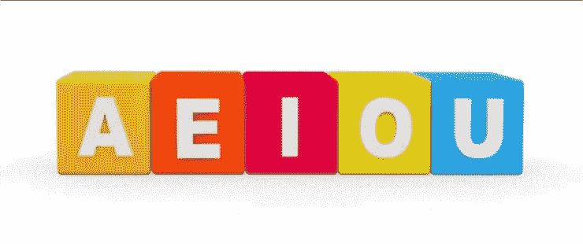
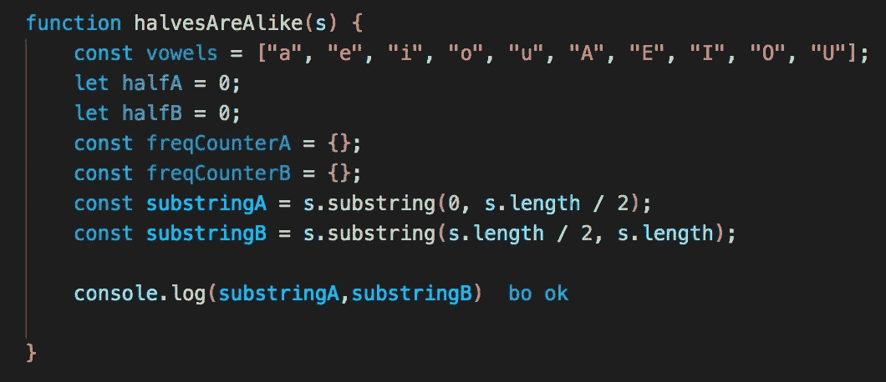
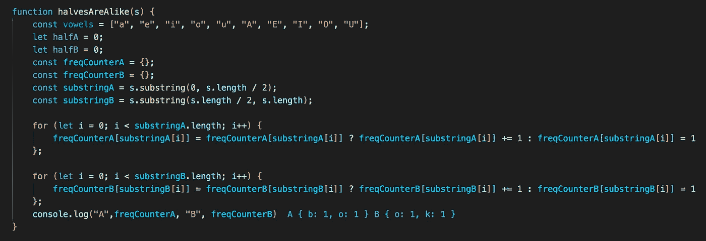
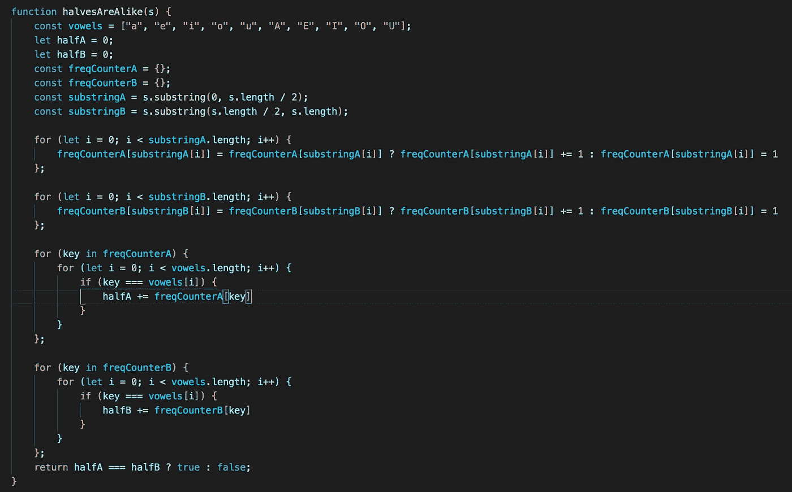

# 确定字符串是否相同:使用频率计数器方法

> 原文：<https://medium.com/nerd-for-tech/determining-if-string-halves-are-alike-using-the-frequency-counter-approach-3932be470458?source=collection_archive---------19----------------------->

## 关于如何使用 JavaScript 中的频率计数器方法确定两个字符串是否包含相同数量的元音的演练

我们直入主题吧，好吗？

*注意这个问题在 Leetcode 上(问题#1704)。跟着来，问题链接如下:*[*https://leet code . com/problems/determine-if-string-halves-is-alike/*](https://leetcode.com/problems/determine-if-string-halves-are-alike/)

# 问题是

我们的问题是:

*给你一个偶数长度的字符串* `*s*` *。将这根弦分成长度相等的两半，设* `*a*` *为前半段，* `*b*` *为后半段。*

*两个字符串如果有相同数量的元音(*`*'a'*`*`*'e'*`*`*'i'*`*`*'o'*`*`*'u'*`*`*'A'*`*`*'E'*`*`*'I'*`*`*'O'*`注意 `*s*` *包含大写和小写字母。*********

***返回* `*true*` *如果* `*a*` *和* `*b*` *都是* ***相像*** *。否则，返回* `*false*` *。***

**好的——我们有几件事要考虑。首先，我们需要把输入字符串分成两半。输入字符串的长度是偶数，所以我们可以确定我们的分割字符串的长度也是偶数。**

**接下来，我们必须考虑小写和大写元音。在创建数组时，我们必须考虑这一点。**

**最后，我们必须记录我们在每个字符串中遇到的元音的数量。我们必须用这个来比较字符串是否**相似**。记住，如果包含相同数量元音的字符串是相似的。**

****

**我可以买一个元音吗？**

# **方法**

**在深入研究解决方案之前，让我们采用我们的典型方法&打好基础，以便我们清楚需要采取的步骤。**

1.  **把我们的绳子分成相等的两半。我们可以使用内置的字符串方法 *substring* 来实现这一点，并将两个字符串都设置为一个变量**

> **substring 方法接受两个参数；第一个参数是我们想要开始子序列的位置的索引，而第二个参数是我们想要结束子序列的位置。**

**2.创建我们的元音数组，我们将使用它来检查字符串是否包含大写或小写元音。**

**3.初始化两个空散列，它们将在各自的两个字符串中存储每个元素的频率计数**

**4.初始化两个变量，它们将保存各自字符串中元音的总数。我们将使用这些计数器来确定函数的输出**

**5.遍历我们的两个字符串->将我们的键设置为字符，将我们的值设置为它们在字符串中出现的次数**

**6.设置一个循环遍历两个哈希的键的外循环->我们将设置一个循环遍历元音数组的内循环，检查键是否匹配元音数组中的任何值。这将给出两个字符串中元音的总数，我们将使用它来确定字符串是否相似。**

# **解决方案**

**现在我们已经计划好了路线图，让我们写一些代码吧！**

**让我们假设我们的测试用例是字符串“book ”,我们应该期望我们返回 true，因为“bo”和“ok”都包含一个元音。**

**我们的第一步是初始化变量。记住，我们需要将我们的字符串分成两半，创建一个包含大写和小写元音的数组，创建两个包含频率计数器的空散列和两个计数器变量。那可是一大堆变数啊！**

****

**注意，在我们的子串参数中，为了得到字符串的中点，我们做了一个简单的数学运算，将字符串的长度除以 2。**

**正如您在控制台日志中看到的，我们的子字符串被等长分割，将 4 个字符串分割成两个 2 个字符串。**

**接下来，我们需要填充我们的散列，并计算每个字符在各自字符串中的出现频率。我们可以使用两个 for 循环来实现这一步:**

****

**正如我们在控制台日志中看到的，我们的散列包含我们的字符的频率计数。正如所料，我们的第一个字符串有 1 个“b”和“o ”,第二个字符串有 1 个“o”和“k”。**

**最后，我们需要迭代散列的关键字，并检查它们是否是元音字母。我们通过设置一个嵌套的 for 循环来实现这一点，该循环将遍历元音数组。对于每次遇到匹配的迭代，我们将根据元音的值(或计数)增加 halfA 和 halfB 的计数。**

****

**我们的最终解决方案**

**在函数的最后，我们将比较 halfA 和 halfB 的值，如果它们相等(意味着我们的字符串相似)，则返回 true，如果不相等，则返回 false。**

# **结论**

**虽然这种方法肯定很冗长(并且不是很有效，因为它是二次时间)，但我希望它足够清晰，让您能够遵循其中的每一步。**

**通过创建一个包含所有元音字母(大写和小写)的数组，我们可以用它来查找字符串中是否包含元音字母&有多少个。此外，使用频率计数器方法允许我们计算每个元音出现的次数，并将该值添加到我们的总数中，这样我们可以很容易地比较我们的 halfA 和 halfB 总数，以确定我们的两个子字符串是否相似。**

**如果您有任何问题或建议，或者您对此问题有更有效的方法，请随时在下面发表评论。**

**下次见！**