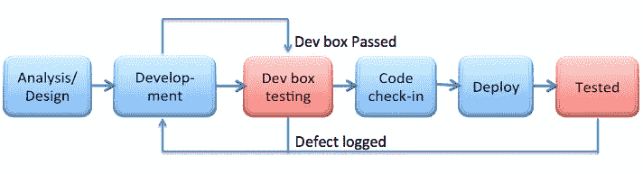

# 开发箱测试

> 原文：<https://medium.com/nerd-for-tech/dev-box-testing-23e247b5a880?source=collection_archive---------4----------------------->

什么是开发盒测试？

“Dev Box”是“开发者机器”的缩写版本。在开发箱测试期间，QE 的工程师在开发人员的机器上验证、测试和检查一个特性。太直白了。保证特征质量的基本技术。当产品、开发和 QA 团队讨论这个特性时,“开发盒”测试程序在开发周期的最开始就开始了。在叙述的准备过程中，质量工程师检查:

*   验收标准(一个 *cts 作为试验的验证点)*
*   范围内和范围外特性(s *ets 测试范围)*
*   前提条件，如果有的话

一旦满足上述条件，开发团队就可以开始工作了。“软件开发工程师”将在开发完成后要求进行“开发箱测试”。

**应该怎么做？？**

没有正式的技术来完成它，所以这个团队是最伟大的，这是我迄今为止做的很少的方法。

*   开发人员展示了引入的功能和做出的修改，这些功能和修改影响了 BA & QA，BA & QA 对其他功能领域的故障或历史负有责任。
*   开发人员将他们的机器转移到 QA 或 BA 来遍历情况，通常是在一个良好的轨迹中，并确保工作的目标得以实现。
*   所用的时间应该是 10 到 15 分钟，取决于故事或缺陷的复杂程度。

**迭代是什么情况？**

**ROI**

如果将 Dev Box 整合到核心开发流程中，以下是主要优势:

*   质量工程师对产品的技术掌握
*   技能提升质量工程师
*   失败很快给团队更多的输入
*   增强垂直测试
*   确保琐碎的问题不会被传递，以后会被集成或端到端测试发现
*   增强团队沟通，树立信心

**取舍**

*   每个团队成员可能需要时间来同步
*   如果团队不遵循 TDD(测试驱动开发),它可能会很有挑战性或者毫无意义
*   至少两名质量工程师应该是团队的一部分(开发箱是以质量为中心的，因此，需要足够的 QE 来适应所有的任务)

开发盒可能会产生一个坚实的，可靠的产品时，应用正确。如果您计划运行 Dev Box 测试，希望这些方法会有所帮助。