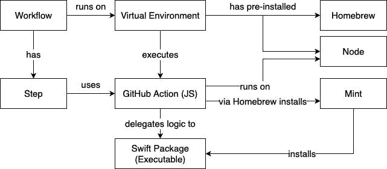
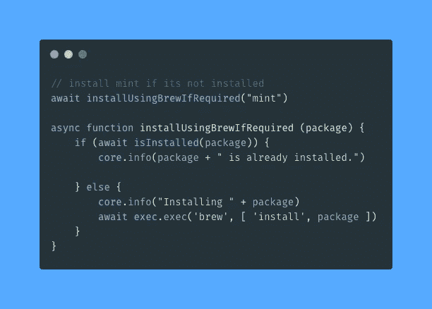
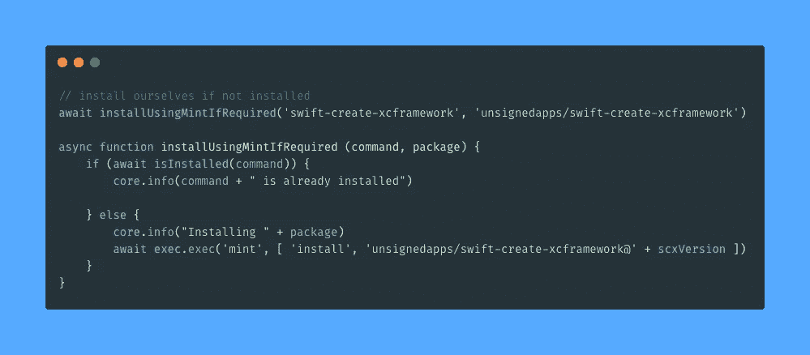
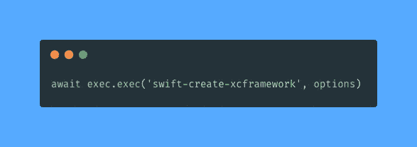
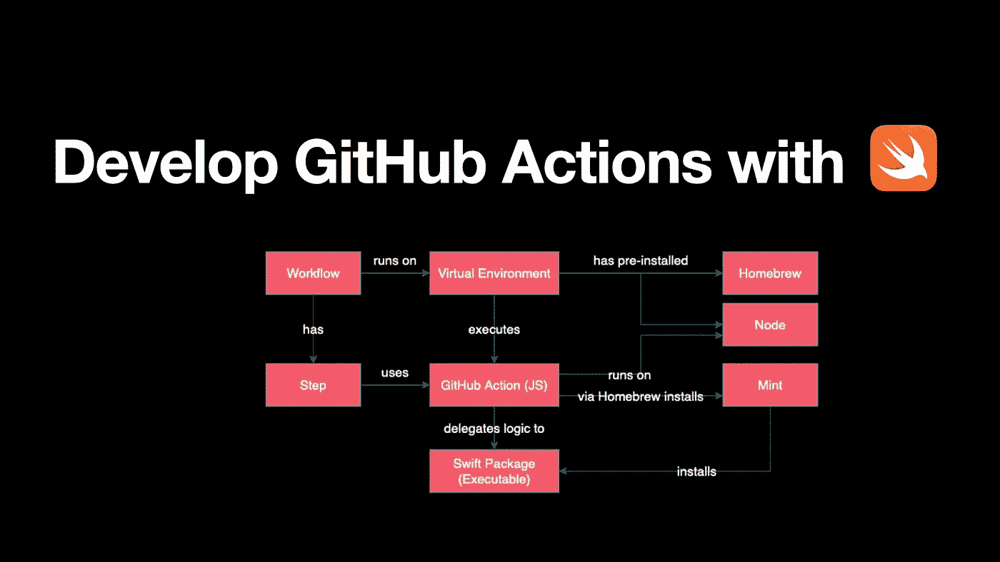

# 利用 Swift 开发 GitHub 行动

> 原文：<https://medium.com/nerd-for-tech/develop-github-actions-with-swift-34c7bcf8a6fe?source=collection_archive---------6----------------------->

我是 GitHub Actions 的狂热粉丝和用户。操作是单独的任务，您可以组合这些任务来创建作业和自定义 CI/CD 工作流。

您可以编写自己的操作在工作流程中使用，并与 GitHub 社区共享这些操作。

您不能完全在 Swift 中编写 GitHub 动作，因为动作本身就是 Docker 容器动作或 JavaScript 动作。

但是您可以使用 Swift 来构建 GitHub 操作的大部分。这里有一个如何做的建议:

一个很好的例子就是[swift-create-xc framework](https://github.com/unsignedapps/swift-create-xcframework)GitHub 动作。

 [## unsigned apps/swift-create-xc framework

### swift-create-xcframework 是一个非常简单的工具，旨在包装 xcodebuild 和创建多个…

github.com](https://github.com/unsignedapps/swift-create-xcframework) 

在它的 [action.yml](https://github.com/unsignedapps/swift-create-xcframework/blob/main/action.yml) 文件中，你可以看到这个动作是用 JavaScript 构建的。

但是 javascript 代码只解析选项，繁重的工作委托给位于同一个存储库中的特定的 [Swift 包](https://github.com/unsignedapps/swift-create-xcframework/blob/main/Package.swift)。

为了安装一个 Swift 包，首先使用[自制软件](https://brew.sh)安装 [Mint](https://github.com/yonaskolb/Mint) 。

用自制软件安装 Mint

Mint 能够安装可执行的 Swift 包，因此用于安装与操作代码位于同一位置的 Swift 包。

用 Mint 安装 Swift 包

最后，调用可执行的 Swift 包。

在 GitHub action (JS)中执行 Swift 包

我希望这个食谱对那些想知道如何在 GitHub action 开发中利用他们的 Swift 专业知识的人有所帮助。

*最初发布于*[*https://blog . ei dinger . info*](https://blog.eidinger.info/develop-github-actions-with-swift)*。*