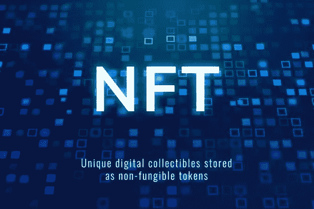

# 开发以太坊上的 NFT 市场

> 原文：<https://medium.com/nerd-for-tech/develop-nft-marketplace-on-ethereum-8e6628c1c1ce?source=collection_archive---------5----------------------->

以太坊在 NFT 交易所获得了发展。凭借其强大的 NFT 交易所功能，令牌元数据和交易历史可以在以太坊中公开获得，从而可以方便地在链上显示所有权历史。所有以太坊对象都在相似的后端工作，这使得 NFTs 很紧凑。以太坊平台有着无可挑剔的不下线记录。

因此，它成为一个全职代币交易平台。一些基本原因支持使用以太坊而不是其他区块链来创建 NFT 市场:

*   您可以在以太坊中证明所有权历史，因为令牌信息所有权记录和交易历史可直接在以太坊中进行公开验证。
*   在以太坊进行交易验证后，你不能修改数据和伪造他人的所有权。
*   以太坊允许点对点交易，消除了主要的佣金和中介。
*   以太坊集成了两种钱包——集中式和 DeFi 式。

以太坊凭借其强大的机制，最大限度地减少了第三方干预、停机和所有权欺诈等障碍。以太坊区块链有各种好处，如数据协调、快速部署、许可网络、网络规模、私人交易、可伸缩性和性能；为 NFT 市场提供动力。现在让我们学习在以太坊上开发 NFT 市场的过程。

# 如何在区块链以太坊开发一个 NFT 市场？

OpenSea 是建在以太坊区块链上的最好的 NFT 市场之一。为了[开发一个类似于 OpenSea 市场的 NFT 市场](https://www.leewayhertz.com/nft-marketplace-development-company/)，请遵循以下步骤:

**第一步**

**储存库**

从资源库开始您的 NFT 市场开发。在您的 GitHub 帐户中派生或克隆存储库，

" $ git 克隆人[https://github.com/miquelTC/nft-marketplace.git](https://github.com/miquelTC/nft-marketplace.git):"

**第二步**

**依赖安装**

克隆主存储库后，运行以下命令安装依赖项，

" $ npm 安装。"

**第三步**

**安装块菌**

在您的终端中运行以下命令来全局安装 Truffle，

" $ npm install -g truffle。"

**第四步**

运行测试

从智能合约编译开始，然后在您的终端中插入以下命令来运行智能合约，

" $ truffle 编译。"

**第五步**

**安装并运行 Ganache**

使用以下链接安装并启动 Ganache 以在本地运行您的区块链，

[https://www.trufflesuite.com/ganache](https://www.trufflesuite.com/ganache)

运行以下命令来执行测试，验证您的解决方案，

" $松露测试"

**第六步**

**本地区块链部署**

运行以下命令在您的本地区块链上部署合同，

" $块菌会迁移。"

**第七步**

**打开 UI**

使用下面提到的链接安装 MetaMask wallet 的浏览器扩展，

[https://metamask.io/](https://metamask.io/)

配置元掩码，将其连接到由 Ganache 运行的本地区块链。按照以下步骤配置元掩码，

*   单击元掩码
*   点击网络配置面板
*   单击自定义 RPC
*   通过在 URL 上添加 [http://localhost:7545](http://localhost:7545/) 并在链 ID 中添加 1337，继续配置您的网络
*   通过将私有帐户密钥从 Ganache 复制粘贴到元掩码中，将第一个 Ganache 帐户集成到元掩码中
*   最后，要访问用户界面，请在终端中键入以下命令，
*   " $ npm 开始。"

**第 8 步**

**公网部署**

从生成 an.env 文件开始，该文件包含，

*   私钥
*   Infura API 密钥

最后，运行以下命令来创建您的 UI 构建工件，并开始在所选主机上部署它，

" npm 运行构建。"

# 结论

凭借建立在以太坊区块链上的 NFT 市场，NFT 交易员可以利用顺畅的数据协调、交易历史和令牌信息、零网络宕机和点对点 NFT 交易。以太坊 NFT 市场上存储的所有商品的“后台”都是一样的。区块链用户可以在一个产品上购买 NFT，然后在另一个产品上销售。用户也可以与创建者同时列出他们在不同产品上的 NFT。另一方面，它标志着所有以太坊产品将快速连接，使产品之间顺利 NFT 转移。因此，以太坊是升级 NFT 市场的催化剂。